# 1. ИБ: прошлое (история), настоящее и ближайшее будущее. Термины. Ключевые принципы обеспечения ИБ

## Информационная безопасность

### Определения

#### Информационная безопасность

практика предотвращения несанкционированного доступа, использования, раскрытия, искажения, изменения, исследования, записи или уничтожения информации. Это понятие применяется вне зависимости от формы, которую могут принимать данные (электронная или, например, физическая).

#### Информационная безопасность

все аспекты, связанные с определением, достижением и поддержанием конфиденциальности, целостности, доступности, неотказуемости, подотчетности, аутентичности и достоверности информации или средств ее обработки. **Такое определение содержится в ГОСТ Р 53113.1-2008**.

#### Безопасность информационной технологии**

состояние защищенности информационной технологии, при котором обеспечивается выполнение изделием, реализующим информационную технологию, предписанных функций без нарушений безопасности обрабатываемой информации. **Это определение вы можете найти в ГОСТ Р 50.1.056-2005**.

#### Безопасность информации (данных)

это состояние защищенности информации (данных), при котором обеспечены ее (их) конфиденциальность, доступность и целостность. Такое определение приведено в ГОСТ Р 50922-2006 в статье 2.4.5.

#### Информационная сфера

это совокупность информации, информационной инфраструктуры, субъектов, осуществляющих сбор, формирование, распространение и использование информации, а также системы регулирования возникающих при этом общественных отношений. Такое определение содержится в [ Доктрине информационной безопасности Российской Федерации от 9 сентября 2000 г. ](https://docs.cntd.ru/document/901770877#64U0IK)

### Свойства информации в ИБ

Классической основой в теории ИБ являются три термина:
- конфиденциальность
- целостность
- доступность 

Под информационной безопасностью понимают также защиту информации и информационных систем от:
- неавторизованного доступа
- использования
- раскрытия
- искажения
- изменения
- уничтожения
в целях обеспечения:
- конфиденциальности
- целостности
- доступности

В понятие ИБ могут быть включены следующие свойства информации:

- **Подлинность (англ. authentication)**<br>проверка и подтверждение подлинности аспектов информационного взаимодействия: содержания и источника сообщения, сеанса связи, времени и т.д.
- **Неотказуемость (англ. non-repudiation)**<br>защита от отказа некоторого участника связи от совершенных действий.
- **Неотслеживаемость (англ. untraceability)**<br>невозможность получения нарушителем сведений о действиях участников связи. 
- **Несвязываемость (англ. unlinkability)**<br>свойство, родственное неотслеживаемости и означающее, что противник не только не может установить, кто выполнил конкретное действие, но и выяснить, были ли разные действия выполнены одним и тем же участником.
- **Анонимность (англ. anonymity)**<br>понятие, родственное неотслеживаемости, выполнение какого-либо действия, не идентифицируя себя, но с доказательством права на действие.

### Нарушения свойств информации в ИБ

- **Нарушение конфиденциальности**<br>нарушителю удалось собрать информацию о том, как работает программное обеспечение конкретных центрифуг.
- **Нарушение доступности**<br>злоумышленнику удалось доставить Stuxnet непосредственно в систему управления через сотрудника; также Stuxnet содержал подписанные сертификаты безопасности, что позволило ему обмануть системы защиты.
- **Нарушение конфиденциальности**<br>хакеры проникли в среду разработки Ccleaner, устроившись в компанию в качестве сотрудников, и проникли на сервер Microsoft Excange, вероятно, удаленно.
- **Нарушение целостности**<br>хакеры изменили код Ccleaner и программы SolarWind.

Рекомендуем вам ознакомиться со статьей [ «Инструменты ИИ в руках злоумышленников» ](https://ict.moscow/static/pdf/files/%D0%98%D0%BD%D1%81%D1%82%D1%80%D1%83%D0%BC%D0%B5%D0%BD%D1%82%D1%8B%20%D0%98%D0%98%20%D0%B2%20%D1%80%D1%83%D0%BA%D0%B0%D1%85%20%D0%B7%D0%BB%D0%BE%D1%83%D0%BC%D1%8B%D1%88%D0%BB%D0%B5%D0%BD%D0%BD%D0%B8%D0%BA%D0%BE%D0%B2_%D0%98%D1%81%D1%81%D0%BB%D0%B5%D0%B4%D0%BE%D0%B2%D0%B0%D0%BD%D0%B8%D0%B5.pdf)

## История формирования ИБ в России

происходило постоянное усложнение и расширение средств и методов ИБ

### Аспекты, которые важно принимать во внимание в настоящее время в рамках развития ИБ:

- формализация положений теории информационной безопасности;
- разработка моделей безопасности, более точно отражающих существующий уровень развития компьютерной техники и информационных технологий, а также более удобных для практического использования и анализа защищенности реальных автоамтизированных систем (АС);
- разработка средств и методов противодействия угрозам информационной войны;
- вопросы обеспечения безопасности в глобальных информационных сетях, например интернета;
- безопасность систем электронной коммерции;
- вопросы безопасности обработки информации мобильными пользователями.

### Основные направления понятийного аппарата ИБ:

- информация и ее свойства;
- угрозы безопасности информации и ее собственникам;
- политика безопасности и модели безопасности;
- способы, методы и средства защиты информации;
- классификация систем защиты;
- требования к защищенности информационных систем;
- методология оценки защищенности информационных систем и проектирования защиты;
- конкретные системы защиты информации, применяемые в различных органах управления, учреждениях и на предприятиях различных форм собственности.

## Основные принципы построения систем защиты

### 1. Законность и обоснованность защиты

Предусматривает, что защищаемая информация по своему правовому статусу относится к информации, которой требуется защита в соответствии с законодательством.

### 2. Системность

Предполагает необходимость учета всех взаимосвязанных, взаимодействующих и изменяющихся во времени элементов, условий и факторов:

- при всех видах информационной деятельности и информационного проявления,
- во всех структурных элементах,
- при всех режимах функционирования,
- на всех этапах жизненного цикла,
- с учетом взаимодействия объекта защиты с внешней средой.

При обеспечении безопасности информационной системы необходимо учитывать
- все слабые, наиболее уязвимые места системы обработки информации
- характер, возможные объекты и направления атак на систему со стороны нарушителей (особенно высококвалифицированных злоумышленников)
- пути проникновения в распределенные системы и пути несанкционированного доступа к информации

### 3. Комплексность

Предполагает согласование разнородных средств при построении целостной системы защиты, перекрывающей все существенные каналы реализации угроз и не содержащей слабых мест на стыках отдельных ее компонентов

### 4. Непрерывность защиты

Защита информации — это непрерывный целенаправленный процесс, предполагающий принятие соответствующих мер на всех этапах жизненного цикла информационной системы, начиная с самых ранних стадий проектирования. Жизненный цикл информации мы рассмотрим далее.

Важно понимать, что разработка системы защиты должна вестись параллельно с разработкой самой защищаемой системы.

### 5. Разумная достаточность

- при достаточном количестве времени и других средств можно преодолеть любую защиту
- возможно достижение лишь некоторого приемлемого уровня безопасности
- высокоэффективная система защиты требует большого количества ресурсов

Важно правильно выбрать тот достаточный уровень защиты, при котором затраты, риск и размер возможного ущерба были бы приемлемыми.

### Дополнительные принципы

#### Гибкость

Для обеспечения возможности варьирования уровня защищенности средства защиты должны обладать определенной гибкостью для соотсвествия средств обеспечения ИБ текущим угрозам и обстоятельствам

#### Открытость алгоритмов и механизмов защиты

- суть состоит в том, что знание алгоритмов работы системы защиты не должно давать возможности ее преодоления даже разработчику защиты.
- это не означает, что информация о конкретной системе защиты должна быть общедоступна, необходимо обеспечивать защиту от угрозы раскрытия параметров системы
- открытость алгоритмов защиты компенсируется режимом шифрования

#### Простота применения средств защиты

- Механизмы защиты должны быть интуитивно понятны и просты в использовании
- Применение средств защиты не должно быть связано с выполнением действий, требующих значительных дополнительных трудозатрат при обычной работе законных пользователей
- Не должно требовать от пользователя выполнения малопонятных ему операций

## Термины в области ИБ

### Информационная безопасность

состояние защищенности информационных ресурсов (информационной среды) от внутренних и внешних угроз, способных нанести ущерб интересам личности, общества, государства (национальным интересам).

### Безопасность информации

защищенность информации от нежелательного (для соответствующих субъектов информационных отношений) ее разглашения (нарушения конфиденциальности), искажения (нарушения целостности), утраты или снижения степени доступности информации, а также незаконного ее тиражирования.

### Информация

сведения (сообщения, данные) независимо от формы их представления. Это и скан вашего паспорта, и информация в виде речи или электромагнитные волны от вашего телефона, даже данные о его местонахождении.

### Защищаемая информация

информация, подлежащая защите в соответствии с требованиями нормативных правовых актов или требованиями, устанавливаемыми обладателем информации. Например, устраиваясь на новую работы, вы почти всегда подписываете договор с требованиями о неразглашении.

### Обладатель информации

лицо, самостоятельно создавшее информацию, либо получившее на основании закона или договора право разрешать или ограничивать доступ к информации, определяемой по каким-либо признакам.

### Доступ к информации

возможность получения информации и ее использования. Этот доступ без ограничений вы получаете к свободной информации, но зачастую с использованием различных технологий, например интернета.

### Предоставление информации

действия, направленные на получение информации определенным кругом лиц или передачу информации определенному кругу лиц.

### Организация защиты информации

совокупность действий, направленных на выявление угроз безопасности информации, планирование, реализацию мероприятий по защите информации и контроль состояния защиты информации.

### Система защиты информации

совокупность органов и (или) исполнителей, используемой ими техники защиты информации, а также объектов защиты информации, организованная и функционирующая в соответствии с требованиями о защите информации.

### Политика безопасности информации в организации

совокупность документированных правил, процедур, практических приемов или руководящих принципов в области безопасности информации, которыми руководствуется организация в своей деятельности.

### Защита информации

это деятельность по предотвращению утечки защищаемой информации и несанкционированных воздействий на нее.

# 2. Информация как объект защиты

## Обобщенная характеристика информации

- **Данные** рассматриваются как признаки или записанные наблюдения, которые по каким-то причинам не используются, а только хранятся
- **Информация** - данные участвующие в процессе снятия неопределенности

> **Информация**
>
> это сведения независимо от формы их представления, но снимающие неопределенность в какой-либо сфере, либо дающие новые или дополнительные сведения к уже имеющейся информации.

> **Знания**
> 
> совокупность фактов, закономерностей и эвристических правил, с помощью которых решается поставленная задача или зафиксированная и проверенная практикой информация, которая может многократно использоваться людьми для решения тех или иных задач.


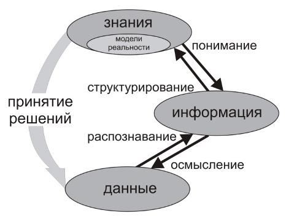

Функции, объединяющие такие базовые понятия как «данные», «информация», «знания» и «мудрость», формируют **жизненный цикл любой информации**.

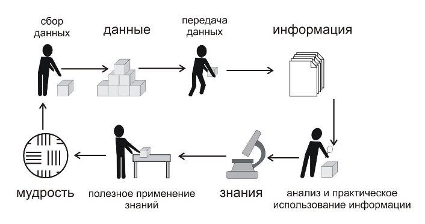 

В терминах информационной безопасности не выделяется разница между данными и информацией.

### Характеристика и форма представления информации

- это данные или знания, которые присутствуют в любом объекте, процессе, и часто служат для поддержки функционирования любых информационных объектов (живых существ, любых систем — биологических, механических, информационных);
- она отображается в виде символов, полей, изменяемых характеристиках поверхности на носителях;
- после записи на носитель информация приобретает определенные параметры, и может быть измерена в объеме;
- информация, записанная в биологический, материальный или другой носитель, может храниться, обрабатываться, передаваться по различным каналам связи;
- перемещаясь по каналам (аудио, электронным, электромагнитным и др.) или линиям связи, информация создает поля, которые отражают ее содержание;
- при обработке, хранении, передаче информация циркулирует в информационной (биологической, технической и другой) системе — простейшая система состоит из источника информации, канала связи и получателя информации.

### Защита информации должна быть рассмотрена с точки зрения:

- самой информации,
- ее носителей,
- каналов передачи,
- систем обработки.

## Формы представления информации

### 3 уровня информации

- **Логический уровень**<br>это связные списки, графы, каталоги и т.п. Например, каталог или дерево папок в проводнике Windows.
- **Синтаксический уровень**<br>кодирование при помощи символов. Например, запись лекции за лектором на бумагу.
Набор символов образует алфавит. В процессе кодирования один алфавит может быть преобразован в другой, например при переводе с русского на английский. Кодирование может являться преобразованием между алфавитами (языками), архивированием, шифрованием и т.п.
- **Семантический уровень**<br>этот уровень связан со смыслом передаваемой информации. Одинаковые лексические конструкции могут иметь различный смысл в разном контексте, времени, условиях.

## Носители информации

### Категории

#### Признаковая информация носителя «о себе», о видовых признаках

форма, размер, структура, химические и физические свойства, энергетические параметры (например, вид нового самолета-невидимки и его секретных составляющих частей, химические и физические свойства отражающих поверхностей, энергетический спектр двигателя).

#### Семантическая информация

то, что не зависит от вида носителя, продукт абстрактного мышления на языке символов, та информация, которую содержит носитель как средство ее фиксации (текст на бумаге, электронные символы на диске).

### Виды носителей информации:

- биологический(-ие) объект(ы), его (их) параметры;
- материальный(-ые) объект(ы) в любом состоянии (целый, поврежденный) и субстанции (твердый, жидкий, газообразный);
- физическое(-ие) поле(я), сигналы.

### Информация отображается в виде:

- символов,
- образцов,
- сигналов (полей),
- технических решений,
- процессов.

### Поля (энергетические носители)

в основном электромагнитные (от теплового до гамма-излучения) и акустические, также несут информацию, например:

- поля при разговоре по телефону (проводному и мобильному);
- интенсивность гамма излучения урана при анализе опасности облучения;
- температура человека, например, когда он заболел;
- звук при разговоре двух людей.

## Классификация информации

### По форме ее представления и способам кодирования на следующие виды

- **Графическая или изобразительная**<br>первый вид, для которого был реализован способ хранения информации об окружающем мире в виде наскальных рисунков, а позднее — в виде картин, фотографий, схем, чертежей на бумаге, холсте, мраморе и др. материалах.
- **Звуковая (акустическая)**<br>ее разновидностью является музыкальная информация.
- **Текстовая**<br>способ кодирования, в основном речи специальными символами.
- **Числовая**<br>количественная мера объектов и их свойств в окружающем мире; особенно большое значение приобрела с развитием торговли, экономики и денежного обмена.
- **Видеоинформация**<br>способ сохранения «живых» картин окружающего мира, появившийся с изобретением кино.
- **Другие виды информации**<br>для которых до сих пор не изобретено способов их кодирования и хранения — это тактильная информация, передаваемая ощущениями, органолептическая, передаваемая запахами и вкусами и др.


## Свойства информации

### Объективность информации

Информация в любом своем проявлении объективна, она отражает объективную действительность (информация получена о событии в будущем от надежного источника — коллеги, и она объективна, если получена до совещания, с учетом, что вы успеете на это совещание. Если получена в 9 утра, когда вы пришли на работу, то объективность будет не такой высокой. т.к. совещание могли и перенести).

### Достоверность 

Информация достоверна, если она отражает истинное положение дел.

Недостоверной информация может быть по следующим причинам:
- преднамеренное искажение (дезинформация) или непреднамеренное искажение субъективного свойства;
- искажение в результате воздействия помех и недостаточно точных средств ее фиксации.

### Полнота 

Информацию можно назвать полной, если ее достаточно для понимания и принятия решений (информации для принятия решения достаточно — нужно прийти на работу к 7.50).

### Точность

определяется степенью ее близости к реальному состоянию объекта, процесса, явления и т.п. (если, например, новый танк разрабатывать не предполагается, то, возможно, коллега ошибается о теме совещания, тогда можно это уточнить).

### Актуальность (ценность) 

важность для настоящего времени, злободневность, насущность (информация ценна при условии, что получена до 7.00, и человек успеет добраться до работы).

### Полезность (ценность)

Полезность может быть оценена применительно к нуждам конкретных ее потребителей, и оценивается по тем задачам, которые можно решить с ее помощью (информация ценна при условии, что получена до 7.00 и человек успеет добраться до работы).:

### Свойства с точки зрения защиты

#### Целостность

это термин в информатике (криптографии, теории телекоммуникаций, теории информационной безопасности), означающий, что данные не были изменены при выполнении какой-либо операции над ними, будь то передача, хранение или отображение (если совещание будет посвящено другой теме, и коллега ошибся, то эта информация будет не целостной).

#### Конфиденциальность (секретность)

это свойство безопасности информации, при котором доступ к ней осуществляют только субъекты доступа, имеющие на него право. Также конфиденциальность можно определить как субъективно определяемую характеристику информации, указывающую на необходимость введения ограничений на круг субъектов, имеющих доступ к данной информации.

Эта характеристика обеспечивается способностью системы сохранять указанную информацию в тайне от субъектов, не имеющих полномочий на доступ к ней.

#### Доступность

это состояние информации (ресурсов автоматизированной информационной системы), при котором субъекты, имеющие права доступа, могут реализовывать их беспрепятственно (сообщение делает доступной информацию о совещании тем, кто должен на нем присутствовать).

## Жизненный цикл защищаемой информации

Как предмет собственности информация имеет определенную ценность.

Ценность информации изменяется (теряется) во времени и от различных обстоятельств:

- при ее раскрытии, то имеется опасность нарушения секретности информации;
- при изменении или уничтожении информации, то имеется опасность для целостности информации;
- при сложности быстрого доступа к информации, то имеется опасность нарушения доступности информации.

Ценность иногда можно восстановить, например, при возврате к прежнему состоянию

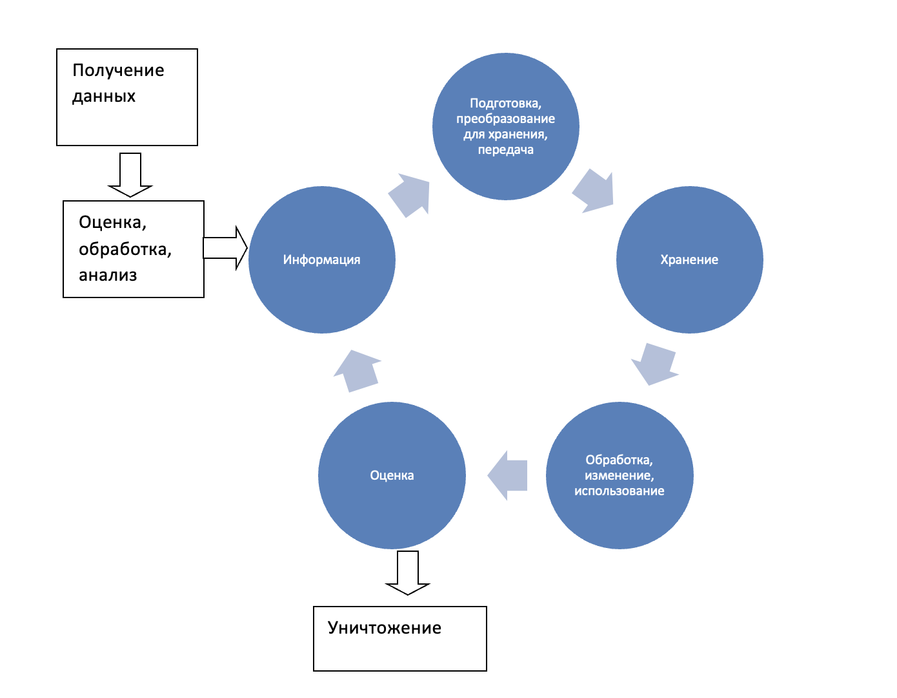

# 3. Угрозы и методы реализации угроз. Модель нарушителя. Общие принципы защиты

## Угрозы и их оценка

### Общее понятие угрозы

> **Под угрозой (в общем) понимается** потенциально возможное событие, действие (воздействие), процесс или явление, которое может привести к нанесению ущерба чьим-либо интересам. Угроза — это фактор, стремящийся нарушить работу системы.

> **Угроза безопасности информации (ГОСТ Р 51624-2000)**
> 
> совокупность условий и факторов, создающих потенциальную или реально существующую опасность, связанную с утечкой информации, и/или несанкционированными и/или непреднамеренными воздействиями на нее.

> **Угроза согласно РД ГосТехКомиссии «Безопасность ИТ**
>
> Положение о разработке ПЗ и ЗБ» — это совокупность условий и факторов, определяющих потенциальную или реально существующую опасность возникновения инцидента, который может привести к нанесению ущерба изделию ИТ или его собственнику.

> **Угроза безопасности КС**
>
> совокупность условий и факторов, определяющих потенциальную или реально существующую опасность нарушения конфиденциальности, целостности, (правомерной) доступности КИ и/или снижения надежности (безотказности и аутентичности) реализации функций КС.

Общий перечень угроз безопасности информации, содержится в [ банке данных угроз безопасности информации ФСТЭК России. ](https://bdu.fstec.ru/)

### Классификация угроз БИ

#### По аспекту информационной безопасности:

- угрозы целостности, конфиденциальности, доступности.

#### По расположению источника угроз:

- внутренние (источники угроз располагаются внутри системы – вредоносное ПО, человек);
- внешние (источники угроз находятся вне системы, например, хакеры конкурентов).

#### По размерам наносимого ущерба:

- общие (нанесение ущерба объекту безопасности в целом);
- локальные (причинение вреда отдельным частям объекта безопасности);
- частные (причинение вреда отдельным свойствам элементов объекта).

#### По степени воздействия на информационную систему:

- пассивные (структура и содержание системы не изменяются, только изменились объемы средств на счету клиентов);
- активные (структура и содержание системы подвергается изменениям, например, стерта база данных или разрушены центрифуги).

#### По природе возникновения:

- естественные (объективные), не зависящие от воли человека, например, при ремонте крыши серверной часть крыши сняли, но пошел дождь и залил сервера;
- искусственные (субъективные);
- непреднамеренные (случайные) угрозы, например, системный администратор пролил чай на клавиатуру;
- преднамеренные (умышленные) угрозы.

### Источники угроз ИБ

#### 3 Ктегории

##### Обусловленные действиями субъекта человека или группы лиц (антропогенные источники)

субъекты, действия которых могут привести к нарушению безопасности информации, данные действия могут быть квалифицированы как умышленные или случайные преступления. Источники, действия которых могут привести к нарушению безопасности информации, могут быть как внешними, так и внутренними. Данные источники можно спрогнозировать, и принять адекватные меры.

##### Обусловленные техническими средствами, например устройствами сети (техногенные источники)

эти источники угроз менее прогнозируемы, напрямую зависят от свойств техники и поэтому требуют особого внимания. Например, может быть отказ роутера сети, обеспечивающего сетевую связь устройств, который привел к нарушению доступности. Данные источники угроз информационной безопасности также могут быть как внутренними, так и внешними.

##### Стихийные источники

данная группа объединяет обстоятельства, составляющие непреодолимую силу (стихийные бедствия или другие обстоятельства (например, пандемия, война), которые невозможно предусмотреть или предотвратить, или же возможно предусмотреть, но невозможно предотвратить — ураганы, наводнения, смерчи, землетрясения, цунами.

#### К источникам внешних угроз относятся:

- деятельность конкурентов по перехвату важной информации;
- преднамеренные действия по разрушению, уничтожению или модификации информации;
- непреднамеренные действия сотрудников сторонних организаций, повлекшие за собой отказ в работе элементов системы;
- стихийные бедствия и катастрофы, аварии, экстремальные ситуации.

#### К источникам внутренних угроз относятся:

- отсутствие координации деятельности подразделений предприятия в сфере защиты информации;
- преднамеренные действия персонала по уничтожению или модификации информации;
- непреднамеренные ошибки персонала, отказы технических средств и сбои в информационных системах;
- нарушения установленных регламентов сбора, накопления, хранения, обработки, преобразования, отображения и передачи информации.

#### Схема категоризации

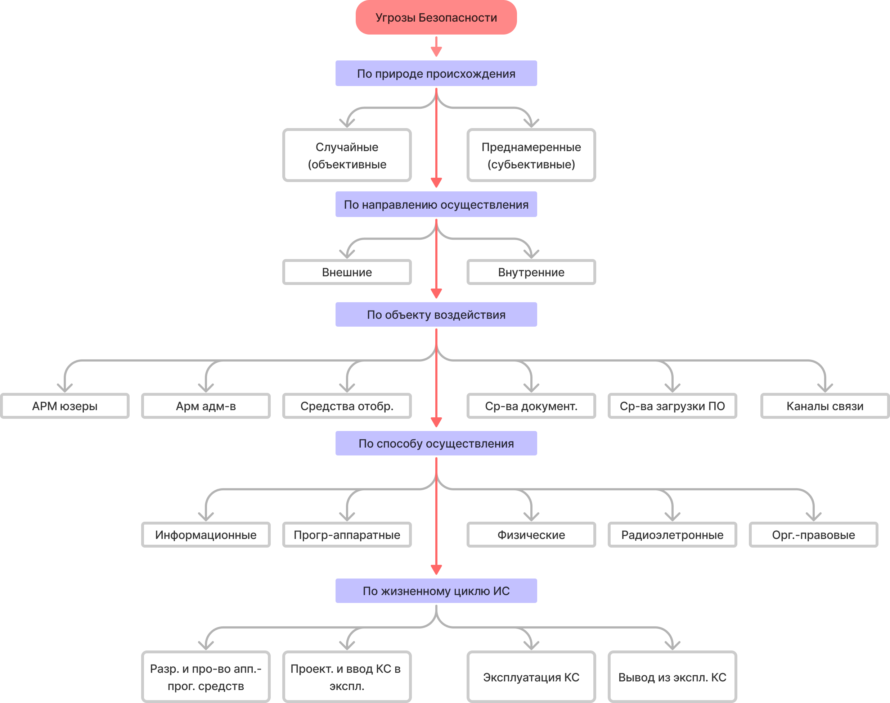

## Виды угроз

### Угроза нарушения конфиденциальности

реализуется в том случае, если получен доступ к секретной информации (как в примере со Сноуденом), хранящейся в информационной системе, передаваемой от одной системы к другой, т.е. информация становится известной лицу, не располагающему полномочиями доступа к ней.

Это могут быть как сведения на бумажном носителе, так и сведения о различных технологиях полученные в ходе, например, переговоров, — то есть информация, передаваемая по звуковому каналу от одного человека к другому.

### Угроза нарушения целостности

- реализуется при несанкционированном изменении программного обеспечения или информации, хранящейся в информационной системе или передаваемой из одной системы в другую.
- Изменению могут быть подвергнуты как электронный или бумажный носители, так и сознание человека.
- Целостность также будет нарушена, если к несанкционированному изменению приводит случайная ошибка программного или аппаратного обеспечения

### Угроза нарушения доступности

- реализуется, когда в результате преднамеренных действий, предпринимаемых другим пользователем или злоумышленником, блокируется доступ к ресурсу информационной системы или носителю информации

### Угрозу раскрытия параметров системы защиты

Преодоление защитных мер — как программных, так и технических, организационных, физических, также представляет собой угрозу. Поэтому необходимо рассматривать еще и угрозу раскрытия параметров системы защиты.

### Общее место угроз в процессе защиты (по ISO/IEC 27001)

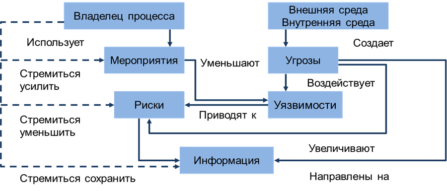

## Теоретические подходы в оценке угроз

### Методы обнаружения угроз

#### 1. Метод выбора

- В анализе таксономических классификационных перечней угроз (каталогов угроз), закрепленных в стандартах и др. нормативно-методических документах, и анализе актуальности тех или иных угроз в отношении активов и их ценности.
- Установление из возможных угроз тех, которые имеют место (существуют, актуальны, воздействуют) для данного объекта защиты на всех этапах и процессах создания и эксплуатации информационной системы, системы работы с защищаемой информацией.

Каталоги (таксономические схемы классификации) угроз безопасности содержатся в:

- ГОСТ 2Р 51275-99. Защита информации. Объект информатизации. Факторы, воздействующие на информацию;
- РД ГосТехКомиссии России. Безопасность ИТ. Руководство по формированию семейств профилей защиты;
- других каталогах, исходя из предметной области защиты

виды угроз на примере **РД ГосТехКомиссии «Руководство по разработке ПЗ и ЗБ, 2003 г.**


- Так, например, отображаемые данные — это данные на экране компьютера.
- Далее для угрозы данным на носителе выбираются методы реализации угрозы.

При выборе необходимо руководствоваться возможностью реализации угрозы.

#### 2. Методы оценивания вероятности угроз

- **Априорные, на основе моделей и статистических характеристик физических процессов, реализующих соответствующие угрозы**<br>(например, на основе Пуассоновского распределения вероятности моторных ошибок человека-оператора при вводе информации с клавиатуры) или вероятности отказа ПО. Данные модели используются при оценке отказоустойчивости АСУ ТП. Такая ошибка рассматривалась в Натанзе при разрушении центрифуг, т.к. сотрудники не знали про вирус.
- **Апостериорные, на основе гистограмм распределения событий проявления соответствующих угроз по статистическим данным**<br>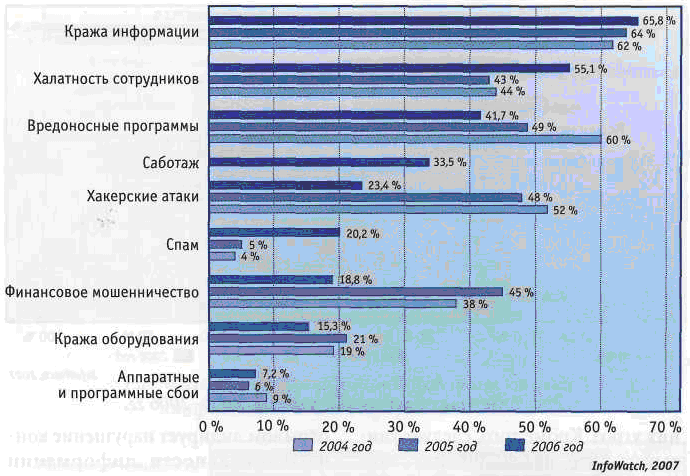

#### 3. Экспертный метод (предложен в методике ФСТЭК 2021 года)

- Отбор экспертов (формальные и неформальные требования, метод «снежного кома», 10-12 экспертов).
- Выбор параметров, по которым оцениваются объекты (стоимость, важность, веса параметров).
- Выбор шкал оценивания (методов экспертного шкалирования).

## Методы реализации угроз

### Угрозы реализуются за счет

- наличия программно-аппаратных уязвимостей (новых или существующих);
- использования должностных полномочий;
- недостатков в организационно-технических мерах защиты.

### Можно выделить следующие причины программно-аппаратных уязвимостей:

- ошибки на этапе проектирования и реализации ПО;
- оставление BackDoor для удаленной отладки;
- применение средств разработки различного происхождения;
- использование в составе ПО сторонних компонентов или свободно распространяемого кода;
- наличие в команде программистов-инсайдеров, которые преднамеренно вносят в написанный код дополнительные функции или элементы.

Методы реализации угроз:

- определение злоумышленником типа и параметров носителей информации;
- получение злоумышленником информации о программно-аппаратной среде, типе и параметрах средств вычислительной техники, типе и версии операционной системы, составе прикладного программного обеспечения;
- получение злоумышленником детальной информации о функциях, выполняемых системой;
- получение злоумышленником данных о применяемых системах защиты;
- определение способа предоставления информации;
- определение злоумышленником содержания данных, обрабатываемых в системе, на качественном уровне (применяется для мониторинга и дешифрования сообщений);
- хищение (копирование) машинных носителей информации, содержащих конфиденциальные данные;
- использование специальных технических средств для перехвата побочных электромагнитных излучений и наводок (ПЭМИН);
- уничтожение средств вычислительной техники и носителей информации;
- несанкционированный доступ пользователя к ресурсам системы в обход или путем преодоления систем защиты с использованием специальных средств, приемов, методов;
- несанкционированное превышение пользователем своих полномочий;
- несанкционированное копирование программного обеспечения;
- перехват данных, передаваемых по каналам связи;
- визуальное наблюдение;
- раскрытие представления информации (дешифрование данных);
- раскрытие содержания информации на семантическом уровне;
- уничтожение носителей информации;
- внесение пользователем несанкционированных изменений в программно-аппаратные компоненты системы и обрабатываемые данные;
- установка и использование нештатного аппаратного и/или программного обеспечения;
- заражение программными вирусами;
- внесение искажений в представление данных, уничтожение данных на уровне представления, искажение информации при передаче по линиям связи;
- внедрение дезинформации;
- выведение из строя носителей информации без уничтожения;
- проявление ошибок проектирования и разработки аппаратных и программных компонентов;
- искажение соответствия синтаксических и семантических конструкций языка;
- запрет на использование информации.

## Модель нарушителя

> **Нарушитель**
>
> это лицо (группа лиц), предпринявшее попытку выполнения запрещенных операций (действий) по ошибке, незнанию или осознанно со злым умыслом (из корыстных интересов) или без такового (ради игры или удовольствия, с целью самоутверждения и т.п.) и использующее для этого различные возможности, методы и средства.

### Модель нарушителя определяет

- категории (типы) нарушителей, которые могут воздействовать на объект;
- цели, которые могут преследовать нарушители каждой категории, возможный количественный состав, используемые инструменты, принадлежности, оснащение, оружие и пр.;
- типовые сценарии возможных действий нарушителей, описывающие последовательность (алгоритм) действий групп и отдельных нарушителей, способы их действий на каждом этапе.

### Три основные вида

- **Содержательная модель нарушителей**<br>отражает систему принятых руководством объекта, ведомства взглядов на контингент потенциальных нарушителей, причины и мотивацию их действий, преследуемые цели и общий характер действий в процессе подготовки и совершения акций воздействия. Если разработка модели является упрощенной, то угрозы оцениваются экспертно, защита строится на формальном соблюдении требований нормативных документов.
- **Сценарная модель нарушителя**<br>подразумевает разработку сценариев действий нарушителей для каждого типа нарушителя, для каждого информационного защищаемого ресурса с конкретизацией алгоритмов и этапов, а также способов действия на каждом этапе.
- **Математическая модель нарушителей**<br>представляет собой формализованное описание сценариев в виде логико-алгоритмической последовательности действий нарушителей, количественных значений, параметрически характеризующих результаты действий, и функциональных (аналитических, численных или алгоритмических) зависимостей, описывающих протекающие процессы взаимодействия нарушителей с элементами объекта и системы охраны. Именно этот вид модели используется для количественных оценок уязвимости объекта и эффективности охраны с использованием событийно-временного анализа.

### Основными параметрами являются

- мотивы;
- категории лиц (внутренний и внешний нарушитель);
- квалификация и техническая оснащенность;
- ограничения;
- сценарии: обобщенные (то есть тактика действий) или конкретные (для сценарной модели нарушителя).

### К мотивам нарушителя можно отнести:

1. Получение личной выгоды.
    - Получение финансовой выгоды, в этом случае необходимо найти заказчика.
    - Кража конфиденциальной информации, например, для следующего места работы. Это часто бывает, когда, например, нанимают сотрудника, у которого уже есть наработанная база клиентов.
1. Интерес.
    - Кража информации с целью посмотреть, ознакомиться.
    - Кража информации с целью взломать.
1. Равнодушие. В данном случае сотрудник не желает соблюдать требования ИБ.
1. Желание мести. Обычно при наличии сильных конфликтов на работе, когда сотрудника увольняют при конфликте интересов или несправедливо.
1. Действия под принуждением. Обычно это относится к сотрудникам, которые имели правонарушения в прошлом, что является причиной шантажа.
1. Идеологическая.
1. Реализация психосоматических отклонений.
    - Повышение самомнения за счет самореализации, самоактуализации при реализации акции.
    - Повышение уровня адреналина.

### Категории лиц (ФСТЭК)

- специальные службы иностранных государств;
- террористические, экстремистские группировки; преступные группы (криминальные структуры);
- отдельные физические лица (хакеры);
- конкурирующие организации;
- разработчики программных, программно-аппаратных средств;
- лица, обеспечивающие поставку программных, программно-аппаратных средств обеспечивающих систем;
- поставщики услуг связи, вычислительных услуг;
- лица, привлекаемые для установки, настройки, испытаний, пусконаладочных и иных видов работ;
- лица, обеспечивающие функционирование систем и сетей или систем оператора (администрация, охрана, уборщики и др.);
- авторизованные пользователи систем и сетей; системные администраторы и администраторы безопасности;
- бывшие (уволенные) работники (пользователи).

### Квалификация и техническая оснащенность

**Внутренний нарушитель**

- относятся пользователи, имеющие как непривилегированные (пользовательские), так и привилегированные (административные) права доступа к информационным ресурсам и компонентам систем и сетей.
- реализуют угрозы безопасности информации преднамеренно (преднамеренные угрозы безопасности информации) с использованием программных, программно-аппаратных средств или без использования таковых или непреднамеренно (непреднамеренные угрозы безопасности информации) без использования программных, программно-аппаратных средств.

**Внешний нарушитель**

- реализуют угрозы безопасности информации преднамеренно (преднамеренные угрозы безопасности информации) с использованием программных, программно-аппаратных средств или без использования таковых.

#### Квалификация нарушителя:

##### Первый уровень

определяет самый низкий уровень возможностей ведения диалога в АС — запуск задач (программ) из фиксированного набора, реализующих заранее предусмотренные функции по обработке информации.

##### Второй уровень

определяется возможностью создания и запуска собственных программ с новыми функциями по обработке информации.

##### Третий уровень

определяется возможностью управления функционированием АС, то есть воздействием на базовое программное обеспечение системы, на состав и конфигурацию ее оборудования.

##### Четвертый уровень

определяется всем объемом возможностей лиц, осуществляющих проектирование, реализацию и ремонт технических средств АС, вплоть до включения в состав СВТ собственных технических средств с новыми функциями по обработке информации.

#### Должностные возможности:

- не имеющий возможность доступа (физическую, информационную) к объекту интересов;
- имеющий периодическую возможность доступа к объекту интересов;
- имеющий постоянную возможность доступа к объекту интересов под надзором;
- имеющий постоянную возможность доступа к объекту интересов без надзора;
- обеспечивающий управление доступом к объекту интересов;
- разрабатывающий систему управления доступом к объекту интересов.


### Сценарный анализ

Для реализации сценариев, согласно Методике ФСТЭК, необходимо:

- проведение анализа исходных данных на систему или сеть, предусматривающего в том числе анализ документации, модели угроз безопасности информации, применяемых средств защиты информации, и определение планируемых к применению автоматизированных средств;
- проведение инвентаризации информационных систем и сетей и определение объектов воздействия и их интерфейсов;
- определение внешних интерфейсов, которые могут быть задействованы при реализации угроз безопасности информации;
- определение внутренних интерфейсов, которые могут быть задействованы при реализации угроз безопасности информации;
- выявление уязвимостей объектов воздействия, а также компонентов систем и сетей, имеющих внешние интерфейсы, с которыми посредством внутренних интерфейсов взаимодействуют объекты воздействия;
- проведение тестирования на проникновение, подтверждающего возможность использования выявленных уязвимостей или выявления новых сценариев реализации угрозы безопасности информации;
- поиск последовательности тактик и техник, применение которых может привести к реализации угрозы безопасности информации, исходя из уровня возможностей актуальных нарушителей, а также результатов инвентаризации, анализа уязвимостей и тестирования на проникновение;
- составление сценариев реализации угрозы безопасности информации применительно к объектам и видам воздействия, а также способам реализации угроз безопасности информации.

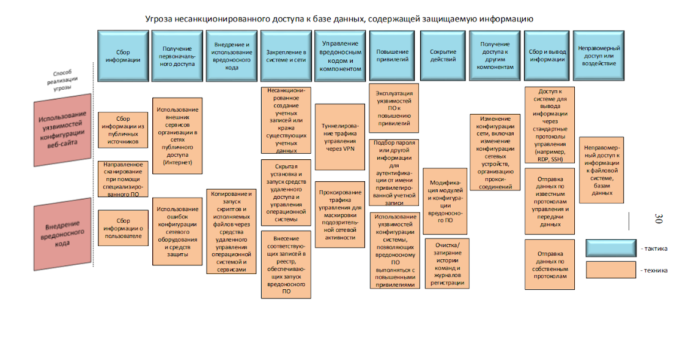

## Виды рисков (ущерба) и типовые негативные последствия

### Классификация негативных последствий

#### Ущерб физическому лицу

- Угроза жизни или здоровью.
- Нарушение свободы, личной неприкосновенности.
- Нарушение неприкосновенности частной жизни.
- Нарушение личной, семейной тайны, утрата чести и доброго имени. Нарушение тайны переписки, телефонных переговоров, иных сообщений.
- Нарушение иных прав и свобод гражданина, закрепленных в Конституции Российской Федерации и федеральных законах.
- Финансовый, иной материальный ущерб физическому лицу.
- Нарушение конфиденциальности (утечка) персональных данных.
- «Травля» гражданина в сети интернет.
- Разглашение персональных данных граждан.

#### Риски юридическому лицу, индивидуальному предпринимателю, связанные с хозяйственной деятельностью:

- Нарушение законодательства Российской Федерации.
- Потеря (хищение) денежных средств.
- Недополучение ожидаемой (прогнозируемой) прибыли.
- Необходимость дополнительных (незапланированных) затрат на выплаты штрафов (неустоек) или компенсаций.
- Необходимость дополнительных (незапланированных) затрат на закупку товаров, работ или услуг (в том числе закупка программного обеспечения, технических средств, вышедших из строя, замена, настройка, ремонт указанных средств).
- Нарушение штатного режима функционирования автоматизированной системы управления и управляемого объекта и/или процесса.
- Срыв запланированной сделки с партнером. Необходимость дополнительных (незапланированных) затрат на восстановление деятельности.
- Потеря клиентов, поставщиков.
- Потеря конкурентного преимущества.
- Невозможность заключения договоров, соглашений.
- Нарушение деловой репутации.
- Снижение престижа.
- Дискредитация работников.
- Причинение имущественного ущерба.
- Неспособность выполнения договорных обязательств. Невозможность решения задач (реализации функций) или снижение эффективности решения задач (реализации функций). Необходимость изменения (перестроения) внутренних процедур для достижения целей, решения задач (реализации функций).
- Принятие неправильных решений.
- Простой информационной системы или сети.
- Публикация недостоверной информации на веб-ресурсах организации.
- Использование веб-ресурсов для распространения и управления вредоносным программным обеспечением.
- Рассылка информационных сообщений с использованием вычислительных мощностей оператора и (или) от его имени.
- Утечка конфиденциальной информации (коммерческой тайны, секретов производства (ноу-хау) и др.)

#### Ущерб государству в области обеспечения обороны страны, безопасности государства и правопорядка, а также в социальной, экономической, политической, экологической сферах деятельности:

- Причинение ущерба жизни и здоровью людей.
- Прекращение или нарушение функционирования объектов обеспечения жизнедеятельности населения.
- Прекращение или нарушение функционирования объектов транспортной инфраструктуры. Прекращение или нарушение функционирования государственного органа в части невыполнения возложенной на него функции (полномочия).
- Прекращение или нарушение функционирования сети связи. Отсутствие доступа к государственной услуге.
- Снижение уровня дохода государственной корпорации, государственной организации или организации с государственным участием.
- Возникновение ущерба бюджетам Российской Федерации.
- Прекращение или нарушение проведения клиентами операций по банковским счетам и (или) без открытия банковского счета или операций в системно значимой кредитной организации, оператором услуг платежной инфраструктуры системно и (или) социально значимых платежных систем, системно значимой инфраструктурной организацией финансового рынка. Вредные воздействия на окружающую среду.
- Прекращение или нарушение функционирования пункта управления (ситуационного центра). Снижение показателей государственного оборонного заказа.
- Прекращение или нарушение функционирования информационной системы в области обеспечения обороны страны, безопасности государства и правопорядка.
- Нарушение законодательства Российской Федерации.
- Публикация недостоверной социально значимой информации на веб-ресурсах, которая может привести к социальной напряженности, панике среди населения и др.
- Нарушение штатного режима функционирования автоматизированной системы управления и управляемого объекта и/или процесса, если это ведет к выводу из строя технологических объектов, их компонентов.
- Нарушение общественного правопорядка, возможность потери или снижения уровня контроля за общественным правопорядком.
- Нарушение выборного процесса.
- Отсутствие возможности оперативного оповещения населения о чрезвычайной ситуации. Организация пикетов, забастовок, митингов и других акций.
- Массовые увольнения.
- Увеличение количества жалоб в органы государственной власти или органы местного самоуправления.
- Появление негативных публикаций в общедоступных источниках.
- Создание предпосылок к внутриполитическому кризису

## Общие принципы (меры) защиты информации

- правовые (законодательные),
- морально-этические,
- организационные (административные и процедурные),
- технологические,
- физические,
- технические (аппаратно-программные).

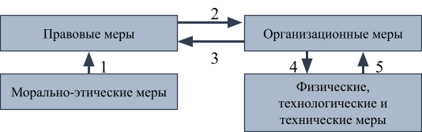

1. Нормативные и организационно-распорядительные документы составляются с учетом и на основе существующих норм морали и этики.
1. Организационные меры обеспечивают исполнение существующих нормативных актов и строятся с учетом существующих правил поведения, принятых в стране и/или организации.
1. Воплощение организационных мер требует разработки соответствующих нормативных и организационно-распорядительных документов.
1. Для эффективного применения организационные меры должны быть поддержаны физическими и техническими средствами.
1. Применение и использование технических средств защиты требует соответствующей организационной поддержки.

### Правовые меры защиты информации

> это законодательное регулирование отношений в этой области.

К правовым мерам защиты относятся:

- действующие в стране законы
- указы
- другие нормативно-правовые акты

Которые:
- регламентируют правила обращения с информацией
- закрепляют права и обязанности участников информационных отношений в процессе
    - получения
    - обработки
    - использования
- устанавливают ответственность за нарушение этих правил, препятствуя тем самым неправомерному использованию информации и являющиеся сдерживающим фактором для потенциальных нарушителей

носят в основном упреждающий, профилактический характер и требуют постоянной разъяснительной работы с пользователями и обслуживающим персоналом системы.

#### Классификация

##### Государственная тайна. Гриф информации — секретно, совершенно секретно, особой важности:

- Закон РФ от 21.07.1993№5485-1 «О государственной тайне»;
- Указ Президента от 30.11.1995 №1203 «Об утверждении перечня сведений, отнесенных к государственной тайне»;
- перечни сведений, подлежащие засекречиванию, уполномоченных органов государственной власти.

##### Персональные данные:

- Федеральный закон №152 от 27.07.2006 «О персональных данных»;
- Федеральный Закон №149 от 27.07.2006 «Об информации, информационных технологиях и о защите информации».

##### Врачебная тайна:

- Федеральный закон от 21.11.2011 № 323-ФЗ «Об основах охраны здоровья граждан…».

##### Коммерческая тайна:

- Федеральный закон от 29.07.2004 № 98-ФЗ «О коммерческой тайне».

##### Тайна связи:

- Федеральный закон от 07.07.2003 № 126-ФЗ «О связи».

##### Тайна страхования:

- Федеральный закон от 29.11.2010 № 326-ФЗ «Об обязательном медицинском страховании…».

##### Банковская тайна:

- Федеральный закон от 02.12.1990 № 395-1 «О банках и банковской деятельности».

##### Сведения, ставшие известными судебным приставам:

- Федеральный закон от 21.07.1997 № 118-ФЗ «О судебных приставах».

##### Налоговая тайна:

Налоговая тайна:

- Налоговый кодекс РФ. Часть первая

Другие законы регулируют деятельность по защите информации, объектов информатизации, по категорированию объектов и определяют общую политику. К таким законам можно отнести, например:
- Доктрину ИБ РФ;
- ФЗ №187 «О безопасности критической информационной инфраструктуры»;
- Постановление Правительства «Об утверждении Правил категорирования объектов критической информационной инфраструктуры Российской Федерации…» от 08.02.2018 г. № 127;
- Положение по аттестации объектов информатизации по требованиям безопасности информации от 25.11.1996;
- Постановление Правительства «О лицензировании деятельности по разработке и производству средств защиты конфиденциальной информации» от 03.03.2012 №171;
- Постановление Правительства «О лицензировании деятельности по технической защите конфиденциальной информации» от 03.02.2012.

### Морально-этические меры защиты

> относятся нормы поведения, которые традиционно сложились или складываются по мере распространения информационных технологий в обществе.

- по большей части не являются обязательными, как требования нормативных актов, однако их несоблюдение ведет обычно к падению авторитета или престижа человека, группы лиц или организации.
- являются профилактическими и требуют постоянной работы по созданию здорового морального климата в коллективах пользователей и обслуживающего персонала АС

Бывают:
- неписаные (общепризнанные нормы честности, патриотизма и т.п.)
- писаные (оформленные в некоторый свод (устав, кодекс чести и т.п.) правил или предписаний)

### Организационные меры защиты

> это меры административного и процедурного характера, регламентирующие процессы функционирования системы обработки данных, использование ее ресурсов, деятельность обслуживающего персонала, а также порядок взаимодействия пользователей и обслуживающего персонала с системой таким образом, чтобы в наибольшей степени затруднить или исключить возможность реализации угроз безопасности или снизить размер потерь в случае их реализации.

Примеры:
- использование процедур двойного ввода ответственной информации
- инициализации ответственных операций только при наличии разрешений от нескольких должностных лиц
- процедур проверки соответствия реквизитов исходящих и входящих сообщений в системах коммутации сообщений
- периодическое подведение общего баланса всех банковских счетов
- и т.п.

### Технологические меры защиты

относятся разного рода технологические решения и приемы, основанные обычно на использовании некоторых видов избыточности (структурной, функциональной, информационной, временной и т.п.) и направленные на уменьшение возможности совершения сотрудниками ошибок и нарушений в рамках предоставленных им прав и полномочий.

### Физические меры защиты

основаны на применении разного рода механических, электро-или электронно-механических устройств и сооружений, специально предназначенных для создания физических препятствий на возможных путях проникновения и доступа потенциальных нарушителей к компонентам системы и защищаемой информации, а также средств визуального наблюдения, связи и охранной сигнализации. К данному типу относятся также меры и средства контроля физической целостности компонентов АС (пломбы, наклейки и т.п.).

### Технические меры защиты

основаны на использовании различных электронных устройств и специальных программ, входящих в состав АС и выполняющих (самостоятельно или в комплексе с другими средствами) функции защиты.

# 4. Модели управления и разграничения доступа

## Общее описание моделей безопасности

Модели позволяют обосновывать безопасность системы, опираясь при этом на постулаты математической теории

системотехнический подход, включающий решение следующих задач
- выбор и обоснование базовых принципов архитектуры защищенных компьютерных систем, определяющих механизмы реализации средств и методов защиты информации;
- подтверждение свойств (защищенности) разрабатываемых систем путем формального доказательства соблюдения политики безопасности (требований, условий, критериев);
- составление формальной спецификации политики безопасности как важнейшей составной части организационного и документационного обеспечения разрабатываемых защищенных компьютерных систем.

> **Политика безопасности организации**
>
> совокупность руководящих принципов, правил, процедур, практических приемов или руководящих принципов в области безопасности, которыми руководствуется организация в своей деятельности.

> **Модель безопасности**
>
> формальное (математическое, алгоритмическое, схемное, древовидное) выражение политики безопасности.

### Три основных типа политик

#### Политика избирательного (дискреционного) доступа

Множество  задается явным образом внешним по отношению к системе фактором в виде указания дискретного набора троек «субъект-поток (операция)-объект».

#### Политика полномочного (мандатного) доступа

Множество $P_L$ задается неявным образом через предоставление субъектам неких полномочий (допуска, мандата) порождать определенные потоки над объектами с определенными характеристиками конфиденциальности (метками, грифами секретности).

#### Политика ролевого (типизированного) доступа

Множество  задается через введение в системе дополнительных абстрактных сущностей – ролей, с которыми ассоциируются конкретные пользователи, и наделение ролевых субъектов доступа на основе дискреционного или мандатного принципа правами доступа к объектам системы.

### Доступ к информации

> ознакомление с ней, ее обработка, в частности копирование, модификация и уничтожение.

> **Субъект доступа**
> 
> это активный компонент системы, который может стать причиной потока информации от объекта к субъекту или изменения состояния системы (пользователь, процесс, прикладная программа).

> **Объект доступа**
> 
> это пассивный компонент системы, хранящий, принимающий или передающий информацию (файл, каталог).


#### Два типа доступа

- **Санкционированный доступ к информации**<br>это доступ, не нарушающий установленные правила разграничения доступа, служащие для регламентации прав доступа субъектов к объектам доступа.
- **Несанкционированный доступ (НСД) к информации**<br>доступ, нарушающий установленные правила разграничения доступа.

> **Разграничение доступа к информации в КС**
> 
> это разделение информации, циркулирующей в КС, на части, элементы, компоненты, объекты и т. д. и организацию такой системы работы с информацией, при которой пользователи имеют доступ только к той части (к тем компонентам) информации, которая им необходима для выполнения своих функциональных обязанностей или необходима исходя из иных соображений.

#### Монитор безопасности

Для обеспечения защиты доступа к информации вводится монитор безопасности

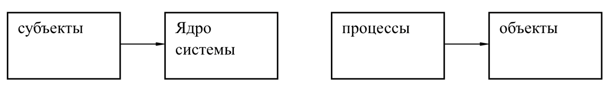 

##### Обязательные требования

- **Полнота**<br>Монитор безопасности должен вызываться при каждом обращении за доступом любого субъекта к любому объекту и не должно быть никаких способов его обхода.
- **Изолированность**<br>Монитор безопасности должен быть защищен от отслеживания и перехвата работы.
- **Верифицируемость**<br>Монитор безопасности должен быть проверяемым (само- или внешнетестируемым) на предмет выполнения своих функций.
- **Непрерывность**<br>Монитор безопасности должен функционировать при любых, в том числе и аварийных ситуациях.

## Модель дискреционного доступа

- непосредственно основываются на субъектно-объектной модели и развивают ее как совокупность некоторых множеств взаимодействующих элементов (субъектов, объектов и т.д.).
- **множество (область) безопасных доступов** в моделях дискреционного доступа определяется дискретным набором троек «пользователь (субъект) — поток (операция) — объект».
- исходя из способа представления области безопасного доступа и механизма разрешений на доступ, анализируется и доказывается, что за конечное число переходов система останется в безопасном состоянии<br><br>
-  **уязвимы для атак с помощью «троянских» программ**, поскольку в них контролируются только операции доступа субъектов к объектам, а не потоки информации между ними

### Модели на основе матрицы доступа

В данных моделях область безопасного доступа строится как прямоугольная матрица (таблица)
- <ins>строки </ins>которой соответствуют **субъектам доступа ($C_i$)**
- <ins>столбцы</ins> — **объектам доступа ($O_i$)**
- <ins>в ячейках</ins> записываются **разрешенные операции (права)** субъекта над объектом
- В матрице используются следующие обозначения:
    - **w** — «писать»
    - **r** — «читать»
    - **e** — «исполнять».

|           | $O_1$     | $O_2$     | $...$     | $O_(n-1)$ | $O_n$     |
| :-------- | --------- | --------- | --------- | --------- | --------- |
| $C_1$     |     r     |           |     e     |           |           |
| $C_2$     |           |     w     |           |           |           |
| $...$     |           |           |           |           |           |
| $C_(k-1)$ |           |           |           |           |           |
| $C_k$     |           |           |           |           |           |

Права доступа в ячейках матрицы в виде разрешенных операций над объектами определяют виды безопасного доступа субъекта к объекту

Для выражения типов разрешенных операций используются специальные обозначения, составляющие основу (алфавит) некоторого языка описания политики разграничения доступа

Принцип организации матрицы доступа в реальных системах определяет использование двух подходов — централизованного и распределенного.

#### Централизованный подход

- матрица доступа создается как отдельный самостоятельный объект с особым порядком размещения и доступа к нему
- количество объектов и субъектов доступа в реальных системах может быть велико
- Для уменьшения количества столбцов матрицы объекты доступа могут делиться на две группы
    - группу объектов, доступ к которым не ограничен
    - группу объектов дискреционного доступа

#### Распределенный подход

- матрица доступа как отдельный объект не создается
- представляется
    - или «списками доступа», распределенными по объектам системы
    - или «списками возможностей», распределенными по субъектам доступ

#### Согласно принципу управления доступом выделяются два подхода

##### Принудительное управление доступом;

- право создания и изменения матрицы доступа имеют только субъекты администратора системы
    - при регистрации для работы в системе нового пользователя создает с соответствующим заполнением новую строку матрицы доступа
    - при возникновении нового объекта, подлежащего избирательному доступу, образует новый столбец матрицы доступа
- Подобный подход наиболее широко представлен в базах данных.

##### Добровольное управление доступом.

- основывается на принципе владения объектами.
- владельцем объекта доступа называется пользователь, инициализировавший поток, в результате чего объект возник в системе, или определивший его иным образом
- Права доступа к объекту определяют их владельцы.

### Парольные системы разграничения доступа

Широко распространенно:
- В документальных информационных системах
- системах автоматизации документооборота

#### Основные положения парольных систем.

1. Система представляется следующим набором сущностей:
	1. множеством информационных объектов (документов) $O\left(o_1, \ldots, o_m\right)$;
	1. множеством пользователей $S\left(s_1, \ldots, s_n\right)$;
	1. множеством паролей доступа к объектам $K\left(k_1, \ldots, k_p\right)$.
2. В системе устанавливается отображение множества $O$ на множество $K$, задаваемое функцией:$f_{k o}: O \rightarrow K$<br>Значением функции $f_{k o}(\mathrm{o})=k o$ является пароль $ko$ доступа к документу $o$.
3. Область безопасного доступа задается множеством троек $(s,k,o)$, каждый элемент которого соответствует владению пользователем паролем доступа к объекту. В результате устанавливается отображение множества $S$ на множество $f_{k s}: S \rightarrow \mathrm{K}$<br><br>Значением $f_{k s}(s)=K s$ является набор паролей доступа к документам системы, известных пользователю $s$.
4. Процессы доступа пользователей к объектам системы организуются в две фазы:
	1. фаза открытия документа;
	1. фаза закрытия (сохранения) документа.

- При открытии документа $o$ пользователь $s$ предъявляет (вводит, передает) монитору безопасности AС пароль $k s_0$ доступа к данному документу
- Запрос в доступе удовлетворяется, если $k s_0=f k_0(\mathrm{o})$
- В случае успешного открытия пользователю предоставляются права работы по фиксированному набору операций с объектом

<span style="color:green">Преимущество: отсутствует ассоциированный с монитором безопасности объект, хранящий информацию о разграничении доступа к конкретным объектам</span>

### Модель Харисона-Руззо-Ульмана (HRU-модель)

Основные положения модели сводятся к следующему.

1. КС представляется тройкой сущностей:
	1. множеством исходных объектов $O\left(o_1, \ldots, o_M\right)$;
	1. множеством исходных субъектов $S\left(s_1, \ldots, s_N\right)$, при этом $S \subseteq O$;
	1. матрицей доступа $A$, каждая ячейка которой специфицирует права доступа к объектам из конечного набора прав доступа $R\left(r_1, r_2, \ldots, r_K\right)$
	- Права доступа $r_i$, размещаемые в ячейках матрицы доступа $A[s, o]$, определяют совокупность допустимых (разрешенных) операций над объектом из полного набора возможных операций над объектами.
2. Функционирование системы рассматривается исключительно с точки зрения изменений в матрице доступа. Возможные изменения определяются шестью примитивными операторами $O_p$:
- Enter $r$ into $A[s,o]$ – ввести право $r$ в ячейку $A[s,o]$;
- Delete $r$ from $A[s,o]$ – удалить право $r$ из ячейки $A[s,o]$;
- Createsubjects – создать субъект $s$ (т. е. новую строку матрицы $A$);
- Createobjecto – создать объект $o$ ( т. е. новый столбец матрицы $A$);
- Destroy subject $s$ – уничтожитьсубъект s;
- Destroyobjecto – уничтожить объект $o$.
- В результате выполнения примитивного оператора осуществляется переход КС из состояния $Q = (S, O, A)$ в новое состояние $Q'= (S',O',A')$.

<span style="color:red">Проблема: отсутствие контроля за порождением потоков информации и, в частности, контроля за порождением субъектов, следствием чего могут быть так называемые «троянские» программы</span>

### Модель типизованной матрицы доступа

КС представляется четверкой сущностей:

- множеством исходных объектов $O\left(o_1, \ldots, o_M\right)$;
- множеством исходных субъектов $S\left(s_1, \ldots, s_N\right)$, при этом $S \subseteq 0$;
- матрицей доступа $A$, каждая ячейка которой специфицирует права доступа к объектам из конечного набора прав доступа $R\left(r_1, r_2, \ldots, r_K\right)$
- множеством (конечным набором) типов безопасности $T\left(t_1, t_2, \ldots, t_L\right)$, с одним из которых создается любой объект (включая субъекты).

### Модель Таke-GRANT

> формальная модель, используемая в области компьютерной безопасности для анализа систем дискреционного разграничения доступа. Эта модель подтверждает либо опровергает степени защищенности данной автоматизированной системы, которая должна удовлетворять регламентированным требованиям.

- Модель представляет всю систему как направленный граф, где узлы — либо объекты, либо субъекты
- Дуги между ними маркированы, и их значения указывают права, которые имеет объект или субъект (узел)

4 правила преобразования:
- правило «брать»;
- правило «давать»;
- правило «создать»;
- правило «удалить».

Используя эти правила, можно воспроизвести состояния, в которых будет находиться система в зависимости от распределения и изменения прав доступа. Следовательно, можно проанализировать возможные угрозы для данной системы.

- $O$ — множество объектов ([ файлы ](https://ru.wikipedia.org/wiki/%D0%A4%D0%B0%D0%B9%D0%BB), [ сегменты памяти ](https://ru.wikipedia.org/wiki/%D0%A1%D0%B5%D0%B3%D0%BC%D0%B5%D0%BD%D1%82_%D0%BF%D0%B0%D0%BC%D1%8F%D1%82%D0%B8) и т. д.);
- $S$ — множество субъектов ([ пользователи ](https://ru.wikipedia.org/wiki/%D0%9F%D0%BE%D0%BB%D1%8C%D0%B7%D0%BE%D0%B2%D0%B0%D1%82%D0%B5%D0%BB%D1%8C_(%D0%B8%D0%BD%D1%84%D0%BE%D1%80%D0%BC%D0%B0%D1%82%D0%B8%D0%BA%D0%B0)), процессы системы);
- $R=\left\{r_1, r_2, r_3, r_4, \ldots, r_n\right\} \cup\{t, g\}$ — множество прав доступа;
- t [take] - право брать «права доступа»;
- g [grant] — право давать «права доступа»;
- G = (S, O, E) — конечный, помеченный, ориентированный граф без петель;
- × — объекты, элементы множества $О$;
- • — субъекты, элементы множества $S$;
- $E \in O \times O \times R$ — дуги графа. Состояние системы описывается ее графом.

#### Реализация правила «Брать».

Брать = take(r, x, y, s), $r \in R$. Пусть $s \in S, \ x,\ y \in O$ — вершины графа $G$.

Тогда граф $G$:


То есть субъект $S$ берет у объекта $X$ права $r$ на объект $Y$.

#### Реализация правила «Давать».

Давать = grant(r, x, y, s), $r \in R$. Пусть $s /ing S, x,y /in O$ — вершины графа $G$.

Тогда граф $G$:


То есть субъект $S$ дает объекту $X$ права $r$ на объект $Y$.

## Модели безопасности на основе мандатной политики

### Общий подход

Для мандатной политики были применены принципы секретного делопроизводства:

1. Гриф конфиденциальности.
1. Невозможность получения информации из документов определенного уровня безопасности работником, чей уровень безопасности, т.е. уровень доверия ниже, чем уровень безопасности соответствующих документов.

Данный критерий безопасности фактически означает запрет определенных информационных потоков, которые трактуются как опасные и недопустимые для дискреционной модели.

На этой основе было «выявлено» два основных правила, гарантирующих безопасность:

- **Правило 1: noreadup (NRU) – нет чтения вверх**<br>Работник не имеет права знакомиться с документом (читать), гриф секретности (уровень безопасности) которого выше его степени допуска (уровня безопасности).
    - является естественным и очевидным способом обеспечения безопасности при осуществлении информационных потоков из документов к работникам и иначе может быть сформулировано так – <ins>работнику нельзя получать информацию, уровень секретности которой выше его уровня доверия</ins>.
- **Правило 2: nowritedown (NWD) – нет записи вниз**<br>Работник не имеет права вносить информацию (писать) своего уровня безопасности в документ с более низким уровнем безопасности (с более низким грифом секретности).
    - обеспечивает безопасность при осуществлении информационных потоков от работника к документу и иначе может быть сформулировано так: – <ins>работнику нельзя передавать информацию своего уровня секретности в тех случаях, когда в результате передачи с ней могут ознакомиться работники с более низким уровнем безопасности</ins>.

> **Мандатное управление доступом**
>
> разграничение доступа субъектов к объектам, основанное на назначении метки конфиденциальности для информации, содержащейся в объектах, и выдаче официальных разрешений (допуска) субъектам на обращение к информации такого уровня конфиденциальности.

Также иногда переводится как «принудительный контроль доступа».

сочетающий защиту и ограничение прав, применяемый по отношению к компьютерным процессам, данным и системным устройствам и предназначенный для предотвращения их нежелательного использования.

<span style="color:green">Важное достоинство заключается в том, что пользователь не может полностью управлять доступом к ресурсам, которые он создает.</span>

Политика безопасности системы, установленная администратором, полностью определяет доступ, и обычно пользователю не разрешается устанавливать более свободный доступ к своим ресурсам, чем тот, который установлен администратором пользователю.

### Модель Белла-Лападуллы

> модель контроля и управления доступом, основанная на мандатной модели управления доступом. В модели анализируются условия, при которых невозможно создание информационных потоков от субъектов с более высоким уровнем доступа к субъектам с более низким уровнем доступа.

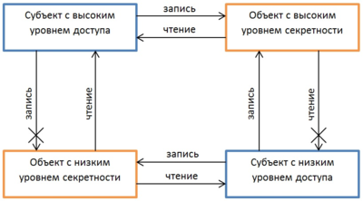

Суть системы заключалась в следующем:
- каждому субъекту (лицу, работающему с документами) и объекту (документам) присваивается метка конфиденциальности
    - начиная от самой высокой («особой важности»)
    - заканчивая самой низкой («несекретный» или «общедоступный»).
- Причем субъект, которому разрешен доступ только к объектам с более низкой меткой конфиденциальности, не может получить доступ к объекту с более высокой меткой конфиденциальности. 
- Также субъекту запрещается запись информации в объекты с более низким уровнем безопасности

Основные правила, обеспечивающие разграничение доступа, приведены ниже:
- **noreadup (NRU)** – нет чтения вверх
- **nowritedown (NWD)** – нет записи вниз

## Ролевое разграничение доступа

Должность, которую можно трактовать как определенную роль, представляет некоторую абстрактную, точнее обобщенную сущность, выражающую определенный тип функций и тип положения работника (подчиненность, права и полномочия).

Так как привилегии не назначаются пользователям непосредственно и приобретаются ими только через свою роль (или роли), управление индивидуальными правами пользователя по сути сводится к назначению ему ролей.

Для определения модели RBAC используются следующие соглашения:

- S = Субъект (англ. Subject) = Человек или автоматизированный агент (множество пользователей);
- R = Роль (англ. Role) = Рабочая функция или название, которое определяется на уровне авторизации (множество ролей);
- P = Разрешения (англ. Permissions) = Утверждения режима доступа к ресурсу (множество прав доступа на объекты системы);
- SE = Сессия (англ. Session) = Соответствие между S, R и/или P
- SA = Назначение субъекта (англ. SubjectAssignment)
- PA: R → 2p — функция, определяющая для каждой роли множество прав доступа; при этом для каждого p ∈ P существует r ∈ R такая, что p ∈ PA(r); (англ. PermissionAssignment)
- RH = Частично упорядоченная иерархия ролей (англ. RoleHierarchy). RH может быть еще записана так: ≥
	- один субъект может иметь несколько ролей;
	- одну роль могут иметь несколько субъектов;
	- одна роль может иметь несколько разрешений;
	- одно разрешение может принадлежать нескольким ролям.

Роли назначаются субъектам, вследствие чего субъекты получают те или иные разрешения через роли.

> **Ролью**
>
> называется активно действующая в КС абстрактная сущность, обладающая логически взаимосвязанным набором полномочий, необходимых для выполнения определенных функциональных обязанностей пользователями системы.

## Модели безопасности информационных потоков

Имеется проблема мандатного управления доступа ‒ проблема деклассификации и наличия скрытого канала.

Проблема состоит в том, что в некоторых случаях объект может понизить свой уровень доступа, не нарушая формальных правил. Если перед этим данный объект возьмет под свой контроль некоторую информацию, то таким образом он переведет данную информацию на более низкий уровень секретности. Фактически произошло прямое нарушение свойства * («запрет записи вниз»), но формально все правила были соблюдены.

> **Безопасность информационных потоков**
>
> набор требований и правил, направленных на определение того, какие информационные потоки в системе являются разрешенными, а какие нет.

Данная модель не является самостоятельной, и используется в дополнение к мандатной или дискреционной модели управления доступа.

Информационным потоком от объекта О (источник) к объекту О1 (приемник) называется преобразование информации в объекте О1 зависящее от информации в объекте О

## Модель информационной невыводимости

- базирующуюся на рассмотрении информационных потоков в системе
- Модель невыводимости выражается в терминах пользователей и информации, связанных с одним из двух возможных уровней секретности (высокий или низкий).

Система считается **невыводимо безопасной**, если пользователи с низкими уровнями безопасности не могут получить информацию с высоким уровнем безопасности в результате любых действий пользователей с высоким уровнем безопасности.
- в таких системах утечка информации не может произойти в результате посылки высокоуровневыми пользователями высокоуровневой информации к низкоуровневым пользователям.

такое определение безопасности не предохраняет информацию высокоуровневых пользователей от просмотра низкоуровневыми пользователями.
- требует, чтобы низкоуровневые пользователи не были способны использовать доступную им информацию для получения высокоуровневой информации (это объясняет, почему определение названо невыводимостью).

## Модели информационного невмешательства (невлияния)

> **Невмешательство**
>
> ограничение, при котором ввод высоко уровневого пользователя не может смешиваться с выводом низкоуровневого пользователя. Модель невмешательства рассматривает систему, состоящую из четырех объектов: высокий ввод (high–in), низкий ввод (low–in), высокий вывод (high–out), низкий вывод (low–out).

Система удовлетворяет требованию невмешательства, если и только если для всех пользователей, всех историй Т, были удалены команды, исполненные пользователем, чей уровень безопасности не доминирует над уровнем безопасности.

# 5. Модели целостности информации

## Общие положения

> **Целостность**
>
> это термин в информатике (криптографии, теории телекоммуникаций, теории информационной безопасности), означающий, что данные не были изменены при выполнении какой-либо операции над ними, будь то передача, хранение или отображение.

> **Целостность информации (ресурсов автоматизированной информационной системы)**
>
> состояние информации (ресурсов автоматизированной информационной системы), при котором ее (их) изменение осуществляется только преднамеренно субъектами, имеющими на него право [Р 50.1.053-2005].

> **Целостность данных** — отсутствие ненадлежащих изменений.

> **Целостность документа**
>
> свойство документа, состоящее в том, что при любой демонстрации документа заданные значения параметров демонстрируемого представления документа соответствуют специфицированным требованиям.

Угроза целостности существует на всех этапах жизни информации:
- при хранении;
- обработке;
- транспортировке.

### С точки зрения механизмов обеспечения целостности данных можно выделить три составляющие:

- **Правильность**<br>Заключается в отсутствии логических ошибок в структуре и ошибок в содержании (в значениях) данных при их обработке.
- **Неискаженность**<br>Заключается в отсутствии подделки данных или возникновения ошибок в данных при их передаче в линиях связи, а также при хранении в компьютерных системах.
- **Неизменность**<br>Заключается в тождественности данных определенному эталону.

### Для данных аспектов в зависимости от области работы с данными выделяют:

- специальные технологии разграничения доступа данных, обеспечивающие их целостность в смысле правильности, неискаженности и неизменности, то есть с использованием моделей целостности данных;
- общие технологии обеспечения целостности (методы ее защиты при хранении обработке и передаче (транспортировке)). Защита целостности осуществляется в основном для электронных и бумажных документов.
- криптографические технологии электронной цифровой подписи, обеспечивающие целостность данных в смысле их неискаженности при передаче в линиях связи и хранении в компьютерных системах, шифрование информации.

## Модели

### Модель Кларка Уилсона

- Модель целостности Кларка-Уилсона обеспечивает <ins>основу для определения и анализа политики целостности вычислительной системы</ins>
- Модель в первую очередь касается формализации понятия **целостности информации**
- Целостность информации поддерживается путем предотвращения повреждения элементов данных в системе либо по ошибке, либо со злым умыслом.

Что делает:
- Политика целостности описывает, как элементы данных в системе должны сохраняться действительными от одного состояния системы к следующему
- определяет возможности различных участников системы.

Модель использует метки безопасности для предоставления доступа к объектам с помощью процедур преобразования и модели ограниченного интерфейса.

Правила обеспечения соблюдения и сертификации модели определяют элементы данных и процессы, которые обеспечивают основу для политики целостности. Ядро модели основано на понятии транзакции.

> **Правильно сформированная транзакция**
>
> это серия операций, которые переводят систему из одного согласованного состояния в другое согласованное состояние.

- политика добросовестности направлена на обеспечение целостности транзакций.
- принцип разделения обязанностей требует, чтобы удостоверяющий транзакцию и исполнитель были разными субъектами.

### Базовые конструкции

- **Ограниченный элемент данных (CDI)**<br>Ключевым типом данных в модели Кларка–Уилсона
- **Процедура проверки целостности (IVP)**<br>Гарантирует, что все CDI в системе действительны в определенном состоянии
- **Элемент неограниченных данных (UDI)**<br>представляют системные входные данные (например, предоставленные пользователем или злоумышленником)
- **Процедура преобразования (TPS)**<br>Транзакции, которые обеспечивают соблюдение политики целостности
    - принимает в качестве входных данных ```CDI``` или ```UDI```
    - должен гарантировать (посредством сертификации), что он преобразует все возможные значения ```UDI``` в «безопасный» ```CDI```
    - должен перевести систему из одного допустимого состояния в другое допустимое состояние

### Основные положения модели.

1. Все множество объектов ```D``` разделяется на объекты ```CDI``` , требующие контроля целостности (constraineddataitems), и объекты ```UDI```, не требующие контроля целостности (unconstraineddataitems). $D=C D I \cup U D I, C D I \cap U D I=\varnothing$.
1. На множестве элементарных операций над объектами выделяются совокупности (последовательности), обособляющиеся в логически самостоятельные сущности, называемые процедурами преобразования ```TP``` (transformation procedures).
1. Дополнительно вводится особый класс процедур ```IVP``` над данными, которые обеспечивают проверку целостности контролируемых данных (integrity verification procedures).
1. Те процедуры преобразования данных TP, применение к результатам которых процедур проверки целостности ```IVP``` дает положительный результат, называются «корректно (правильно, хорошо) сформированными транзакциями».

### Устанавливаются следующие правила функционирования системы.

- <font size="4">**С1.**</font> Множество всех процедур контроля целостности ```IVP``` должно содержать процедуры контроля целостности любого элемента данных из множества всех ```CDI```.
- <font size="4">**С2.**</font> Все процедуры преобразования ```TP``` должны быть хорошо сформированными транзакциями, т.е. не нарушать целостности данных, и применяться только по отношению к списку элементов (объектов) ```CDI```, устанавливаемых администратором системы.
- <font size="4">**Е1.**</font> Система должна контролировать допустимость применения ```TP``` к элементам ```CDI``` в соответствии со списками, указанными в правиле <ins>С2</ins>.
- <font size="4">**Е2.**</font> Система должна поддерживать список разрешенных конкретным пользователям процедур преобразования ```TP``` с указанием допустимого для каждой ```TP``` и данного пользователя набора обрабатываемых элементов ```CDI``` (т.е. тройки «субъект-```TP```-объект ```CDI```»).
Список, определенный правилом <ins>С2</ins>, должен отвечать требованию разграничения функциональных обязанностей (в т.ч. совместного выполнения).
- <font size="4">**Е3.**</font> Система должна аутентифицировать всех пользователей, пытающихся выполнить какую-либо процедуру преобразования ```TP```.
- <font size="4">**С4.**</font> Каждая ```TP``` должна записывать в журнал регистрации информацию, достаточную для восстановления полной картины каждого применения этой ```TP```. Журнал регистрации – это специальный элемент ```CDI```, предназначенный только для добавления в него информации.
- <font size="4">**С5.**</font> Специальные ```TP``` могут корректно обрабатывать ```UDI```, превращая их в ```CDI``` .
- <font size="4">**Е4.**</font> Только специально уполномоченный субъект (пользователь) может изменять списки, определенные в правилах <ins>С2</ins> и <ins>Е2</ins>. Этот субъект не имеет права выполнять какие-либо действия, если он уполномочен изменять регламентирующие эти действия списки.


## Модель Кена Биба

> представляет собой формальную систему перехода состояния политики компьютерной безопасности, описывающую набор правил контроля доступа, предназначенных для обеспечения целостности данных

- Данные и субъекты сгруппированы по упорядоченным уровням целостности
- субъекты не могут повредить данные на уровне, ранжированном выше, чем у субъекта
- или быть повреждены данными с более низкого уровня, чем у субъекта.<br><br>
- модель была разработана для рассмотрения целостности как основного принципа

Сохранение целостности данных преследует три цели:
- Предотвращать изменение данных неавторизованными сторонами
- Предотвращение несанкционированного изменения данных уполномоченными сторонами
- Поддерживать внутреннюю и внешнюю согласованность (т.е. данные отражают реальный мир)

Эта модель безопасности направлена на целостность данных (а не на конфиденциальность) и характеризуется фразой: «прочитай, запиши».

### Набор правил безопасности
- Свойство Simple Integrity утверждает, что субъект с заданным уровнем целостности не должен считывать данные с более низкого уровня целостности (без чтения вниз).
- Свойство целостности * (звездочка) указывает, что субъект с заданным уровнем целостности не должен выполнять запись в данные с более высоким уровнем целостности (без записи).
- Свойство вызова указывает, что процесс снизу не может запрашивать более высокий доступ; только с субъектами на равном или более низком уровне

## Защита целостности электронной информации при хранении

### Организационные меры

Организационные меры защиты направлены на предупреждение хищения или утраты носителей, а вместе с ними и информации. Организационные меры излагаются в документах, описывающих режим хранения конфиденциальной информации.

Организационные меры разделяются на две группы:

- Создание резервных копий информации, хранимой на электронных носителях.
- Обеспечение правильных условий хранения и эксплуатации носителей.

#### Создание резервных копий

> **Резервное копирование (англ. backupcopy)**
>
> процесс создания копии данных на носителе (жестком диске, дискете и т. д.), предназначенном для восстановления данных в оригинальном или новом месте их расположения в случае их повреждения или разрушения.

##### Резервирование в биологических системах

- Механизм резервирования, обеспечивающий воспроизведение вида — многочисленное потомство.
- Резервирование создает новые функциональные возможности. Дублирование глаз (разнесенных на некоторое расстояние) позволяет реализовать стереоскопическое зрение, то есть определять расстояние до объекта, дублирование ушей — определять направление на источник звука (бинауральный эффект).

##### Резервирование в организационных системах

- Пример резервирования в организационных структурах — наличие заместителей у руководителей.
- В вооруженных силах используется резервирование кадров — запас.

##### Резервирование в технических системах

Резервирование в технике — метод повышения характеристик надежности технических устройств или поддержания их на требуемом уровне посредством введения аппаратной избыточности за счет включения запасных (резервных) элементов и связей, дополнительных по сравнению с минимально необходимым для выполнения заданных функций в данных условиях работы.

###### Наименование операций

- Резервное копирование данных (резервное дублирование данных) — процесс создания копии данных.
- Восстановление данных — процесс восстановления в оригинальном месте.

##### Полное резервное копирование

Полное копирование обычно затрагивает всю систему и все файлы. Еженедельное, ежемесячное и ежеквартальное резервное копирование подразумевает создание полной копии всех данных.

##### Дифференциальное резервное копирование

При дифференциальном («разностном») резервном копировании каждый файл, который был изменен с момента последнего полного резервного копирования, копируется каждый раз заново.

<span style="color:green">ускоряет процесс восстановления</span>

##### Инкрементное резервное копирование

При добавочном («инкрементном») резервном копировании происходит копирование только тех файлов, которые были изменены с тех пор, как в последний раз выполнялось полное или добавочное резервное копирование

<span style="color:green">занимает меньше времени</span>

<span style="color:red">процесс восстановления данных занимает больше времени</span>

#### Обеспечение правильных условий хранения и эксплуатации

##### Мобильные носители

- определяется конкретным типом носителя
- учет носителей производятся независимо от того, есть ли на них конфиденциальная информация или нет
- служебные носители должны иметь ясную, хорошо видимую этикетку, на которой проставлены гриф, номер, дата регистрации
- Гриф секретности носителя может изменяться только в большую сторону
- Учет носителей по журналу ведется в течение всей «жизни» носителя<br><br>
- не должно быть личных носителей
- передача между подразделениями должна осуществляться под расписку и учитываться в журнале
- вынос за пределы помещения возможен только с разрешения уполномоченных лиц.

##### Стационарные носители

- диск регистрируется с грифом, соответствующим категории компьютера, независимо от целей его использования
- на корпусе жесткого диска должна быть этикетка
- при передаче компьютера в ремонт необходимо
    - либо изъять жесткий диск
    - либо гарантированно удалить с него информацию
    - либо присутствовать при ремонте
- копирование файлов с зарегистрированных носителей допускается только на компьютерах, категория которых не ниже грифа секретности носителя
    - каждое копирование должно учитываться в обычном или электронном журнале.

## Контроль целостности

> Механизм, необходимый для отслеживания неизменности файлов, документов, реестра, конфигурации оборудования и других сущностей, которые находятся на компьютере или сервере

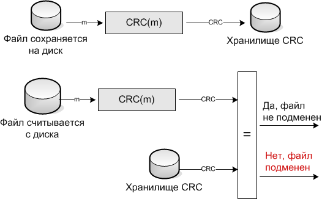

### Контроль целостности по ГОСТ Р 57580.1-2017:

- Наличие, учет и контроль целостности эталонных копий ПО АС, ПО средств и систем защиты информации, системного ПО
- Наличие, учет и контроль целостности эталонных значений параметров настроек ПО АС, системного ПО, ПО средств и систем защиты информации, возможность восстановления указанных настроек в случаях нештатных ситуаций
- Контроль состава ПО серверного оборудования
- Контроль состава ПО АРМ пользователей и эксплуатационного персонала, запускаемого при загрузке операционной системы
- Контроль целостности запускаемых компонентов ПО АС на АРМ пользователей и эксплуатационного персонала
- Регистрация установки, обновления и (или) удаления ПО АС, ПО средств и систем защиты информации, системного ПО на серверном и сетевом оборудовании
- Регистрация результатов выполнения операций по контролю состава ПО серверного оборудования, АРМ пользователей и эксплуатационного персонала

### Контроль целостности по приказам ФСТЭК: приказы 21, 17,239.

- Регламентация правил и процедур обеспечения целостности
- Контроль целостности программного обеспечения
- Ограничения по вводу информации в информационную (автоматизированную) систему
- Контроль данных, вводимых в информационную (автоматизированную) систему
- Контроль ошибочных действий пользователей по вводу и (или) передаче информации и предупреждение пользователей об ошибочных действиях
- Обезличивание и (или) деидентификация информации

### Программные средства контроля целостности

- **Средства анализа защищенности (vulnerability scanners)**<br>Удаленное подключение к защищаемым ресурсам, снятие хеш-суммы с контролируемых файлов и сохранение в локальную базу на периодической основе.
- **Средства защиты информации от несанкционированного доступа (СЗИ от НСД, Endpointprotection)**<br>Обеспечение контроля целостности файлов и реестра комплексным агентским решением, обеспечивающим разграничение доступа к файлам, контроль прав доступа, контроль изменений по хеш-суммам и свойствам файла.
- **Средства обнаружения вторжений уровня хоста (Host Intrusion Detection System, IDS)**<br>**Средства контроля целостности файлов (File integrity monitoring, FIM)**<br>Обеспечение контроля целостности файлов и реестра легким агентом, обеспечивающим контроль изменений файла по хеш-суммам и свойствам файл.

### Защита целостности информации при обработке

#### 9 основных принципов:

##### 1. Корректность транзакций

- Пользователь не должен модифицировать данные произвольно, а только определенными способами, т.е. так, чтобы сохранялась целостность данных.
- данные можно изменять только путем корректных транзакций и нельзя произвольными средствами
- «корректность» каждой из таких транзакций должна быть доказана.

##### 2. Аутентификация пользователей

- может осуществляться только специально аутентифицированными для этой цели пользователями
- работает совместно с последующими четырьмя

##### 3. Минимизация привилегий

- процессы должны быть наделены теми и только теми привилегиями, которые естественно и минимально необходимы для выполнения процессов.
- распространяется и на программы, и на пользователей.

##### 4. Разграничение функциональных обязанностей

- подразумевает организацию работы с данными таким образом, что в каждой из ключевых стадий, составляющих единый критически важный, с точки зрения целостности, процесс, необходимо участие различных пользователей
- гарантирует невозможность выполнения одним пользователем всего процесса целиком  с тем, чтобы нарушить целостность данных

##### 5. Аудит произошедших событий

- является превентивной мерой в отношении потенциальных нарушителей

##### 6. Объективный контроль

- контроль целостности данных имеет смысл лишь тогда, когда эти данные отражают реальное положение вещей
- необходимость регулярных проверок, имеющих целью выявление возможных несоответствий между защищаемыми данными и объективной реальностью, которую они отражают

##### 7. Управление передачей привилегий

- необходимо для эффективной работы всей политики безопасности
- должна адекватно отражать организационную структуру предприятия
- должна позволять администраторам безопасности гибко манипулировать схемой назначения привилегий для обеспечения эффективности производственной деятельности

##### 7. Обеспечение непрерывной работоспособности

- защита от сбоев, стихийных бедствий и других форс-мажорных обстоятельств

##### 8. Простота использования защитных механизмов

- чтобы пользователи не стремились обойти их как мешающих «нормальной» работе
- как правило, простые схемы являются более надежными
- самый безопасный путь эксплуатации системы будет также наиболее простым, и самый простой — наиболее защищенным.

### Защита целостности информации при транспортировке

Средства контроля целостности должны обеспечивать защиту от несанкционированного изменения информации нарушителем при ее передаче по каналам связи, как по электронным, бумажным, аудиальным каналам.

- следует защищать как целостность, так и подлинность информации
- выполнение двумя сторонами — источником и приемником — некоторых (возможно, разных) криптографических преобразований данных
- контроль целостности может выполняться с восстановлением или без восстановления исходных данных

#### Имитовставка

вводится некоторая дополнительная информация, которая легко вычисляется, если секретный ключ известен, и является трудновычислимой в противном случае

> **Имитовставка (MessageAuthenticationCode (MAC))** - если такая информация вырабатывается и проверяется с помощью одного и того же секретного ключа

#### Шифрование

Целостность данных можно обеспечить и с помощью их шифрования симметричным криптографическим алгоритмом при условии, что подлежащий защите текст обладает некоторой избыточностью

#### Контроль целостности потока сообщений

- помогает обнаружить их повтор, задержку, переупорядочение или утрату
- целостность каждого отдельного сообщения обеспечивается шифрованием, имитовставкой или цифровой подписью
- пример
    - может использоваться порядковый номер целостности
    - использовать в алгоритмах шифрования сцепление с предыдущим сообщением

#### Электронная подпись

- Цифровая подпись вычисляется на основе сообщения и секретного ключа отправителя

### Защита от угрозы нарушения целостности информации на уровне содержания

в обычной практике рассматривается как защита от дезинформации

Наиболее распространенные приемы дезинформации:
- прямое сокрытие фактов;
- тенденциозный подбор данных;
- нарушение логических и временных связей между событиями;
- подача правды в таком контексте (добавлением ложного факта или намека), чтобы она воспринималась как ложь;
- изложение важнейших данных на ярком фоне отвлекающих внимание сведений;
- смешивание разнородных мнений и фактов;
- изложение данных словами, которые можно истолковывать по-разному;
- отсутствие упоминания ключевых деталей факта.

В процессе сбора и получения информации могут возникнуть искажения.

Основные причины искажений информации:
- передача только части сообщения;
- интерпретация услышанного в соответствии со своими знаниями и представлениями;
- пропуск фактуры через призму субъективно-личностных отношений.

Для успешности борьбы с вероятной дезинформацией следует:
- различать факты и мнения;
- применять дублирующие каналы информации;
- исключать все лишние промежуточные звенья и т.п.

## Защита семантического анализа и актуальности информации

### два уровня
- **уровень представления**<br>защиту от угрозы отказа доступа к информации (защиту семантического анализа) можно рассматривать как противодействие сопоставлению используемым синтаксическим конструкциям (словам некоторого алфавита, символам и т.п.) определенного смыслового содержания.
- **уровень содержания информации**<br>защита информации от угрозы доступности обеспечивается защитой актуальности информации или легализацией полученных сведений или данных.

# 6. Модели и методы обеспечения доступности информации

> **Доступность информации**
>
> это состояние информации (ресурсов автоматизированной информационной системы, бумажных документов и других видов носителей информации), при котором субъекты, имеющие права доступа, могут реализовывать их беспрепятственно.

К правам доступа относятся:
- право на чтение,
- изменение,
- хранение,
- копирование,
- уничтожение информации.
- права на изменение, использование, уничтожение ресурсов

> **Доступность (документа)
>
> свойство документа, состоящее в том, что форма представления документа обеспечивает физическую возможность измерения заданных параметров этого представления документа (содержания, атрибутов, технологии) заданными средствами в заданных точках за конечное время.

> **Доступ к информации
>
> возможность получения информации и ее использования.

> **Доступ (в автоматизированной информационной системе)
>
> получение возможности ознакомления с информацией, ее обработки и (или) воздействия на информацию и (или) ресурсы автоматизированной информационной системы с использованием программных и (или) технических средств.

При этом к субъектами доступа относятся лица, а также логические и физические объекты, например базы данных, компьютеры.

К нарушениям доступности можно отнести:
- Выход поддерживающей инфраструктуры из обычного режима (к этому может привести, к примеру, превышение числа запросов);
- Отказ ПО.

## Реализация условий доступности информации (исключение неправомерного блокирования информации)

необходимо реализовать («Меры защиты информации в ГИС» (утв. ФСТЭК России 11.02.2014)):
- отказоустойчивость технических средств;
- резервирование технических средств, программного обеспечения, каналов передачи информации, средств обеспечения функционирования информационной системы
- контроль безотказного функционирования технических средств, обнаружение и локализация отказов функционирования, принятие мер по восстановлению отказавших средств и их тестирование;
- периодическое резервное копирование информации на резервные машинные носители информации;
- обеспечение возможности восстановления информации с резервных машинных носителей информации (резервных копий) в течение установленного временного интервала;
- кластеризацию информационной системы и (или) ее сегментов;
- контроль состояния и качества предоставления уполномоченным лицом вычислительных ресурсов (мощностей), в том числе по передаче информации;

## Отказоустойчивость технических средств.

Обеспечение доступности информации обеспечивается устойчивой работой технических средств, предусматривающее:
1. определение сегментов информационной системы, в которых должны применяться отказоустойчивые технические средства, обладающие свойствами сохранять свою работоспособность после отказа одного или нескольких их составных частей;
1. перечень таких средств, например, серверных;
1. необходимость оценки степени непрерывного функционирования информационной системы – необходимость круглосуточности, допустимы ли остановки системы, например на техническое обслуживание;
1. определение коэффициентов готовности технических средств;
1. определение параметров безотказной работы.

По результатам анализа пунктов 1-3 необходимо составить <ins>список оборудования для оценки надежности, и определить возможные времена остановки системы</ins>.

Далее необходимо определить коэффициенты готовности.

### Коэффициенты готовности

> **Коэффициенты готовности**
>
> вероятности того, что объекты будут в работоспособном состоянии в произвольный момент времени (кроме планируемых периодов, в течение которых применение объекта по назначению не предусматривается).

Коэффициент готовности представляет собой отношение времени исправной работы к сумме времен исправной работы и вынужденных простоев объекта, взятых за один и тот же календарный срок.

$\mathrm{Kg}=\mathrm{t}_{\mathrm{w}} /\left(\mathrm{t}_{\mathrm{w}}+\mathrm{t}_{\mathrm{p}}\right)$

- $t_w$ – суммарное время исправной работы объекта;
- $t_p$– суммарное время вынужденного простоя.

### Расчет вероятности безотказной работы

Далее для каждого элемента проводится расчет его вероятности безотказной работы исходя их стандартных показателей. Рассмотрим, как это делается на примере.

Пример:

Ориентировочные статистические данные по надежности основных компонентов сервера и рабочей станции

| № компонента    | Компонент   | Диапазон наработки на отказ<br>по экспертным оценкам (тыс. часов)    |
|---------------- | --------------- | --------------- |
| 1    | Системная плата    | 100-150    |
| 2    | Жесткий диск    | 1000-1400    |
| 3    | Монитор         | 50-100 |

Экспертные данные по функциональным отказам компонентов сервера и рабочей станции

| Компонент    | Интенсивность отказов<br>(x 10-3ч-1)  | Значение r<br>(для рабочей станции)  |
|---------------- | --------------- | --------------- |
| Системная плата    | 0,010    | 1    |
| Жесткий диск    | 0,001    | 1    |
| Монитор    | 0,010    | 0,05    |

Общая интенсивность отказов сервера в уточненном виде запишется как:

$\Lambda=\sum_{i=1}^{i=N} \lambda_i r_i$

- $N$ – число компонентов сервера
- $r_i$ – вероятность того, что отказ $i$-го компонента приводит к функциональному отказу сервера,
- $\lambda_i$ – интенсивность отказов $i$-го компонента.

## Резервирование технических средств, программного обеспечения, каналов передачи информации, средств обеспечения функционирования ИС

Резервирование технических средств возможно в режимах **ненагруженное («холодное»)** и (или) **нагруженное («горячее»)** резервирование.

По формулам, приведенным выше, необходим контроль с установленной периодичностью за значениями характеристик (коэффициентов) готовности и надежности технических средств и реагирование на ухудшение значений данных характеристик

Резервирование каналов передачи информации включает:

- резервирование каналов связи, обеспечивающее снижение вероятности отказа в доступе к информационной системе;
- наличие у основных и альтернативных поставщиков телекоммуникационных услуг (провайдеров) информационной системы планов по восстановлению связи при авариях и сбоях, с указанием времени восстановления.

Резервирование средств обеспечения функционирования информационной системы включает:

- использование кратковременных резервных источников питания для обеспечения правильного завершения работы сегмента информационной системы (технического средства, устройства) в случае отключения основного источника питания;
- использование долговременных резервных источников питания в случае длительного отключения основного источника питания и необходимости продолжения выполнения сегментом информационной системы (техническим средством, устройством) установленных функциональных (задач);
- определение перечня энергозависимых технических средств, которым необходимо обеспечить наличие резервных источников питания (кратковременных и долговременных);
- конфигурацию резервных мест обработки информации, предусматривающую минимально требуемые эксплуатационные возможности рабочего места;
- разработку оператором процедур обеспечения требуемых условий, обеспечения непрерывности функционирования информационной системы и доступности информации в случае нарушения функционирования (сбоев, аварий) резервных мест обработки информации;

### Контроль безотказного функционирования технических средств

Необходимо проводить контроль безотказного функционирования
- серверного и телекоммуникационного оборудования
- каналов связи
- средств обеспечения функционирования информационной системы

путем периодической проверки работоспособности в соответствии с эксплуатационной документацией

При обнаружении отказов функционирования осуществляется 
- локализация
- принятие мер по восстановлению отказавших средств
- тестирование в соответствии с эксплуатационной документацией.

Оператором должна обеспечиваться регистрация сбоев и отказов в функционировании технических средств информационной системы<br>
В информационной системе должны применяться программные средства мониторинга технического состояния информационной системы

### Периодическое резервное копирование информации

Оператором должно осуществляться:

1. периодическое резервное копирование информации</ins> на резервные машинные носители информации, предусматривающее:
	1. резервное копирование информации на резервные машинные носители информации с установленной оператором периодичностью;
	1. разработку перечня информации (типов информации), подлежащей периодическому резервному копированию на резервные машинные носители информации;
	1. регистрацию событий, связанных с резервным копированием информации на резервные машинные носители информации;
	1. принятие мер для защиты резервируемой информации, обеспечивающих ее конфиденциальность, целостность и доступность.
1. хранение (размещение) резервных копий информации на отдельных (размещенных вне информационной системы) средствах хранения резервных копий и в помещениях, специально предназначенных для хранения резервных копий информации, которые исключают воздействие внешних факторов на хранимую информацию;
1. резервное копирование информации на зеркальную информационную систему (сегмент информационной системы, техническое средство, устройство);
1. соответствующая пропускная способность каналов связи, используемых для передачи резервных копий в процессе их создания или восстановления информации, для достижения требуемых условий обеспечения непрерывности функционирования информационной системы и доступности информации;
1. пространственное (географическое) разнесение мест хранения носителей резервных копий информации и мест расположения оригиналов этой информации.

### Восстановление информации с резервных носителей

- Должна быть обеспечена возможность восстановления информации с резервных машинных носителей информации (резервных копий) в течение установленного ременного интервала.
- должно предусматривать:
    - определение времени, в течение которого должно быть обеспечено восстановление информации и обеспечивающего требуемые условия непрерывности функционирования информационной системы и доступности информации;
    - регистрацию событий, связанных восстановлением информации с резервных машинных носителей информации.
- должна обеспечиваться возможность восстановления информации, с учетом нагруженного («горячего») резервирования технических средств.

### Кластеризация информационной системы и (или) ее сегментов

В информационной системе должно:

1. обеспечиваться выделение групп
    - однотипных узлов, объединенных каналами передачи информации и рассматриваемых как единый программно-технический ресурс
    - информационной системы в целом и (или) отдельных ее сегментов<br>для обеспечения доступности
        - информации
        - сервисов
        - механизмов защиты информации.
1. осуществляться кластеризация
    - серверов контроллеров доменов
    - серверов резервного копирования
    - серверов управления и мониторинга состояния информационной системы
    - серверов виртуальной инфраструктуры
    - иных основных устройств и <ins>программного обеспечения системного уровня</ins>.
1. осуществляться кластеризация
    - серверов приложений
    - файловых серверов
    - серверов баз данных
    - почтовых серверов
    - иных устройств и <ins>программного обеспечения прикладного уровня</ins>.
1. осуществляться кластеризация
    - средств защиты информации, включая
        - средства межсетевого экранирования
        - средства защиты каналов передачи информации.

### Контроль состояния и качества предоставления уполномоченным лицом вычислительных ресурсов (мощностей)

Оператором должен осуществляться **контроль состояния и качества предоставления уполномоченным лицом (провайдером) вычислительных ресурсов (мощностей)**, в том числе по передаче информации, предусматривающий:

- контроль выполнения уполномоченным лицом требований о защите информации, установленных законодательством Российской Федерации и условиями договора (соглашения), на основании которого уполномоченное лицо обрабатывает информацию или предоставляет вычислительные ресурсы (мощности);
- мониторинг состояния и качества предоставления уполномоченным лицом (провайдером)
    - вычислительных ресурсов (мощностей);
    - услуг по передаче информации.


