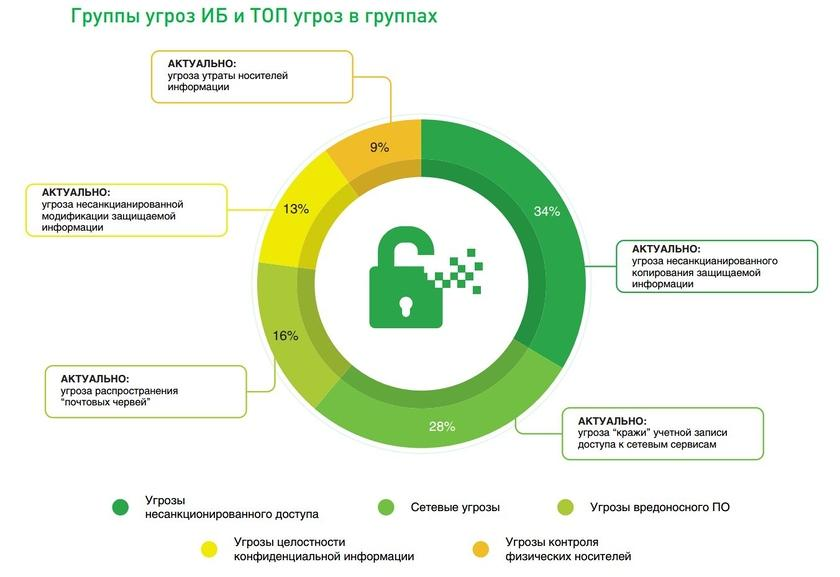
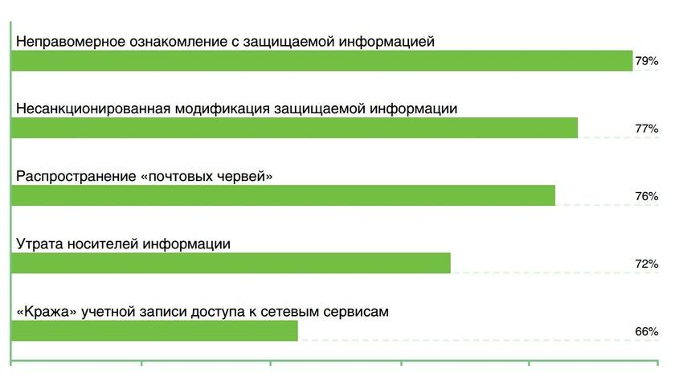
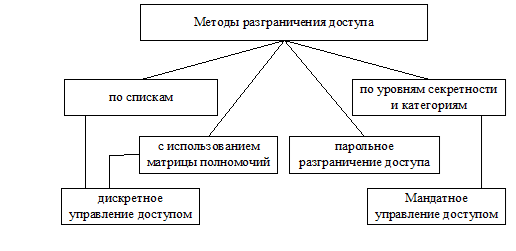
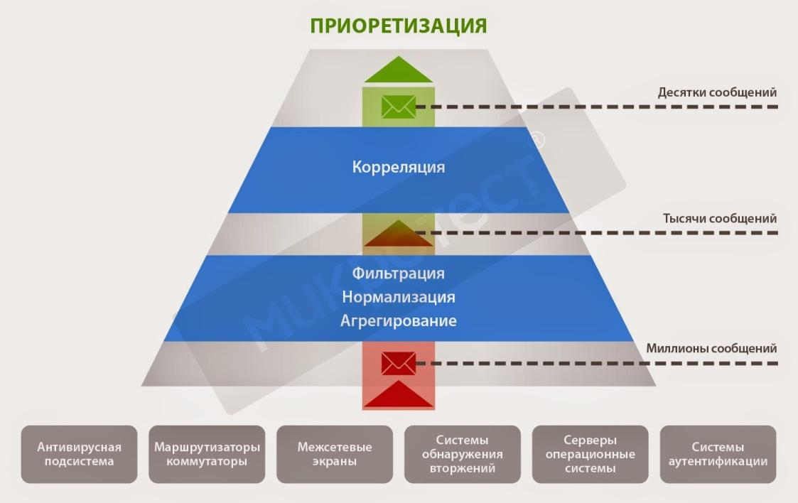
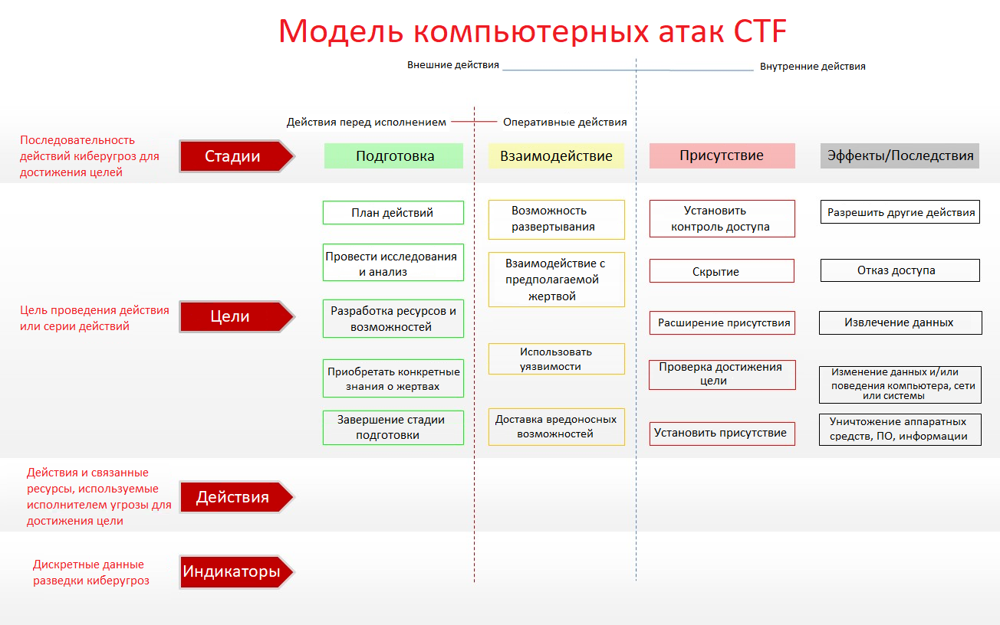
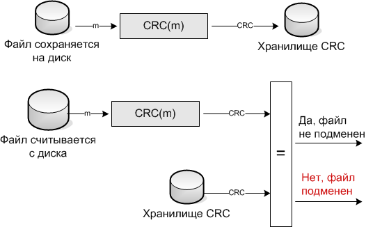
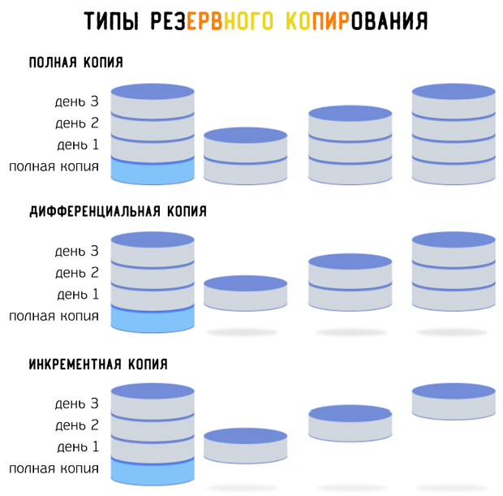
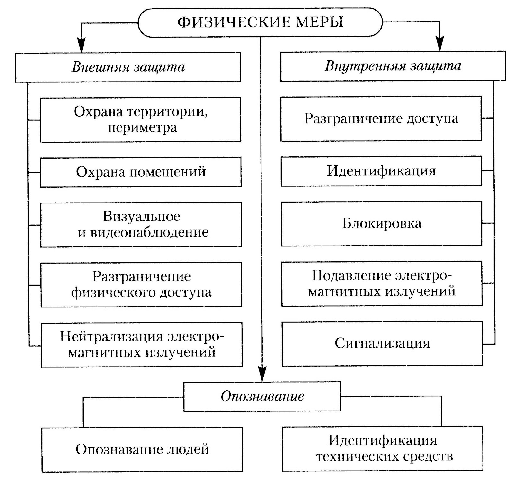

# 1. Теория ИБ и государственная политика РФ

Под информационной сферой, подлежащей защите на уровне государства, понимается совокупность
- информации
- объектов информатизации
- информационных систем
- сайтов в информационно-телекоммуникационной сети интернет
- сетей связи
- информационных технологий
- субъектов, деятельность которых связана с
    - формированием и обработкой информации
    - развитием и использованием названных технологий
    - обеспечением информационной безопасности
- совокупность механизмов регулирования соответствующих общественных отношений.

## Концепция комплексного обеспечения информационной безопасности на уровне государства

### Основные информационные угрозы

- <ins>деятельность организаций, осуществляющих техническую разведку</ins> в отношении российских государственных органов, научных организаций и предприятий оборонно-промышленного комплекса;
- <ins>информационно-психологическое воздействие</ins> направленное на дестабилизацию внутриполитической и социальной ситуации в компьютерной преступности, прежде всего в кредитно-финансовой сфере — увеличивается число преступлений, связанных с нарушением конституционных прав и свобод человека и гражданина, в том числе в части, касающейся неприкосновенности частной жизни, личной и семейной тайны, при обработке персональных данных с использованием информационных технологий, при этом методы, способы и средства совершения таких преступлений становятся все изощреннее;
- <isn>атаки на объекты критической информационной инфраструктуры</isn>;
- <ins>разведывательная деятельность иностранных государств</ins>;
- увеличение масштабов применения отдельными государствами и организациями <ins>информационных технологий в военно-политических целях</ins>.

Основные причины реализации угроз:

- недостаточный уровень развития конкурентоспособных информационных технологий и их использования для производства продукции и оказания услуг.
- высокий уровень зависимости отечественной промышленности от зарубежных информационных технологий в части, касающейся электронной компонентной базы, программного обеспечения, вычислительной техники и средств связи.

### Защита от угроз

В рамках защиты от данных угроз, согласно Доктрине ИБ РФ, реализуется:

#### Оборона страны

- **стратегическое сдерживание и предотвращение военных конфликтов** которые могут возникнуть в результате применения информационных технологий;
- **совершенствование системы обеспечения информационной безопасности** Вооруженных Сил Российской Федерации, других войск, воинских формирований и органов, включающей в себя силы и средства информационного противоборства;
- **прогнозирование, обнаружение и оценка информационных угроз** включая угрозы Вооруженным Силам Российской Федерации в информационной сфере;
- **содействие обеспечению защиты интересов союзников** Российской Федерации в информационной сфере;
- **нейтрализация информационно-психологического воздействия** в том числе направленного на подрыв исторических основ и патриотических традиций, связанных с защитой Отечества.

#### Государственная и общественная безопасность

- участвуют социальные сети, применяются различные системы сбора информации и проводятся научные исследования
- обнаружение современных методов атак
- Вводятся законы для обеспечения защиты объектов критической инфраструктуры и соответствующее программное обеспечение для защиты от компьютерных атак

#### Экономическая сфера

- **инновационное развитие отрасли информационных технологий и электронной промышленности** увеличение доли продукции этой отрасли в валовом внутреннем продукте, в структуре экспорта страны (вводится автоматизация и роботизация производства);
- **ликвидация зависимости отечественной промышленности от зарубежных информационных технологий и средств обеспечения информационной безопасности** за счет создания, развития и широкого внедрения отечественных разработок, а также производства продукции и оказания услуг на их основе;
- **повышение конкурентоспособности российских компаний** осуществляющих деятельность в отрасли информационных технологий и электронной промышленности, разработку, производство и эксплуатацию средств обеспечения информационной безопасности, оказывающих услуги в области обеспечения информационной безопасности, в том числе за счет создания благоприятных условий для осуществления деятельности на территории Российской Федерации (в рамках импортозамещения отдается предпочтение отечественным разработкам;
- **развитие отечественной конкурентоспособной электронной компонентной базы и технологий производства электронных компонентов** обеспечение потребности внутреннего рынка в такой продукции и выхода этой продукции на мировой рынок.

#### Наука, технологии и образование

- достижение конкурентоспособности информационных технологий и развитие научно-технического потенциала в области обеспечения информационной безопасности;
- создание и внедрение информационных технологий, изначально устойчивых к различным видам воздействия (в рамках зарубежных компьютерных атак);
- проведение научных исследований и осуществление опытных разработок в целях создания перспективных информационных технологий и средств обеспечения информационной безопасности;
- развитие кадрового потенциала в области обеспечения информационной безопасности и применения информационных технологий (в частности, в МИФИ, а также в других ВУЗах страны);
- обеспечение защищенности граждан от информационных угроз, в том числе за счет формирования культуры личной информационной безопасности (то есть психологической защищенности, которая будет рассмотрена далее).

#### Стратегическая стабильность

- защита суверенитета Российской Федерации в информационном пространстве посредством осуществления самостоятельной и независимой политики, направленной на реализацию национальных интересов в информационной сфере;
- участие в формировании системы международной информационной безопасности, обеспечивающей эффективное противодействие использованию информационных технологий в военно-политических целях, противоречащих международному праву, а также в террористических, экстремистских, криминальных и иных противоправных целях;
- создание международно-правовых механизмов, учитывающих специфику информационных технологий, в целях предотвращения и урегулирования межгосударственных конфликтов в информационном пространстве;
- продвижение в рамках деятельности международных организаций позиции Российской Федерации, предусматривающей обеспечение равноправного и взаимовыгодного сотрудничества всех заинтересованных сторон в информационной сфере;
- развитие национальной системы управления российским сегментом сети «Интернет».

## Системный подход по ИБ на уровне государства

составляющих информационной безопасности:

1. Законодательная, нормативно-правовая и научная база.
1. Структура и задачи органов (подразделений), обеспечивающих безопасность ИТ.
1. Организационно-технические и режимные меры и методы (Политика информационной безопасности).
1. Программно-технические способы и средства обеспечения информационной безопасности.

### Законодательная, нормативно-правовая и научная база

Акты федерального законодательства:

Напрвления:

- международные договоры РФ;
	- Конституция РФ;
	- законы федерального уровня (включая федеральные конституционные законы, кодексы);
	- указы Президента РФ;
	- постановления Правительства РФ;
	- нормативные правовые акты федеральных министерств и ведомств;
	- нормативные правовые акты субъектов РФ, органов местного самоуправления и т. д.
- К нормативно-методическим документам можно отнести:
	- Методические документы государственных органов России:
	- Доктрину информационной безопасности РФ;
	- руководящие документы ФСТЭК (Гостехкомиссии России);
	- приказы ФСБ;
- Стандарты информационной безопасности, из которых выделяют:
	- международные стандарты;
	- государственные (национальные) стандарты РФ;
	- рекомендации по стандартизации;
	- методические указания.

### Органы обеспечения информационной безопасности и защиты информации, их функции и задачи, нормативная деятельность

#### Организации, на которые возложены функции в части ИБ в РФ:

- Комитет Государственной думы по безопасности;
- Совет безопасности России;
- Федеральная служба по техническому и экспортному контролю (ФСТЭК России);
- Федеральная служба безопасности Российской Федерации (ФСБ России);
- Федеральная служба охраны Российской Федерации (ФСО России);
- Служба внешней разведки Российской Федерации (СВР России);
- Министерство обороны Российской Федерации (Минобороны России);
- Министерство внутренних дел Российской Федерации (МВД России);
- Федеральная служба по надзору в сфере связи, информационных технологий и массовых коммуникаций (Роскомнадзор);
- Центральный банк Российской Федерации (Банк России).

#### Службы, организующие защиту информации на уровне предприятия

- Служба экономической безопасности;
- Служба безопасности персонала (Режимный отдел);
- Служба защиты активов;
- Кадровая служба;
- Служба информационной безопасности.

### Программно-технические средства и технологии

На уровне государства и объектов приоритетными направлениями развития являются:

- Средства защиты от несанкционированного доступа:
	- Средства авторизации;
	- Мандатное управление доступом;
	- Избирательное управление доступом;
	- Управление доступом на основе ролей;
	- Журналирование (аудит).
- Системы анализа и моделирования информационных потоков (CASE-системы).
- Системы мониторинга сетей:
	- Системы обнаружения и предотвращения вторжений (IDS/IPS);
	- Системы предотвращения утечек конфиденциальной информации (DLP-системы).
- Анализаторы протоколов.
- Антивирусные средства.
- Межсетевые экраны.
- Криптографические средства:
	- Шифрование;
	- Цифровая подпись.
- Системы резервного копирования.
- Системы бесперебойного питания:
	- Источники бесперебойного питания;
	- Резервирование нагрузки;
	- Генераторы напряжения.
- Системы аутентификации:
	- Пароль;
	- Ключ доступа (физический или электронный);
	- Сертификат;
	- Биометрия.
- Средства предотвращения взлома корпусов и краж оборудования.
- Средства контроля доступа в помещения.
- Инструментальные средства анализа систем защиты:
    - Антивирус.

### Организационная защита

> это регламентация производственной деятельности и взаимоотношений исполнителей на нормативно-правовой основе, исключающей или существенно затрудняющей неправомерное овладение конфиденциальной информацией и проявление внутренних и внешних угроз.

обеспечивает:

- организацию охраны, режима, работу с кадрами, с документами;
- использование технических средств безопасности и информационно-аналитическую деятельность по выявлению внутренних и внешних угроз предпринимательской деятельности. 

К основным организационным мероприятиям можно отнести:

- **организацию режима и охраны** их цель — исключение возможности тайного проникновения на территорию и в помещения посторонних лиц;
- **организацию работы с сотрудниками** которая предусматривает подбор и расстановку персонала, включая ознакомление с сотрудниками, их изучение, обучение правилам работы с конфиденциальной информацией, ознакомление с мерами ответственности за нарушение правил защиты информации и др.;
- **организацию работы с документами и документированной информацией** включая организацию разработки и использования документов и носителей конфиденциальной информации, их учет, исполнение, возврат, хранение и уничтожение;
- **организацию использования**
    - технических средств сбора
    - обработки
    - накопления
    - хранения конфиденциальной информации;
- **организацию работы по анализу внутренних и внешних угроз конфиденциальной информации и выработке мер по обеспечению ее защиты**;
- **организацию работы по проведению систематического контроля** за работой персонала с конфиденциальной информацией, порядком учета, хранения и уничтожения документов и технических носителей.

# 2. Методики и подходы к построению ТЗИ: Технические средтва

Наиболее популярные и эффективные технологии для построения ТЗИ:

- идентификацию и аутентификацию;
- разграничение доступа (и изоляцию);
- регистрацию событий и аудит;
- контроль целостности;
- шифрование данных и ЭП;
- резервирование и резервное «затирание» остаточной информации;
- обнаружение и обезвреживание вирусов;
- фильтрацию трафика и трансляцию адресов;
- виртуальную среду ловушек.

## Идентификация и аутентификация

> **Идентификация** — называние себя лицом системе.
> 
> **Аутентификация** — установление соответствия лица названному им идентификатору.
> 
> **Авторизация** — предоставление этому лицу возможностей в соответствии с положенными ему правами или проверка наличия.

### Способы аутентификации:

- аутентификация при помощи электронной подписи,
- аутентификация по паролям,
- аутентификация с помощью SMS,
- биометрическая аутентификация,
- аутентификация через географическое местоположение,
- многофакторная аутентификация.

#### Аутентификация при помощи электронной подписи

##### Простая электронная подпись

электронная подпись, которая посредством использования кодов, паролей или иных средств подтверждает факт формирования электронной подписи определенным лицом.

##### Неквалифицированная электронная подпись

электронная подпись, которая:
- получена в результате криптографического преобразования информации с использованием ключа электронной подписи;
- позволяет определить лицо, подписавшее электронный документ;
- позволяет обнаружить факт внесения изменений в электронный документ после момента его подписания;
- создается с использованием средств электронной подписи.

##### Квалифицированная электронная подпись

электронная подпись, которая:
- соответствует всем признакам неквалифицированной электронной подписи
- ключ проверки электронной подписи указан в квалифицированном сертификате;
- для создания и проверки электронной подписи используются средства электронной подписи, получившие подтверждение соответствия требованиям, установленным в соответствии с Федеральным законом N 63-ФЗ.

#### Аутентификация по паролям

##### 1. Аутентификация по многоразовым паролям

Введенный субъектом пароль может передаваться в сети двумя способами:
- Незашифрованно, в открытом виде, на основе протокола парольной аутентификации (Password Authentication Protocol, PAP).
- С использованием шифрования SSL или TLS. В этом случае неповторимые данные, введенные субъектом, передаются по сети защищенной.

##### 2. Аутентификация по одноразовым паролям

это пароль, действительный только для одного сеанса аутентификации. Действие одноразового пароля также может быть ограничено определенным промежутком времени.

Технологии использования одноразовых паролей можно разделить на:
- использование генератора псевдослучайных чисел, единого для субъекта и системы;
- использование временных меток вместе с системой единого времени;
- использование базы случайных паролей, единой для субъекта и для системы.

##### Аутентификация маркеров

Среди маркеров можно выделить:

- маркеры или токены, реагирующие на вызов (асинхронные маркеры или токены);
- хронометрированные маркеры или токены (синхронные маркеры или токены).

Наиболее распространен маркер аутентификации — устройство, генерирующее новый пароль, каждый раз используемый при аутентификации, например пульт дистанционного управления автомобилем.

##### Биометрическая аутентификация

это аутентификация по биопараметрам человека.

преимущества

- ее нельзя украсть,
- мало меняется со временем,
- нельзя потерять как пропуск.

недостатки

- Биометрический шаблон сравнивается не с результатом первоначальной обработки характеристик пользователя, а с тем, что пришло к месту сравнения. За время пути может произойти множество событий.
- База шаблонов может быть изменена злоумышленником.
- Следует учитывать разницу между применением биометрии на контролируемой территории, под бдительным оком охраны, и в «полевых» условиях, когда, например, к устройству сканирования могут поднести муляж и т. п.
- Некоторые биометрические данные человека меняются (как в результате старения, так и травм, ожогов, порезов, болезней и т. д.), так что база шаблонов нуждается в постоянном сопровождении, а это создает определенные проблемы и для пользователей, и для администраторов.
- Если у вас крадут биометрические данные или компрометируют их, то это происходит, как правило, на всю жизнь. Пароли, при всей их ненадежности, в крайнем случае можно сменить. Палец, глаз или голос изменить нельзя, по крайней мере в кратчайшие сроки.
- Биометрические характеристики являются уникальными идентификаторами, но их нельзя сохранить в секрете.

##### Смарт-карты

В смарт-картах находится небольшой процессор данных, который может принимать данные, обрабатывать их с помощью программ, сохраненных в памяти, и затем выдавать результат

Способны хранить криптографические ключи или другую информацию и осуществлять некоторые вычисления на карте

бывают трех типов:

1. Контактные.
1. Бесконтактные.
1. Комбикарты.

Использование смарт-карт — это защищенный вариант идентификации, его сложно подделать, но его желательно объединять с другим видом идентификации, так как смарт-карту можно украсть.

## Разграничение доступа (и изоляция)

- Угроза несанкционированного копирования является одной из наиболее частых, как видно на рисунках
- Также весьма актуальные угрозы — угроза несанкционированной модификации и кражи информации.

 

### Типы разграничения прав доступа

#### Информационное разграничение доступа

бывает следующих видов:
- мандатное,
- дискреционное,
- ролевое,
- на основе атрибутов.

Разграничение прав доступа к данным составляет основу защищенной информационной системы. Внедряется комплекс разрешений и запретов на получение доступа к различным объектам и данным. Набор правил устанавливает полномочия для каждого конкретного пользователя — субъекта.

> **Права доступа**
>
> совокупность правил, регламентирующих порядок и условия доступа субъекта к объектам информационной системы (ее носителям, процессам и другим ресурсам), установленным правовыми документами или собственником, владельцем информации.

####  Физическое разграничение доступа

подразумевает выделение определенных пространственных зон (территорий, помещений) и определение круга лиц, которым разрешен доступ в ту или иную зону. Например, в помещения первого отдела разрешен вход только сотрудникам этого отдела.

### Функции системы разграничения доступа:

- реализация правил разграничения доступа (ПРД) субъектов и их процессов к данным;
- реализация ПРД субъектов и их процессов к устройствам создания твердых копий;
- изоляция программ процесса, выполняемого в интересах субъекта, от других субъектов;
- управление потоками данных с целью предотвращения записи данных на носители несоответствующего грифа;
- реализация правил обмена данными между субъектами для АС и СВТ, построенных по сетевым принципам.

Обеспечивающие средства для СРД выполняют следующие функции:
- идентификацию и опознание (аутентификацию) субъектов, поддержание привязки субъекта к процессу, выполняемому для субъекта;
- регистрацию действий субъекта и его процесса;
- предоставление возможностей исключения и включения новых субъектов и объектов доступа, а также изменение полномочий субъектов;
- реакцию на попытки НСД, например, сигнализацию, блокировку, восстановление после НСД;
- тестирование;
- очистку оперативной памяти и рабочих областей на магнитных носителях после завершения работы пользователя с защищаемыми данными;
- учет выходных печатных и графических форм, а также твердых копий в АС;
- контроль целостности программной и информационной части как СРД, так и обеспечивающих ее средств.

### Избирательный (дискреционный) принцип контроля доступа

Комплекс средств защиты (КСЗ) должен контролировать доступ наименованных субъектов (пользователей) к наименованным объектам (файлам, программам, томам и т. д.).

Дискреционное разграничение доступа к объектам (Discretionary Access Control — DAC) характеризуется следующим набором свойств:

- все субъекты и объекты компьютерной системы должны быть однозначно идентифицированы;
- для любого объекта компьютерной системы определен пользователь-владелец;
- владелец объекта обладает правом определения прав доступа к объекту со стороны любых субъектов компьютерной системы;
- в компьютерной системе существует привилегированный пользователь, обладающий правом полного доступа к любому объекту (или правом становиться владельцем любого объекта).

### Управление доступом на основе ролей

Шаги реализации:
1. Разработчики приложений, в которых над объектами системы выполняются определенные действия, совместно с администратором безопасности компьютерной системы и конструктором ролей составляют список привилегий и множество правил.
1. Конструктор ролей разрабатывает библиотеку ролей для данной системы.
1. Диспетчер ролей каждому пользователю системы статическим образом присваивает набор возможных для данного пользователя ролей (при этом могут использоваться статические ограничения на назначение ролей).
1. После авторизации пользователя в системе для него создается сессия (при этом могут использоваться динамические ограничения на использование ролей).

К недостаткам ролевого разграничения доступа относится
- отсутствие формальных доказательств безопасности компьютерной системы
- возможность внесения дублирования и избыточности при предоставлении пользователям прав доступа
- сложность конструирования ролей.

### Разграничение доступа на основе атрибутов

> **Attribute-Based Access Control, ABAC**
>
> модель контроля доступа к объектам, основанная на анализе правил для атрибутов объектов или субъектов, возможных операций с ними и окружения, соответствующего запросу.

Системы управления доступом на основе атрибутов обеспечивают мандатное и избирательное управление доступом

Развитием модели ABAC являются модели на основе аутентификации (англ. autheNtication-Based Access Control, NBAC) и авторизации (англ. authoriZation-Based Access Control, ZBAC), где учитывается проблема согласования значений атрибутов и уменьшается количество междоменных соглашений.

### Изоляция процессов (выполнение программ)

> в общем виде процессы называются изолированными, если ни один из них не влияет на другой

#### На примере Linux.

Выделяют следующие группы изоляции (cgroups):

- ограничения на процессорное время,
- оперативную память,
- подсистему ввода-вывода,
- набор правил доступа к устройствам системы (включая устройства хранения).

поддержка пространств имен, например:

- **mnt** - точки монтирования и файловые системы;
- **pid** - идентификаторы запущенных процессов (и информация о них);
- **net** - сетевой стек (доступные интерфейсы, возможность получения и отправки информации, создания сокетов);
- **ipc** - межпроцессное взаимодействие (доступные каналы);
- **uts** - идентификация системы в сети (в частности, имя хоста);
- **user** - идентификаторы пользователей и групп (используются для контроля доступа к ресурсам);
- **cgroup** - трансляция групп управления ресурсами внутрь изолированного окружения (чтобы исключить возможность просмотра и изменения групп для других процессов);
- **time** - трансляция виртуального времени для процесса.

#### Виртуальные машины

> программная и/или аппаратная система, эмулирующая аппаратное обеспечение некоторой платформы или виртуализирующая некоторую платформу и создающая на ней среды, которые изолируют друг от друга программы и даже операционные системы (см. ниже «песочница»); также — спецификация некоторой вычислительной среды (например: «виртуальная машина языка программирования Си»).

Виртуальные машины могут использоваться для:

- защиты информации и ограничения возможностей программ (см. ниже «песочница»);
- моделирования информационных систем с клиент-серверной архитектурой на одной ЭВМ (эмуляция компьютерной сети с помощью нескольких виртуальных машин);
- тестирования и отладки системного программного обеспечения;
- проверки программ на содержание вредоносного ПО.

> **Песочница**
>
> специально выделенная (изолированная) среда для безопасного исполнения компьютерных программ. Обычно представляет собой жестко контролируемый набор ресурсов для исполнения гостевой программы, например, место на диске или в памяти. Доступ к сети, возможность сообщаться с главной операционной системой или считывать информацию с устройств ввода обычно либо частично эмулируют, либо сильно ограничивают. Песочницы представляют собой пример виртуализации.

## Регистрация событий и аудит

Регистрация всех событий в системе важна, чтобы провести расследование при инциденте.

События, подлежащие регистрации:

- данные от сенсоров и управляющие события,
- действия пользователей,
- системные события,
- события безопасности.

> **Журнал событий**
>
> стандартный способ для приложений и операционной системы записи и централизованного хранения информации о важных программных и аппаратных событиях. Служба журналов событий сохраняет события от различных источников в едином журнале событий, программа просмотра событий позволяет пользователю наблюдать за журналом событий.

Также регистрируются:
- видеопотоки,
- информация от других сенсоров и управляющие события,
- передаваемые пакеты (зеркалирование трафика).

Атаки на журнал событий бывают следующими:
- переполнение,
- остановка записи под учетной записью администратора,
- изменения одним пользователем при его временном уходе с рабочего места другим пользователем.

### Обработка событий, SIEM-системы

> объединение двух терминов, обозначающих область применения ПО: SIM (Security information management) — управление информацией о безопасности, и SEM (Security event management) — управление событиями безопасности.

- обеспечивает анализ в реальном времени событий (тревог) безопасности, исходящих от сетевых устройств и приложений
- позволяет реагировать на них до наступления существенного ущерба
- данные о безопасности информационной системы собираются из разных источников, и результат их обработки предоставляется в едином интерфейсе, доступном для аналитиков безопасности

**SIM (управления информационной безопасностью)**

отвечает за анализ исторических данных, стараясь улучшить долгосрочную эффективность системы и оптимизировать их хранение

**SEM (управления событиями безопасности)

делает акцент на выгрузке из имеющихся данных определенного объема информации, с помощью которого могут быть немедленно выявлены инциденты безопасности

 

#### Основные операции SIEM

- **Нормализация** приводит форматы записей журналов, собранных из различных источников, к единому внутреннему формату, который затем будет использоваться для их хранения и последующей обработки.
- **Фильтрация событий безопасности** заключается в удалении избыточных событий из поступающих в систему потоков.
- **Классификация** позволяет для атрибутов событий безопасности определить их принадлежность определенным классам.
- **Агрегация**  объединяет события, схожие по определенным признакам.
- **Корреляция** выявляет взаимосвязи между разнородными событиями.
- **Приоритезация** определяет значимость и критичность событий безопасности на основании правил, определенных в системе.
- **Анализ событий, инцидентов и их последствий** включает процедуры моделирования событий, атак и их последствий, анализа уязвимостей и защищенности системы, определения параметров нарушителей, оценки риска, прогнозирования событий и инцидентов.
- **Генерация отчетов и предупреждений** означает формирование, передачу, отображение или печать результатов функционирования.
- **Визуализация** предполагает представление в графическом виде данных, характеризующих результаты анализа событий безопасности и состояние защищаемой системы и ее элементов.

### Расследование инцидентов ИБ

При наличии зарегистрированных событий можно проводить расследование инцидентов, при этом:

- Расследование и анализ могут проводиться в ручном или автоматизированном режиме.
- Для защиты от направленных компьютерных атак SIEM-системы являются определенным гарантом безопасности информации.
- Важно сохранить баланс между устойчивостью бизнес-процессов и остановках ряда информационных систем, приложений при расследовании.

### Аудит информационной безопасности

> мероприятия для проверки текущего состояния защиты ИТ-инфраструктуры, выявления потенциальных угроз и уязвимостей. Аудиторские проверки могут проводиться в отношении корпоративных сетей, отдельных устройств, сайтов, приложений, программ, серверов разных масштабов и процессов.

#### Внутренний аудит

регламентируется внутренними документами и уставами компании. Они определяют порядок работы с данными и процессами. Внутренний аудит проводится собственными структурными подразделениями и выполняется на регулярной основе.

необходимо:

- определить список проверяемых процессов и сервисов, потенциально уязвимые места (стандарт, на основе которого проводится аудит, область действия, реализация системы защиты информации, привлекаемые ресурсы, формат и сроки проведения, ожидаемый результат и т. д.);
- выбрать способ аудита (документальный, технический, в формате учений, комбинированный и т. д.).

#### Внешний аудит

проводится независимыми экспертами, которым по условиям договоров предоставляется доступ к внутренней сети компании. Он может проводиться по требованию руководства, акционеров и правоохранительных органов. Как правило, привлечение внешних аудиторов ведет к более объективной оценке существующей СУИБ, поскольку такие компании имеют штат квалифицированных аудиторов. Также у них есть соответствующие лицензии и сертификаты, подтверждающие их способность качественно проводить аудит по запрашиваемому направлению.

Основные виды:

- экспертная документальная проверка состояния защиты информации и информационных систем на основе опыта аудиторов;
- анализ защищенности информационных систем с использованием технических средств для обнаружения потенциальных уязвимостей в программно-аппаратном комплексе;
- аттестация или сертификация реализованных систем и процессов информационной безопасности на предмет соответствия таким стандартам как ISO 27001, 27701, PCI DSS, приказ ФСТЭК №17 и др.

Внешний аудитор может применять разные методы, в том числе использовать технологию имитации атак (пытаться взломать систему без повреждения данных и нарушения ее работоспособности). Таким образом, он будет выступать в роли злоумышленника, пытающегося взломать защиту или обойти ее.

Во время аудита на этапе имитации атаки проверяют:

- уязвимости аппаратной и программной части инфраструктуры;
- несанкционированное использование и устойчивость каналов связи и коммуникации;
- оперативность реагирования системы безопасности организации на проводимую атаку;
- схемы управления инфраструктурой и обеспечения ее стабильной работы;
- возможность проникновения в инфраструктуру организации через сотрудников компании и контрагентов.

### События и инциденты в области ИБ

> **Событие ИБ**
>
> идентифицированное появление определенного состояния системы, сервиса или сети, указывающее на возможное политики ИБ, или отказ защитных мер, или возникновение неизвестной ранее ситуации, которая может иметь отношение к безопасности.

> **Инцидент ИБ**
>
> событие, являющееся следствием одного или нескольких нежелательных событий ИБ, имеющих значительную вероятность компрометацию бизнес-процессов и создания угрозы ИБ.

#### Примеры инцидентов в области ИБ

- Отказ в обслуживании (согласно ГОСТ Р ИСО/МЭК ТО 18044-2007).
	- Технические средства (уничтожение ресурсов и истощение ресурсов):
		- зондирование сетевых широковещательных адресов с целью полного заполнения полосы пропускания сети трафиком ответных сообщений;
		- передача данных в непредусмотренном формате в систему, сервис или сеть в попытке разрушить или нарушить их нормальную работу;
		- одновременное открытие нескольких сеансов с конкретной системой, сервисом или сетью в попытке исчерпать их ресурсы (замедление их работы, блокирование или разрушение).
	- Нетехнические средства:
		- Перезагрузка системы, повышение температуры, ущерб оборудованию
- Несанкционированный доступ.
	- Технические средства:
		- попытки извлечь файлы с паролями;
		- использование уязвимостей протокола для перехвата соединения или ложного направления легитимных сетевых соединений;
		- попытки расширить привилегии доступа к ресурсам или информации по сравнению с легитимно имеющимися у пользователя или администратора.
	- Нетехнические средства:
	    - Разрушение с последующим доступом.

Инциденты обычно бывают подготовкой атаки — по модели Cyber Threat Framework (CTF), приведенной на рисунке.

На этом рисунке декомпозированы действия нападающих. При этом, в зависимости от проявляемых индикаторов, например фишинговых писем или нахождения нарушителя в системе, мы можем определить, на какой стадии находится проникновение, чтобы предпринять наиболее эффективные действия.

## Контроль целостности

> **Контроль целостности**
>
> это механизм, необходимый для отслеживания неизменности файлов, документов, реестра, конфигурации оборудования и других сущностей, которые находятся на компьютере или сервере. Средства контроля целостности могут быть как программными, так и программно-аппаратными.

> **Целостность**
>
> одно из основных свойств безопасности информации наряду с конфиденциальностью и доступностью. Необходимость обеспечения контроля целостности определяется требованиями нормативных документов в сфере информационной безопасности.

 

Существуют программные средства контроля целостности для автоматизации процесса контроля:

- **Средства анализа защищенности (vulnerabilityscanners)** удаленное подключение к защищаемым ресурсам, снятие хеш-суммы с контролируемых файлов и сохранение в локальную базу на периодической основе.
- **Средства защиты информации от несанкционированного доступа (СЗИ от НСД, Endpointprotection)** обеспечение контроля целостности файлов и реестра комплексным агентским решением, подразумевающим разграничение доступа к файлам, контроль прав доступа, контроль изменений по хеш-суммам и свойствам файла.
- **Средства обнаружения вторжений уровня хоста (Host Intrusion Detection System, IDS) или средства контроля целостности файлов (Fileintegritymonitoring, FIM)** обеспечение контроля целостности файлов и реестра легким агентом, контроля изменений файла по хеш-суммам и его свойствам.

## Шифрование данных и ЭП

> **Шифрование данных**
>
> процесс кодирования информации с целью предотвращения несанкционированного доступа. В случае кражи или утечки зашифрованные данные будут недоступны для прочтения без соответствующего ключа.

Важной особенностью любого алгоритма шифрования является использование ключа, который утверждает выбор конкретного преобразования из совокупности возможных для данного алгоритма

> **Электронная подпись**
>
> это реквизит электронного документа, полученный в результате криптографического преобразования информации с использованием закрытого ключа подписи, и позволяющий проверить отсутствие искажения информации в электронном документе с момента формирования подписи (целостность), принадлежность подписи владельцу сертификата ключа подписи (авторство), а в случае успешной проверки — подтвердить факт подписания электронного документа (неотказуемость).

## Резервирование и резервное копирование

> **Резервирование**
>
> метод повышения надежности систем и объектов. Является универсальным принципом обеспечения надежности, широко применяется в природе, технике и технологиях.

Основные виды резервирования:

- Аппаратное резервирование, например дублирование.
- Информационное резервирование, например контроль ошибок — комплекс методов обнаружения и исправления ошибок в данных при их записи и воспроизведении или передаче по линиям связи.
- Временное резервирование, например методы альтернативной логики.
- Программное резервирование, применение независимых, функционально равноценных программ.

> **Аппаратное резервирование**
>
> может подразумевать разные решения, начиная от резервирования внутрисерверных компонентов и заканчивая созданием кластеризованных систем с удаленной репликацией данных на десятки километров, созданием резервных офисов.

Кластеризация дает ряд преимуществ, основные из которых — это:

- значительное уменьшение времени простоя ИС в случае отказа элемента ИС;
- возможность проводить профилактические работы, не прерывая работу пользователей;
- снижение стоимости администрирования нескольких серверов.
- сетевое копирование.

### Резервное копирование (англ. backup copy)

> процесс создания копии данных на носителе (жестком диске, дискете и т. д.), предназначенном для восстановления данных в оригинальном или новом месте расположения в случае их повреждения или разрушения.

#### Виды копирования

 

##### Полное резервное копирование.

Полное копирование обычно затрагивает всю систему и все файлы. Еженедельное, ежемесячное и ежеквартальное резервное копирование подразумевает создание полной копии всех данных. Обычно оно выполняется тогда, когда копирование большого объема данных не влияет на работу организации. Для предотвращения большого объема использованных ресурсов используют алгоритмы сжатия.

##### Дифференциальное резервное копирование.

При дифференциальном («разностном») резервном копировании каждый файл, который был изменен с момента последнего полного резервного копирования, копируется каждый раз заново. Дифференциальное копирование ускоряет процесс восстановления. Все копии файлов делаются в определенные моменты времени, что, например, важно при заражении вирусами.

##### Инкрементное резервное копирование.

При добавочном («инкрементном») резервном копировании происходит копирование только тех файлов, которые были изменены с тех пор, как в последний раз выполнялось полное или добавочное резервное копирование. Инкрементное резервное копирование занимает меньше времени, так как копируется меньшее количество файлов. Однако процесс восстановления данных занимает больше времени, так как должны быть восстановлены данные последнего полного резервного копирования, а также данные всех последующих инкрементных резервных копирований. В отличие от дифференциального копирования, изменившиеся или новые файлы не замещают старые, а добавляются на носитель независимо.

#### Разновидности копирования:

##### Клонирование.

Клонирование позволяет скопировать целый раздел или носитель (устройство) со всеми файлами и каталогами в другой раздел или на другой носитель. Если раздел является загрузочным, то клонированный раздел тоже будет загрузочным.

##### Резервное копирование в виде образа.

Образ — точная копия всего раздела или носителя (устройства), хранящаяся в одном файле.

##### Резервное копирование в режиме реального времени.

Резервное копирование в режиме реального времени позволяет создавать копии файлов, каталогов и томов, не прерывая работу, без перезагрузки компьютера.

## «Затирание» остаточной информации

> **Остаточная информация**
>
> это информация на запоминающем устройстве, оставшаяся от формально удаленных операционной системой данных

### Очистка

удаление конфиденциальной информации с записывающих устройств таким образом, при котором гарантируется, что данные не могут быть восстановлены с помощью обычных системных функций или утилит для восстановления файлов. Данные могут оставаться доступными для восстановления, но не без специальных лабораторных методов.

### Уничтожение

удаление конфиденциальной информации с записывающего устройства так, чтобы данные не могли быть восстановлены никаким известным способом. Удаление, в зависимости от конфиденциальности данных, обычно совершается перед выходом устройства из-под надзора, как, например, перед списанием оборудования или перемещением его на компьютер с другими требованиями по безопасности данных.

### Перезаписывание

Распространенная методика для предотвращения остаточной информации — перезаписывание устройства новыми данными.

Размагничивание — удаление или ослабление магнитного поля.

Шифрование данных перед записью может ослабить угрозу остаточной информации.

Физическое уничтожение хранилища данных считается самым надежным способом предотвращения появления остаточной информации:

- Физическое разрушение устройства на части производится путем размалывания, измельчения и т. д.
- Другой его вариант — сожжение, фазовый переход (то есть растворение или возгонка целого диска), а также применение коррозийных реагентов, таких как кислоты, к записывающим поверхностям, для магнитных устройств — нагрев выше точки Кюри.

## Обнаружение и обезвреживание вирусов

### Основные методы

Обнаружение вирусов (вредоносного ПО) формируется на основании трех методов:

- **Методы, основанные на анализе содержимого файлов (как файлов данных, так и файлов с кодами команд)** К этой группе относится сканирование сигнатур вирусов, а также проверка целостности и сканирование подозрительных команд.
- **Методы, основанные на отслеживании поведения программ при их выполнении** Эти методы заключаются в протоколировании всех событий, угрожающих безопасности системы и происходящих либо при реальном выполнении проверяемого кода, либо при его программной эмуляции.
- **Методы регламентации порядка работы с файлами и программами** Эти методы относятся к административным мерам обеспечения безопасности.

#### Метод сканирования сигнатур

К этой группе относится сканирование сигнатур вирусов, а также проверка целостности и сканирование подозрительных команд.

Поиск в файлах уникальной последовательности байтов — сигнатуры, характерной для определенного вируса. Для каждого вновь обнаруженного вируса специалистами антивирусной лаборатории выполняется анализ кода, на основании которого определяется его сигнатура.

Достоинство: низкая доля ложных срабатываний.

Недостаток: невозможность обнаружения нового вируса, для которого отсутствует сигнатура в базе данных антивирусной программы или старого после обфускации.

#### Метод контроля целостности

Любое неожиданное и беспричинное изменение данных на диске является подозрительным событием, требующим особого внимания антивирусной системы.

К этому методу относится изменение системных или исполняемых файлов, появление новых исполняемых файлов.

Нарушение целостности — сравнение контрольной суммы, заранее подсчитанной для исходного состояния тестируемого кода, и контрольной суммы текущего состояния тестируемого кода.

Достоинства: быстрота, обнаружение следов деятельности любых, в том числе неизвестных, вирусов.

После этого делается предположение о вредоносной сущности файла и предпринимаются дополнительные действия по его проверке.

#### Метод сканирования подозрительных команд — эвристический метод

Выявление в сканируемом файле некоторого числа подозрительных команд и (или) признаков подозрительных кодовых последовательностей (например, команда форматирования жесткого диска или функция внедрения в выполняющийся процесс или исполняемый код).

После этого делается предположение о вредоносной сущности файла и предпринимаются дополнительные действия по его проверке.

#### Метод отслеживания поведения программ

Анализ поведения запущенных программ.

Недостатки: активное участие пользователя, призванного принимать решения в ответ на многочисленные предупреждения системы, значительная часть которых может оказаться впоследствии ложными тревогами.

Для устранения подобного недостатка используется песочница.

### Эффективность антивирусных программ

Обычно эффективность антивирусных программ невысокая:

- Против свежих программ — около 5 %.
- От появления вируса до начала его распознавания антивирусами проходит до четырех недель для топовых АВП. Для нетоповых — несколько месяцев.
- При высоком проценте определения — высокий процент ложных срабатываний.

#### Типы антивирусных программ по способу защиты

- **Программы-детекторы (или сканеры)** находят вирусы в оперативной памяти, на внутренних и (или) внешних носителях, выводя сообщение при обнаружении вируса.
- **Программы-докторы** находят зараженные файлы и «лечат» их.
- **Программы-вакцины (иммунизаторы)** выполняют иммунизацию системы (файлов, каталогов), блокируя действие вирусов.
- К программе дописывается небольшая программа, которая проверяет контрольную сумму.
- **Программы-ревизоры** запоминают исходное состояние программ, каталогов, системных областей диска до момента инфицирования компьютера (как правило, на основе подсчета контрольных сумм), затем сравнивают текущее состояние с первоначальным, выводя найденные изменения на дисплей. При сравнении проверяется длина файла, код циклического контроля (контрольная сумма файла), дата и время модификации, другие параметры.
- **Программы-мониторы** начинают свою работу при запуске операционной системы, постоянно находятся в памяти компьютера и осуществляют автоматическую проверку файлов по принципу «здесь и сейчас».
- **Программы-фильтры** (сторожа) обнаруживают вирус на ранней стадии, пока он не начал размножаться.

### Примеры вирусов

#### Сетевой червь

Самостоятельно распространяющаяся программа через локальные и глобальные (интернет) компьютерные сети.

#### Червь Морриса

Червь использовал уязвимости в почтовом сервере Sendmail, а также других сервисах с подбором паролей по словарю. Словарь был небольшой — всего лишь около 400 ключевых слов, но если учесть, что в конце 1980-x годов о компьютерной безопасности мало кто задумывался, и имя учетной записи (обычно реальное имя пользователя) часто совпадало с паролем, то этого было достаточно.

Червь также использовал маскировку, чтобы скрыть свое присутствие в компьютере: он удалял свой исполняемый файл, переименовывал свой процесс в «sh» и ветвился каждые три минуты.

#### Многовекторный червь

Сетевой червь, применяющий для своего распространения несколько разных механизмов (векторов атаки), например, электронную почту и эксплойт ошибки в операционной системе.

#### «Fizzer»

Многовекторный сетевой червь, распространяющийся по ресурсам интернета. Такое вредоносное программное обеспечение (ПО) доставляется на целевой компьютер в виде исполняемого файла и активизируется при его запуске. Далее такие «вирусы» создают несколько файлов и прописываются в «ветку реестра» Windows для последующего запуска вместе с компьютером.

#### Троянская программа

Проникает в компьютер под видом легитимного программного обеспечения, в отличие от червей, которые распространяются самопроизвольно.

В данную категорию входят программы, осуществляющие различные неподтвержденные пользователем действия:

- сбор информации о банковских картах;
- передача этой информации злоумышленнику;
- использование, удаление или злонамеренное изменение;
- нарушение работоспособности компьютера;
- использование ресурсов компьютера в целях майнинга;
- использование IP для нелегальной торговли.

### Примеры мало обнаруживаемых вирусов — старт через VBS скрипт

- VBS скрипт (в макросе файла, в IExplorer) запускает легитимный инструмент удаленного доступа RMS (Remote Manipulator System).
- Загрузка трояна NanoCore (адрес расположения: \LANSubsystem\lanss.exe).
- Загрузка Empire агентов, полностью работающих в оперативной памяти и не обнаруживаемых антивирусным ПО и СОВ на скриптовом языке.
- Далее имеется несколько Empire агентов, которые запускает нарушитель:
- Кейлоггеры — получение пароля с клавиатуры.
- Mimikatz — получение паролей из памяти компьютера.
- Antivirusproduct — получение список антивирусов на компьютере.
- Sherlock — проверка CVE-уязвимостей.
- Bloodhound3 (путь к файлу) — передача файлов с атакуемой машины себе.

## Фильтрация трафика

> Ограничение доступа пользователей к нежелательным ресурсам – программное обеспечение, которое анализирует трафик, вычисляет и блокирует опасную информацию, позволяя избежать заражения вирусом или утечки данных.

### Основные функции Firewall:

- отделение серверов и рабочих станций от внешних каналов связи;
- идентификация всех запросов, которые поступают в сеть;
- проверка полномочий и прав доступа устройств и их пользователей к локальной сети;
- регистрация запросов к сети извне;
- контроль целостности данных внутри локальной сети;
- сокрытие IP-адресов внутренних серверов для защиты от хакеров.

### Примеры фильтров — анализ пакетов

При анализе заголовка сетевого пакета могут использоваться следующие параметры:

- IP-адреса источника и получателя,
- тип транспортного протокола,
- поля служебных заголовков протоколов сетевого и транспортного уровней,
- порт источника и получателя.

Плюсы фильтрации трафика:

- защита от атак: шпионских программ, DDoS-атак и прочих;
- невозможность посещения зараженных или нежелательных интернет-сайтов;
- обнаружение средств слежения за активностью пользователей.

### Системы фильтрации

Системы работают на разных уровнях:

#### Международный уровень

Централизованный подход к фильтрации DNS-запросов на государственном уровне. Обеспечивается полнота контроля, хотя требуются большие затраты в организации метода.

#### Уровень интернет-провайдеров

Для этого организации пользуются перечнями запрещенных сайтов, сформированными судами и государственными службами. Метод признан надежным, характеризуется доступной стоимостью.

#### Уровень интернет-шлюза

Используется частными предприятиями, образовательными и государственными организациями. Требуется особое ПО, обеспечивающее фильтрацию. Метод сохраняет быстроту интернет-доступа, обеспечивая широту настройки контроля. Для этого требуется штатный или внештатный специалист, либо привлечение сторонней специализированной организации.

#### Уровень компьютера пользователя

ПО инсталлируется на ПК. Метод эффективен для домашнего использования, а также для применения на небольших предприятиях. Это доступное решение, хотя требует непосредственного участия пользователя.

### Трансляция адресов (NAT)

#### Преимущества трансляции адресов:

- Позволяет сэкономить IP-адреса, транслируя несколько внутренних IP-адресов в один внешний публичный IP-адрес (или в несколько, но меньшим количеством, чем внутренних).
- Позволяет предотвратить или ограничить обращение снаружи ко внутренним хостам, оставляя возможность обращения изнутри наружу.
- Позволяет скрыть определенные сервисы внутренних хостов или серверов. Повышение безопасности и сокрытие «непубличных» ресурсов.

#### Недостатки трансляции адресов:

- Старые протоколы. Протоколы, разработанные до массового внедрения NAT, не в состоянии работать, если на пути между взаимодействующими хостами есть трансляция адресов. Некоторые межсетевые экраны, осуществляющие трансляцию IP-адресов, могут исправить этот недостаток, соответствующим образом заменяя IP-адреса не только в заголовках IP, но и на более высоких уровнях.
- Идентификация пользователей. Из-за трансляции адресов «много в один» появляются дополнительные сложности с идентификацией пользователей и необходимость хранить полные логи трансляций.
- Иллюзия DoS-атаки. Если NAT используется для подключения многих пользователей к одному и тому же сервису, это может вызвать иллюзию DoS-атаки на сервис.

### Виртуальная среда ловушек

> **Honeypot (с англ. «горшочек с медом»)** — ресурс, представляющий собой приманку для злоумышленников.

Задача Honeypot — подвергнуться атаке или несанкционированному исследованию, что впоследствии позволит изучить стратегию злоумышленника и определить перечень средств, с помощью которых могут быть нанесены удары по реально существующим объектам безопасности.

# 3. Методики и подходы к правовой ЗИ: Нормативно-согласованные правила

## Общие определения

> **Правовой режим**
>
> это совокупность правил, регулирующих ту или иную сферу деятельности; специальный закрепленный в норме благоприятных условий для удовлетворения интересов субъектов права, выражающийся в специфике способов и гарантий его реализации, ответственности за нарушение его требований и основывается на действии общих принципов, приводящих все его элементы в единую упорядоченную систему.

Правовые режимы строго устанавливаются или санкционируются государством, например:

- в исключительных случаях (режим чрезвычайного/военного положения);
- в отношении отдельных территорий (режим заповедных территорий и объектов);
- в отношении объектов (режим оборота наркотических средств);
- в отношении субъектов (режим наибольшего благоприятствования, национальный режим).

В зависимости от предмета регулирования правовые режимы подразделяются на:

- конституционные,
- административные,
- финансовые,
- земельные,
- таможенные,
- налоговые,
- гражданско-процессуальные,
- гражданско-правовые и др.

> **правовой режим информации**
>
> это нормативно установленные правила, определяющие степень открытости, порядок документирования, доступа, хранения, распространения и защиты информации, а также исключительные права на информацию

## Правовый режим как инструмент правового регулирования

Правовое регулирование информации и тождественный ему правовой режим направлены на закрепление баланса общества и государства в постоянно меняющихся условиях формирования общественных, экономических, производственных и иных видов отношений

Отдельное регулирование в сфере информации должно обеспечить своевременное в разрешение спорных ситуаций, связанных с реализацией права, а также сберечь механизм такой реализации для работы правовой системы в целом

Обладатель информации вправе определять порядок и условия доступа к информации (установление режима доступа к информации), однако это право может быть ограничено, использовать информацию, в том числе путем ее распространения и введения в оборот, а также вправе получить защиту от несанкционированного получения или использования информации

Признаки правовго режима информации

- информация рассматривается как объект права и имеющий нематериальную природу;
- устанавливается в целях достижения желаемого социального эффекта;
- отражается в нормах и правилах, которые в своей совокупности призваны обеспечить достижение поставленной цели;
- правила установлены государством, то есть имеют общеобязательную силу;
- правила представляют собой систему, сочетающую в себе в различном соотношении запреты и обязывания, льготы и дозволения.

Правовой режим информационных ресурсов определяется нормами, устанавливающими:

- порядок документирования информации;
- право собственности на отдельные документы и их массивы;
- категорию информации по уровню доступа к ней;
- порядок правовой защиты информации.

## Информационная безопасность как цель правового режима информации

- утверждена Доктрина информационной безопасности, которая конкретизирует нормы Концепции национальной безопасности Российской Федерации
- Данная доктрина закрепила круг национальных интересов России в информационной сфере, вероятных угроз причинения вреда этим интересам, также единую систему обеспечения информационной безопасности

Объекты, подлежащие защите информации:

- сведения, отнесенные к государственной тайне защищаются уполномоченными органами на основании закона РФ «О государственной тайне» от 21.09.93 № 182-ФЗ;
- конфиденциальная информация охраняется собственником информационных ресурсов или уполномоченным лицом на основании Федерального закона «Об информации, информационных технологиях и защите информации» от 27.07.2006 № 149-ФЗ;
- персональные данные охраняются Федеральным законом «О персональных данных» от 27.07.2006 № 152-ФЗ.

### Правовые режимы информации

#### Режим общедоступной информации

известной широкому кругу лиц доступной для ознакомления в общедоступных и проверяемых источниках:
- сведения государственной статистики;
- сведения о научных открытиях
    - содержащиеся в научных изданиях сведения
    - содержащиеся в открытых государственных реестрах;
- информация о размещении заказов на
    - поставки товаров
    - выполнение работ
    - оказание услуг для государственных (муниципальных) нужд;
- т.н. «открытые данные» и др., а также иной информации, доступ к которой не ограничен — любая иная информация, помимо «очевидных», общеизвестных сведений, которая была обнародована тем или иным способом ее обладателем либо для нее установить принадлежность конкретному обладателю не представляется возможным) <ins>подразумевает свободу не только доступа, но и использования информации</ins>.

#### Специальные правовые режимы

- ориентированы на охрану информации (сведений), свободное распространение которой может нарушать права и законные интересы общества, государства, личности
- Специальным режимом ограничивается доступ к информации, ее использованию и распространению, а также определяется категория строгости регулирования, возможные исключения, основания для таковых, порядок введения и прекращения действия режима и сроки его действия во времени, пространстве и по кругу лиц.

Государство правомочно выкупить документированную информацию у физических и юридических лиц, если данная информация отнесена к государственной тайне.

## Категории информации в РФ

Категории информации могут различаться в зависимости от страны. Но категоризация информации нужна для дифференциации требований по защите и обеспечения наилучшего режима защиты, исходя из ее специфики.

- Сведения о фактах, событиях и обстоятельствах частной жизни гражданина, позволяющие идентифицировать его личность (персональные данные), за исключением сведений, подлежащих распространению в средствах массовой информации в установленных федеральными законами случаях.
- Сведения, составляющие тайну следствия и судопроизводства, а также сведения о защищаемых лицах и мерах государственной защиты.
- Служебные сведения, доступ к которым ограничен органами государственной власти в соответствии с Гражданским кодексом Российской Федерации и федеральными законами (служебная тайна).
- Сведения, связанные с профессиональной деятельностью, доступ к которым ограничен в соответствии с Конституцией Российской Федерации и федеральными законами (врачебная, нотариальная, адвокатская тайна, тайна переписки, телефонных переговоров, почтовых отправлений, телеграфных или иных сообщений и так далее).
- Сведения, связанные с коммерческой деятельностью, доступ к которым ограничен в соответствии с Гражданским кодексом Российской Федерации и федеральными законами (коммерческая тайна).
- Сведения о сущности изобретения, полезной модели или промышленного образца до официальной публикации информации о них.

Виды тайн в РФ:

- Государственная тайна (Закон о государственной тайне устанавливает три вида секретности).
- Персональные данные (Закон о персональных данных № 152 ФЗ).
- Профессиональная (№149 ФЗ от 27.07.2006 «Об информ., ИТ…» ) — врачебная, нотариальная, адвокатская и т.д.).
- Коммерческая (№98-ФЗ от 29.07.2004 «О коммерческой тайне») – секреты производства, новые решения, НИОКР, данные торгов и др.
- Служебная тайна.
- Личная, семейная тайны.

## Правовая защита персональных данных

> **Персональные данные (ПД)** или **личностные данные** — сведения, относящиеся к прямо или косвенно определенному или определяемому физическому лицу (субъекту персональных данных), которые могут быть предоставлены другим лицам.

Персональные данные — это юридическое, а не техническое понятие, тем не менее современные технологии анализа данных позволяют отличить одного человека от другого по косвенным признакам.

### Защита персональных данных и ответственность

#### Юридическая ответственность

Ответственность за разглашение персональных сведений на территории РФ наступает в соответствии с частью <ins>1, 2, ст. 13 Федерального закона № 323-ФЗ «Об основах охраны здоровья граждан в Российской Федерации»</ins>

Пример информации врачебной тайны:
- сведения о факте обращения гражданина за оказанием медицинской помощи;
- сведения о состоянии здоровья и диагнозе гражданина;
- иные сведения, полученные при медицинском обследовании и лечении гражданина.

Также в примечании к статье <ins>ст. 137 УК РФ говорится, что она предусматривает уголовную ответственность</ins> за 
- незаконное собирание или распространение сведений о частной жизни лица, составляющих его личную или семейную тайну, без его согласия
- либо распространение этих сведений в публичном выступлении, публично демонстрируемом произведении или СМИ
- за те же деяния, совершенные лицом с использованием своего служебного положения.

#### Защита персональных данных в соцсетях

Хотя имеется возможность настройки пользовательского доступа в соцсетях, это не решает проблему защиты персональных данных.

Существуют и другие пути утечки данных, а именно:
- общедоступные данные, добровольно размещаемые пользователями в социальных сетях, могут быть обработаны сторонними сервисами
- у физического лица всегда есть право на исключение этих данных путем направления соответствующего требования оператору персональных данных (например, оператору связи или хостеру), по которому последний обязан немедленно прекратить обработку персональных данных этого лица.

#### Обнародование персональной информации судами

В силу ст. 13 Федерального закона от 22.12.2008 N 262-ФЗ «Об обеспечении доступа к информации о деятельности судов в Российской Федерации» обнародование информации о деятельности судов в средствах массовой информации осуществляется в соответствии с законодательством Российской Федерации о средствах массовой информации, к которым относится Закон РФ от 27.12.1991 N 2124-1 «О средствах массовой информации», а также издаваемые в соответствии с ним иные нормативные правовые акты Российской Федерации. На основании п. В ч. 2 ст. 14 Федерального закона от 22.12.2008 N 262-ФЗ «Об обеспечении доступа к информации о деятельности судов в Российской Федерации», в сети интернет размещаются сведения о находящихся в суде делах: регистрационные номера дел, их наименования или предмет спора, информация об участниках судебного процесса, информация о прохождении дел в суде, а также сведения о вынесении судебных актов по результатам рассмотрения дел.

Вместо исключенных персональных данных используются инициалы, псевдонимы и другие обозначения, не позволяющие идентифицировать участников судебного процесса.

#### Персональные данные в цифровых медиа

Многие компании предоставляют свои данные в интернете через API, веб-сервисы и стандарты открытых данных. Данные, предоставляемые таким образом, структурированы, чтобы их можно было связывать и повторно использовать третьими сторонами. Доступ к данным в личном социальном графе пользователя может осуществляться сторонним программным обеспечением, подходящим для персонализированной веб-страницы или информационного устройства.

#### Массовая персонализация

> определяется как индивидуальная настройка в соответствии со вкусами и предпочтениями конечных пользователей. Массовая персонализация может рассматриваться как совместная работа между клиентами и производителями, которые имеют разные наборы приоритетов и нуждаются в совместном поиске решений, которые наилучшим образом соответствуют индивидуальным потребностям клиентов с возможностями настройки производителей.

Основное различие между массовой кастомизацией и массовой персонализацией заключается в том, что кастомизация — это способность компании предоставлять своим клиентам возможность создавать и выбирать продукт в соответствии с определенными спецификациями, но имеет ограничения.

#### Нормативная база

Нормативной основой защиты персональных данных являются нормы Конституции РФ, Федерального закона «О персональных данных», Указ Президента РФ «О перечне сведений конфиденциального характера» и другие акты

Федеральный закон Российской Федерации от 27 июля 2006 г. 152-ФЗ «О персональных данных» является базовым в проблематике защиты персональных данных.

Одним из главных требований Конвенции и 152-ФЗ является взятие с субъекта персональных данных согласия на обработку персональных данных.

##### Документы, связанные с ПД:

- Указ Президента РФ.
- Указ Президента Российской Федерации от 6 марта 1997 года № 188 «Об утверждении перечня сведений конфиденциального характера».
- Постановления Правительства Российской Федерации:
	- «Об утверждении требований к материальным носителям биометрических персональных данных и технологиям хранения таких данных вне информационных систем персональных данных» от 06.07.2008 № 512;
	- «Об утверждении Положения об особенностях обработки персональных данных, осуществляемой без использования средств автоматизации» от 15.09.2008 № 687;
	- «Об утверждении требований к защите персональных данных при их обработке в информационных системах персональных данных» от 01.11.2012 № 1119.

###### Методические материалы Роскомнадзора:

- «Об утверждении требований и методов по обезличиванию персональных данных» приказ Роскомнадзора от 05.09.2013 № 996 (зарегистрировано в Минюсте России 10.09.2013 N 29935);
- Методические рекомендации по применению приказа Роскомнадзора от 5 сентября 2013 г. № 996 «Об утверждении требований и методов по обезличиванию персональных данных» утв. Роскомнадзором 13.12.2013.

###### Методические материалы ФСТЭК России:

- «Базовая модель угроз безопасности персональных данных при их обработке в информационных системах персональных данных» от 15 февраля 2008 года;
- «Методика определения актуальных угроз безопасности персональных данных при их обработке в информационных системах персональных данных» утв. ФСТЭК РФ 14 февраля 2008 года;
- «Об утверждении Состава и содержания организационных и технических мер по обеспечению безопасности персональных данных при их обработке в информационных системах персональных данных» приказ ФСТЭК России от 18.02.2013 № 21 (Зарегистрировано в Минюсте России 14.05.2013 № 28375).

###### Приказы ФСТЭК России о составе и содержании мер по обеспечению безопасности персональных данных в ИСПДн

риказ Федеральной службы по техническому и экспортному контролю (ФСТЭК России) от 18 февраля 2013 г. N 21 г. Москва «Об утверждении Состава и содержания организационных и технических мер по обеспечению безопасности персональных данных при их обработке в информационных системах персональных данных». Документ зарегистрирован в Минюсте РФ 14 мая 2013 года, опубликован 22 мая 2013 года в «Российской газете» (№ 6083), вступил в действие с 1 июня 2013 года.

###### Методические материалы ФСБ России

- «Методические рекомендации по обеспечению с помощью криптосредств безопасности персональных данных при их обработке в информационных системах персональных данных с использованием средств автоматизации» от 21 февраля 2008 года № 149/54-144;
- «Типовые требования по организации и обеспечению функционирования шифровальных (криптографических) средств, предназначенных для защиты информации, не содержащей сведений, составляющих государственную тайну в случае их использования для обеспечения безопасности персональных данных при их обработке в информационных системах персональных данных» от 21 февраля 2008 года № 149/6/6-622.
- «Об утверждении Состава и содержания организационных и технических мер по обеспечению безопасности персональных данных при их обработке в информационных системах персональных данных с использованием средств криптографической защиты информации, необходимых для выполнения установленных Правительством Российской Федерации требований к защите персональных данных для каждого из уровней защищенности» приказ ФСБ России от 10.07.2014 № 378.

## Конфиденциальная информации в России

В Указе Президента Российской Федерации «Об утверждении перечня сведений конфиденциального характера» к сведениям конфиденциального характера относят:

- Сведения о фактах, событиях и обстоятельствах частной жизни гражданина, позволяющие идентифицировать его личность (персональные данные), за исключением сведений, подлежащих распространению в средствах массовой информации в установленных федеральными законами случаях.
- Сведения, составляющие тайну следствия и судопроизводства, а также сведения о защищаемых лицах и мерах государственной защиты.
- Служебные сведения, доступ к которым ограничен органами государственной власти в соответствии с Гражданским кодексом Российской Федерации и федеральными законами (служебная тайна).
- Сведения, связанные с профессиональной деятельностью, доступ к которым ограничен в соответствии с Конституцией Российской Федерации и федеральными законами (врачебная, нотариальная, адвокатская тайна, тайна переписки, телефонных переговоров, почтовых отправлений, телеграфных или иных сообщений и так далее).
- Сведения, связанные с коммерческой деятельностью, доступ к которым ограничен в соответствии с Гражданским кодексом Российской Федерации и федеральными законами (коммерческая тайна).
- Сведения о сущности изобретения, полезной модели или промышленного образца до официальной публикации информации о них.

> **конфиденциальность**
>
> определяется как обязательное для выполнения лицом, получившим доступ к определенным сведениям (сообщениям, данным) независимо от формы их представления, требование не передавать их третьим лицам, без согласия лица, самостоятельно создавшего информацию либо получившего на основании закона или договора право разрешать или ограничивать доступ к информации, определяемой по каким-либо признакам.

### Конфиденциальность в различных областях

> **Конфиденциальность**
>
> обязательство неразглашения информации, полученной от испытуемого (в общем случае, от делового партнера, от участника переговоров, собеседника), или в общем случае ограничение ее распространения кругом лиц, о которых испытуемый был заранее извещен.

> **Государственная тайна**
>
> защищаемые государством сведения в области его военной, внешнеполитической, экономической, разведывательной, контрразведывательной и оперативно-розыскной деятельности, распространение которых может нанести ущерб безопасности Российской Федерации.

> **Коммерческая тайна**
>
> режим конфиденциальности информации, позволяющий ее обладателю при существующих или возможных обстоятельствах увеличить доходы, избежать неоправданных расходов, сохранить положение на рынке товаров, работ, услуг или получить иную коммерческую выгоду.

Информация, составляющая коммерческую тайну (секрет производства), — сведения любого характера (производственные, технические, экономические, организационные и другие), в том числе о результатах интеллектуальной деятельности в научно-технической сфере, а также сведения о способах осуществления профессиональной деятельности, которые имеют действительную или потенциальную коммерческую ценность в силу неизвестности их третьим лицам, к которым у третьих лиц нет свободного доступа на законном основании и в отношении которых обладателем таких сведений введен режим коммерческой тайны.

Перечень сведений, на которые режим коммерческой тайны не может быть наложен
- содержащихся в учредительных документах юридического лица, документах, подтверждающих факт внесения записей о юридических лицах и об индивидуальных предпринимателях в соответствующие государственные реестры;
- содержащихся в документах, дающих право на осуществление предпринимательской деятельности;
- о составе имущества государственного или муниципального унитарного предприятия, государственного учреждения и об использовании ими средств соответствующих бюджетов;
- о загрязнении окружающей среды, состоянии противопожарной безопасности, санитарно-эпидемиологической и радиационной обстановке, безопасности пищевых продуктов и других факторах, оказывающих негативное воздействие на обеспечение безопасного функционирования производственных объектов, безопасности каждого гражданина и безопасности населения в целом;
- о численности, о составе работников, о системе оплаты труда, об условиях труда, в том числе об охране труда, о показателях производственного травматизма и профессиональной заболеваемости, и о наличии свободных рабочих мест;
- о задолженности работодателей по выплате заработной платы и по иным социальным выплатам;
- о нарушениях законодательства Российской Федерации и фактах привлечения к ответственности за совершение этих нарушений;
- об условиях конкурсов или аукционов по приватизации объектов государственной или муниципальной собственности;
- о размерах и структуре доходов некоммерческих организаций, о размерах и составе их имущества, об их расходах, о численности и об оплате труда их работников, об использовании безвозмездного труда граждан в деятельности некоммерческой организации;
- о перечне лиц, имеющих право действовать без доверенности от имени юридического лица;
- обязательность раскрытия которых или недопустимость ограничения доступа к которым установлена иными федеральными законами.
- основные меры по охране конфиденциальности информации, принимаемые ее обладателем, включают:
- определение перечня информации, составляющей коммерческую тайну;
- ограничение доступа к информации, составляющей коммерческую тайну, путем установления порядка обращения с этой информацией и контроля за соблюдением такого порядка;
- учет лиц, получивших доступ к информации, составляющей коммерческую тайну, и (или) лиц, которым такая информация была предоставлена или передана;
- регулирование отношений по использованию информации, составляющей коммерческую тайну, работниками на основании трудовых договоров и контрагентами на основании гражданско-правовых договоров;
- нанесение на материальные носители, содержащие информацию, составляющую коммерческую тайну, или включение в состав реквизитов документов, содержащих такую информацию, грифа «Коммерческая тайна» с указанием обладателя такой информации (для юридических лиц — полное наименование и место нахождения, для индивидуальных предпринимателей — фамилия, имя, отчество гражданина, являющегося индивидуальным предпринимателем, и место жительства).

> **Конфиденциальность**
>
> принцип аудита, заключающийся в том, что аудиторы и аудиторские организации обязаны обеспечивать сохранность документов, получаемых или составляемых ими в ходе аудита, и не вправе передавать эти документы или их копии (как полностью, так и частично) каким бы то ни было третьим лицам либо устно разглашать содержащиеся в них сведения без согласия собственника (руководителя) экономического субъекта, за исключением случаев, предусмотренных законодательными актами Российской Федерации.

## Государственная тайна

> согласно определению, принятому в российском законодательстве, защищаемые государством сведения в области его военной, внешнеполитической, экономической, разведывательной, контрразведывательной, оперативно-розыскной деятельности, распространение которых может нанести ущерб государству.

### Защита государственной тайны в Российской Федерации

Законодательство Российской Федерации о государственной тайне основывается на Конституции Российской Федерации, законах Российской Федерации «О безопасности» и «О государственной тайне» (ст. 3 Закона «О государственной тайне»).

Перечень сведений, составляющих государственную тайну, определяется федеральным законом «О государственной тайне» (Раздел II), на основании которого межведомственная комиссия по защите государственной тайны формирует перечень сведений, отнесенных к государственной тайне (ст. 5).

Законом «О государственной тайне» запрещается относить к государственной тайне и засекречивать сведения (ст. 7):
- о чрезвычайных происшествиях и катастрофах, угрожающих безопасности и здоровью граждан, и их последствиях, а также о стихийных бедствиях, их официальных прогнозах и последствиях;
- о состоянии экологии, здравоохранения, санитарии, демографии, образования, культуры, сельского хозяйства, а также о состоянии преступности;
- о привилегиях, компенсациях и социальных гарантиях, предоставляемых государством гражданам, должностным лицам, предприятиям, учреждениям и организациям;
- о фактах нарушения прав и свобод человека и гражданина;
- о размерах золотого запаса и государственных валютных резервов Российской Федерации;
- о состоянии здоровья высших должностных лиц Российской Федерации;
- о фактах нарушения законности органами государственной власти и их должностными лицами.

### Система классификации

Согласно статье 8 закона «О государственной тайне», уровень секретности информации должен соответствовать степени тяжести ущерба, который может быть нанесен безопасности государства вследствие распространения указанных сведений

В настоящее время существует три уровня секретности и соответствующие им грифы секретности:
1. секретные
1. совершенно секретные
1. особой важности.

#### Особой важности

к сведениям особой важности следует относить сведения в области военной, внешнеполитической, экономической, научно-технической, разведывательной, контрразведывательной и оперативно-розыскной деятельности, распространение которых может нанести ущерб интересам Российской Федерации в одной или нескольких из перечисленных областей. Эквивалент в США: TOP SECRET.

#### Совершенно секретные

к совершенно секретным сведениям следует относить сведения в области военной, внешнеполитической, экономической, научно-технической, разведывательной, контрразведывательной и оперативно-розыскной деятельности, распространение которых может нанести ущерб интересам министерства (ведомства) или отрасли экономики Российской Федерации в одной или нескольких из перечисленных областей. Эквивалент в США: SECRET.

#### Секретные

к секретным сведениям следует относить все иные сведения из числа сведений, составляющих государственную тайну. Ущербом безопасности Российской Федерации в этом случае считается ущерб, нанесенный интересам предприятия, учреждения или организации в военной, внешнеполитической, экономической, научно-технической, разведывательной, контрразведывательной или оперативно-розыскной области деятельности. Эквивалент в США: CONFIDENTIAL.

#### Ограниченный доступ (потенциально конфиденциальная), но не секретная информация:

- ДСП (Для служебного пользования). Эквивалент в США: FOR OFFICIAL USE ONLY (FOUO) или RESTRICTED.
- ДСП не являются государственной тайной.

### Маркировка носителей информации

на носители информации, содержащие государственную тайну, наносятся следующие реквизиты:

- степень секретности содержащихся в носителе сведений со ссылкой на соответствующий пункт действующего в данном органе государственной власти, на данном предприятии, в данных учреждении и организации перечня сведений, подлежащих засекречиванию;
- сведения об органе государственной власти, о предприятии, об учреждении, организации, осуществивших засекречивание носителя;
- регистрационный номер;
- дата или условия рассекречивания сведений либо о событии, после наступления которого сведения будут рассекречены.

Помимо данных реквизитов на носителе или в сопроводительной документации могут проставляться дополнительные отметки, определяющие полномочия должностных лиц по ознакомлению с содержащимися сведениями. Вид и порядок проставления дополнительных отметок и других реквизитов определяются нормативными документами, утверждаемыми Правительством Российской Федерации.

При невозможности нанесения таких реквизитов на сам носитель, эти данные указываются в сопроводительной документации на этот носитель.

### Рассекречивание сведений

Основаниями для рассекречивания сведений, составляющих государственную тайну (снятия ограничений на их распространение), являются:

- Взятие на себя Российской Федерацией международных обязательств по открытому обмену сведениями, составляющими в Российской Федерации государственную тайну.
- Изменение объективных обстоятельств, вследствие которого дальнейшая защита сведений, составляющих государственную тайну, является нецелесообразной.
- Срок засекречивания сведений, составляющих государственную тайну, не должен превышать 30 лет. В исключительных случаях этот срок может быть продлен по заключению межведомственной комиссии по защите государственной тайны.

### Ограничения

Лица, допущенные к сведениям, составляющим государственную тайну, могут быть частично ограничены в своих конституционных правах.
- права свободного выезда за пределы РФ
- права на распространение информации
- права на использование открытий и изобретений
- права на неприкосновенность частной жизни

# 4. Методики и подходы к физической ЗИ

## Физические меры

(доля 15-20%) обеспечивают ограничение физического доступа к компьютеру, линии связи, телекоммуникационному оборудованию и контроль доступа.

Физические меры защиты направлены
- на управление доступом
    - физических лиц
    - автомобилей
    - грузов в охраняемую зону
- на противодействие средствам агентурной и технической разведки.

Эти меры включают:
- охрану периметра, территории, помещений
- визуальное и видеонаблюдение
- опознавание людей и грузов
- идентификацию техники
- сигнализацию и блокировку
- ограничение физического доступа в помещения.

Выделяют три основные макрофункции физической защиты:

- внешнюю защиту,
- опознавание,
- внутреннюю защиту.

### Охранная сигнализация.

Основной элемент сигнализации — датчики, фиксирующие изменение одного или нескольких физических параметров, характеристик.

Датчики классифицируют по следующим группам:

- объемные, позволяющие контролировать пространство помещений, например внутри компьютерных классов;
- линейные или поверхностные, для контроля периметров территорий, зданий, стен, проемов (окна, двери);
- локальные, или точечные, для контроля состояния отдельных элементов (закрыто окно или дверь).
- Датчики устанавливаются как открыто, так и скрытно. Наиболее распространены:
- выключатели (размыкатели), механически или магнитным способом замыкающие (размыкающие) управляющую электрическую цепь при появлении нарушителя. Бывают напольные, настенные, на касание;
- инфраакустические, устанавливаемые на металлические ограждения для улавливания низкочастотных колебаний, возникающих во время их преодоления;
- датчики электрического поля, состоящие из излучателя и нескольких приемников. Выполняются в виде натянутых между столбами проводов-кабелей. Изменение поля при появлении нарушителя и фиксируется датчиком;
- инфракрасные датчики (излучатель — диод либо лазер), используемые для сканирования поверхностей или объемов помещений. Тепловая «фотография» запоминается и сравнивается с последующей для выявления факта перемещения объекта в защищаемом объеме;
- микроволновые – сверхвысокочастотный передатчик и приемник;
- датчики давления, реагирующие на изменение механической нагрузки на среду, в которой они уложены или установлены;
- магнитные датчики (в виде сетки), реагирующие на металлические предметы, имеющиеся у нарушителя;
- ультразвуковые датчики, реагирующие на звуковые колебания конструкций в области средних частот (до 30— 100 кГц);
- емкостные, реагирующие на изменение электрической емкости между полом помещения и решетчатым внутренним ограждением при появлении инородного объекта.

### Средства оповещения и связи

Всевозможные сирены, звонки, лампы, подающие постоянный или прерывистые сигналы о том, что датчик зафиксировал появление угрозы. На больших расстояниях используют радиосвязь, на малых специальную экранированную защищенную кабельную разводку. Обязательное требование — наличие автоматического резервирования электропитания средств сигнализации.

### Охранное телевидение

Распространенное физическое средство защиты. Главная особенность – возможность не только фиксировать визуально факт нарушения режима охраны объекта и контролировать обстановку вокруг объекта, но и документировать факт нарушения, как правило, с помощью видеомагнитофона.

### Естественные средства противодействия вторжению.

Сюда относятся естественные или искусственные барьеры (водные преграды, сильно пересекающаяся местность, заборы, спецограждения, особые конструкции помещений, сейфы, запираемые металлические ящики для компьютеров и т.п.).

### Средства ограничения доступа

в состав которых входит компьютерная техника. Сюда относятся биометрические или иные, использующие внешние по отношению к компьютеру носители паролей или идентифицирующих кодов, пластиковые карты, флеш-карты, таблетки Touch Memory и другие средства ограничения доступа.

### Биометрические средства ограничения доступа.

Особенность биометрических методов допуска состоит в их статистической природе.

Качество биометрической системы контроля доступа определяется следующими характеристиками:

- вероятностью ошибочного допуска «чужого» — ошибка первого рода;
- вероятностью ошибочного задержания (отказа в допуске) «своего» легального пользователя — ошибка второго рода;
- временем доступа или временем идентификации;
- стоимостью аппаратной и программной частей биометрической системы контроля доступа, включая расходы на обучение персонала, установку, обслуживание и ремонт.

В качестве уникального биологического кода человека в биометрии используются параметры двух групп:
- **Поведенческие** основанные на специфике действий человека, — это тембр голоса, подпись, индивидуальная походка, клавиатурный почерк
- **Физиологические** использующие анатомическую уникальность каждого человека, - радужная оболочка глаза, сетчатка глаза, отпечатки пальцев, отпечаток ладони, геометрия кисти руки, геометрия лица, термограмма лица

Известная компания Identix, занимающаяся автоматизированным дактилоскопическим оборудованием, прошла регистрацию в 52 странах. Ее серийно выпускаемое оборудование решает следующие идентификационные задачи:

- контроль физического доступа в здание, на стоянки автомашин и в другие помещения;
- контроль компьютерных станций (серверов, рабочих мест) и систем телекоммуникаций;
- контроль доступа к сейфам, складам и т.п.;
- идентификация в электронной коммерции;
- контроль членства в различных организациях и клубах;
- паспортный контроль;
- выдача и контроль виз, лицензий;
- контроль времени посещения;
- контроль транспортных средств;
- идентификация кредитных и смарт-карт.

# 5. Методики и подходы к психологической защиты и защите ПД

> **Социальная инженерия**
>
> в контексте информационной безопасности, психологическое манипулирование людьми с целью совершения определенных действий или разглашения конфиденциальной информации.

Также может быть определено как «любое действие, побуждающее человека к действию, которое может или не может быть в его интересах».

## Техники воздействия

### Фишинг

> Фишинг (англ. phishing, от fishing — рыбная ловля, выуживание) — это вид интернет-мошенничества, целью которого является получение доступа к конфиденциальным данным пользователей — логинам и паролям.

Наиболее ярким примером фишинговой атаки может служить сообщение, отправленное жертве по электронной почте и подделанное под официальное письмо от банка или платежной системы

### Вишинг

Телефонный фишинг — вишинг (англ. vishing — voicefishing) назван так по аналогии с фишингом. Данная техника основана на использовании системы предварительно записанных голосовых сообщений с целью воссоздать «официальные звонки» банковских и других IVR-систем.

### Претекстинг

атака, в которой злоумышленник представляется другим человеком и по заранее подготовленному сценарию узнает конфиденциальную информацию. Эта атака подразумевает должную подготовку: разведывание информации о дне рождении, ИНН, номере паспорта либо последних цифр счета для того, чтобы не вызвать подозрений у жертвы. Обычно реализуется через телефон или электронную почту.

### Квид про кво

Quidproquo — «то за это») — услуга за услугу. Данный вид атаки подразумевает обращение злоумышленника в компанию по корпоративному телефону (используя актерское мастерство) или электронной почте. Зачастую злоумышленник представляется сотрудником технической поддержки, который сообщает о возникновении технических проблем на рабочем месте сотрудника и предлагает помощь в их устранении. В процессе «решения» технических проблем злоумышленник вынуждает цель атаки совершать действия, позволяющие атакующему запускать команды или устанавливать различное программное обеспечение на компьютере жертвы.

### «Дорожное яблоко»

- Этот метод атаки представляет собой адаптацию троянского коня, и состоит в использовании физических носителей
- Злоумышленник подбрасывает «инфицированные» носители информации в местах общего доступа, где эти носители могут быть легко найдены, такими как туалеты, парковки, столовые, или на рабочем месте атакуемого сотрудника.
- Носители оформляются как официальные для компании, которую атакуют, или сопровождаются подписью, призванной вызвать любопытство.

### Сбор информации из открытых источников

Применение техник социальной инженерии требует не только знания психологии, но и умения собирать о человеке необходимую информацию. Относительно новым способом получения такой информации стал ее сбор из открытых источников, главным образом из социальных сетей.

### Плечевой серфинг

shouldersurfing - включает в себя наблюдение личной информации жертвы через ее плечо. Этот тип атаки распространен в общественных местах, таких как кафе, торговые центры, аэропорты, вокзалы, а также в общественном транспорте.

Опрос ИТ-специалистов о безопасности показал, что:

- 85 % опрошенных признались, что видели конфиденциальную информацию, которую им не положено было знать;
- 82 % признались, что информацию, отображаемую на их экране, могли бы видеть посторонние лица;
- 82 % слабо уверены в том, что в их организации кто-либо будет защищать свой экран от посторонних лиц.

### Обратная социальная инженерия

Об обратной социальной инженерии упоминают тогда, когда жертва сама предлагает злоумышленнику нужную ему информацию.

## Способы защиты от социальной инженерии

Для проведения своих атак злоумышленники, применяющие техники социальной инженерии, зачастую эксплуатируют доверчивость, лень, любезность и даже энтузиазм пользователей и сотрудников организаций.

Ниже перечислены методы действий социальных инженеров:

- представление себя другом-сотрудником либо новым сотрудником с просьбой о помощи;
- представление себя сотрудником поставщика, партнерской компании, представителем закона;
- представление себя кем-либо из руководства;
- представление себя поставщиком или производителем операционных систем, звонящим, чтобы предложить обновление или патч жертве для установки;
- предложение помощи в случае возникновения проблемы и последующее провоцирование возникновения проблемы, которое принуждает жертву попросить о помощи;
- использование внутреннего сленга и терминологии для возникновения доверия;
- отправка вируса или троянского коня в качестве приложения к письму;
- использование фальшивого pop-up окна с просьбой аутентифицироваться еще раз или ввести пароль;
- предложение приза за регистрацию на сайте с именем пользователя и паролем;
- записывание клавиш, которые жертва вводит на своем компьютере или в своей программе (кейлоггинг);
- подбрасывание различных носителей данных (флэш-карт, дисков и т. д.) с вредоносным ПО на стол жертвы;
- подброс документа или папки в почтовый отдел компании для внутренней доставки;
- видоизменение надписи на факсе, чтобы казалось, что он пришел из компании;
- просьба секретаря принять, а затем отослать факс;
- просьба отослать документ в место, которое кажется локальным (то есть находится на территории организации);
- подстройка голосовой почты, чтобы работники, решившие перезвонить, подумали, что атакующий — их сотрудник.

## Классификация угроз

### Угрозы, связанные с телефоном

Меры по обеспечению безопасности предполагают скептическое отношение к любым подобным сообщениям и некоторые принципы обеспечения безопасности:

- проверка личности звонящего;
- использование услуги определения номера;
- игнорирование неизвестных ссылок в смс-сообщениях.

### Угрозы, связанные с электронной почтой

Большинство мер по обеспечению безопасности направлены на предотвращение доступа неавторизованных пользователей к корпоративным ресурсам.

самым эффективным способом защиты от атак злоумышленников является скептическое отношение к любым неожиданным входящим письмам

Для распространения этого подхода в организации в политику безопасности следует включить конкретные принципы использования электронной почты, охватывающие перечисленные ниже элементы:

- вложения в документы;
- гиперссылки в документах;
- запросы личной или корпоративной информации, исходящие изнутри компании;
- запросы личной или корпоративной информации, исходящие из-за пределов компании.

### Угрозы, связанные с использованием службы мгновенного обмена сообщениями

Для получения надежного контроля над мгновенным обменом сообщениями в корпоративной среде следует выполнить несколько требований:

- Выбрать одну платформу для мгновенного обмена сообщениями.
- Определить параметры защиты, задаваемые при развертывании службы мгновенного обмена сообщениями.
- Определить принципы установления новых контактов.
- Задать стандарты выбора паролей.
- Составить рекомендации по использованию службы мгновенного обмена сообщениями.

## Основные защитные методы

Специалисты по социальной инженерии выделяют следующие основные защитные методы для организаций:

- разработка продуманной политики классификации данных, учитывающей те кажущиеся безвредными типы данных, которые могут привести к получению важной информации;
- обеспечение защиты информации о клиентах с помощью шифрования данных или использования управления доступом;
- обучение сотрудников навыкам для распознавания социального инженера, проявлениям подозрения при общении с людьми, которых они не знают лично;
- запрет персоналу на обмен паролями либо использование общего;
- запрет на предоставление информации из отдела с секретами кому-либо, не так знакомому лично или не подтвержденному каким-либо способом;
- использование особых процедур подтверждения для всех, кто запрашивает доступ к конфиденциальной информации;

### Многоуровневая модель обеспечения безопасности

Ниже перечислены некоторые особенности и обязанности таких систем.

- **Физическая безопасность**  Барьеры, ограничивающие доступ в здания компании и к корпоративным ресурсам. Не стоит забывать, что ресурсы компании, например, мусорные контейнеры, расположенные вне территории компании, физически не защищены.
- **Данные**  Деловая информация: учетные записи, почтовая корреспонденция и т. д. При анализе угроз и планировании мер по защите данных нужно определить принципы обращения с бумажными и электронными носителями данных.
- **Приложения**  Программы, запускаемые пользователями. Для защиты среды необходимо учесть, как злоумышленники могут использовать в своих целях почтовые программы, службы мгновенной передачи сообщений и другие приложения.
- **Компьютеры**  Серверы и клиентские системы, используемые в организации. Защита пользователей от прямых атак на их компьютеры, путем определения строгих принципов, указывающих, какие программы можно использовать на корпоративных компьютерах.
- **Внутренняя сеть**  Сеть, посредством которой взаимодействуют корпоративные системы. Она может быть локальной, глобальной или беспроводной. В последние годы из-за роста популярности методов удаленной работы, границы внутренних сетей стали во многом условными. Сотрудникам компании нужно разъяснить, что они должны делать для организации безопасной работы в любой сетевой среде.
- **Периметр сети**  Граница между внутренними сетями компании и внешними, такими как интернет или сети партнерских организаций.

