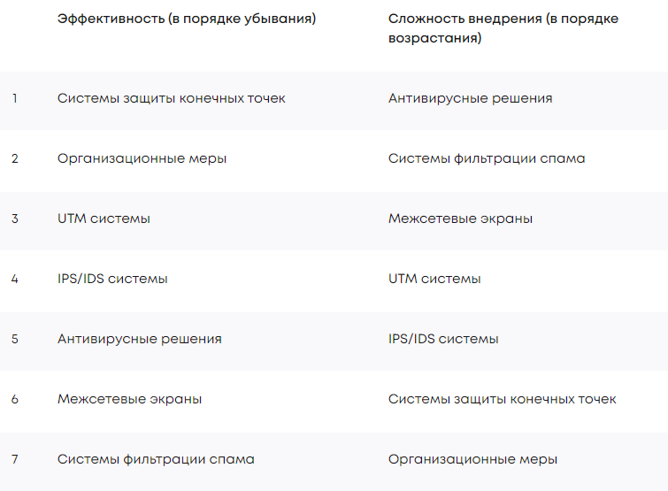

# 1. Оценка защищенности информации для разных форм представления

## Обзор методов оценки защищенности

<table>
    <thead>
        <tr>
            <th>Методы оценки соответствия</th>
            <th>Методы сценарного анализа</th>
        </tr>
    </thead>
    <tbody>
        <tr>
            <td>Определение уязвимостей (для выполнения требований ФСТЭК)</td>
            <td>Дерево отказов</td>
        </tr>
        <tr>
            <td>Оценка информационных рисков ПО Гриф – Анализ и контроль рисков</td>
            <td>Сценарии атак по модели MITRE Программы симуляции атак</td>
        </tr>
        <tr>
            <td>CWE анализ – анализ дефектов</td>
            <td>Экспериментальный подход, этичный хакинг с продвижением внутрь системы</td>
        </tr>
        <tr>
            <td>Анализ программного кода — анализ кода, анализатор трасс выполнения кода, фаззинг — подача случайного кода на вход программы</td>
            <td>Оценка защищенности от отдельных угроз, например, фишинга — путем тестирования сотрудников</td>
        </tr>
        <tr>
            <td>Формальное соответствие требованиям Категорирование ИС по требованиям например по ФСТЭК ПО Кондор, Cobra — соответствие стандартам ISO</td>
            <td></td>
        </tr>
        <tr>
            <td colspan="2" style="text-align:center;"><b>Информация на физических носителях, физическое хищение</b></td>
        </tr>
        <tr>
            <td>Формальное выполнение требований документов по физической защите информации</td>
            <td>Событийно-временной анализ действий сил охраны и нарушителя Программы ASSESS, Вега-2 Программа PACRAT — синхронный путь физического и ИТ нарушителя (при хищении физического носителя информации)</td>
        </tr>
        <tr>
            <td colspan="2" style="text-align:center;"><b>Электромагнитная информация (ПЭМИН)</b></td>
        </tr>
        <tr>
            <td colspan="2">Методы анализа зон — зон R1, R2 по нормам излучения</td>
        </tr>
        <tr>
            <td colspan="2" style="text-align:center;"><b>Звуковая информация</b></td>
        </tr>
        <tr>
            <td colspan="2">Анализ разборчивости речи по заданным таблицам</td>
        </tr>
    </tbody>
</table>

## Определение уязвимостей — модель противостояния угрозам и средства защиты

Оценивать безопасность можно по количеству уязвимостей

Борьба с ошибками в средствах защиты заключается в
- возможном уменьшении объема кода средств защиты
- усилении тестирования
- сертификации.

Для сокращения уязвимостей в программном обеспечении (ПО) необходимо
- сокращать функциональные возможности ПО
- контролировать их с помощью средств защиты
- делать так, чтобы на них нельзя было воздействовать (см. рис.)

Обеспечение безопасности системы состоит:

- в контроле и своевременном исправлении ошибок;
- минимизации объема кода средств защиты;
- в контроле над тем, чтобы не было ПО, которое не контролировалось бы средствами защиты;
- в уменьшении привилегий программ.

Вывод

- Чем больше уязвимостей, тем менее система безопасна
- с точки зрения практики <ins>является эффективным</ins>, так как позволяет оценивать безопасность здесь и сейчас
- свойства продукта при этом не исследуются
- существование некоторых уязвимостей не может быть обнаружено
- оценка безопасности должна быть постоянной

## Оценка рисков

### Процессная модель управления рисками

Четыре базовых процессах:
- **планирование** включает
    - выбор политики
	- методов управления рисками
	- проведение оценки информационных активов
	- формирование профилей угроз и их дальнейшую обработку
- **реализация** выполняется
    - развертывание систем безопасности согласно намеченному плану
	- принимаются дополнительные защитные меры:
        - коррекция бизнес-планов
	    - этапов запуска проекта исходя из специфики
	    - критичности рисков
- **проверка** сводится к выполнению мероприятий, которые подтверждают эффективность принятых мер, полноценную работу механизмов контроля информации
- **действие** заключается в улучшен и управленческих процессов на основе полученных данных мониторинга, аудита
- **итог** внесение корректировок, поправок в нормативную, регулирующую документацию компании.

### Модель FRAP (Facilitated Risk Analysis Process)

состоит в качественной оценке рисков.

При этом акценты расставляются в пользу детального изучения информационной системы с помощью автоматизированных инструментов, тщательной идентификации угроз с формированием подробного списка. В ходе оценки рисков информационной безопасности происходит их градация согласно вероятности наступления и величине ущерба.

### Модель CRAMM (CCTA Risk Analysis & Management Method)

опирается на количественные и качественные методы анализа.

уделяет повышенное внимание <ins>определению ценности информации</ins> и использует для оценки ущерба балльную систему, группирует информационные ресурсы согласно типу угроз, выделяет отдельные уровни угроз, уязвимостей.

### Модель OCTAVE (Operationally Critical Threat, Asset, and Vulnerability Evaluation)

- основана на качественной оценке рисков.
- ведется в три этапа предварительно выполняется группа мероприятий, направленных на создание ролей, планирование рисков
- Ключевые моменты:
    - персональная разработка профиля угроз, исходя из вида информационного актива
    - точная идентификация уязвимостей по всей инфраструктуре
    - подбор оптимальных стратегий для обеспечения информационной безопасности.

## Методики оценки рисков информационной безопасности

### Количественные

- Используются с целью расчетов конкретных величин, выраженных в числовых значениях, процентах
- Опираются на сравнение с эталонными величинами,
- каждому виду риска присваивается конкретная величина, параметры, выраженные в денежных, временных эквивалентах
- позволяет оценить возможный ущерб, расходы на обеспечение защитных мер, долю резервов, которые придется задействовать

Ход оценки:
1. провести оценку всех информационных активов компании в денежном эквиваленте для понимания их важности и критичности
1. проводится определение величин возможного ущерба в случае конкретных рисков и отдельных информационных активов
1. расчет вероятности наступления каждой возможной угрозы в отношении активов
1. рассчитывают суммарный потенциальный ущерб для каждого вида угроз с привязкой к какому-то временному периоду
1. выполняется анализ собранных данных и определяют количественный размер ущерба применительно к конкретной угрозе

В результате количественной оценки рисков должны быть определены:
- ценность активов в денежном выражении;
- полный список всех угроз ИБ с ущербом от разового инцидента по каждой угрозе;
- частота реализации каждой угрозы;
- потенциальный ущерб от каждой угрозы;
- рекомендуемые меры безопасности, контрмеры и действия по каждой угрозе.

### Качественные

Основываются на присвоении риску определенного ранга согласно системе ценностей: баллы, степени

Ход оценки:
1. выставляется оценка ценности информационных активов
1. рассчитывается вероятность наступления угрозы по отношению к активу
1. рассчитывают вероятность реализации угрозы, принимая во внимание действующие защитные меры
1. делается вывод о размере риска, исходя из ценности конкретного актива, а также вероятности наступления риска
1. По окончанию оценки:
    - проводится анализ и выставляется оценка в отношении каждой угрозы, величины риска
    - разрабатываются защитные меры по каждой угрозе для снижения величины ущерба

### CWE-анализ

> **Дефекты (недостатки)**
>
> это ошибки, сбои и прочие проблемы реализации, проектирования или архитектуры программного обеспечения, которые могут привести к уязвимостям.

> **Уязвимости**
>
> уже найденные кем-то ошибки, которые могут быть напрямую использованы злоумышленниками для получения доступа к системе или сети, нарушения работы сервисов и так далее.

#### Что такое CWE, чем отличается от CVE и при чем тут CVSS?

- **CWE (Common Weakness Enumeration)** общий перечень дефектов (недостатков) безопасности.
- **CVE (Common Vulnerabilities and Exposures)** перечень уязвимостей и дефектов, обнаруженных в различном программном обеспечении.
- **CVSS (Common Vulnerability Scoring System)** числовая оценка, показывающая потенциальную серьезность уязвимости (CVE). Она основана на стандартизированном наборе характеристик.

#### CWE Top 25

- список наиболее опасных и распространенных недостатков
- их легко найти и использовать
- могут позволить злоумышленникам помешать работе приложения, украсть данные или даже полностью захватить систему

#### Примеры ошибок

 

##### Программные дефекты
- переполнения буферов, ошибки форматной строки
- проблемы структуры и валидации данных
- манипуляции со специальными элементами
- ошибки путей
- проблемы с обработчиками
- ошибки пользовательского интерфейса
- проблемы обхода каталогов и распознавания эквивалентности путей
- ошибки аутентификации
- ошибки управления ресурсами
- недостаточный уровень проверки данных
- проблемы оценки входящих данных и внедрение кода
- проблемы предсказуемости и недостаточная «случайность» случайных чисел.

##### Аппаратные дефекты

- ошибки вычислений, обычно связанные с 
    - процессорами
	- графикой
	- компьютерным зрением (Vision)
	- искусственным интеллектом (AI)
	- ПЛИС (FPGA) и микроконтроллерами (uControllers)
- вопросы разделения привилегий и контроля доступа, относящиеся к
    - идентификации
	- общим ресурсам
	- контролю блокировок и другим возможностям и механизмам
- вопросы
    - питания
	- работы часов
	- обработки напряжения
	- тока или температуры
	- контроля тактовой частоты и сохранения/восстановления состояния

### Экспериментальный подход

> **Атака**
>
> реализация угрозы безопасности. Атаки не описаны ни в моделях безопасности, ни в стандартах. Невозможно перечислить все способы и реализации атак.

> **Уязвимость**
>
> слабое место в информационной системе или ошибка в программном коде, которая может привести к нарушению безопасности путем осуществления той или иной угрозы.

> **Эксплойт**
>
> термин, служащий для обозначения фрагмента программного кода, который использует возможности предоставляемой ошибки, уязвимости, и ведет к повышению привилегий, выполнению произвольных команд, или отказу в обслуживании компьютерной системы.

> **Безопасность (на практике)**
>
> успешное противостояние атакам. Система безопасна, если не содержит уязвимостей.

- некоторые атаки можно пробовать гипотетически
- для реализации большинства атак используют уязвимости, но бывают атаки и без уязвимостей
- мы можем заменить попытки осуществления атак на проверку свойств нашей системы и свойств систем, для которых данные атаки проходят

Уязвимости появляются вследствие ошибок проектирования, реализации и конфигурирования

Уязвимости могут быть классифицированы, например, следующим образом:

- по этапам разработки и эксплуатации
    - проектирования
    - реализации
    - конфигурирования;
- по расположению: в стеке, в куче и пр.

Очень важно, где допущена ошибка: в средствах защиты или в каком-либо другом компоненте системы. **Любая ошибка в системе защиты — уязвимость**

### Методы с использованием деревьев

#### Анализ дерева отказов (Fault Tree Analysis, FTA)

производится с помощью построения дерева отказов на основе полученной информации о системе.

> **Дерево отказов**
>
> это представление в виде направленного графа последовательности всевозможных взаимосвязанных событий, осуществление которых может привести к нарушению функционирования системы.

- В корне дерева находится результирующее событие — отказ системы
- в листьях — исходные события.
- Взаимосвязь между событиями, приводящая (не приводящая) к переходу на следующий уровень, реализуется логическими функциями (в основном, И/ИЛИ/исключающее ИЛИ и т. п.)
- с ветвями дерева отказов могут быть связаны качественные характеристики

#### Анализ дерева событий (Event Tree Analysis, ETA)

подразумевает построение дерева событий на основе анализа всех возможных событий, происходящих в системе

- используют индуктивную логику

### Технология MITRE

> **MITRE ATT&CK**
>
> систематизированное описание техник (приемов) и тактик, которые используют злоумышленники при атаках на организации. Эта методология позволяет обеспечить должный уровень защиты и своевременно выявить атаки на инфраструктуру, а также дает понимание того, на каком этапе вредоносной операции находятся хакеры, какую цель они преследуют и каким способом можно обнаружить их присутствие.

Матрицы MITRE ATT&CK составлены для трех сегментов:
- информационных инфраструктур предприятий (Enterprise)
- мобильных устройств на базе операционных систем Android и iOS
- промышленных систем управления (ICS)

Матрица для сегмента Enterprise содержит информацию о тактиках и техниках, которые применяются при разведке и атаках против инфраструктур на базе
- Windows
- Linux
- macOS
- облачных, контейнерных и сетевых.

 

Описание матрицы MITRE ATT&CK состоит из двух сущностей: <ins>тактик и техник</ins>.

> **TTP (Tactics, Techniques and Procedures)** - Тактики определяют цель, которой атакующие хотят достичь путем использования определенных техник и процедур, называемых также подтехниками

Каждая тактика или техника имеет свой уникальный идентификатор, используемый для простоты работы с матрицей

 

Всего в версии матрицы 12.1 содержится описание 14 тактик
- две из которых относятся к подготовительному этапу:
    - разведка (содержит 10 техник) 
    - подготовка ресурсов (7 техник)
- Остальные — это
    - первоначальный доступ (9)
	- выполнение (13)
	- закрепление (19)
	- повышение привилегий (13)
	- предотвращение обнаружения (42)
	- получение учетных данных (17)
	- исследование (30)
	- перемещение внутри периметра (9)
	- сбор данных (17)
	- управление и контроль (16)
	- эксфильтрация данных (9)
	- воздействие (13)

## Угрозы утечки информации по каналам ПЭМИН

Специальная проверка технических средств и систем представляет собой комплекс инженерно-технических мероприятий, проводимых с использованием необходимых технических средств

**Цель проверки** — исключение перехвата информации, содержащей государственную тайну, с помощью внедренных в защищаемое помещение закладок и других технических средств разведки.

[ ГОСТ Р 51583-2000 «Порядок создания автоматизированных систем в защищенном исполнении» ](https://docs.cntd.ru/document/1200108858)

> **Специальная проверка (СП)**
>
> проверка компонентов автоматизированной системы, осуществляемая с целью поиска и изъятия закладочного устройства.

> **Специальные исследования (СИ)**
>
> выявление с использованием контрольно-измерительной аппаратуры возможных технических каналов утечки защищаемой информации от основных и вспомогательных технических средств и систем и оценка соответствия защиты информации требованиям нормативных документов по защите информации.

Нормы, по которым оценивается защищенность информации, — значения показателей эффективности защиты информации, установленные нормативными документами

Побочные электромагнитные излучения и наводки (ПЭМИН), возникающие в работе любого компьютера, — способ снять информацию с оборудования, не подключенного к сети.

### Как работают каналы ПЭМИН

- Электромагнитное напряжение возникает при работе любого элемента архитектуры компьютера
- Перехват и дешифровка излучения приводят к получению информации злоумышленником.

При измерениях ПЭМИН оперируют понятием **«информативность» сигнала**. Информативными сигналами в общем случае считаются сигналы, амплитуда которых претерпевает изменения в зависимости от передаваемой информации.

две основные методики оценки защищенности ТС от утечки по каналу ПЭМИН:
- методика специальных исследований, результатом измерения которой является расчет радиусов R2, r1 и r1’
- методика оценки защищенности, результатом которой является измеренное и рассчитанное соотношение сигнал/шум на границе контролируемой зоны (реальное затухание).

Пространство вокруг ОТСС, в пределах которого напряженность ЭМ-поля превышает допустимое (нормированное) значение, называется зоной 2 (R2). <ins>Фактически зона R2 — это зона, в пределах которой возможен перехват средством разведки ПЭМИН с требуемым качеством.</ins>

Пространство вокруг ОТСС, в пределах которого уровень наведенного от ОТСС информативного сигнала в сосредоточенных антеннах превышает допустимое (нормированное) значение называется **зоной 1 (r1)**, а в распределенных антеннах — **зоной 1’ (r1’)**.

В отличие от зоны R2, размер зоны r1 (r1’) зависит не только от уровня побочных электромагнитных излучений ТСПИ, но и от длины случайной антенны (от помещения, в котором установлено ТСПИ до места возможного подключения к ней средства разведки).

 

 

## Оценка защищенности помещений от утечки речевой информации по акустическому и виброакустическому каналам и по каналу электроакустических преобразований

Одним из нормированных показателей оценки качества трактов (аппаратуры) телефонной проводной и радиосвязи, в которых используется аналоговый речевой сигнал, является разборчивость речи W, под которой понимается относительное количество (в процентах) правильно принятых, переданных по тракту элементов (слогов, слов, фраз) артикуляционных таблиц.

Показатель словесной разборчивости речи используется для оценки эффективности защищенности помещений от утечки речевой информации по акустическому и виброакустическому каналам.

Наиболее целесообразно для оценки разборчивости речи использовать
- инструментально-расчетный метод
- выбор мест (контрольных точек) размещения элементов аппаратуры контроля зависит от типа аппаратуры речевой разведки
в отношении которой осуществляется защита речевой информации.

## Программы, оценивающие эффективность при физическом проникновении на объект

### ASSESS

программа, предназначенная для оценки эффективности СФЗ при «внешней» и «внутренней» угрозах, при сговоре «внешнего» и «внутреннего» нарушителей, расчета вероятности нейтрализации вооруженного противника.

Программа ASSESS содержит следующие основные модули:

1. **Facility (объект)** модуль, предназначенный для описания объекта с точки зрения его физической защиты.
1. **Outsider (внешний нарушитель)** модуль, предназначенный для оценки эффективности системы физической защиты при внешней угрозе.
1. **Insider (внутренний нарушитель)** модуль, предназначенный для оценки эффективности системы физической защиты при внутренней угрозе.
1. **Collusion (сговор)** модуль, предназначенный для оценки эффективности системы физической защиты при сговоре внешнего и внутреннего нарушителей.
1. **Neutralization (нейтрализация)** модуль, предназначенный для оценки результатов боестолкновения сил реагирования (охраны) и нарушителя.

Объект физической защиты описывается так называемыми схемами последовательности действий нарушителя (СПДН), представляющими собой графическое описание объекта, включающее в себя:
- **зоны защиты** какие-либо части территории объекта, например, неохраняемая (внешняя) территория, охраняемая территория, охраняемое здание, помещение, место дислокации цели нарушителя;
- **элементы защиты** основные элементы, составляющие систему физической защиты, например, ограждение, стена здания, дверь, окно, контрольно-пропускной пункт и др.
- **слои защиты** совокупности элементов защиты, разделяющие зоны защиты объекта.

Каждый элемент защиты описывается двумя основными характеристиками:
- продолжительность задержки действий нарушителя,
- вероятность обнаружения нарушителя.

> Последовательности элементов защиты, преодолевая которые нарушитель может проникнуть к цели, называются **маршрутом движения нарушителя**.

Для ввода характеристик элементов защиты в программу ASSESS включены базы данных по вероятностям обнаружения нарушителя и временам задержки его действий

данные вводятся для различных способов преодоления элемента физической защиты, таких как:
- без оборудования;
- с ручными инструментами;
- с инструментами с приводом (специальные инструменты);
- с помощью взрывчатых веществ.

Программа позволяет указывать, какие зоны защиты могут преодолеваться нарушителем на автотранспорте, а какие — нет.

В результате оценки программа определит так называемый критический маршрут нарушителя, т.е. маршрут, на котором эффективность системы физической защиты минимальна, и выделит его на экране красным цветом.

### ВЕГА-2

Российская компьютерная программ ВЕГА-2 разработана как программный комплекс, объединяющий в себе ряд программ-модулей, таких как:

1. Модуль описания объекта.
1. Расчетный модуль.
1. Модуль формирования отчета.
1. Автоматизированные базы данных по средствам обнаружения, физическим барьерам, моделям нарушителей.

Работа с программой начинается с запуска модуля описания объекта. В результате работы с модулем разрабатывается формализованное описание объекта с точки зрения его физической защиты, включающее в себя:

- **Зоны защиты** какие либо части территории объекта, например, неохраняемая (внешняя) территория, защищенная внутренняя и особо-важная зоны.
- **Секции** элементы формализованного описания объекта, описывающие локализованные части объекта, отделенные от других частей рубежами ФЗ. Секциями описываются территория ЯО, локальные зоны, помещения (группы помещений и т.д.).
- **Цели нарушителя** элементы формализованного описания объекта, описывающие уязвимые места объекта или предметы физической защиты.
- **Переходы** элементы формализованного описания объекта, описывающие вероятные каналы проникновения нарушителя, например, дверь, окно, стена и др.

Каждый переход является элементом вероятного маршрута движения нарушителя и описывается двумя основными характеристиками:
- временем преодоления
- вероятностью обнаружения нарушителя.

Программный модуль позволяет проводить оценку эффективности СФЗ для:
- конкретной цели нарушителя;
- группы целей, относящихся к одной категории важности;
- объекта в целом.

Результатом оценки эффективности является вероятность пресечения нарушителя силами реагирования, рассчитанная для наихудшей, с точки зрения охраны, ситуации.

К основным особенностям программы относятся:
- Полная автоматизация процесса оценки эффективности.
- Учет случайного характера процессов, происходящих в системе «охрана-нарушитель».
- Учет тактик действий сил охраны объекта (посты, тревожная группа).
- Возможность рассмотрения действий как внешнего, так и внутреннего нарушителей.

### PACRAT

Программа PACRAT (разработки PNNL) позволяет учитывать компьютерные действия нарушителя, такие как подбор пароля с использованием специализированного ПО, и также рисует путь нарушителя на схеме объекта в физическом и киберпространстве.

# 2. Технологии фишинга и оценка защищенности от целевого фишинга

## Целевая атака

Перед атакой киберпреступники тщательно изучают средства защиты атакуемой организации.

При целевых атаках, как правило, преследуются следующие цели:
- похищение средств с банковских счетов и электронных кошельков, а также конфиденциальной, коммерческой информации;
- нечестная конкуренция: манипулирование процессами, подделка документов, ослабление конкурентов, вымогательство и шантаж;
- нарушение нормальной деятельности объектов.

### Модель жизненного цикла целевой атаки

Основной задачей подготовки является поиск цели, сбор о ней достаточно детальной приватной информации, опираясь на которую можно выявить слабые места в инфраструктуре. При этом выстраивается стратегия атаки, подбираются доступные инструменты, либо происходит их самостоятельная разработка.

> **Проникновение**
>
> активная фаза целевой атаки, проводимая для первичного инфицирования цели и внутренней разведки. Здесь широко используется целевой фишинг. По окончании разведки и после определения принадлежности инфицированной рабочей станции по команде злоумышленника через центр управления загружается дополнительный вредоносный код.

> **Распространение**
>
> фаза закрепления внутри инфраструктуры. Максимально распространяя свой контроль, при необходимости корректируя версии вредоносного кода через центры управления.

> **Достижение цели**
>
> ключевая фаза целевой атаки, в зависимости от выбранной стратегии в ней может применяться, хищение или изменение информации, манипуляции с бизнес-процессами компании.

## Целевой фишинг — элемент целевой атаки

Целью фишинга является получение доступа к конфиденциальным данным пользователей или установка вредоносного ПО с использованием методов социальной инженерии.

На почтовый ящик жертвы злоумышленник отправляет письмо, которое должно побудить его ввести необходимую информацию. Также сообщение может содержать вредоносное вложение, которое при этом проникнет в систему и будет собирать и отправлять информацию злоумышленнику. Особенность классического фишинга — массовая рассылка писем с идентичным содержанием.

Целевой фишинг (англ. spear-phishing), в отличие от обычного, направлен на конкретную цель, а значит является намного опаснее, поскольку кибер-преступники специально собирают информацию о жертве, чтобы сделать свое послание убедительнее

 

### Методы внедрения вредоносного кода с использованием целевого фишинга

Существует два типовых метода:
- вложение
- ссылка

Уязвимостью программы является ошибка, допущенная программистами на этапе ее разработки

Причины можно выделить следующие:
- ошибки на этапе проектирования и реализации ПО;
- оставление BackDoor для удаленной отладки;
- применение средств разработки различного происхождения;
- использование в составе ПО сторонних компонентов или свободно распространяемого кода;
- наличие в команде программистов-инсайдеров, которые преднамеренно вносят в написанный код дополнительные функции или элементы.

Найденным уязвимостям присваивают код с индексом **CVE (Common Vulnerabilities and Exposures)** с описанием в национальных базах данных, например на сайте ФСТЭК России

#### Эксплойты

Для того, чтобы воспользоваться уязвимостью программы, используют эксплойты

- Эксплойты для разных уязвимостей часто упакованы вместе — так, чтобы проверить систему-мишень на широкий спектр уязвимостей
- Как только выявляется одна или несколько уязвимостей, в дело вступают соответствующие эксплойты, которые подгружают программы сбора информации об
    - учетных записях пользователей
    - установленном программном обеспечении
    - активных процессах
    - средствах защиты
- далее загружают, например, систему удаленного мониторинга, инжектируя вредоносный код в запущенные программы.

#### Средства доставки

Проникнув благодаря уязвимости на целевой корпоративный компьютер, эксплойт запускает средство доставки:
- валидатор
- загрузчик
- дроппер

#####  Валидатор

является сборщиком данных и выполняет фильтрацию информации об учетных записях пользователей, установленном программном обеспечении, активных процессах и средствах защиты, передает шифрованные данные в центр управления атакой, и, в зависимости от полученной информации, злоумышленником принимается решение о дальнейшем развитии нападения, т.е. выбирается одна из следующих команд:

- загрузка дроппера — приступить к выполнению целевой атаки;
- самоуничтожение — компьютер и данные на нем не представляют ценности для целевой атаки;
- ожидание — решение откладывается, режим «сна».

валидатор не несет в себе уникальной информации о целевой атаке и ее организаторах, и, если он перехватывается средствами защиты, это не создает для киберпреступников угрозы утечки методов и средств, планируемых к применению.

##### Дроппер (Dropper)

загружает из сети либо выделяет из самого себя компоненты, необходимые для проведения атаки (Payload) с их последующим выполнением. Также его задачей является обход средств защиты и обеспечение скрытности установки.

##### Загрузчик (Downloader)

используется в целях быстрого заражения, и при запуске выкачивает основной модуль Payload либо дроппер, в зависимости от целей и планов киберпреступников.

### Письмо с вредоносным вложением

Файлы формата *.pdf часто содержат объекты JavaScript. Поэтому для злоумышленника достаточно просто создать некоторый скрипт, который использовал бы одну из уязвимостей движка от Adobe.

В документах Microsoft Office вредоносное ПО может загружаться при помощи макросов, которые содержит файл

Помимо рассмотренных случаев, существует множество других офисных продуктов и форматов, с которыми они работают. Но принцип атаки один и тот же — запустить скрытый сценарий, который позволит загрузить ПО злоумышленника на атакуемый компьютер.

Самыми популярными инструментами для создания вредоносных вложений, отправляемых в фишинговых письмах, стали Microsoft Word Intruder (MWI) и OffensiveWare Multi Exploit Builder (OMEB).

### Письмо с ссылкой

В качестве содержания письма также может отправляться ссылка. Целью злоумышленника в данном случае является переход жертвы на определенный веб-ресурс, где, используя уязвимости самого сайта или браузера переходящего, преступник также пытается внедрить зловредное ПО.

Для проведения подобных операций создаются фишинговые сайты, которые живут, как правило, недолго

### Технологии фишинга

#### Расширения файлов во вложении и эксплойты, эксплуатирующие уязвимость формата файла

1. **Основной способ обмана жертвы** маскировка вложения, содержащего вредоносную программу, под документ с популярным расширением. Также вредонос может быть замаскирован под картинку.
1. **Использование файла с достоверным расширением** внутри которого содержится эксплоит, эксплуатирующий уязвимость программы. При открытии вложения жертвой злоумышленник получает доступ к ее машине. Подобные эксплойты становятся все более популярными и в целом более эффективны, чем маскировка вложения под документ с популярным расширением.

#### Индивидуализация электронных писем в целевом фишинге (посредством email-спуфинга)

В Trend Micro подсчитали, что 91% всех кибератак начинается с адресных электронных фишинговых писем. Все, что необходимо фишеру, — обмануть одного сотрудника компании, скомпрометировав его компьютер или получив конфиденциальную информацию.

email-спуфинг, целью которого является установление доверия между вами и злоумышленником.

Фишер подделывает поля From, Return-Path и Reply-To, чтобы электронное письмо выглядело как присланное от сотрудника той же компании, департамента правительства или от лица или органа управления, с которым у компании или правительства были деловые отношения.

#### Индивидуализация электронных писем в целевом фишинге (на основе собранной информации)

Большая часть информации, используемая фишерами для индивидуализации электронных писем, получается из открытых источников.

вначале информация собирается из открытых источников одним из следующих способов:

1. Исследование веб-сайта компании для получения вашего имени, электронного адреса, корпоративных документов и т. д. Также фишер может получить первичную информацию из корпоративных каталогов или телефонных разговоров.
1. Использование инструментов для разведки по открытым источникам (например, Maltego), а также исследование фотографий, социальных сетей, форумов, блогов, новых статей, утечек и т. д.
1. Исследование мусорных контейнеров, социальная инженерия, реже – используя информаторов или прибегая к услугам сторонних компаний.

### Как самостоятельно оценить защищенность в части персонала

#### Как самостоятельно организовать тестирование сотрудников на целевой фишинг

Обучение и мониторинг готовности персонала на целевой фишинг обычно проводится с использованием 4 этапов (рис. 4).

 

На первом этапе выбираются программы для целевой тестовой рассылки, при этом нашей рекомендацией является бесплатная и поддерживаемая разработчиками программа — **Gophish**.

#### Этап 2 — обучение персонала

Важным для сотрудников является знание принципов фишинга, методов социальной инженерии, анализ самого письма и особенно обратного адреса письма. В тексте ссылки при подозрении на злонамеренность желательно посмотреть адрес ссылки по буквам, а при необходимости набрать его в ручном режиме для исключения фарминга (подмены 1–2 символов относительно правильного адреса). Важным является обновление системного ПО: ОС, браузеров и прикладного ПО, при этом в обучении должны участвовать и системные администраторы, несущие за это ответственность.

мы рекомендуем оценивать появление эмоциональной составляющей (страх, сострадание, сочувствие, альтруизм, тревогу, готовность поддержать, доверчивость, жалость, желание испытать новое, быть в тренде и т.п.)

#### Этап 3 — мониторинг готовности персонала

После обучения персонала можно проверить полученные теоретические знания и, выждав 2–3 недели, провести выборочную или полноценную рассылку с оценкой с помощью GoPhish: насколько сотрудники запомнили полученную информацию при обучении.

Важным является постепенное усложнение фишинговых писем для обучения и адаптации персонала к возможному реальному фишингу

 

При организации тестирования на фишинг необходимо анализировать показатели и их изменение как результат улучшения распознавания сотрудниками фишинговых писем:

- Персонал:
    - процент обученных сотрудников среди допущенных к корпоративной почте,
    - результаты тестирования сотрудников (теория),
    - результаты тестирования сотрудников (практика — процент переходов по ссылке, введенных данных на сайтах),
- Рабочие места:
    - процент обновленных операционных систем,
    - процент обновленных почтовых программ,
- Антиспам-фильтры почтовых серверов (наличие настроек от фишинга).

#### Этап 4 — обратная связь

при организации тестирования на фишинг необходимо соблюдать ряд рекомендаций:

- Письменно согласовать с подразделениями предприятия (ИТ-департамент, СБ, режимные подразделения и т.п.) все аспекты тестирования время, вид фишингового письма, список тестируемых адресов и т.п.
- Использовать все возможности программ для тестирования (например, автоматическую загрузку адресов, ФИО, обратную информацию об ОС на АРМ-ах, где письмо было открыто) для повышения удобства тестирования.
- Обеспечить защиту персональных данных (списка всех адресов, ФИО) для исключения их утечки, в т.ч. минимизировать сбор персональных данных на тест-фишинговых сайтах для исключения их реальной утечки и использовать проверенные облачные сервисы для исключения реальной утечки загружаемых персональных данных.
- Учитывать, что создание фишинговых страниц, например антивирусной компании, банка, может нарушить использование торговой марки, авторского права.
- Планомерно увеличивать сложность писем с одновременным информированием пользователей об ошибках и результатах.
- Периодичность мониторинга — не чаще 2–3 раз в год для одного сотрудника.
- Обеспечить наличие общего (корпоративного) информирования (например, на внутреннем портале) о новых угрозах, типовых ошибках пользователей при открытии тестовых фишинговых писем.
- Обеспечить непрерывность процесса обучения и тестирования.

### Как оценить защищенность от фишинга в целом

#### Анализ существующих мер защиты

##### Организационные меры

- необходимо минимизировать размещение электронных адресов на открытых сайтах
- ограничить доступ сотрудников к общей базе данных корпоративных адресов
- регламентирование политики использования корпоративной почты;
- обучение персонала;
- проведение тестирования.

##### Политика использования email

- электронная почта предоставляется сотрудникам организации только для выполнения своих служебных обязанностей, а не для личных целей;
- все электронные письма являются собственностью организации и не считаются персональными;
- организация может получить доступ к электронной почте сотрудников;
- пользователи не должны позволять кому-либо посылать письма, используя их идентификаторы;
- запрещение использования сторонних почтовых клиентов;
- справочники электронных адресов сотрудников доступны только внутри компании.

##### Обучение и тестирование персонала

Под обучением понимается повышение осведомленности пользователей. Персонал должен понимать возможности злоумышленников и способы атак, а также постоянно сохранять бдительность. Поэтому необходимо проводить соответствующие семинары и тренинги по темам:

- основные принципы фишинга,
- методы социальной инженерии,
- важность использования последних версий ПО,
- анализ расширений файлов и текста ссылок.

Администратору необходимо постоянно следить за обновлением ПО.

#### Программно-технические меры защиты

##### Системы фильтрации спама

Фильтрация нежелательных писем является первой ступенью защиты в борьбе с фишингом.

##### Анализ IP-адреса сервера отправителя

Данный вид анализа направлен на установление репутации IP-отправителя, которая осуществляется путем его поиска в «черных списках». Подобная защита эффективна против массового фишинга, но бесполезна при целенаправленной атаке.

##### Анализ тела письма

Спам-фильтр может проверять содержимое письма: заголовок, тему, текст, ссылки и вложения. В текстовом содержании проверяется наличие словосочетаний, которые наиболее часто применяются при фишинговых методиках. Указанные ссылки при помощи алгоритмов анализируются на предмет схожести с известными ресурсами, а также, как и в случае с IP-адресами, осуществляется поиск доменных имен в списках нежелательных или имеющих подозрительную активность. Соответственно, у вложений проверяются имена и расширения.

##### SPF/DKIM-анализ

SPF является расширением для протокола отправки электронной почты, который позволяет получателям проверять IP-адрес отправителя с помощью просмотра списка авторизованных шлюзов для определенного домена в DNS-записях.

DKIM является методом email-аутентификации, дающим возможность получателю проверить, что письмо действительно было отправлено с заявленного домена.

##### Межсетевые экраны

Межсетевой экран осуществляет контроль и фильтрацию проходящего через него сетевого трафика с использованием ряда правил.

При анализе заголовка сетевого пакета могут использоваться следующие параметры:

- IP-адреса источника и получателя;
- тип транспортного протокола;
- поля служебных заголовков протоколов сетевого и транспортного уровней;
- порт источника и получателя.

##### Антивирусные решения

Современные антивирусные решения включают в себя сетевые экраны и спам-фильтры, работающие по тем же принципам, которые были описаны ранее. А также проводят анализ загружаемого или работающего ПО с использованием следующих методов:

- сигнатурный анализ,
- эвристический анализ,
- песочница.

##### IDS/IPS

Система обнаружения вторжений (IDS), как и система предотвращения вторжений (IPS), является программным или программно-аппаратным средством защиты информации.

Данные системы предназначены для выявления фактов неавторизованного доступа в компьютерную систему или сеть, либо для несанкционированного управления ими. Одним из требований к данным системам является обнаружение активности вредоносного ПО.

##### UTM-системы

Система UTM является комплексным решением и содержит:

- межсетевой экран,
- фильтр URL,
- антивирусное решение,
- спам-фильтры,
- IDS/IPS.

##### Системы защиты конечных точек

EDR-системы разработаны для предотвращения атак со сложной структурой. Платформа EDR не просто защищает компьютерную систему от вредоносных тел, она умеет моментально замечать новейшие угрозы высокой сложности и одновременно проявлять реакцию на возникшую ситуацию. Под конечной точкой в данном случае подразумевается рабочая станция, сервер или любое другое компьютерное устройство.

Основным компонентом подобных решений является система обнаружения таргетированной атаки, которая имеет:

- сетевые/почтовые сенсоры, позволяющие осуществлять сбор информации с различных контрольных точек;
- сенсоры рабочих станций, позволяющие увеличить охват и детализацию анализируемой информации;
- компонент динамического анализа объектов;
- центр по анализу аномалий — создание типовых шаблонов поведения и контроль отклонений от них;
- облачный репутационный сервис — обновляемая в реальном времени база знаний об угрозах, в том числе и по компонентам таргетированных атак.

#### Оценка эффективности методов защиты

Экспертная оценка эффективности мер защиты

 

Эффективным решением для организации безопасности является внедрение системы защиты конечных точек как более эффективного средства защиты от внедрения ПО при целевых фишинговых атаках. Но данные системы имеют высокую стоимость и относительно сложную процедуру установки, а также требуют высококвалифицированного персонала, поэтому не все организации могут использовать их.

 

# 3. Оценка защищенности по модели MITRE

> **MITRE ATT&CK**
>
> это аббревиатура от Adversarial Tactics, Techniques and Common Knowledge (тактики, техники и общие знания противника). Это фреймворк, который описывает различные этапы атаки на IT-инфраструктуру, начиная от разведки и заканчивая действиями после компрометации. Каждый этап атаки соответствует определенной тактике, а каждая тактика включает в себя несколько техник, которые используются для достижения цели.

- Принцип работы MITRE ATT&CK основан на том, что злоумышленники обычно используют одни и те же тактики и техники для атаки на разные IT-инфраструктуры.
- Это позволяет специалистам по кибербезопасности анализировать поведение противника, определять его уязвимости и слабые места, а также разрабатывать эффективные меры защиты.
- помогает специалистам по кибербезопасности понимать логику и мотивацию противника, а также предсказывать его следующие шаги.

## Построение IT-инфраструктуры с использованием MITRE ATT&

### 1. Оценка текущего состояния безопасности

- необходимо провести аудит и анализ существующей IT-инфраструктуры
- определить ее сильные и слабые стороны
- выявить потенциальные угрозы и риски

Для этого можно использовать различные инструменты и методы, такие как
- сканирование уязвимостей
- тестирование на проникновение
- мониторинг сетевого трафика
- т.д.

### 2. Выбор подходящих тактик и техник из MITRE ATT&CK

- необходимо выбрать те тактики и техники из фреймворка, которые наиболее релевантны для конкретной IT-инфраструктуры и целей безопасности
- Для этого можно использовать различные критерии, такие как
    - частота использования противником
    - степень вреда
    - сложность обнаружения и предотвращения
    - т.д.

### 3. Разработка и реализация мер защиты

- необходимо разработать и реализовать меры защиты, которые будут противодействовать выбранным тактикам и техникам противника
- Для этого можно использовать различные инструменты и методы, такие как
    - обновление программного обеспечения
	- настройка правил фаервола
	- внедрение систем обнаружения и предотвращения вторжений (IDS/IPS)
	- обучение персонала по кибергигиене
    - т.д.

### 4. Проверка и оценка эффективности мер защиты

- необходимо проверить и оценить эффективность реализованных мер защиты
- выявить возможные проблемы и недостатки
- Для этого можно использовать различные инструменты и методы, такие как
    - симуляция атаки
	- анализ инцидентов
	- измерение показателей безопасности (KPI)
    - т.д.

## Преимущества использования MITRE ATT&CK для защиты IT-инфраструктуры

### Улучшение понимания угроз и противников

MITRE ATT&CK предоставляет обширную и актуальную информацию о тактиках и техниках, которые используют злоумышленники для атаки на IT-инфраструктуры. Это помогает специалистам по кибербезопасности лучше понимать угрозы и противников, а также их логику и мотивацию.

### Улучшение способности к обнаружению и реагированию на атаки

MITRE ATT&CK помогает специалистам по кибербезопасности определять признаки атаки, а также разрабатывать эффективные меры обнаружения и реагирования на атаки. Это позволяет сократить время между компрометацией и обнаружением, а также снизить ущерб от атаки.

### Улучшение способности к предотвращению атак

MITRE ATT&CK помогает специалистам по кибербезопасности разрабатывать эффективные меры предотвращения атак, которые будут противодействовать выбранным тактикам и техникам противника. Это позволяет уменьшить вероятность успешной атаки, а также повысить уровень безопасности IT-инфраструктуры.

### Улучшение способности к совершенствованию безопасности

MITRE ATT&CK помогает специалистам по кибербезопасности проверять и оценивать эффективность реализованных мер защиты, а также выявлять возможные проблемы и недостатки. Это позволяет постоянно совершенствовать безопасность IT-инфраструктуры, а также адаптироваться к изменяющимся угрозам и противникам.

## Потенциальные сложности и проблемы

### Недостаток ресурсов и квалификации

Для эффективного использования MITRE ATT&CK необходимо иметь достаточные ресурсы и квалификацию, такие как оборудование, программное обеспечение, персонал, обучение и т.д. Не все компании могут позволить себе такие ресурсы или иметь достаточный уровень квалификации для работы с фреймворком.

### Сложность и объем информации

MITRE ATT&CK предоставляет обширную и подробную информацию о тактиках и техниках противника, которая может быть сложной и объемной для понимания и анализа. Не все компании могут эффективно использовать эту информацию или выбрать наиболее релевантные для них тактики и техники.

### Динамичность или изменчивость угроз и противников

MITRE ATT&CK постоянно обновляется и дополняется новой информацией о тактиках и техниках противника, которые могут меняться в зависимости от ситуации и целей. Не все компании могут постоянно следить за этими изменениями или адаптироваться к ним.

## Пример использования матрицы MITRE

<table>
    <thead>
        <tr>
            <th>
            Тактика             
            </th>
            <th>
            Техника / инструмент / № тактики / Результат
            </th>
        </tr>
    </thead>
    <tbody>
        <tr>
            <td>Исследование личностей TA0023</td>
            <td>
                <ul>
                    <li>Автоматизированный анализ соц. сетей по названию организации / IBM Anatics Studio / T1341 / Список e-mail сотрудников</li>
                    <li>Выбор связанных людей организаций / IBM Anatics Studio / T1343 / Список людей, организаций</li>
                    <li>Поиск персонифицированной информации / Ручной просмотр / T1344</li>
                </ul>
            </td>
        </tr>
        <tr>
            <td>Разработка / выбор инструментов TA0024</td>
            <td>
                <ul>
                    <li>Разработка эксплойтов/ (Microsoft Word Intruder (MWI) и Offensive Ware Multi Exploit Builder (OMEB) ) / T1349 / Письма с эксплойтами в формате MS Word</li>
                    <li>Построение и конфигурирование системы доставки / Gophish SendPulse / T1347</li>
                    <li>Remote access tool development T1351</li>
                    <li>(Metasploit)</li>
                </ul>
            </td>
        </tr>
        <tr>
            <td>Тестирование TA0025</td>
            <td>Тестирование / Gophish SendPulse / T1357 / Доставка на тестовые адреса</td>
        </tr>
        <tr>
            <td>Разработка TA0024</td>
            <td>Создание зараженных флешек / Python / T1355 / Флешки с вирусным ПО</td>
        </tr>
        <tr>
            <td>Тестирование TA0025</td>
            <td>Распространение зараженных флешек / Человек / Разбросанные флешки на автостоянке или территории предприятия</td>
        </tr>
    </tbody>
</table>

# 4. Система управления информационной безопасностью (СУИБ) и оценка защищенности по стандарту ISO 27001

Файл с полным текстом стандарта: [./текст_гост_исо_27001.pdf](./текст_гост_исо_27001.pdf)

## Модель системы информационной безопасности предприятия

Для обеспечения управлением ИБ необходимо разрабатывать модель для своего предприятия. В модели должна быть связь между:
- угрозами информационной безопасности, которые характеризуются вероятностью возникновения и реализации;
- уязвимостью системы информационной безопасности, влияющей на вероятность реализации угрозы;
- рисками, отражающими предполагаемый ущерб в результате реализации угрозы информационной безопасности.

Общая структура такой модели приведена на рисунке.

 

> **Система управления информационной безопасностью (СУИБ)**
>
> часть общей системы управления организации, основанной на оценке бизнес рисков, которая создает, реализует, эксплуатирует, осуществляет мониторинг, пересмотр, сопровождение и совершенствование информационной безопасности (ISO 27001) с учетом данной модели.

- собраны описания лучших мировых практик в области управления информационной безопасностью
- устанавливает требования к системе менеджмента информационной безопасности для демонстрации способности организации защищать свои информационные ресурсы

Подготовлен в качестве модели сопровождения системы менеджмента информационной безопасности (СМИБ):
- разработки
- внедрения
- функционирования
- мониторинга
- анализа
- поддержки
- улучшения

## Применение стандарта ISO/IEC 27001 на предприятии позволяет:

- установить требования и цели в области информационной безопасности;
- гарантировать уверенность в том, что управление рисками в области информационной безопасности является эффективным, а также то, что деятельность предприятия соответствует законодательству и другим нормативным документам;
- реализовать процесс контроля за внедрением системы управления информационной безопасностью;
- идентифицировать и отслеживать существующие процессы управления информационной безопасностью;
- руководству предприятия определить состояние процессов управления защитой информации;
- внутренним и внешним аудиториям установить уровень соответствия политики безопасности регламентам;
- обеспечить партнеров и поставщиков соответствующей информацией о стандартах, процедурах и политике предприятия.

## ISO/IEC 27001 состоит из следующих элементов:

- организационные структуры,
- политика,
- действия по планированию,
- обязанности,
- процедуры,
- процессы,
- ресурсы.

содержит требования по оценке и обработке рисков информационной безопасности с учетом потребностей организации

## Что дает сертификат соответствия ISO IEC 27001 и ГОСТ Р ИСО/МЭК 27001

комплексный подход, который подразумевает последовательное внедрение в компании организационных мер, программно-технических средств и процессов менеджмента, связанных в единую систему управления информационной безопасностью (СУИБ).

Требования ГОСТ Р ИСО/МЭК 27001 можно условно разделить на 
1. перечислены в Приложении А (так называемые контроли)
2. требования основной части стандарта (большая часть перечислена в разделе 4 «Система менеджмента информационной безопасности»).

### Какие основные цели сертификации?

- получение возможности работать с государственными организациями (гос. тайна);
- определение целей и принципов деятельности относительно информационной безопасности;
- управление информационной безопасностью в соответствии с применимым законодательством и нормативными требованиями;
- получение конкурентного преимущества и формирование имиджа организации;
- получение права участвовать в тендере;
- выполнение требований некоммерческих партнерств;
- содействие в получении различных разрешений и допусков;
- выход на международный рынок.

## Аттестация

### Шаги проведения атестации

- подача заявки;
- заключение договора на сертификацию;
- анализ документации (при необходимости разработка и корректировка);
- проведение сертификационного аудита;
- рассмотрение результатов сертификационного аудита;
- выдача сертификата соответствия при положительном результате аудита.

### Содержание приложения А

#### А.5	Связь целей (задач) управления и средств их реализации**

|     |     |
| :-- | :-- |
| А.5.1.1 |	Политики ИБ |
| A.5.1.2 | Пересмотр политик информационной безопасности |

#### А.6	Организация информационной безопасности

##### A.6.1 	Внутренняя организация

|     |     |
| :-- | :-- |
| A.6.1.1 | Должностные функции и обязанности, связанные с информационной безопасностью |
| A.6.1.2 | Разделение обязанностей |
| A.6.1.3 | Контакты с полномочными органами |
| A.6.1.4 | Контакты с профессиональными сообществами |
| A.6.1.5 | Информационная безопасность в управлении проектами |

##### A.6.2 	Мобильные устройства и удаленная работа

|     |     |
| :-- | :-- |
| A.6.2.1 | Политика в отношении мобильных устройств |
| A.6.2.2 | Удаленная работа |

#### A.7 	Безопасность персонала

##### A.7.1 	До приема на работу

|     |     |
| :-- | :-- |
| A.7.1.1 | 	Предварительная проверка |
| A.7.1.2 | 	Условия трудового соглашения |

##### A.7.2 	В период занятости

|     |     |
| :-- | :-- |
| A.7.2.1 | 	Ответственность руководства |
| A.7.2.2 | 	Осведомленность, образование и обучение в сфере информационной безопасности |
| A.7.2.3 | 	Дисциплинарные меры |

##### A.7.3 	Прекращение и изменение трудовых отношений

|     |     |
| :-- | :-- |
| A.7.3.1 | 	Освобождение от обязанностей или их изменение |

#### A.8 	Управление активами

##### A.8.1 	Ответственность за активы

|     |     |
| :-- | :-- |
| A.8.1.1 | 	Инвентаризация активов |
| A.8.1.2 | 	Владение активами |
| A.8.1.3 | 	Надлежащее использование активов |
| A.8.1.4 | 	Возврат активов |

##### A.8.2 	Классификация информации

|     |     |
| :-- | :-- |
| A.8.2.1 | 	Классификация информации |
| A.8.2.2 | 	Маркировка информации |
| A.8.2.3 | 	Обращение с активами |

##### A.8.3 	Обращение с носителями информации

|     |     |
| :-- | :-- |
| A.8.3.1 | 	Управление съемными носителями |
| A.8.3.2 | 	Утилизация носителей информации |
| A.8.3.3 | 	Физическое перемещение носителей информации |

#### A.9 	Контроль доступа
 
##### A.9.1 	Диктуемые бизнесом требования к контролю доступа

|     |     |
| :-- | :-- |
| A.9.1.1 | 	Политика контроля доступа |
| A.9.1.2 | 	Доступ к сетям и сетевым службам |

##### A.9.2 	Управление доступом пользователей

|     |     |
| :-- | :-- |
| A.9.2.1 | 	Регистрация и отмена регистрации пользователя |
| A.9.2.2 | 	Предоставление доступа пользователю |
| A.9.2.3 | 	Управление привилегированными правами доступа |
| A.9.2.4 | 	Управление секретной информацией аутентификации пользователей |
| A.9.2.5 | 	Пересмотр прав доступа пользователей |
| A.9.2.6 | 	Отмена или изменение прав доступа |

##### A.9.3 	Обязанности пользователей

|     |     |
| :-- | :-- |
| A.9.3.1 | 	Использование секретной информации аутентификации |

##### A. 9.4 	Контроль доступа к системе и приложениям

|     |     |
| :-- | :-- |
| A.9.4.1 | 	Ограничение доступа к информации |
| A.9.4.2 | 	Безопасные процедуры входа в систему |
| A.9.4.3 | 	Система управления паролями |
| A.9.4.4 | 	Использование утилит с привилегированными правами |
| A.9.4.5 | 	Контроль доступа к исходным кодам |

#### A.10 	Криптография
 
##### A.10.1 	Криптографические методы защиты

|     |     |
| :-- | :-- |
| A.10.1.1 | 	Политика использования криптографических методов защиты |
| A.10.1.2 | 	Управление ключами |

#### A.11 	Физическая безопасность и защита от природных угроз
 
##### A.11.1 	Охраняемая зона

|     |     |
| :-- | :-- |
| A.11.1.1 | 	Физический периметр безопасности |
| A.11.1.2 | 	Средства контроля прохода |
| A.11.1.2 | 	Средства контроля прохода |
| A.11.1.4 | 	Защита от внешних угроз и угроз природного характера |
| A.11.1.5 | 	Работа в охраняемых зонах |
| A.11.1.6 | 	Зоны доставки и отгрузки |

##### A.11.2 	Оборудование

|     |     |
| :-- | :-- |
| A.11.2.1 | 	Размещение и защита оборудования |
| A.11.2.2 | 	Службы обеспечения |
| A.11.2.3 | 	Защита кабельных сетей |
| A.11.2.4 | 	Обслуживание оборудования |
| A.11.2.5 | 	Вынос активов |
| A.11.2.6 | 	Защита оборудования и активов вне территории |
| A.11.2.7 | 	Безопасная утилизация или повторное использование оборудования |
| A.11.2.8 | 	Оборудование пользователя, оставленное без присмотра   |
| A.11.2.9 | 	Политика чистого стола и чистого экрана |

#### A.12 	Безопасность производственной деятельности

##### A.12.1 	Рабочие процедуры и обязанности

|     |     |
| :-- | :-- |
| A.12.1.1 | 	Документированные рабочие процедуры |
| A.12.1.2 | 	Управление изменениями |
| A.12.1.2 | 	Управление изменениями |
| A.12.1.4 | 	Разделение среды разработки, тестирования и эксплуатации |

##### A.12.2 	Защита от вредоносного кода

|     |     |
| :-- | :-- |
| A.12.2.1 | 	Меры защиты от вредоносного кода |

##### A.12.3 	Резервное копирование

|     |     |
| :-- | :-- |
| A.12.3.1 | 	Резервное копирование информации |

##### A.12.4 	Ведение журналов и мониторинг

|     |     |
| :-- | :-- |
| A.12.4.1 | 	Регистрация событий |
| A.12.4.2 | 	Защита информации в журналах |
| A.12.4.3 | 	Журналы действий администратора и оператора |
| A.12.4.4 | 	Синхронизация часов |

##### A.12.5 	Контроль эксплуатируемого программного обеспечения

|     |     |
| :-- | :-- |
| A.12.5.1 | 	Установка программ в эксплуатируемых системах |

##### A.12.6 	Управление техническими уязвимостями

|     |     |
| :-- | :-- |
| A.12.6.1 | 	Управление техническими уязвимостями |
| A.12.6.2 | 	Ограничения на установку программного обеспечения |

##### A.12.7 	Ограничения на аудит информационных систем

|     |     |
| :-- | :-- |
| A.12.7.1 | 	Средства управления аудитом информационных систем |

#### A.13 	Безопасность обмена информацией

##### A.13.1 	Управление сетевой безопасностью

|     |     |
| :-- | :-- |
| A.13.1.1 | 	Средства управления сетями |
| A.13.1.2 | 	Безопасность сетевых сервисов |
| A.13.1.3 | 	Разделение в сетях |

##### A.13.2 	Передача информации

|     |     |
| :-- | :-- |
| A.13.2.1 | 	Политики и процедуры передачи информации   |
| A.13.2.2 | 	Соглашения по передаче информации |
| A.13.2.3 | 	Электронные сообщения |

#### A.14 	Приобретение, разработка и обслуживание систем
 
##### A.14.1 	Требования по безопасности информационных систем

|     |     |
| :-- | :-- |
| A.14.1.1 | 	Анализ и установление требований по информационной безопасности   |
| A.14.1.2 | 	Безопасность прикладных услуг в сетях общего пользования   |
| A.14.1.3 | 	Защита операций прикладных услуг |

##### A.14.2 	Безопасность в процессах разработки и поддержки

|     |     |
| :-- | :-- |
| A.14.2.1 | 	Политика безопасности при разработке |
| A.14.2.2 | 	Процедуры управления системными изменениями |
| A.14.2.3 | 	Технический анализ приложений после изменений операционной платформы |
| A.14.2.4 | 	Ограничения на изменения в пакетах программ |
| A.14.2.5 | 	Принципы разработки защищенных систем |
| A.14.2.6 | 	Безопасная среда разработки |
| A.14.2.7 | 	Разработка, переданная на аутсорсинг |
| A.14.2.8 | 	Тестирование защищенности системы |
| A.14.2.9 | 	Приемочное тестирование системы |

##### A.14.3 	Данные для тестирования

|     |     |
| :-- | :-- |
| A.14.3.1 | 	Защита данных для тестирования |

#### A.15 	Отношения с поставщиками
 
##### A.15.1 	Информационная безопасность в отношениях с поставщиками

|     |     |
| :-- | :-- |
| A.15.1.1 | 	Политика информационной безопасности в отношениях с поставщиками |
| A.15.1.2 | 	Решение вопросов безопасности в соглашениях с поставщиками |
| A.15.1.3 | 	Цепочка поставок информационно-коммуникационных технологий  |

##### A.15.2 	Управление предоставлением услуги поставщиком

|     |     |
| :-- | :-- |
| A.15.2.1 | 	Мониторинг и анализ услуг поставщика  |
| A.15.2.2 | 	Управление изменениями в услугах поставщика  |

#### A.16	Управление инцидентами информационной безопасности

##### A.16.1	Управление инцидентами информационной безопасности и улучшения

|     |     |
| :-- | :-- |
| A.16.1.1 | 	Обязанности и процедуры  |
| A.16.1.2 | 	Оповещение о событиях, связанных с информационной безопасностью  |
| A.16.1.3 | 	Оповещение об уязвимостях в информационной безопасности  |
| A.16.1.4 | 	Оценка и решение по событиям информационной безопасности  |
| A.16.1.5 | 	Ответные меры на инциденты информационной безопасности  |
| A.16.1.6 | 	Излечение уроков из инцидентов информационной безопасности  |
| A.16.1.7 | 	Сбор свидетельств  |

#### A.17 	Аспекты информационной безопасности в менеджменте непрерывности бизнеса
 
##### A.17.1 	Непрерывность информационной безопасности

|     |     |
| :-- | :-- |
| A.17.1.1 | 	Планирование непрерывности информационной безопасности  |
| A.17.1.2 | 	Обеспечение непрерывности информационной безопасности  |
| A.17.1.3 | 	Проверка, анализ и оценка непрерывности информационной безопасности  |

##### A.17.2 	Резервирование

|     |     |
| :-- | :-- |
| A.17.2.1 | 	Возможность применения средств обработки информации  |

#### A.18 	Соответствие

##### A.18.1 	Соответствие законодательным и контрактным требованиям

|     |     |
| :-- | :-- |
| A.18.1.1 | 	Определение действующих законодательных и контрактных требований  |
| A.18.1.2 | 	Права интеллектуальной собственности  |
| A.18.1.3 | 	Защита записей  |
| A.18.1.4 | 	Конфиденциальность и защита персональных данных  |
| A.18.1.5 | 	Регламентация применения криптографических методов  |

##### A.18.2 	Анализ информационной безопасности

|     |     |
| :-- | :-- |
| A.18.2.1 | 	Независимый анализ информационной безопасности  |
| A.18.2.2 | 	Соответствие политикам безопасности и стандартам  |
| A.18.2.3 | 	Анализ технического соответствия  |

## Итог отестации

В соответствии с установленными требованиями по результатам сертификации органом по сертификации оформляются следующие документы:

- Извещение о результатах рассмотрения заявки.
- Распоряжение о составе комиссии по сертификации.
- Заключение по результатам рассмотрения документов.
- Лист регистрации на предварительном совещании.
- Акт по результатам сертификационного аудита.
- Лист регистрации на заключительном совещании.
- Решение о выдаче сертификата соответствия.
- Сертификат соответствия требованиям ISO 27001.
- Разрешение на использование знака соответствия.

