# 1. Введение в управление информационной безопасностью

## Цель дисциплины

Главные активы компаний предоставляющие услуги:
- данные
    - клиентах
    - исполнителях
    - запросах
- геолокации пользователей
- их оценке уровня сервиса

Управление данными включает в себя организацию процессов по
- сбору
- хранению
- передаче
- защите
- использованию
- уничтожению данных организации на протяжении всего жизненного цикла информации.

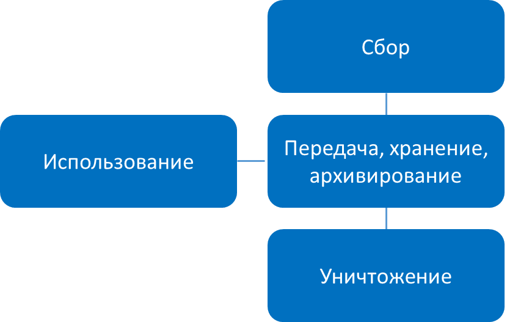

Защита информации — это часть процесса по управлению данными, ключевого процесса современных компаний.

### Прохождение этого курса поможет вам:

1. Видеть весь контекст, в котором работает функция информационной безопасности компании, а не только картину рутинных операционных задач.
1. Ставить цели и определять путь развития своего направления в компании.
1. Знать инструменты для отстаивания интересов функции информационной безопасности в компании.
1. Понимать, как выигрывать битву за бюджетирование.
1. Уметь приоритизировать свои проекты и бороться за выполнение инициатив на корпоративном уровне.

## Обзор содержания курса

### 1 модуль

- познакомитесь с основами построения архитектуры организации в целом
- поймете, почему информационная безопасность — только инструмент достижения целей организации, но никак не сама суть существования организации

Будет включать общий обзор:
- стандартов
- лучших практик и фреймворков по ИБ
- самымый известным фреймворком построения архитектуры информационной безопасности

### 2 модуль

рассмотрим стандарты построения систем управления ИБ и аспекты их практического применения.

### 3 модуль

сделаем обзор наиболее популярных фреймворков построения контролей и процессов, применимых к области управления ИБ.

## Основные термины

### Управлением информационной безопасностью

> это циклический процесс, который обеспечивает конфиденциальность, целостность и доступность информационных активов, информации, данных и услуг организации

- является частью организационного подхода к управлению безопасностью
    - физическую безопасность
    - экономическую безопасность в отношениях с контрагентами
    - и т.д.

#### Основная цель процесса управления информационной безопасностью

Является обеспечение эффективного управления безопасностью всех услуг и бизнес-процессов организации, где эффективность определяется как отношение полученной выгоды к затраченным усилиям и упущенной выгоде.

#### Самые частые состовляющие УИБ

- осознание степени необходимости защиты информации и постановку задач;
- сбор и анализ данных о состоянии информационной безопасности в организации;
- оценку информационных рисков, планирование мер по обработке рисков;
- реализацию и внедрение соответствующих механизмов контроля, распределение ролей и ответственности, обучение и мотивацию персонала, оперативную работу по осуществлению защитных мероприятий;
- мониторинг функционирования механизмов контроля, оценку их эффективности и соответствующие корректирующие воздействия.

### Другие термины

1. **Информационная безопасность (ИБ)** совокупность методов, инструментов и процессов, которые используются для защиты информации от несанкционированного доступа, утечки, изменения и уничтожения. <ins>Целью информационной безопасности</ins> является обеспечение трех наиболее важных сервисов безопасности: конфиденциальность, целостность и доступность. 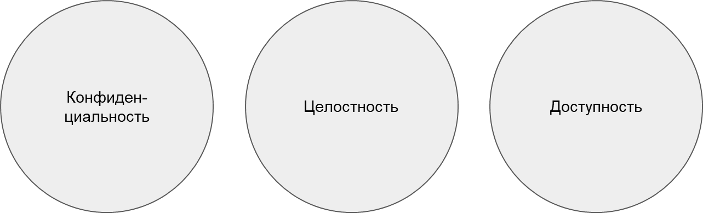 
1. **Конфиденциальность**  обеспечение доступа к информации только авторизованным пользователям.
1. **Целостность**  обеспечение достоверности и полноты информации.
1. **Доступность**  обеспечение доступа к информации авторизованных пользователей по запросу.
1. **Уязвимость**  это слабость в информационной системе, программном обеспечении или процедуре, которую злоумышленник может использовать для проникновения в систему, нарушения ее работы или доступа к ней.
1. **Угроза**  совокупность условий и факторов, создающих опасность нарушения информационной безопасности.
1. **Риск**
	1. Вероятность возникновения негативного события, которое нанесет ущерб организации или физическому лицу.
	1. Вероятность того, что источник угрозы воспользуется уязвимостью, и соответствующее влияние на бизнес.
	1. Влияние неопределенности на цели компании или лица.
1. **Воздействие (exposure)**  то, что приводит к ущербу в связи с действиями источника угрозы.
1. **Контроль (контрмера)**  мера, вводимая для уменьшения потенциального риска.
1. **Актив**  все, что представляет ценность для организации.

# 2. Стандарты, лучшие практики и фреймворки ИБ

## С чем работает информационная безопасность

### Контроли

Трех основных видов:
- **административные** Пример: документация по безопасности, управление рисками, безопасность персонала и обучение
- **технические** представляют собой программные или аппаратные компоненты
- **физические** средства, используемые для физической защиты объектов, персонала и ресурсов

Эти виды контроля необходимо внедрить для обеспечения эшелонированной защиты, которая представляет собой скоординированное использование нескольких мер безопасности на разных уровнях.

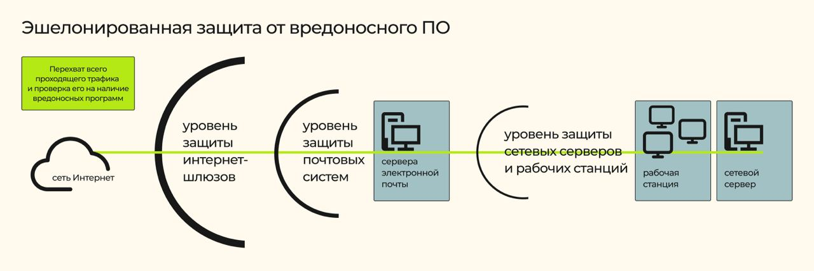 *Пример эшелонированной защиты. Источник: Лаборатория Касперского*

#### Функциях контролей ИБ

1. **Превентивный контроль** Предназначен для предотвращения инцидента.
1. **Детективный контроль** Помогает детектировать действия, связанные с инцидентом, и потенциального нарушителя.
1. **Корректирующий контроль** Предпринимается для устранения причин нежелательных ситуаций, чтобы подобные события не проявлялись в будущем.
1. **Сдерживающий контроль** Предназначен для отпугивания потенциального злоумышленника.
1. **Восстанавливающий контроль** Предназначен для восстановления нормальной работы окружения.
1. **Компенсирующий контроль** Средства, обеспечивающие альтернативную меру контроля.

### Безопасность через неясность (security through obscurity)

- Основная идея заключается в том, чтобы скрыть внутреннее устройство системы или реализацию для обеспечения безопасности
- Система может иметь существующие или предполагаемые уязвимости, но ее владельцы или разработчики считают, что если недостатки неизвестны, то злоумышленник не сможет их обнаружить.

Усложняет этап разведки для злоумышленника

не должен использоваться в качестве основной меры безопасности

## Фреймворк

> это составное понятие, которое в среднем означает набор правил, шаблонов и инструментов,используемых для построения чего-либо, в нашем случае — системы управления организацией или информационной безопасностью. Далее в модулях дисциплины будем считать, что фреймворк — <ins>это подход к построению архитектуры предприятия</ins>.

### Архитектура предприятия

- включает в себя компоненты организации
- выражает структуру (форму) и поведение (функцию) предприятия
- воплощает в себе компоненты предприятия
    - их взаимоотношения друг с другом и с окружающей средой.

### Сотовные части

1. **Структурные элементы. Организационные структуры (подразделения), ИС, элементы ИТ-инфраструктуры, элементная база, промышленные активы, информация, помещения, ЦОД, склады** 
1. **Поведенческие элементы. Действия и функции участников системы (людей, отделов, смежных бизнесов), которые должны совершать свою деятельность в определенных последовательностях в виде процессов** 
1. **Пассивные элементы. Документы, объекты данных, цифровые двойники реальности** 
1. **Элементы мотивации и целеполагания. Цели действий, принципы деятельности, правовые нормы, драйверы рынка и интересы отдельных стейкхолдеров** 

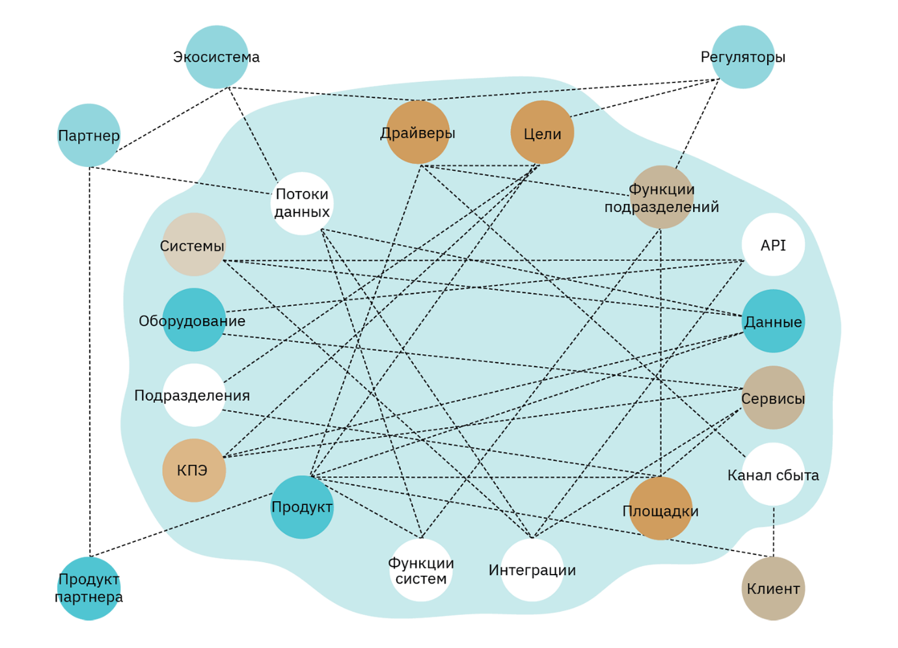 *Пример элементов, которые связывают фреймворк организации между собой*

## Применение фреймворков

### Первый (простой) подход

- Большинство организаций, особенно малого и среднего бизнеса, не начинают с безопасной архитектуры
- Дальше ситуация корректируется по мере роста компании
- полагается на краткосрочные меры -> Тушение пожаров

### Второй (сложный) подход

- заключается в определении архитектуры безопасности предприятия, которая служит ориентиром при внедрении решений, обеспечивающих удовлетворение потребностей бизнеса, обеспечении стандартной защиты всей среды и уменьшении количества неожиданностей в области безопасности, с которыми может столкнуться организация.

Для реализации необходимо:

1. Определить заинтересованные стороны, людей, которые будут использовать архитектуру, другими словами — участвовать в жизни организации.
1. Определить «точки наблюдения» (viewpoints) со стороны участников организации. То есть представления о том, в какую оболочку будет заключена информация, наиболее важная для различных групп заинтересованных сторон. Национальный институт стандартов и технологий США (NIST) разработал структуру, показанную на рис. 8, которая объясняет, что компании имеют несколько разных точек зрения на данные. Так, например:
	- руководители должны понимать компанию с точки зрения бизнеса;
	- разработчики бизнес-процессов должны понимать, какой тип информации необходимо собирать для поддержки бизнес-деятельности;
	- разработчики приложений должны понимать системные требования, которые поддерживают и обрабатывают информацию;
	- разработчики моделей данных должны знать, как структурировать элементы данных;
	- технологическая группа должна понимать сетевые компоненты, необходимые для поддержки вышележащих уровней.

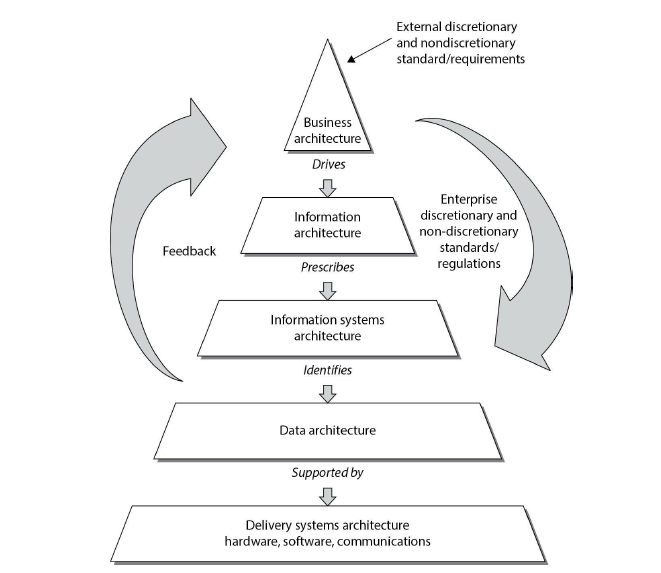 *Рис. 8. Архитектура организации по NIST. Источник: [ https://www.nist.gov/* ]( https://www.nist.gov/* )*

### Обзор фреймворков

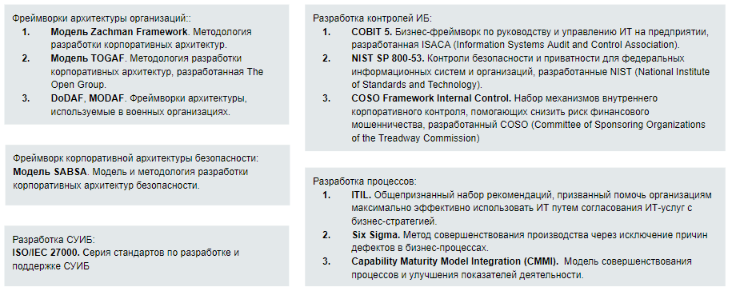

#### Группы фреймворков

1. Фреймворки архитектуры организации.
1. Фреймворк корпоративной архитектуры безопасности.
1. Стандарты построения системы управления ИБ.
1. Фреймворки контролей ИТ/ИБ.
1. Фреймворки процессов ИТ/ИБ.

# 3. Фреймворки построения архитектуры организации

## Zachman Framework. Модель разработки корпоративной архитектуры

модель является общей и хорошо подходит для описания нашей работы как профессионалов в области безопасности информационных систем.

Фреймворк Захмана — это двумерная модель, в которой используются:

- Шесть вопросов:
    1. что
	1. как
	1. где
	1. кто
	1. когда
    1. зачем
- Различные точки взглядов:
    - владельца бизнеса
	- топ-менеджеров
	- бизнес-аналитиков
	- системных аналитиков
	- технических специалистов и взгляд в масштабе всего предприятия, чтобы дать целостное представление о нем.

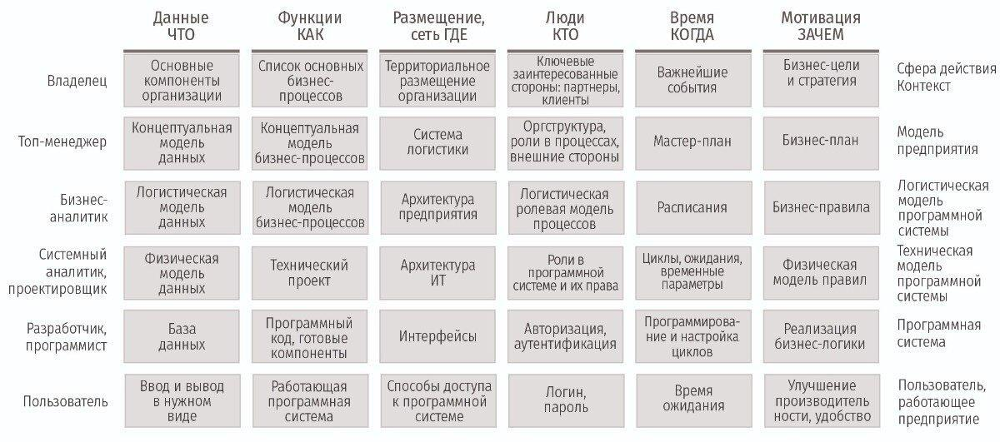

Эта структура содержит правила, управляющие упорядоченным набором отношений. Одно из этих правил заключается в том, что каждая строка должна полностью описывать предприятие с определенной точки зрения.

Цель фреймворка Захмана заключается в формировании возможности взглянуть на одну и ту же организацию с разных точек зрения

## TOGAF (The Open Group Architecture Framework)

Обеспечивает подход к проектированию, внедрению и управлению информационной архитектуры предприятия.

**типы архитектуры:**

1. **бизнес-архитектура** определяет стратегию бизнеса, управление, организацию и ключевые бизнес-процессы;
1. **архитектура данных** представляет структуру информационных ресурсов организации, включая логическую и физическую организацию данных, а также средства управления информацией;
1. **архитектура приложений** предоставляет план развертывания отдельных приложений, их взаимодействия и взаимосвязи с основными бизнес-процессами организации;
1. **технологическая архитектура** описывает цифровую архитектуру, логические возможности, стандарты программной и аппаратной инфраструктуры, необходимые в качестве поддержки развертывания сервисов для бизнеса, данных и приложений.

Эти различные архитектуры могут позволить технологическому архитектору **понять предприятие с четырех разных точек зрения** (бизнес, данные, приложения и технологии), чтобы он мог гарантировать, что его команда разрабатывает нужную технологию, которая при этом сможет работать в существующей среде и всех компонентах, составляющих эту среду, да еще и соответствовать бизнес-требованиям.

**В основе TOGAF лежат четыре основных принципа:**

1. модульность,
1. масштабируемость,
1. расширяемость,
1. гибкость.

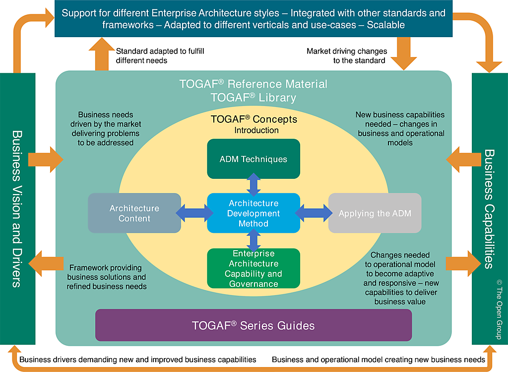

Модель TOGAF открыто распространяется для исследовательских целей, вы можете изучить ее, зарегистрировавшись на сайте библиотеки The Open Group: [ https://publications.opengroup.org/ ]( https://publications.opengroup.org/ ).

### методика ADM (Architecture Development Method)

определяет процесс разработки архитектуры

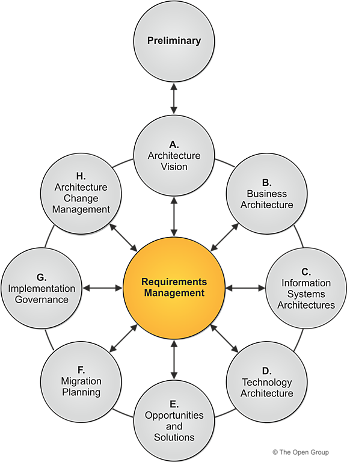

1. **Фаза A. Видение архитектуры** Определение области применения и зрелости текущей архитектуры и установление новой архитектуры.
1. **Фаза B. Бизнес-архитектура** Разработка бизнес-архитектуры, которая поддерживает стратегические цели компании.
1. **Фаза C. Системная архитектура** Создание информационной системной архитектуры, включая разработку архитектуры данных и приложений.
1. **Фаза D. Технологическая архитектура** Разработка технологической архитектуры, обеспечивающей необходимую технологическую инфраструктуру.
1. **Фаза E. Возможности и решения** Подготовка плана реализации, определяющего порядок внедрения компонентов архитектуры.
1. **Фаза F. Управление миграцией** Непрерывное управление процессами проектирования и реализации.
1. **Фаза G. Управление реализацией** Проведение текущего управления архитектурой в рамках управленческих структур организации.
1. **Фаза H. Управление изменениями архитектуры** Установление процедур управления изменениями для обеспечения постоянной актуализации архитектуры.

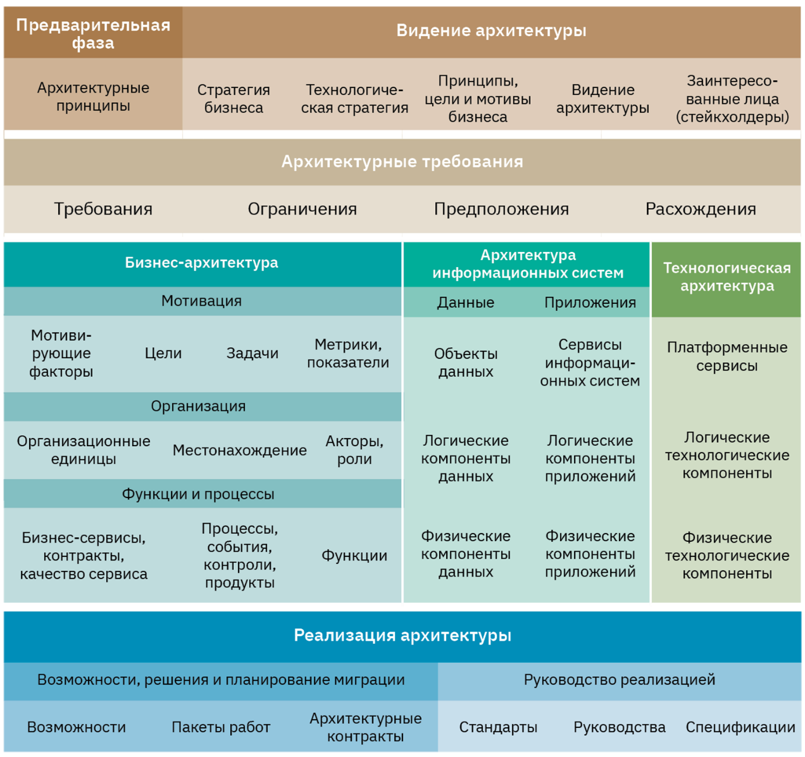

## DoDAF, MODAF. Фреймворки архитектуры, используемые в военных организациях

1. **Department of Defense Architecture Framework (DoDAF)** фреймворк, разработанный для Министерства обороны США.
1. **Ministry of Defence Architecture Framework (MODAF)** фреймворк, разработанный для Министерства обороны Великобритании.

Закупаемые министерствами технологические продукты и системы вооружения должны соответствовать их архитектурам, чтобы правильно интегрироваться в текущую инфраструктуру.

Основное внимание в структуре архитектур уделяется
- командованию
- контролю
- связи
- компьютерам
- разведке
- наблюдению
- разведывательным системам

Важно не только, чтобы эти разные устройства обменивались данными, используя одни и те же типы протоколов и совместимые программные компоненты, но и чтобы они использовали одни и те же элементы данных.

### Точка зрения

> **Точка зрения**
>
> это совокупность мнений и взглядов группы лиц, имеющих общие цели в организации. Точки зрения обычно классифицируются по доменам.

| DoDAF точки зрения   | MODAF точки зрения    |
|--------------- | --------------- |
| Точка зрения на возможности системы. Описывает требования к возможностям системы.  | Стратегическая точка зрения. Определяет желаемый бизнес-результат и какие возможности необходимы для его достижения.   |
| Точка зрения на данные и информацию. Описывает взаимодействия между данными системы и согласование архитектуры данных.   | Операционная точка зрения. Определяет процессы, информацию и объекты, необходимые для выполнения требований к возможностям.   |
| очка зрения на эксплуатацию. Включает операционный сценарий, активности и требования по поддержке возможностей.   | Сервис-ориентированная точка зрения. Описывает услуги, необходимые для поддержки процессов в операционных представлениях.   |
| Проектная точка зрения. Описывает отношения между операционными требованиями и требованиями к возможностям системы.   | Точка зрения систем. Описывает физическую реализацию операционных и сервис-ориентированных представлений и, таким образом, определяет решение.   |
| Сервисное представление. Описывает идентификацию сервисов, сервисных элементов и их взаимодействий.   | Точка зрения приобретения. Описывает зависимости и сроки проектов, которые предоставят решение.   |
| Точка зрения на стандарты. Описывает некоторые стандарты, которые используют в разработке решений.   | Техническая точка зрения. Определяет стандарты, которые должны применяться к решению.   |
| Точка зрения на системы. Описывает системы и соединения, поддерживающие работу организации.   | Общая точка зрения. предоставляет описание и глоссарий содержания архитектуры.   |

### DoDAF: этапы построения архитектуры предприятия

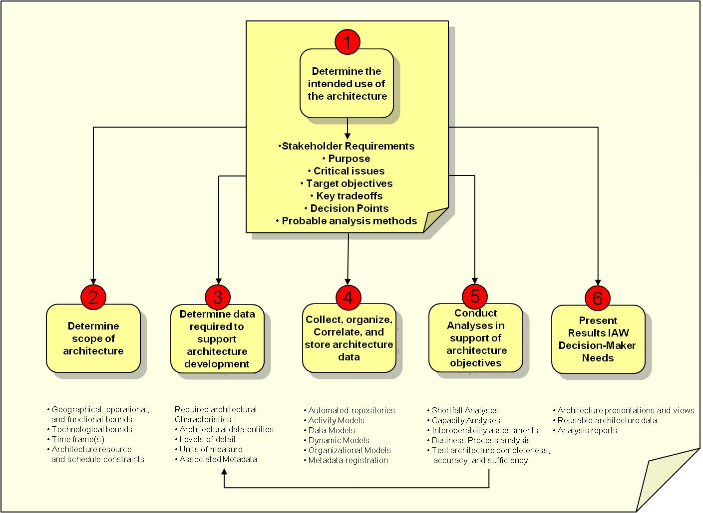

1. **Определить планируемое использование архитектуры** Это называется «Fit-for-Purpose», то есть разработать архитектуру, сразу подходящую под цели.
1. **Определить контекст архитектуры** Установить требования заинтересованных сторон, проблемы и возможности, которые стоят перед организацией.
1. **Определить данные, требуемые для поддержки разработк** архитектуры.
1. **Собрать, организовать и хранить в нужном виде данны** архитектуры.
1. **Провести анализ поддержки целей создания архитектуры** Перепроверить, что в процессе построения архитектуры не произошло отклонений от изначальных целей и требований.
1. **Представить результаты лицам, отвечающим за принятие решений, в понятном для ни** виде.

## Выводы

- Пытаясь выяснить, какая архитектурная структура лучше всего подходит для вашей организации, вам необходимо определить, <ins>кто является заинтересованными сторонами и какая информация им нужна от архитектуры</ins>.
- Архитектура должна представлять компанию наиболее полезным образом для людей, которым необходимо понять ее лучше всего
- архитектура должна обеспечивать такое представление, которое отображает информацию, необходимую заинтересованным сторонам

Одно из основных различий между фреймворками построения архитектуры предприятия заключается в том, какой тип информации они лучше представляют и как именно они ее предоставляют.

# 4. Модель разработки корпоративных архитектур безопасности

## Что такое архитектура безопасности организации

Архитектура безопасности предприятия является подмножеством архитектуры предприятия

определяет стратегию информационной безопасности, состоящую из
- слоев
    - решений
    - процессов
    - процедур
- способов их стратегической, тактической и оперативной связи.

### Присутствует ли архитектура корпоративной безопасности

1. Обеспечена ли безопасность разрозненными подразделениями по всей организации?
1. Существует ли постоянный разрыв между высшим руководством и сотрудниками службы безопасности?
1. Приобретаются ли избыточные продукты для разных отделов из-за дублирования потребностей в области безопасности?
1. Состоит ли программа безопасности в основном из политик без фактической реализации и соблюдения?
1. Когда требования к доступу пользователей возрастают из-за потребностей бизнеса, может ли сетевой администратор просто изменить конфигурацию настроек доступа без одобрения руководителя пользователей и владельца ресурса?
1. При выпуске нового продукта возникают ли неожиданные проблемы совместимости, для устранения которых требуется больше времени и денег?
1. При возникновении проблем безопасности предпринимаются ли многочисленные «разовые» действия вместо следования стандартным процедурам?
1. Руководители бизнес-подразделений не знают о своих обязанностях по обеспечению безопасности и о том, как их обязанности соотносятся с законодательными и нормативными требованиями.
1. В организации определены «конфиденциальные данные», но необходимые меры контроля не реализованы и не контролируются в полной мере.
1. Внедряются ли точечные решения вместо общекорпоративных решений?
1. Продолжают ли повторяться одни и те же дорогостоящие ошибки?
1. Управление безопасностью в настоящее время недоступно, потому что предприятие не рассматривается и не контролируется стандартизированным и целостным образом.
1. Принимаются ли бизнес-решения без учета аспектов безопасности?
1. Сотрудники службы безопасности обычно «тушат пожары», потому что не имеют времени на рассмотрение и разработку стратегических подходов.
1. Принимаются ли меры по обеспечению безопасности в бизнес-подразделениях, о которых другие бизнес-подразделения ничего не знают?
1. Все больше и больше сотрудников службы безопасности обращаются к специалистам в области психического здоровья и принимают антидепрессанты или лекарства от тревожности.

Если вы получили большое 8 ответов «да», то никакой работающей архитектуры не существует.

## SABSA. Модель разработки корпоративной архитектуры безопасности

> **Sherwood Applied Business Security Architecture (SABSA)**
>
> это фреймворк и методология архитектуры безопасности предприятия.
>
>- Поскольку это фреймворк, это означает, что SABSA предоставляет структуру для построения архитектуры безопасности.
>- Поскольку это также методология, это означает, что SABSA предоставляет процессы, которым необходимо следовать для построения и поддержки этой архитектуры.

### Уровни SABSA

- контекстуальном,
- концептуальном,
- логическом,
- физическом,
- компонентном,
- операционном.

вопросы, на которые необходимо ответить на каждом уровне SABSA

1. Что вы пытаетесь сделать на этом уровне? Определение активов, которые будут защищены вашей архитектурой безопасности.
1. Почему вы это делаете? Мотивация применения безопасности, выраженная в терминах этого уровня.
1. Как вы пытаетесь это сделать? Функции, необходимые для обеспечения безопасности на этом уровне.
1. Кто участвует? Люди и организационные аспекты безопасности на этом уровне.
1. Где вы это делаете? Места, в которых вы применяете свою безопасность, относящиеся к этому уровню.
1. Когда вы это делаете? Временные аспекты безопасности, относящиеся к этому уровню.

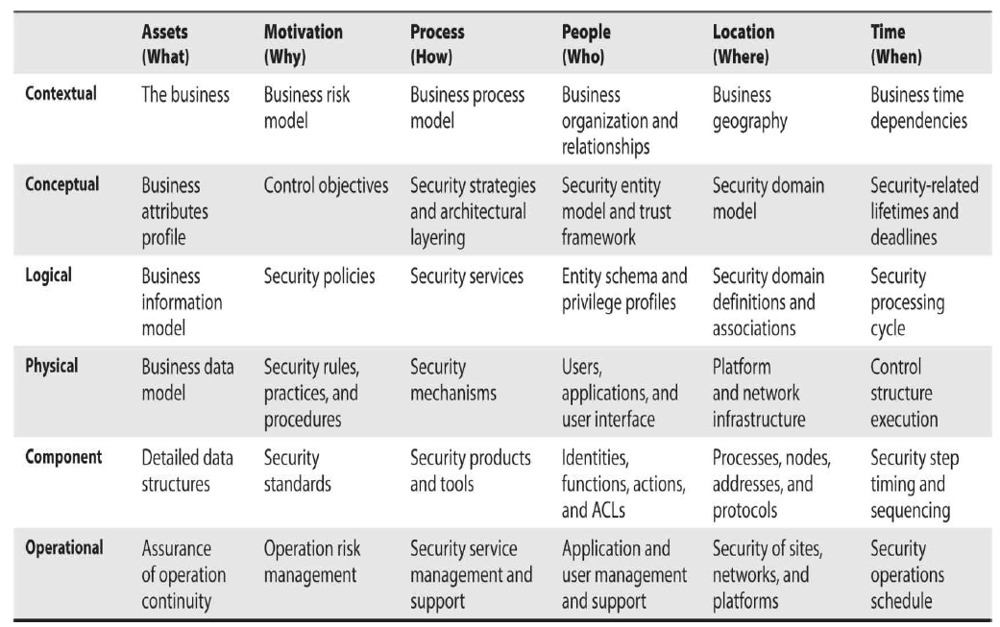

на каждом уровне необходимо понимать и соблюдать следующие моменты:

1. Ориентация на стратегию предприятия.
1. Ориентация на увеличение возможностей бизнеса.
1. Улучшение бизнес-процессов.
1. Эффективность безопасности.

#### Strategic Alignment. Ориентация на стратегию предприятия

- означает, что бизнес-факторы, а также нормативные и юридические требования учитываются архитектурой безопасности предприятия
- усилия по обеспечению безопасности должны обеспечивать и поддерживать среду, которая позволяет компании не просто выживать, а процветать.

#### Business Enablement. Помощь бизнесу в развитии

означает, что основные бизнес-процессы интегрированы в операционную модель безопасности — они основаны на стандартах и соответствуют критериям толерантности к риску.

**Примеры**

1. Удаленная работа сотрудников (из дома).
1. Возможность совершать транзакции онлайн
1. Автоматизация производственных процессов
1. Создание личных кабинетов пользователей

#### Process enhancement. Улучшение бизнес-процессов

- Когда организация разрабатывает свои корпоративные компоненты безопасности, они должны быть интегрированы в бизнес-процессы, чтобы быть эффективными
- Деятельность по внедрению таких компонент безопасности необходимо использовать для усовершенствования самих бизнес-процессов.

#### Security effectiveness. Оценка эффективности безопасности

Необходимо проводить мониторинг того, насколько эффективно работают выбранные решения безопасности и архитектура безопасности в целом.

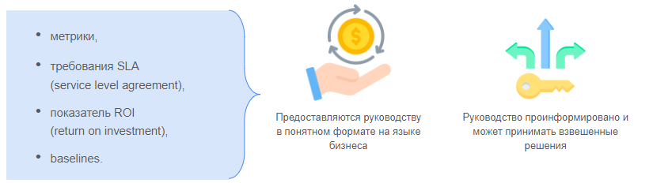

Этот принцип связан с множеством метрик, которые представляют ценность для руководства.

> **[Базис (baseline)](https://dorlov.blogspot.com/2009/06/issp-01-9.html#issp_d1_i6_3)**
>
> это точка во времени, которая используется для сравнения с будущими изменениями. Когда риски снижены и меры безопасности внедрены, базисы пересматривают, чтобы иметь возможность более адекватно контролировать эффективность будущих изменений. Базис - это некий ориентир.
>
> используются для определения минимально требуемого уровня защиты

- После установки базисов можно разработать метрики для проверки соответствия их требованиям.
- Затем эти метрики предоставляются руководству

> **Evaluation Assurance Level**
>
> это числовая оценка, присваиваемая после завершения оценки безопасности. Повышение уровней безопасности от 1 до 7 отражает дополнительные требования к безопасности, которые должны быть выполнены. Уровень EAL не измеряет безопасность самой системы, он просто указывает, на каком уровне система была протестирована, что дает определенную уверенность в том, что основные функции безопасности системы надежно реализованы

Получается, что при установке такого базиса ИБ на предприятии могут использоваться только системы, получившие при EAL-оценке рейтинг 4.

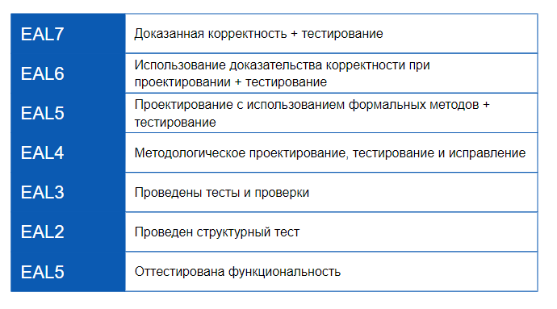

# Источники и дополнительные материалы

- [ https://www.nist.gov/ ]( https://www.nist.gov/ )
- [https://www.dragon1.com/frameworks/zachman-framework-for-enterprise-architecture ]( https://www.dragon1.com/frameworks/zachman-framework-for-enterprise-architecture)
- [ https://zachman-feac.com/ ](https://zachman-feac.com/)
- [ https://www.opengroup.org/togaf ](https://www.opengroup.org/togaf)
- [ https://sabsa.org/ ](https://sabsa.org/)

