# 1. Введение

> **Система управления ИБ (СУИБ)**
>
> это часть общей системы менеджмента компании, основанная на риск-ориентированном подходе и предназначенная для создания, реализации, эксплуатации, мониторинга, анализа, поддержки и совершенствования информационной безопасности компании.

# 2. Стандарты построения системы управления ИБ

## Системы менеджмента информационной безопасности. Серия стандартов ISO/IEC 27000

> **Международная организация по стандартизации (International Organization for Standardization, или ISO)**
>
> это крупнейшая независимая неправительственная организация, которая занимается разработкой рекомендательных международных стандартов.

> **Международная электротехническая комиссия (International Electrotechnical Commission, или IEC)**
>
> это ведущая мировая организация, которая готовит и публикует международные стандарты для электрических, электронных и смежных технологий.

стандарты ISO относятся чаще всего к
- областям управления качеством
- международной торговлей
- научными процессами

стандарты ISO/IEC
- к инженерным областям
- техническим областям

> **Серия стандартов ISO/IEC 27000**
>
> это семейство международных стандартов по информационной безопасности, опубликованное в рамках объединенного подкомитета ISO/IEC. Серия содержит лучшие практики и рекомендации в области ИБ для создания, развития и поддержания СУИБ.

### Группы семейств стандартов ISO/IEC 27000

1. Обзор и термины.
1. Два стандарта, в которых содержатся прямые требования к построению СУИБ и к тому, как проводить аудит и сертификацию СУИБ. Последнее относится к внешним аудиторам, а не к организациям, внедряющим СУИБ.
1. Набор лучших практик для различных процессов ИБ (управление рисками, инцидентами, непрерывностью, оценка эффективности и пр.). В этой группе стандартов нет требований, но к ним полезно обращаться за рекомендациями.
1. Рекомендации, специфичные для конкретных секторов бизнеса и экономики.

### Самые распространенные стандарты серии ISO/IEC 27000

1. ISO/IEC 27000 — Information security management systems — Overview and vocabulary.
1. ISO/IEC 27001 — Information security, cybersecurity and privacy protection — Information security management systems — Requirements.
1. ISO/IEC 27002 — Information security, cybersecurity and privacy protection — Code of practice for information security controls.
1. ISO/IEC 27003 — Information security management system implementation guidance.
1. ISO/IEC 27004 — Information security management — Monitoring, measurement, analysis and evaluation.
1. ISO/IEC 27005 — Guidance on managing information security risks.
1. ISO/IEC 27017 — Code of practice for information security controls based on ISO/IEC 27002 for cloud services.
1. ISO/IEC 27018 — Code of practice for protection of personally identifiable information (PII) in public clouds acting as PII processors.
1. ISO/IEC 27701 — Information technology — Security Techniques — Information security management systems — Privacy Information Management System (PIMS).

[Список стандартов серии ISO/IEC 27000](https://www.codetd.com/ru/article/16311457)

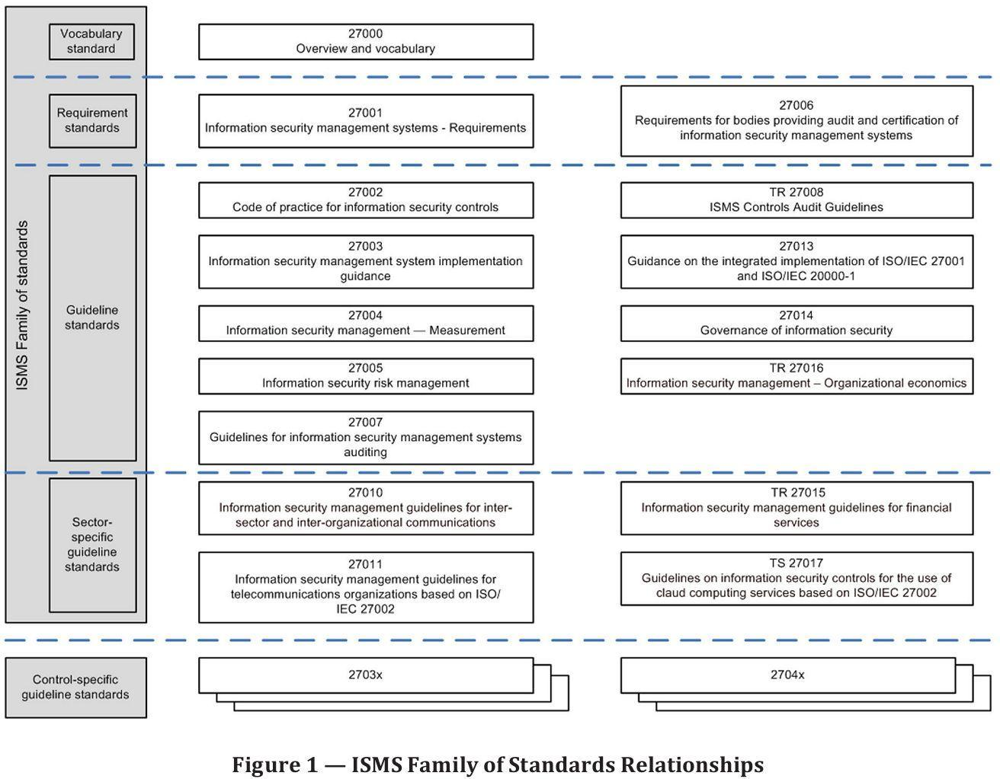

## Стандарт ISO/IEC 27001

> стандарт безопасности, который официально определяет СУИБ, предназначенную для обеспечения информационной безопасности.

- подробно рассматривается процесс и способы управления информационной безопасностью
- устанавливает требования к СУИБ:
    - внедрению
    - контролю
    - поддержанию
    - улучшению
- прописаны конкретные советы и рекомендации с требованиями к документам
- так же прописаны:
    - зоны разделения ответственности
    - доступность
    - контроль доступа
	- безопасность
	- аудит
	- корректирующие
    - профилактические меры

Цель стандарта ISO/IEC 27001 — помочь построить СУИБ, в рамках которой организация сможет выбрать меры управления безопасностью для защиты информационных активов, соответствующие ее целям и запросам заинтересованных сторон.

### Основные задачи СУИБ, внедренной в соответствии со стандартом ISO/IEC 27001

- установить единые требования по обеспечению информационной безопасности организаций;
- внедрить риск-ориентированный подход при управлении мерами обеспечения информационной безопасности;
- обеспечить взаимодействие руководства и сотрудников, входящих в область действия СУИБ;
- повысить эффективность мероприятий по обеспечению и поддержанию информационной безопасности организаций;
- обеспечить работающие механизмы снижения уязвимостей и своевременного реагирования на изменяющиеся риски безопасности;
- обеспечить инвентаризацию важных информационных активов, таких как финансовая отчетность, интеллектуальная собственность, данные сотрудников и информация, доверенная третьим лицам, а также их неповрежденности (целостности), конфиденциальности и доступности;
- подготовить людей, процессы и технологии в рамках СУИБ к противостоянию угрозам ИБ;
- сэкономить ресурсы за счет повышения эффективности и сокращения расходов на неэффективные технологии защиты, проектные инициативы и контроли.

### Цели контролей согласно ISO/IEC 27001

сгруппированных по четырем категориям

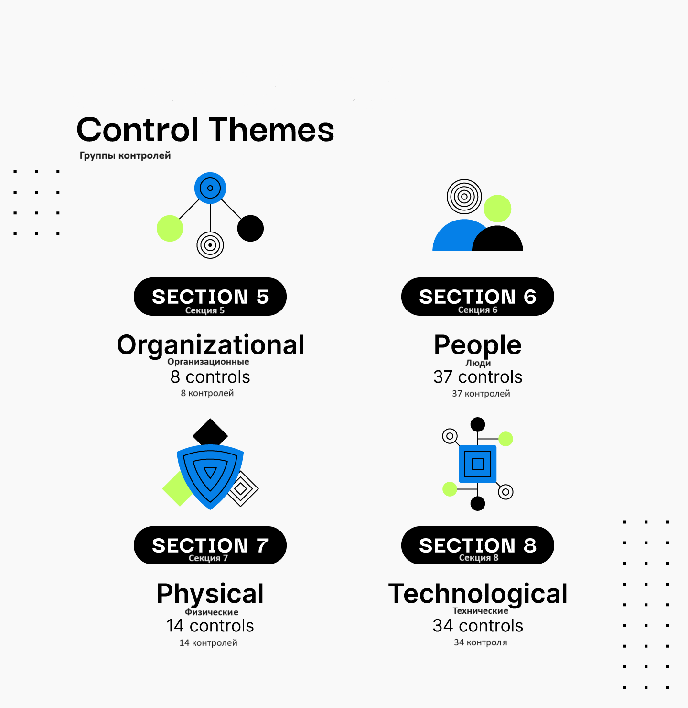

Подробнее о контролях:  

# 3. Инструменты управления ИБ

## Риск-ориентированный подход как управленческий инструмент

Комплаенс vs Риск-ориентированный подход 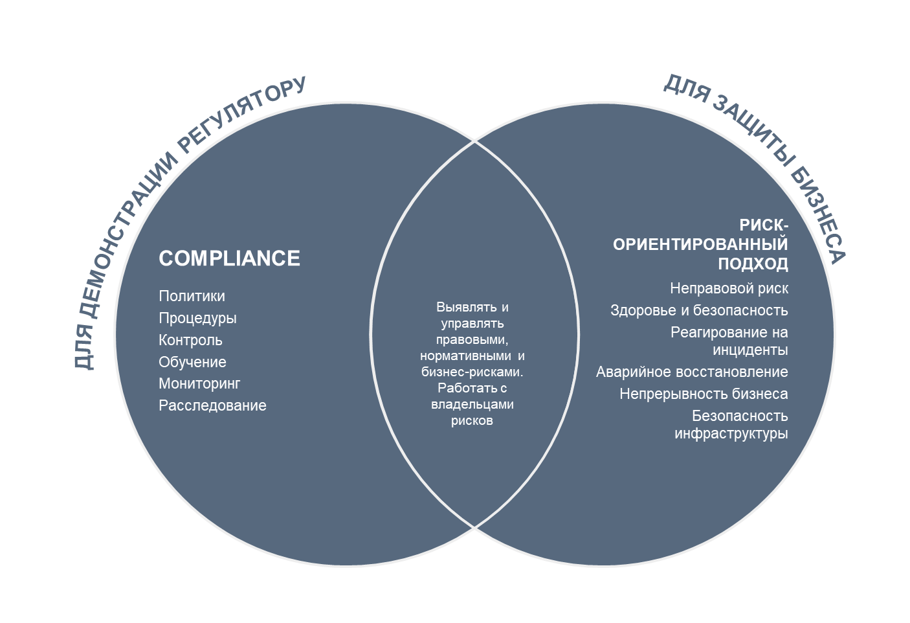

- ориентация исключительно на достижение комплаенса приводит к «бумажной безопасности»
- Такая практика может сопровождаться также реактивным характером реагирования на инциденты

Корректно организованный процесс управления рисками информационной безопасности позволяет руководителю ИБ самостоятельно определять необходимый набор мер для снижения нежелательных рисков.

## Алгоритм применения риск-ориентированного подхода при принятии решений

**ISO 31000:2018 (ГОСТ Р ИСО 31000-2019)** - самый известный в кругах кибербезопасности подход к оценке рисков [https://files.stroyinf.ru/Data/731/73107.pdf](https://files.stroyinf.ru/Data/731/73107.pdf)

> **Риск** — это влияние неопределенности на цели.

Влияние — это отклонение от ожидаемого результата. Оно может происходить в обе стороны — как в плюс, так и в минус (то есть быть положительным или отрицательным). Благодаря влиянию могут быть реализованы возможности, а также созданы или устранены угрозы.

Цели могут иметь разные аспекты и категории, могут применяться на различных уровнях управления.

Риск ($R$) обычно определяется как комбинация вероятности наступления события ($L$ — likelihood или $P$ — possibility) и воздействия ($I$ — impact) от этого события.

Получается следующая формула:
$$R=L \times I$$

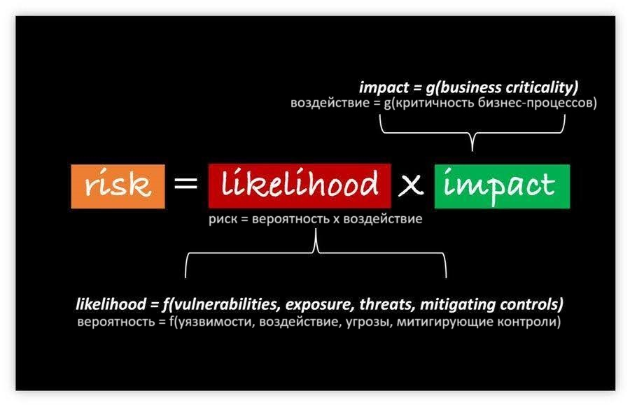

## Схема процесса риск-менеджмента

состоит из четырех шагов:
1. Идентификация рисков.
1. Оценка рисков.
1. Обработка рисков.
1. Мониторинг рисков.

Все шаги выполняются последовательно и циклично. После завершения четвертого шага заново начинается идентификация рисков с учетом последних изменений внешней и внутренней среды.

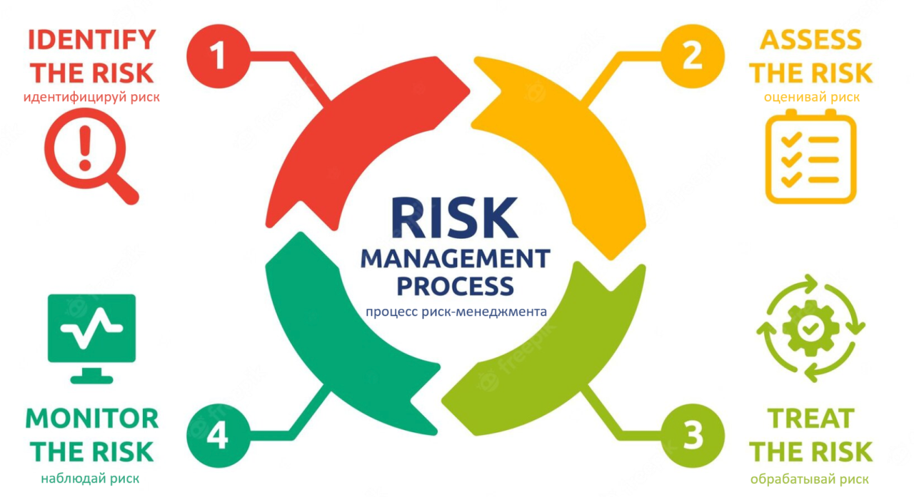

### Процесс управления рисками ИБ на примере подхода, предложенного в стандарте ИБ ISO 31000:2018

Если вы хотите подробнее изучить мировой опыт управления рисками ИБ, рекомендую ознакомиться с [NIST Special Publication 800-37 Risk Management Framework for Information Systems and Organizations](https://csrc.nist.gov/Projects/risk-management) — эта информация даст больше понимания, как еще можно управлять рисками

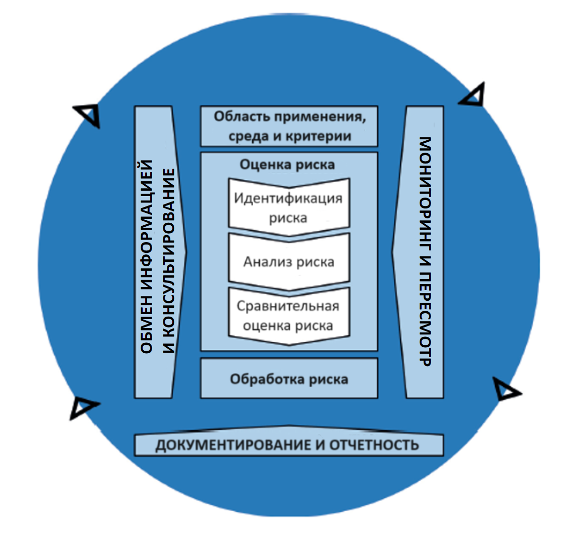 

процесс управления рисками ИБ рассматривается уже подробнее и состоит из следующих элементов:

1. Обмен информацией и консультирование.
1. Установление области применения, контекста и риск-критериев.
1. Оценка рисков.
    1. Идентификация рисков;
    1. Анализ рисков;
    1. Оценивание рисков.
1. Обработка рисков.
1. Мониторинг и пересмотр рисков.
1. Документирование и отчетность.

### 1. Идентификация рисков ИБ

> это поиск, выявление и описание рисков, которые могут помочь или помешать организации в достижении ее целей.

Для идентификации рисков важно использовать надлежащую, соответствующую и актуальную информацию.

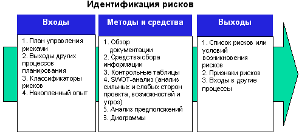

Организация может использовать методы для идентификации неопределенностей, которые в перспективе влияют на достижение одной или нескольких бизнес-целей

следует учитывать:

- материальные и нематериальные источники риска;
- причины и события;
- угрозы и возможности;
- уязвимости и способности нарушителя;
- изменения внешнего и внутреннего контекста;
- индикаторы возникающих рисков;
- характер и стоимость активов и ресурсов;
- последствия и их влияние на цели;
- ограниченность знаний и достоверности информации;
- факторы, связанные со временем;
- предубеждения, допущения и убеждения вовлеченных лиц.

### 2. Анализ рисков ИБ

> это подробное рассмотрение неопределенностей, источников риска, последствий, вероятности, событий, сценариев, средств контроля и их эффективности.

При помощи информации, собранной на этапе Идентификации рисков
- определяется характер риска и его особенности
- определяется уровень риска.

проводить анализ риска следует, опираясь на цели, а также беря во внимание доступность и достоверность информации и ресурсы команды

Анализ риска следует проводить с учетом:
- вероятности событий и последствий;
- характера и масштаба последствий;
- сложности и связности компонентов;
- факторов, связанных со временем, и их волатильностью;
- эффективности существующих средств контроля;
- чувствительности и достоверности.

Методы анализа
- качественными
- количественными

Хорошая практика — выполнять полный цикл оценки рисков раз в год

#### Колличественный анализ рисков

главная практическая польза оценки рисков заключается в предоставлении основы для принятия управленческих решений

При грамотном выполнение предоставляет более точный анализ

На практике количественный подход к анализу рисков ИБ может быть затруднительным
- требуется детальная информация о стоимости ущерба
- большой объем статистических данных
- нужен большой человеческий ресурс

#### Качественный анализ рисков

может реализовываться при помощи шкалы «низкий», «средний», «высокий» или при помощи балльной системы от 1 до 10

Таблица качественного анализа рисков 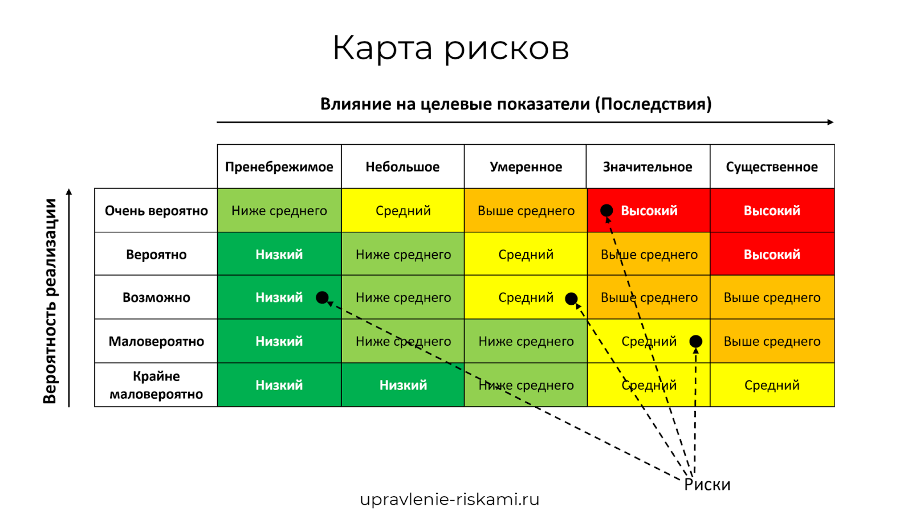

### 3. Оценка рисков ИБ

> этап, на котором происходит сравнение результатов анализа риска с установленными критериями принятия риска для определения необходимости дальнейших действий.

Этот процесс может привести к следующим решениям:
- ничего не нужно предпринимать;
- необходимо воздействовать на риск.

#### Критерий принятия риска

устанавливается перед оценкой риска на этапе определения области применения, контекста и риск-критериев

На основе критериев принятия руководство компании фиксирует, с какими рисками оно не готово мириться и какие риски далее нужно обрабатывать.

Пример:

| Уровень риска   | Мера обработки риска    |
|--------------- | --------------- |
| 0-50   | Принятие   |
| 51-70   | Принятие или снижение уровня риска (решение принимается комитетом по рискам ИТ)   |
| 71-100   | Снижение уровня риска   |

### 4. Меры обработки рисков

Воздействие на риск может осуществляться по-разному:
- принять риск;
- избежать риска — не начинать или не продолжать деятельность, которая порождает риск;
- устранить источник риска;
- изменить вероятность появления рискового события;
- изменить тяжесть последствий;
- передать риск другой стороне (часто — с помощью страхования).

Процесс планирования реагирования на риски 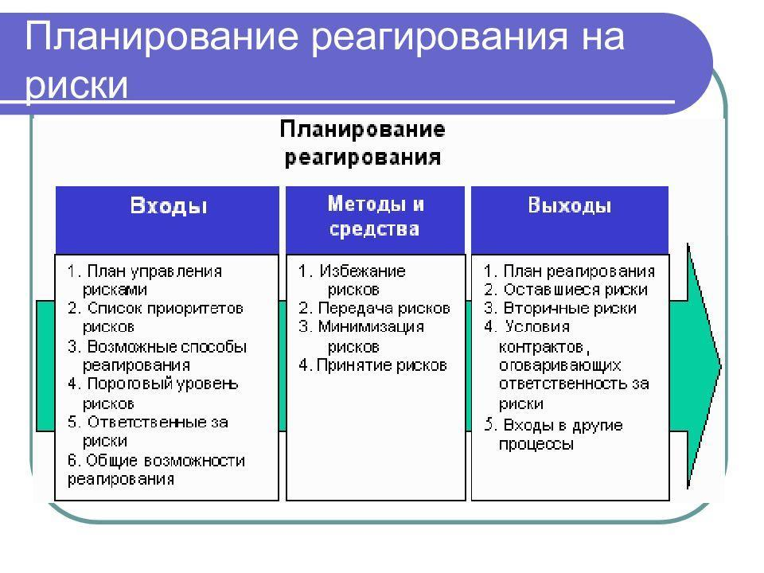

При выборе наиболее подходящего варианта воздействия на риск (одного или нескольких) необходимо учитывать
- ущерб, потенциально наносимый компании при реализации риска
- стоимость конкретной меры обработки риска.
- обязательства организации
- мнения заинтересованных сторон
- цели организации
- доступные ресурсы
- внешний и внутренний контекст.

## Как убедить бизнес в эффективности риск-ориентированного подхода

Оценка рисков основывается на множестве данных и на методике оценки рисков. Правильно выбирая данные и методики, вы сможете подчеркнуть те риски, которые будут выгодны вам для того, чтобы можно было продемонстрировать их руководству.

Зафиксируем, какие действия можно предпринять, чтобы руководство считалось с аргументами специалистов ИБ:
- интегрировать принципы ИБ в бизнес-процессы;
- сделать ИБ частью всех бизнес-процессов, чтобы обеспечить их бесперебойную работу;
- говорить на одном языке с бизнесом — ориентироваться в процессах, структуре и стратегии его развития, не презентовать сложные технические описания при общении с руководством;
- учитывать максимальные показатели потерь от возможных событий при формировании предложений.

Постулат «говорить на одном с бизнесом языке» мы обозначили еще там, и он будет проходить красной нитью через всю дисциплину.

# 4. Методы управления рисками. Цикл PDCA

> **Цикл PDCA**
>
> это системный подход, предназначенный для улучшения процессов и достижения лучших результатов с течением времени. Он расшифровывается как «Plan-Do-Check-Act» и применяется к любым процессам, длящимся во времени и что-либо производящим (продукт) или предоставляющим (услугу).

Цикл PDCA 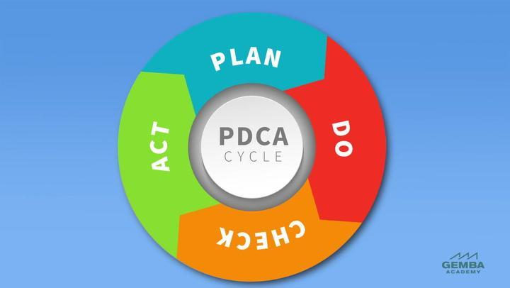

Цикл PDCA включает в себя 4 этапа:
1. Plan — планирование;
1. Do — выполнение;
1. Check — проверка;
1. Act — действие.

Циклы выполняются линейно (каждый этап следует четко за предыдущим и никак иначе), при этом завершение одного цикла означает начало следующего.

## Этапы PDCA:

### Этап 1. Plan — планирование

- определить целеи и процессы для их достижения
- выбрать способы оценки выполнения целей
- запланировать работы, чтобы этих целей достичь
- выделить на это необходимые ресурсы

**Цель**: максимально четко определить текущее и желаемое состояния процесса или системы управления, чтобы было понятно, что есть сейчас и к чему в итоге нужно прийти.

### Этап 2. Do — выполнение

*Примечание: больше этап тестирования*

происходит выполнение запланированных работ строго по плану действий.

**Цель**: выполнить намеченный план работ без отступлений от него (по возможности) с попаданием в целевые показатели эффективности (по желанию). Для этого необходимо собрать данные и информацию, которые будут использоваться в следующих этапах процесса.

- Когда вы получите план действий или потенциальное решение проблемы, следует <ins>протестировать их — проверить предложенные изменения на реальной задаче</ins>
- Этап выполнения следует проводить на небольшом отрезке процесса в условиях, которые вы строго контролируете
- внешние факторы не должны мешать вам прервать процесс в любой момент
- он не должен нарушать другие процессы и влиять на деятельность организации в целом

### Этап 3. Check — проверка

происходит проверка информации и контроль результатов работ, выполненных ранее.

Результаты оцениваются следующими методами:
- сравниваются с ключевыми показателями эффективности (КПЭ, или KPI), установленными на этапе планирования;
- выявляются и анализируются отклонения от заданных целевых значений;
- устанавливаются причины отклонений.

**Цель**: оценить результат и понять, получилось ли реализовать все так, как планировалось. И даже если в целом все было в пределах нормы, все равно важно найти что-то, что можно улучшить, чтобы повысить эффективность процессов и перераспределить ресурсы.

происходит:
- анализ данных, которые были собраны во время выполнения тестирования
- их сравнение с изначально поставленными целями

По завершению:
- специалист оценивает результаты и эффект предложенных изменений или решений
- необходимо принять решение о дальнейших действиях
    - провести новый тест, повторяя этапы выполнения и проверки, чтобы найти более удовлетворительное решение для перехода к этапу действия
    - перейти на следующий этап

оценка успехов и принятие соответствующих мер на основе анализа данных помогут определить дальнейшие шаги и обеспечить эффективность всего цикла.

### Этап 4. Act — действие

происходит принятие мер по устранению причин отклонений от запланированного результата, а также изменяется планирование и перераспределяются ресурсы на следующий цикл работ.

**Цель**: улучшить план работ с учетом полученного опыта: применить новые наработки, сделать процесс стабильным и еще сильнее улучшить систему управления.

Когда цикл завершен, всеми наблюдающими должны быть определены изменения, которые нужно внедрить в процесс в следующий раз

## Как использовать PDCA в управлении ИБ

Цикл PDCA лежит в основе построения СУИБ по стандарту ISO/IEC 27001

1. **Plan**
    - чего вы хотите достичь при помощи СУИБ
    - какими ресурсами, процессами ИБ и как вы измерите, достигли ли вы того, чего хотели
    - разработаете ключевые показатели эффективности для процессов ИБ
1. **Do** выполняете намеченные шаги:
    - внедряете контроли ИБ
	- выполняете проекты по ИБ
	- внедряете средства защиты информации
	- пишете политики по ИБ
	- развиваете культуру и осведомленность в области ИБ внутри организации
1. **Check**
    -  проверяете, добились ли своих целей
    - собираете информацию о выполнении проектов по ИБ, функционировании систем и процессов ИБ
    - оцениваете эффективность их работы
    - По результатам
        - понимаете какие процессы ИБ не дотянули до целевых уровней показателей эффективности их работы
        - ищете причину и анализируете ее.
1. **Act** работаете с причинами отклонений показателей эффективности процессов ИБ от целевых значений:
    - воздействуете на эти причины
        - устраняете уязвимости в инфраструктуре или меняете целые подходы и процессы управления ИБ

Цикл PDCA обеспечивает организациям основу (и даже в какой-то степени фреймворк) для постоянного усиления своей информационной безопасности.

## Другие подходы к улучшению процессов

Есть и другие подходы к улучшению процессов, откуда вы можете почерпнуть полезные элементы:
- DMAIC (Define — Measure — Analyse — Improve — Control);
- IDEAL (Initiating — Diagnosing — Establishing — Acting — Learning);
- ТРИЗ (теория решения изобретательских задач);
- TBBDI (Team Based Business Design Improvement);
- EBBDI (Enterprise Based Business Design Improvement);
- философия Кайдзен (бережливое производство) и др.

### Метод управления DMAIC

[https://www.dmaic.com/](https://www.dmaic.com/)

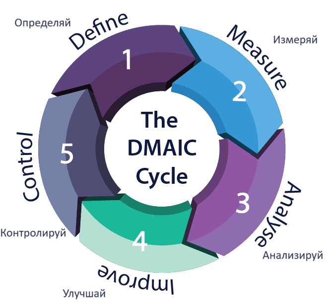

### Метод управления IDEAL

[https://www.plays-in-business.com/](https://www.plays-in-business.com/)

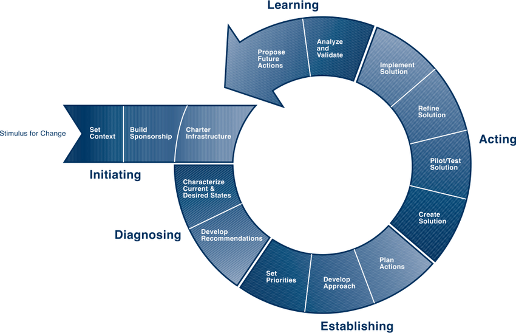

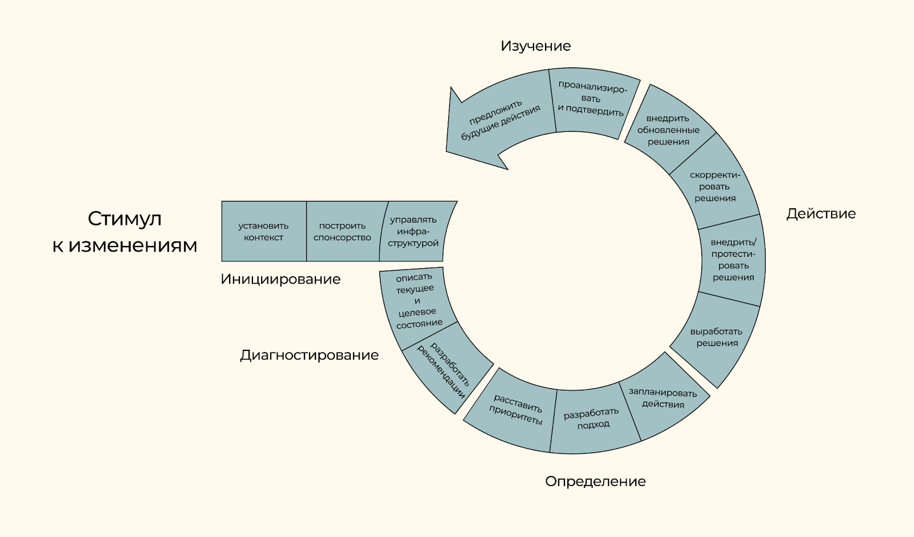

### Задачи метода управления Кайдзен (бережливое производство)

[https://habr.com/ru/articles/297004/](https://habr.com/ru/articles/297004/)

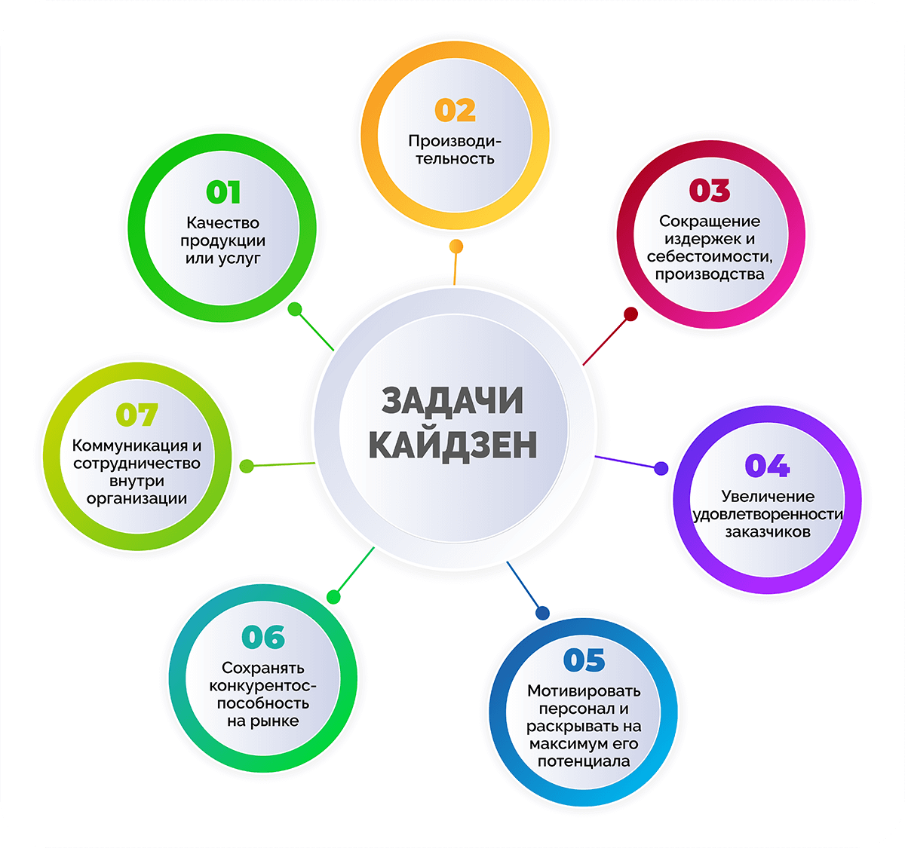

## Как сочетать ISO 27000 (СУИБ) и фреймворк архитектуры безопасности

Серия стандартов ISO 27000 и архитектура безопасности предприятия только дополняют друг друга, так как являются инструментами для внедрения ИБ с различными уровнями абстракции.

СУИБ
- описывает меры контроля, которые необходимо внедрить
    - управление рисками
    - управление уязвимостями
    - планирование непрерывности бизнеса
    - защита данных
    - аудит
    - управление конфигурацией
    - физическая безопасность
- дает указания о том, как следует управлять этими средствами контроля на протяжении всего срока их службы

Цикл СУИБ определяет элементы, которые необходимо внедрить для обеспечения целостной программы безопасности для организации в целом, а также способы правильного надзора (мониторинга эффективности) за этими элементами.

Компоненты СУИБ должны быть интегрированы во всю бизнес-среду, а не разрознены по отдельным подразделениям компании.

Серия стандартов ISO/IEC 27000 ориентирована на политику безопасности и описывает необходимые компоненты программы безопасности. Это означает, что стандарты ISO носят общий характер.

|     | СУИБ    | Архитектура безопасности предприятия    |
|---------------- | --------------- | --------------- |
| Что делает    | 1. Описывает элементы управления, которые необходимо внедрить. 2. Дает указания о том, как эксплуатировать эти элементы управления на протяжении их жизненного цикла. 3. Определяет, как обеспечить целостную программу безопасности для организации в целом.    | Показывает, как элементы управления СУИБ должны быть интегрированы в различные уровни бизнес-среды.    |
| Степень подробности указаний    | Указания носят общий характер — они были созданы для применения к различным типам предприятий, а не к одному конкретному.    | Имеет четкие стандарты безопасности для разных уровней конкретной организации.    |
| Как работает с рисками   | СУИБ будет диктовать необходимость внедрения процесса управления рисками.   | Архитектура предприятия разделит компоненты управления рисками и продемонстрирует, как управление рисками должно осуществляться на стратегическом, тактическом и операционном уровнях.   |
| Как работает с защитой информации   | СУИБ может диктовать необходимость и степень обеспечения защиты конкретных данных.   | Архитектура может показать, как защита происходит на уровне инфраструктуры, приложений, компонентов и бизнеса.   |

