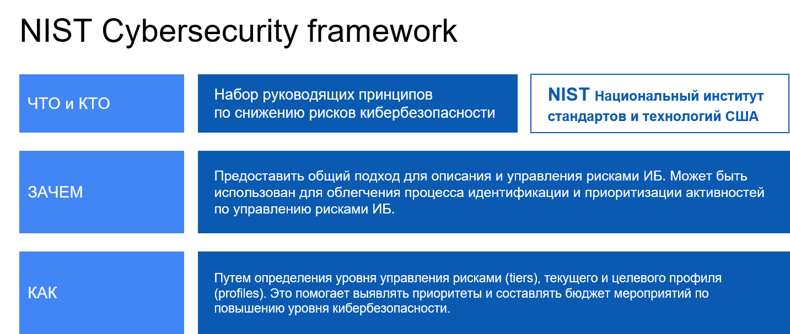
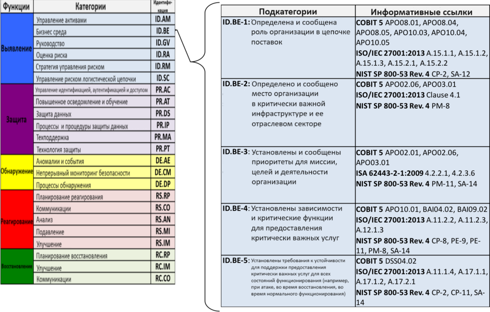

# 1. Фреймворки контролей ИТ/ИБ

## COBIT 5

> **The Control Objectives for Information and related Technology COBIT**
>
> это методология управления информационными технологиями. Пять — номер версии.

Данное руководство было создано совместно ISACA (Information Systems Audit and Control Association) и Института управления ИТ.

> **ISACA**
>
> международная профессиональная ассоциация, которая занимается разработкой стандартов в области управления ИТ и аудита информационных систем, которые традиционно уважаются в мировом сообществе

Также ассоциация организует различные сертификации, которые признаются как доказательство профессиональных компетенций:
- CISA (Certified Information Systems Auditor);
- CISM (Certified Information Security Manager);
- CGEIT (Certified in the Governance of Enterprise IT);
- CRISC (Certified in Risk and Information Systems Control).

### Задачи и особенности COBIT

**Задача COBIT** — ликвидировать разрыв между руководством компании и техническими специалистами.

COBIT предлагает единый язык и терминологию, которые могут служить своеобразной платформой для конструктивного диалога между всеми участниками бизнеса: от топ-менеджеров и руководителей среднего звена до непосредственных исполнителей и аудиторов.

COBIT помогает организациям оптимизировать свои ИТ-технологии уравновешивая использование ресурсов, уровни риска и реализовывая преимущества.

Все это делается путем поиска компромисса между:
- потребностями заинтересованных сторон;
- целями организации (удовлетворением этих потребностей);
- целями ИТ (достижением или поддержкой целей организации).

### 5 принципов COBIT

1. Удовлетворение потребностей заинтересованных сторон.
1. Принятие во внимание предприятия от начала до конца.
1. Применение единого интегрированного фреймворка.
1. Обеспечение целостного подхода.
1. Разделение руководства и управления.

#### Принцип 1. Удовлетворение потребностей заинтересованных сторон

Целью существования предприятий является создание ценности для всех заинтересованных сторон путем балансирования выгод и рисков, а также оптимизации ресурсов.

COBIT 5 описывает все необходимые процессы и факторы, которые способствуют созданию бизнес-ценности с применением информационных технологий.

Для адаптакции к специфике разных индустрий и направлений бизнеса COBIT использует **каскадирование общих стратегических целей** предприятия до уровня управляемых и специфических целей в области информационных технологий.

#### Принцип 2. Комплексный взгляд на предприятие

интегрирует управление информационными технологиями в общую систему управления предприятием:
- охватывает все функции и процессы предприятия;
- опирается на внутренние и внешние аспекты и роли.

Данный подход позволяет предприятию рассматривать информационные технологии не как изолированную функцию, а как критическую составляющую всей организации.

#### Принцип 3. Применение единого интегрированного фреймворка

COBIT интегрирует множество связанных с ИТ сводов знаний и стандартов, чтобы обеспечить соответствие высоким требованиям безопасности:

1. **Стандарт ISO/IEC 27001** стандарт управления информационной безопасностью в организациях. COBIT 5 обеспечивает соотнесение с этим стандартом, что позволяет предприятию использовать методы, процессы и контроли для обеспечения безопасности информации в соответствии с ним.
1. **Стандарт Payment Card Industry Data Security Standard (PCI DSS)** стандарт, который устанавливает требования безопасности для организаций, принимающих платежные карты.
1. **Своды знаний NIST (National Institute of Standards and Technology)** COBIT 5 включает соответствие сводам знаний <ins>NIST: NIST SP 800-53</ins> и NIS<ins>T Cybersecurity Framework</ins>. Эти своды знаний предоставляют рекомендации для обеспечения безопасности от киберугроз.
1. **Правила GDPR (General Data Protection Regulation)** правила, которые представляют собой набор требований и стандартов, регулирующих защиту персональных данных граждан Европейского союза.

#### Принцип 4. Обеспечение целостности подхода

подчеркивает необходимость обеспечения целостного подхода к руководству и управлению информационными технологиями на предприятии.

предлагает набор факторов влияния, которые помогают организации успешно внедрить систему управления ИТ и достичь стратегических целей.

> **Факторы влияния в контексте управления ИТ**
>
> это сущности, которые могут оказывать положительное или отрицательное влияние на решение задач и достижение целей предприятия.

Определение и учет этих факторов помогает организации принимать информированные решения и преодолевать возможные препятствия.

##### 7 факторов влияния:

1. Принципы, политики и подходы.
1. Процессы.
1. Организационная структура.
1. Культура, этика и поведение.
1. Информация.
1. Услуги, инфраструктура и приложения.
1. Персонал, навыки и компетенции.

#### Принцип 5. Разделение руководства и управления

включает в себя руководство и управление организацией, но различает их. 
- руководство представляет собой набор процессов более высокого уровня, направленных на комплексную оценку потребностей заинтересованных сторон и того, что им можно предложить.
- управление — это набор действий, направленных на достижение целей предприятия.

##### Руководство

обеспечивает уверенность в достижении целей предприятия путем
- **Сбалансированной оценки**
    - производит систематическую и всестороннюю оценку потребностей заинтересованных сторон, анализирует текущие условия и рассматривает возможные варианты
    - это позволяет получить полное представление о стоящих перед предприятием задачах и определить наиболее эффективные стратегии для их решения.
- **Установления направления развития**
    - определяет приоритетные направления развития предприятия путем анализа и оценки всех факторов, включая возможности и риски
    - принятие решений основывается на балансе между краткосрочными и долгосрочными целями, а также учетом интересов заинтересованных сторон.
- **Мониторинга выполнения**
    - отслеживает соответствие фактической производительности предприятия и степени выполнения установленных направления и целей
        - постоянное измерение и оценку достижения конкретных показателей производительности
        - анализ причин отклонений
        - принятие корректирующих мер, если это оказывается необходимым

##### Управление

1. планирование;
1. организацию;
1. выполнение;
1. контроль деятельности.

### Каскад целей в COBIT

> Все в COBIT в конечном счете связано с заинтересованными сторонами через ряд преобразований, которые называются **каскадом целей**

На любом этапе наших процессов управления ИТ/ИБ мы должны иметь возможность задать вопрос «зачем мы это делаем?». Причем ответ должен привести к цели ИТ/ИБ, связанной с целью предприятия, которая, в свою очередь, связана с потребностями заинтересованных сторон.

Цепочка вопросов может выглядеть следующим образом:

COBIT выделяет
- 17 корпоративных
- 17 связанных с ИТ целей контроля

Ниже приведены схемы стандартизации
- целей бизнеса и ИТ
- разбор процессов ИТ
- взаимосвязь бизнес-целей компании с ИТ-процессами внутри нее.

#### Стандартизация целей бизнеса, целей ИТ, процессов ИТ и практик ИТ по COBIT

#### Процессы ИТ по COBIT

#### Пример взаимосвязи бизнес-целей с ИТ-процессами по COBIT

 

### Выявление целей ИТ/ИБ по COBIT

В современном мире аудит основан на какой-либо методике. Большая часть аудитов основана как раз на COBIT.

Такая оценка позволит:
- определить процессы, которые необходимо усовершенствовать;
- выбрать действия, которые позволят достичь целевых результатов;
- сконструировать метрики, которые просигнализируют о достижении цели.

#### алгоритм

1. Корпоративные цели, определенные в организации, привести к 17 типовым бизнес-целям, определенным в COBIT.
1. Используя матрицу соответствия, конвертировать 17 типовых бизнес-целей в 17 типовых ИТ-целей.
1. Опционально: установить дополнительный уровень соответствия на цели и процессы ИБ (которые должны быть предварительно разработаны).
1. Для достижения 17 типовых ИТ-целей (ИБ-целей, если был выполнен п. 3) использовать 37 типовых ИТ-процесса, описанных в COBIT.
1. Оценить уровень зрелости процессов по определенным в COBIT критериям.

#### Пример организации ИТ-процессов по COBIT

#### Что COBIT помогает делать с процессами ИТ?

1. Систематизировать.
1. Оценивать на эффективность, результативность и зрелость.
1. Аудировать на соответствие требованиям.
1. Проверять на выполнение целей контроля.

## COSO Internal Control — Integrated Framework

> **The committee of sponsoring organizations of the treadway commission**
>
> это инициатива, созданная в 1985 году при поддержке Комиссии Тредвея и известная как Комитет организаций-спонсоров Комиссии Тредвея.

**Цель COSO** — помощь предприятиям и организациям в оценке и улучшении систем внутреннего контроля.

Один из ключевых документов, выпущенных COSO, называется «Концептуальные основы внутреннего контроля».

У COSO тоже есть свой фреймворк про управление рисками: **Enterprise Risk Management — Integrated Framework**

Если вы хотите подробнее узнать про подходы COSO к управлению рисками, вы можете самостоятельно изучить их на сайте [https://www.coso.org/guidance-erm](https://www.coso.org/guidance-erm).

### Internal Control — Integrated Framework

> интегрированная система внутреннего контроля

Целью данной системы является:
- предоставление помощи руководству для лучшего контроля организации;
- предоставление совету директоров дополнительных возможностей для надзора за внутренним контролем.

> **Внутренний контроль**
>
> процесс, осуществляемый советом директоров, руководством и другим персоналом организации с целью обеспечения разумной уверенности в достижении целей компании.

Такими целями могут быть:
- эффективность и продуктивность операций;
- надежность финансовой отчетности;
- соблюдение законов и правил.

Процесс внутреннего контроля включает в себя
- установление и поддержание
    - системы политик
    - процедур
    - практик  которые помогают предотвращать ошибки, мошенничество, потери и другие негативные последствия
- обеспечивают надлежащий учет и контроль важных процессов и ресурсов компании.

Важно учитывать несколько важных деталей об этом процессе.
1. Внутренний контроль является процессом, направленным на достижение целей в различных, но взаимосвязанных категориях.
1. Внутренний контроль является средством для достижения целей, это не самоцель.
1. Процесс осуществляется людьми, и мы говорим не только о политиках, процедурах, системах и формах, но и о людях и их действиях на всех уровнях организации для обеспечения внутреннего контроля.
1. Внутренний контроль предоставляет разумную (reasonable), а не абсолютную уверенность высшему руководству и совету директоров организации. Он не может исключить все риски и негативные последствия, но стремится обеспечить разумную степень уверенности в достижении целей компании.
1. Внутренний контроль способен адаптироваться к структуре организации и проявлять гибкость в применении ко всему объекту. Он должен быть готов приспосабливаться к изменениям внутри и вне организации, чтобы соответствовать текущим требованиям и обеспечивать эффективное функционирование внутреннего контроля.

#### Пять компонентов COSO Internal Control — Integrated Framework

Согласно системе COSO, поддержку организации на ее пути по достижению целей оказывают пять компонентов внутреннего контроля:
1. контрольная среда;
1. оценка и управление риском;
1. мероприятия контроля;
1. сбор и анализ информации, а также передачу ее по назначению;
1. мониторинг и исправление ошибок.

### Взаимосвязь целей, компонентов и сущности в COSO

Существует прямая связь между целями, которые организация стремится достичь, конкретными действиями, необходимыми для их реализации, и структурой предприятия

- На верхней грани куба расположены три категории целей
- Горизонтальные ряды представляют собой пять компонентов (конкретики в оригинале не дается)
- Вертикальные ряды отражают подразделения организации (дочерние компании, операционные подразделения или функции, включая бизнес-процессы — продажи, закупки, производство и маркетинг, к которым относится внутренний контроль).

### 17 принципов COSO Internal Control — Integrated Framework

- изложены 17 принципов, представляющих фундаментальные концепции
- 5 компонентов

#### компоненты внутреннего контроля

##### 1. Принципы контрольной среды

включает в себя <ins>набор стандартов, процессов и структур</ins>, которые являются основой для реализации системы внутреннего контроля внутри организации

Тон и значимость контролей задаются советом директоров и высшим руководством организации

- Организация демонстрирует приверженность честности и этическим ценностям.
- Совет директоров демонстрирует независимость от менеджмента и осуществляет надзор за развитием и функционированием системы внутреннего контроля.
- Под надзором совета директоров руководство устанавливает структуры, порядок подотчетности и соответствующие полномочия и ответственность для достижения целей.
- Организация демонстрирует стремление привлекать, развивать и удерживать компетентных специалистов в соответствии с целями.
- Организация возлагает на отдельных лиц ответственность за выполнение ими своих обязанностей по внутреннему контролю при достижении целей.

##### 2. Принципы оценки риска

представляет собой постоянный и динамичный процесс, основанный на выявлении и анализе потенциальных рисков с целью достижения организацией своих целей

служит основой для определения эффективных стратегий управления рисками

Топ-управление организации
-  рассматривает как внутреннюю среду компании, так и внешние факторы, которые могут представлять потенциальные угрозы для достижения поставленных целей
- активно ищут изменения во внешней среде и анализируют внутреннюю бизнес-модель, чтобы выявить возможные факторы, которые могут помешать достижению поставленных целей

На основе этой оценки рисков разрабатываются планы управления рисками

- Организация определяет цели с достаточной ясностью, чтобы обеспечить идентификацию и оценку рисков, связанных с целями.
- Организация идентифицирует риски для достижения своих целей в рамках всего предприятия и анализирует риски как основу для определения того, как этими рисками следует управлять.
- Организация учитывает возможность мошенничества при оценке рисков для достижения целей.
- Организация выявляет и оценивает изменения, которые могут существенно повлиять на систему внутреннего контроля.

##### 3. Принципы мероприятий контроля

> **Мероприятия контроля**
>
> это действия, установленные политиками и процедурами, которые помогают гарантировать выполнение указаний руководства по снижению рисков для достижения целей.

Контрольные мероприятия осуществляются на всех уровнях организации и на различных стадиях бизнес-процессов, а также в технологической среде.

- Организация выбирает и разрабатывает контрольные мероприятия, способствующие снижению рисков достижения целей до приемлемого уровня.
- Организация выбирает и разрабатывает общие мероприятия по контролю над технологиями для поддержки достижения целей.
- Организация осуществляет контрольную деятельность посредством политик, определяющих ожидаемые результаты, и процедур, которые приводят политику в действие.

##### 4. Принципы сбора и анализа информации

обеспечение открытой коммуникации, которая даст сотрудникам полное представление о своих обязанностях по внутреннему контролю и их значимости для достижения общих целей.

- Организация получает или генерирует и использует соответствующую качественную информацию для поддержки функционирования других компонентов внутреннего контроля.
- Организация внутренне передает информацию, включая цели и обязанности внутреннего контроля, необходимую для поддержки функционирования других компонентов внутреннего контроля.
- Организация общается с внешними сторонами по вопросам, влияющим на функционирование других компонентов внутреннего контроля.

##### 5. Принципы мониторинга и исправления ошибок

применяются различные методы оценки и их комбинации.

Их цель — убедиться в наличии и правильном функционировании каждого из пяти компонентов внутреннего контроля, а также проверить наличие соответствующих средств контроля, необходимых для реализации принципов в каждом компоненте.

Полученные результаты оценки подвергаются анализу, и в случае выявления недостатков они сообщаются вовремя, чтобы принять необходимые меры для их устранения

- Организация выбирает, разрабатывает и проводит текущие и/или отдельные оценки, чтобы убедиться в наличии и функционировании компонентов внутреннего контроля.
- Организация оценивает и своевременно сообщает о недостатках внутреннего контроля сторонам, ответственным за принятие корректирующих мер, включая высшее руководство и совет директоров, в зависимости от обстоятельств.

### Реализация COSO Internal Control — Integrated Framework

внедрение COSO-модели не лишено ограничений. Наиболее существенным из этих ограничений является то, что данную структуру может быть сложно внедрить.

Причин — две:

- во-первых, эта концепция относительно широка по своему охвату, а значит, ее можно применять к широкому кругу организаций и процессов. Однако такая широкая сфера применения также означает, что в системе отсутствует значительное количество предписывающих конкретных указаний.
- во-вторых, ограничение обусловлено особенностями организационной структуры фреймворка.

# 2. Фреймворк кибербезопасности NIST Cybersecurity Framework

Если вы хотите поближе познакомиться со стандартами NIST в области информационной безопасности, обязательно изучите следующие на официальном сайте NIST[https://www.nist.gov/](https://www.nist.gov/):
- NIST Special Publication 800-53 Security and Privacy Controls for Federal Information Systems and Organizations;
- NIST Special Publication 800-82 Guide to Industrial Control Systems (ICS) Security;
- NIST Special Publication 800-37 Risk Management Framework for Information Systems and Organizations.

Также можно посмотреть список тут [https://www.securityvision.ru/blog/kratkiy-obzor-spetsialnykh-publikatsiy-nist-po-informatsionnoy-bezopasnosti-chast-1/](https://www.securityvision.ru/blog/kratkiy-obzor-spetsialnykh-publikatsiy-nist-po-informatsionnoy-bezopasnosti-chast-1/).

> **NIST Cybersecurity framework**
>
> это набор руководящих принципов по снижению рисков кибербезопасности организаций, опубликованный Национальным институтом стандартов и технологий США (NIST).

Вы можете скачать NIST Cybersecurity framework на официальном [сайте NIST](https://www.nist.gov/cyberframework/framework). На момент января 2024 актуальна версия v.1.1, состоящая из:
- framework (документ pdf);
- core (документ Excel с защитными мерами).

Зачем может понадобиться NIST Cybersecurity framework?
1. Он поможет организации спланировать, запустить или улучшить существующую программу кибербезопасности.
1. Этот фреймворк, созданный на основе зарекомендовавших себя эффективных практик, поможет организациям повысить зрелость в области кибербезопасности.
1. Он поспособствует налаживанию коммуникаций между внутренними и внешними заинтересованными сторонами по вопросам кибербезопасности.
1. Он поможет интегрировать и согласовать управление рисками кибербезопасности с более широкими процессами управления рисками всего предприятия.

## Структура NIST Cybersecurity framework

состоит из трех основных компонентов:
1. ядра (core);
1. уровней реализации (tiers);
1. профилей (profiles).

### 1. Ядро NIST Cybersecurity framework

> предоставляет набор желаемых действий и результатов в области кибербезопасности, используя общий язык, который легко понять всем функциям организации.

Ядро состоит из трех частей:
1. функции (function);
1. категории (category);
1. подкатегории (subcategory).

#### 1. Функции

Ядро включает в себя пять функций высокого уровня:
1. выявление (identify);
1. защита (protect);
1. обнаружение (detect);
1. реагирование (respond);
1. восстановление (recover).

#### 2. Категории

**23 категории**, которые разделены на пять функций. Категории были разработаны, чтобы охватить весь спектр целей кибербезопасности организации, но при этом не были слишком подробными и уделять особое внимание целям бизнеса.

#### 3. Подкатегории

Существует **108 подкатегорий**, которые представляют собой требования по созданию и совершенствованию программы кибербезопасности.

Поскольку фреймворк не предписывает, как организация должна достигать результатов, он позволяет реализовать выдвигаемые требования согласно результатам оценки рисков и потребностям организации.

Столбец Reference («Информативные ссылки») детализирует ядро, предоставляя ссылки на уже известные вам стандарты COBIT, ISO 27001, а также другие важные стандарты в области ИБ, в которых можно найти более подробные и технические рекомендации по внедрению тех или иных контролей.

### 2. Уровни реализации (tiers) NIST Cybersecurity framework

> предоставляют контекст, в котором организация рассматривает управление рисками кибербезопасности. Tiers помогают организациям учитывать соответствующий уровень строгости своей программы кибербезопасности и часто используются в качестве инструмента коммуникации для обсуждения склонности к риску, приоритетов миссии и бюджета.

описывают степень, в которой существующие методы управления рисками кибербезопасности организации соответствуют характеристикам, определенным во фреймворке.

Уровень может быть:
- частичным (partial);
- информированным (risk informed);
- информированным о рисках и повторяющимся (repeatable);
- адаптивным (adaptive).

Каждый уровень детализирован во фреймворке и описывает:
- возрастающую степень требований к процессу риск-менеджмента кибербезопасности;
- насколько хорошо процесс риск-менеджмента кибербезопасности интегрирован в более широкие процессы управления рисками;
- степень, в которой организация делится и получает информацию о кибербезопасности от внешних сторон.

Организациям следует определить желаемый уровень, учитывая, что выбранный уровень:
- соответствует целям компании;
- снижает риск кибербезопасности до уровней, приемлемых для организации;
- это уровень можно внедрить с финансовой, так и с других точек зрения.

### 3. Профили фреймворка (profiles) NIST Cybersecurity framework

> это сопоставление текущего состояния организации, ее требований и целей, склонности к риску и ресурсов с желаемыми результатами ядра структуры.

Профили в основном используются для выявления и определения приоритетности мероприятий по улучшению кибербезопасности в организации. Это происходит путем сравнения «текущего» профиля с «целевым».

предназначены для оптимизации структуры кибербезопасности для наилучшего обслуживания организации.

Одним из распространенных способов использования профилей является сопоставление организацией
- своих требований к кибербезопасности
- целей и миссии кибербезопасности с подкатегориями ядра структуры для создания профиля целевого состояния.

**Текущее состояние**

- текущие практики и операционные процессы обеспечения кибербезопасности
- vs
- подкатегории ядра структуры (subcategories of framework’s core)

**Целевое состояние**

- требования к кибербезопасности, цели и миссия кибербезопасности
- vs
- подкатегории ядра структуры (subcategories of framework’s core)

Создание этих профилей и анализ пробелов (gap-анализ) позволяют организациям составить приоритетный план внедрения.

Приоритет, размер пробелов (gaps) и предполагаемая стоимость корректирующих действий помогают организациям планировать и составлять бюджет мероприятий по улучшению кибербезопасности.

### Обобщение NIST Cybersecurity Framework

помогает построить программу управления информационной безопасностью для любой организации.

Фреймворк состоит из трех компонентов: ядро (core), уровни реализации (tiers), профили (profiles).
- Ядро помогает нам определить требования наше программы кибербезопасности и ничего не забыть.
- Уровни реализации помогают правильно интегрировать риск-менеджмент для ИБ в общекорпоративный процесс управления рисками,
- Профили помогают определить путь развития и приоритетность выполнения задач на этом пути.

## Функции ядра NIST Cybersecurity framework

пять ключевым функциям:
1. выявление (identify);
1. защита (protect);
1. обнаружение (detect);
1. реагирование (respond);
1. восстановление (recover).

Во второй версии фреймворка модель будет выглядеть следующим образом

### 1. Identify (Выявляй)

**Цель:** развивать в организации понимание, как управлять рисками кибербезопасности систем, активов, данных.

1. **Определите критически важные процессы и активы предприятия.** Какие виды деятельности вашего предприятия обязательно необходимо продолжать, чтобы компания существовала?
1. **Определите потоки документированной информации**
    - знать, какой тип информации собирает и использует ваше предприятие
    - понимать, где находятся данные и как они используются, особенно там, где задействованы контракты и внешние партнеры.
1. **Проводите инвентаризацию аппаратного и программного обеспечения**
    - иметь представление о компьютерах и программном обеспечении на вашем предприятии
    - инвентаризация может быть простой и вестись в электронной таблице, а может собираться при помощи автоматизированных средств и сканеров.
1. **Определите и установите политики кибербезопасности, включающие роли и обязанности**
    - четко описывать ваши ожидания относительно того, как мероприятия по кибербезопасности защитят вашу информацию и системы и как они поддерживают критически важные корпоративные процессы
    - Политики кибербезопасности должны быть интегрированы с другими политиками по управлению корпоративными рисками
1. **Выявляйте угрозы, уязвимости и риски для ваших ценных активов**
    - Обеспечьте процесс риск-менеджмента, включающий в себя
        - выявление
        - оценку
        - документирование внутренних и внешних угроз в реестрах рисков
    - Убедитесь, что меры реагирования на риски
        - идентифицированы
        - расставлены по приоритетам
        - выполняются
        - результаты их применения отслеживаются

### 2. Protect (Защищай)

**Цель:** разработать и внедрить меры безопасности для обеспечения предоставления услуг.

1. **Управляйте доступом к активам и информации** Создавайте уникальные учетные записи для каждого сотрудника таким образом, чтобы пользователи имели доступ только к информации, которая необходима для их работы.
1. **Защищайте конфиденциальные данные**
    - убедитесь, что они защищены шифрованием как во время хранения на компьютерах, так и при передаче другим сторонам
    - использование контролей проверки целостности, чтобы гарантировать, что в данные были внесены только авторизованные изменения
    - Безопасно удаляйте и/или уничтожайте данные, когда они больше не нужны.
1. **Совершайте регулярное резервное копирование** Хорошей практикой является хранение одного резервного набора данных в автономном режиме, чтобы защитить его от программ-вымогателей.
1. **Защитите свои устройства**
    - установка межсетевых экранов на хосте (конечном устройстве) и других средств защиты, таких как продукты обеспечения безопасности конечных точек
    - Применяйте унифицированные конфигурации к устройствам и контролируйте изменения в конфигурациях устройств.
1. **Управляйте уязвимостями устройств**
    - Регулярно обновляйте операционную систему и приложения
    - включите автоматические обновления
    - использовать программных инструментов для сканирования устройств на наличие дополнительных уязвимостей
    - Устраняйте уязвимости с высокой вероятностью и/или воздействием.
1. **Обучайте пользователей** Регулярно обучайте и переобучайте всех пользователей, чтобы быть уверенными, что они осведомлены о политиках и процедурах кибербезопасности предприятия, а также об их конкретных ролях и обязанностях в области информационной безопасности.

### 3. Detect (Обнаруживай)

**Цель:** разработать и внедрить меры безопасности для выявления возникновения события кибербезопасности.

1. **Тестируйте и корректируйте процедуры обнаружения**
    - Разработайте и протестируйте процедуры для обнаружения несанкционированных объектов и действий в сетях и в физической среде, включая деятельность персонала
    - Сотрудники должны знать свою роль и ответственность за обнаружение нарушений и соответствующую отчетность как внутри вашей организации, так и перед внешними руководящими и юридическими органами.
1. **Ведите и мониторьте журналы событий**
    - в журналах регистрируются
        - изменения в системах или учетных записях
        - запуск несанкционированных каналов связи
    - использовать программных инструментов, которые могут объединять эти журналы и искать закономерности или аномалии в ожидаемом поведении сети.
1. **Знайте легитимные потоки данных для вашего предприятия**
    - Неожиданные потоки данных могут включать в себя экспорт информации о клиентах из внутренней базы данных и выход из сети
1. **Понимайте влияния событий кибербезопасности**
    - Если обнаружено событие кибербезопасности, вашему предприятию следует действовать быстро и точно, чтобы понять широту и глубину воздействия, а главное, ограничить ее
    - Передача информации о мероприятии соответствующим заинтересованным доверенным сторонам поможет вам сохранить хорошую репутацию с точки зрения партнеров, надзорных органов и других лиц (возможно, включая инвесторов), а также улучшить политику и процессы.

### 4. Respond (Реагируй)

**Цель:** разработать и внедрить меры безопасности для принятия мер в отношении обнаруженного события кибербезопасности.

1. **Обеспечьте проверку планов реагирования**:
    - протестировать планы реагирования
    - включает в себя знание любых юридических требований к отчетности или тестирование схемы обязательного обмена информацией.
1. **Обеспечьте обновление планов реагирования**
    - Тестирование плана и его выполнения во время инцидента неизбежно выявит необходимые улучшения.
1. **Координируйте свои действия с внутренними и внешними заинтересованными сторонами**
    - планы реагирования и обновления вашего предприятия включают всех ключевых заинтересованных сторон и внешних поставщиков услуг. Они могут способствовать улучшению процедур.

### 5. Recover (Восстанавливай)

**Цель:** разработать и внедрить меры безопасности для поддержания планов восстановления любых возможностей или услуг, которые были нарушены из-за события кибербезопасности.

1. **Общайтесь с внутренними и внешними заинтересованными сторонами**:
    - В планах восстановления необходимо учитывать, какая информация, как и когда будет передана различным заинтересованным сторонам
    - участники получали необходимую им информацию, но при этом не распространялась неуместная информация
    - разработать план коммуникаций для разных событий кибербезопасности.
1. **Обеспечьте обновление планов восстановления**:
    - Как и в случае с планами реагирования, проведение тестирования повысит осведомленность сотрудников и партнеров и выделит области для улучшения.
1. **Управляйте связями с общественностью и репутацией компании**:
    - управление репутацией предприятия
    - как вы будете управлять связями с общественностью, чтобы обмен информацией был точным, полным и своевременным, а не реакционным.

# 3. Фреймворки процессов ИТ/ИБ

рассмотрим три известных и широко применяемых инструмента в области управления проектами и процессами.

предназначены для улучшения качества, эффективности и производительности в организации и позволяют управлять рисками, оптимизировать процессы и повысить удовлетворенность клиентов

## ITIL

> **Information Technology Infrastructure Library**
>
> это библиотека инфраструктуры информационных технологий. Она представляет собой признанный по всему миру набор рекомендаций, предназначенных для эффективного управления информационно-технологической инфраструктурой организации и ее соответствия бизнес-стратегии.

В настоящее время ITIL находится под лицензией компании Axelos, совместного предприятия Кабинета министров Великобритании и Capita.

Цель ITIL состоит не в создании строгих правил и тяжеловесных процессов, а в предоставлении гибких рекомендаций

ITIL — это:
- библиотека книг;
- общепризнанный набор рекомендаций;
- движение, профессиональное сообщество и индустрия;
- сертификация в области управления ИТ-услугами;
- активность по популяризации, сертификации и применению проверенных практик, поддерживаемая правительством Великобритании;
- подход, нацеленный помочь организациям эффективно использовать ИТ путем достижения максимального согласования ИТ-услуг с бизнес-стратегией.

позволяет снижать затраты за счет оптимизации используемых ресурсов

Скачать текущую версию ITIL Foundation 4 Edition можно на официальном сайте [https://itil.press/#read](https://itil.press/#read)

### Преимущества ITIL

Внедряя ITIL, вы:
- достигнете лучшей согласованности между ИТ-отделами и бизнесом;
- сократите время на обслуживание и повысите удовлетворенность клиентов;
- снизите эксплуатационные расходы за счет более эффективного использования ресурсов — цифровых, физических и человеческих;
- улучшите видимость затрат и активов на ИТ;
- оптимизируете ответы и управление перерывами в обслуживании;
- внедрите гибкую сервисную среду, которая легче адаптируется к изменениям.

#### 1. Улучшенная согласованность

- предлагает фреймворк и набор процессов, которые помогут обеспечить более эффективное взаимодействие между ИТ-отделами и бизнесом.
- приведет к лучшему пониманию клиентских потребностей и предпочтений, а также к более четкому определению обязанностей и ответственностей каждого отдела.
- достичь большей согласованности в работе, улучшить коммуникацию и повысить качество услуг в области кибербезопасности.

#### 2. Сокращение времени на обслуживание

- позволяет оптимизировать процессы обслуживания клиентов.
- Через четкую организацию процессов управления инцидентами, а также управления проблемами и запросами компания сможет более быстро и эффективно реагировать на возникающие проблемы в области кибербезопасности.
- поможет сократить время реакции на инциденты и устранить их последствия, что в свою очередь повысит удовлетворенность клиентов.

#### 3. Снижение эксплуатационных расходов

- включает в себя процессы и методы оптимизации использования ресурсов — как цифровых, так и физических.
- компания может
    - более эффективно использовать свои ИТ-ресурсы
    - минимизировать ненужные затраты
    - предотвращать недостаток ресурсов
- позволит снизить общую стоимость обслуживания и эксплуатации, а также повысить эффективность и производительность в данной области.

#### 4. Улучшенная видимость затрат и активов

- позволяет компании иметь более точную и полную видимость затрат и активов в области кибербезопасности
- Через установление процессов учета и отчетности компания сможет
    - более точно оценить затраты
    - определить наиболее затратные аспекты своей деятельности
    - принять меры для их оптимизации
- позволит лучше контролировать бюджет и ресурсы, а также принимать обоснованные решения на основе фактических данных.

#### 5. Оптимизация ответов и управление перерывами в обслуживании

- предлагает методы и процессы для эффективного управления перерывами в обслуживании
- позволит разработать планы и процедуры для
    - минимизации перерывов в обслуживании
    - быстрого восстановления после инцидента
    - ерехода в нормальный режим работы
- поможет обеспечить более высокую доступность услуг и удовлетворенность клиентов.

#### 6. Гибкая сервисная среда

- предлагает гибкий и адаптивный подход к управлению услугами
- позволит организации
    - лучше адаптироваться к изменениям
    - быстрее внедрять новые методы и технологии
    - гибко реагировать на потребности клиентов в области кибербезопасности
- обеспечивает долгосрочную устойчивость и успех компании в этой области.

### Элементы и принципы ITIL

#### Компоненты

Ключевыми компонентами являются:
- система создания ценности услуг ITIL (Service Value System, или SVS);
- модель четырех измерений (4 dimensions model).

Для системы создания ценности услуг основными входными данными являются возможность или потребность, а основным результатом — ценность.

Каждый компонент SVS внутри ITIL должен учитывать четыре аспекта, которые составляют собой модель 4 измерений:

#### Измерения

1. Роль людей является ключевой в создании ценности.
    - Каждый индивидуум должен понимать свой вклад в SVS
    - Организация же в свою очередь обладает формальной структурой и культурой, а также обеспечивает достаточный уровень навыков и компетенций.
1. Важную роль играет информация, которая используется в рамках услуг, а также сопутствующие услуге знания.
    - Комплексный подход включает в себя
        - защиту
        - управление
        - архивирование этой информации
    - Технологии играют основополагающую роль в управлении услугами.
1. Любой поставщик услуг использует услуги других организаций.
    - Принятие решений о выборе других поставщиков услуг зависит от 
        - стратегической ориентации
        - корпоративной культуры
        - ограниченности ресурсов
        - финансовых проблем
        - предметной экспертизы
        - внешних ограничений и потребностей заказчиков.
1. Потоки создания ценности — это шаги, которые приводят к созданию продуктов или услуг с определенной ценностью.

### Общие особенности

- при решении задач ориентируйтесь на клиента — потребителя вашей услуги;
- не стоит посвящать пользователя (клиента) во все трудности и тонкости организации технической или иного вида поддержки, так как его эта информация перегружает;
- уделите больше внимания предоставлению интегрированных сервисов вместо простого фокуса на аппаратных платформах;
- используйте специальные инструменты, которые помогут организовать совместную работу всех сотрудников технической и иного вида поддержки;
- расширьте спектр задач и не ограничивайтесь лишь восстановлением обслуживания — включите анализ ключевых причин сбоев, обеспечение необходимых ресурсов и пр.

## Six Sigma

> это методология улучшения процессов

**Цель:** улучшить качество процессов за счет использования статистических методов измерения эффективности работы и сокращения отклонений, дефектов и отходов.

### Методология Six Sigma

Основной принцип методологии — статистическое измерение и анализ процессов с целью их оптимизации

Она базируется на использовании шкалы стандартных отклонений, известной как **«сигмы»**

- 1 сигма $\approx$ 68% продукции или услуг соответствуют требованиям
- 6 сигма $\approx$ 99,99966% продукции или услуг соответствуют требованиям

#### Процесс внедрения

1. **Определение: идентификация целей и ожидаемых результато** Включает определение ключевых процессов, которые необходимо оптимизировать, и установление показателей, которые будут использоваться для измерения успеха.
1. **Измерение: сбор данных о процессе с использованием различных методо** Включает сбор статистических данных и обратную связь от клиентов и заинтересованных сторон. Эта информация поможет определить текущее состояние процесса и проявления дефектов.
1. **Анализ: статистический анализ данных для определения основных причин дефектов или проблем в работе процесс**
1. **Идентификация факторов, оказывающих наибольшее влияние на качество и эффективность работы процесса**
1. **Улучшение: разработка и внедрение мероприятий для устранения причин дефектов и улучшения производительности процесс**
1. **Контроль: установление системы контроля и мониторинга, чтобы обеспечить постоянное соблюдение нового и оптимизированного процесс**

### Как применить Six Sigma в ИБ

1. **Улучшение процесса управления доступо** Six Sigma может помочь оптимизировать процесс выдачи и отзыва прав доступа к информационным ресурсам. Используя методологию, можно идентифицировать и устранить проблемы, связанные с неэффективностью и ошибками при управлении доступом.
1. **Улучшение процесса обработки инцидентов безопасност** Методология может применяться для анализа и улучшения процессов, связанных с обработкой инцидентов безопасности. Это позволяет минимизировать время реакции на инциденты, повышать качество и эффективность идентификации, анализа и реагирования на угрозы.
1. **Снижение уровня ошибок в процессе разработки и внедрения систем безопасност** Six Sigma может быть применена для улучшения качества процессов разработки и внедрения систем безопасности. Анализируя и оптимизируя эти процессы, можно снизить количество ошибок, связанных с разработкой и внедрением систем безопасности, что приведет к более надежной защите информации.
1. **Улучшение процесса управления уязвимостям** Методология может быть применена для оптимизации процессов обнаружения, анализа и устранения уязвимостей в информационных системах. Это помогает улучшить эффективность и качество процесса управления уязвимостями, что в свою очередь повышает уровень безопасности информационных ресурсов.

## CMMI

> **CMMI-модель**
>
> это интеграция модели зрелости возможностей, разработанная Университетом Карнеги-Меллона для Министерства обороны США как способ определения зрелости процессов организации. Эта модель используется внутри организаций, чтобы помочь проложить путь постепенного улучшения.

### Уровни зрелости в CMMI

- CMMI определяет 22 процессные области
- Для каждой из них существуют цели, которые должны быть достигнуты при внедрении CMMI
- Цели достигаются путем реализации практик или их адекватных альтернатив.
  
- В CMMI определены пять уровней зрелости (maturity level) от 1 до 5
- Оценка уровня зрелости процессных областей выполняется с использованием этой шкалы
- Для достижения каждого уровня зрелости, кроме первого, необходимо выполнить требования по реализации целей определенного набора процессных областей
- Первый уровень зрелости в модели не определен.

 

### Как применить CMMI в ИБ

Модель CMMI является методологией для оценки и улучшения процессов разработки программного обеспечения, но ее принципы и подходы могут быть применены и для оценки зрелости ИБ в организации.

Единственный способ, которым мы можем действительно улучшить систему управления безопасностью, — это знать:
- с чего мы начинаем;
- куда нам нужно идти;
- какие шаги нам нужно предпринять между ними.

Чтобы применить модель CMMI в контексте оценки зрелости информационной безопасности, следует предпринять следующие шаги:

1. **Определить цели и ожидаемые результаты оценки зрелости информационной безопасности** Это может быть повышение уровня безопасности, улучшение процессов управления рисками или обеспечение соответствия регуляторным требованиям.
1. **Определить процессы безопасности в вашей организации** Это включает политики безопасности, управление уязвимостями, управление доступом, мониторинг и инцидентный менеджмент. Данный шаг поможет определить области для оценки зрелости.
1. **Оценить текущий уровень зрелости информационной безопасности в организации, используя модель CMMI** Модель определяет уровни от начинающего до оптимизирующего, и каждый уровень имеет свои характеристики и требования. Определение уровня зрелости может включать анализ документации, интервью с сотрудниками и анализ систем безопасности.
1. **На основе результатов оценки разработать план улучшения, который будет ориентирован на достижение следующего уровня зрелости безопасности** Он должен включать конкретные шаги, мероприятия и ресурсы, необходимые для достижения поставленных целей.
1. **После разработки плана улучшения реализуйте его в организации** Это может включать внедрение новых политик и процедур безопасности, обучение сотрудников, внедрение новых инструментов и технологий.
1. **Отслеживайте прогресс в реализации плана улучшения и оценивайте его эффективность** Регулярно проверяйте уровень зрелости безопасности и вносите необходимые корректировки в план улучшения, если это требуется.

# Источники

- [https://www.isaca.org/resources/cobit](https://www.isaca.org/resources/cobit)
- [https://habr.com/ru/articles/501222/](https://habr.com/ru/articles/501222/)
- [https://www.coso.org/guidance-erm](https://www.coso.org/guidance-erm)
- [https://www.coso.org/guidance-on-ic](https://www.coso.org/guidance-on-ic)
- [https://www.thinkhdi.com/~/media/HDICorp/Files/Library-Archive/Insider%20Articles/calculating-roi-itil](https://www.thinkhdi.com/~/media/HDICorp/Files/Library-Archive/Insider%20Articles/calculating-roi-itil)
- [https://itil.press/#read](https://itil.press/#read)
- [https://cmmiinstitute.com/cmmi](https://cmmiinstitute.com/cmmi)

