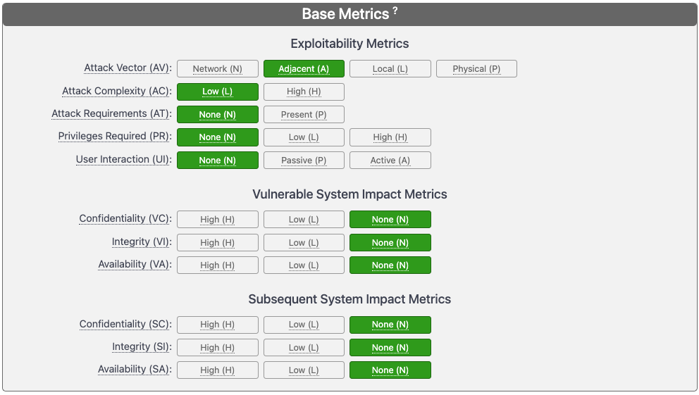
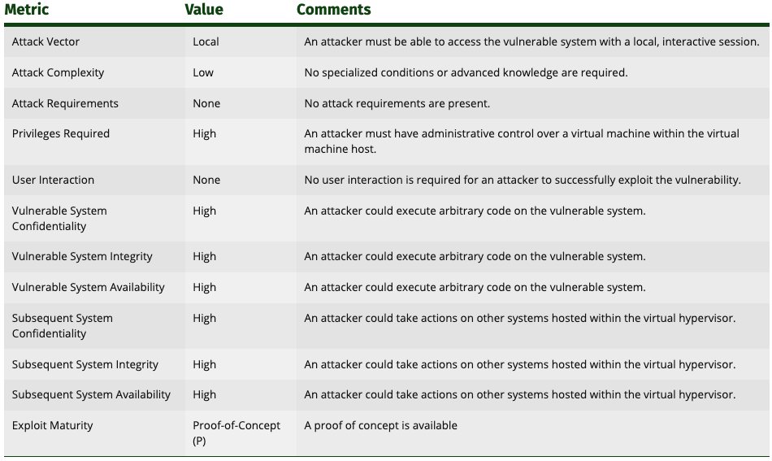
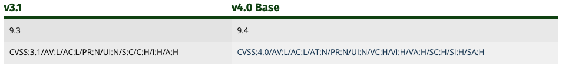
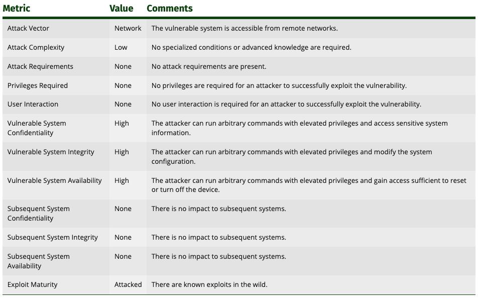
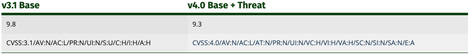

# 1. Основные термины

> **Атака**
>
> это попытка несанкционированного вторжения или нарушения безопасности системы с целью получения конфиденциальной информации, повреждения данных или нарушения работы системы.

> **Инъекция**
>
> это вид атаки, при которой злоумышленник вводит вредоносные данные или код в систему через входные поля или другие механизмы ввода данных.
> **Критичность уязвимости**
>
> это оценка степени опасности, которую представляет уязвимость.

> **Сканер**
>
> это инструмент, используемый для обнаружения уязвимостей в системе или сети. Сканеры могут проводить различные виды сканирования, включая сканирование на уязвимости и сетевое сканирование.

> **Уязвимость**
>
> это недостаток в системе или приложении, который может быть использован злоумышленником для получения несанкционированного доступа к информации, ее модификации или уничтожения. Уязвимости могут быть вызваны ошибками в программном коде, ошибками в конфигурации системы или другими факторами.

> **Эксплойт**
>
> это программа, скрипт или команда, разработанные для использования уязвимости в программном или аппаратном обеспечении с целью получения несанкционированного доступа или выполнения нежелательных действий на целевой системе.

> **Эксплуатация уязвимости**
>
> это процесс использования уязвимости злоумышленником для получения несанкционированного доступа к системе или приложению. Эксплуатация может быть выполнена вручную или с помощью автоматизированного инструментария.

# 2. Определение и классификация уязвимостей

## Что такое уязвимость

> это недостаток в системе, который может быть использован злоумышленником для получения несанкционированного доступа к системе, ее данным или функциям.

Существует штатная и нештатная функциональность программы. К нештатной можно отнести все то, что не закладывали в логику программы разработчики при ее создании. То, что приводит к нештатной функциональности, — и есть уязвимость.

## Как появляются уязвимости

### SQL-инъекция

> тип уязвимости, при котором злоумышленник может внедрять, или «инъецировать» вредоносный SQL-код в запрос, который выполняется базой данных.

Пример кода, уязвимого для SQL-инъекции:

```Python
# Уязвимый код для SQL-инъекции
user_input = request.GET['user_input']
sql_query = "SELECT * FROM users WHERE user_name = '" + user_input + "';"
database.execute(sql_query)
```

Если пользовательский ввод не санитизирован, злоумышленник может в качестве входного значения указать строку, например `' OR '1'='1`, которая изменит логику SQL-запроса и может привести к разглашению данных.

### Переполнение буфера

> происходит, когда данные превышают размер выделенного буфера в памяти, что может привести к перезаписи смежных областей памяти и потенциально позволить выполнение произвольного кода.

Пример уязвимого кода на C:

```C
// Уязвимый код для переполнения буфера
void vulnerable_function(char *user_input) {
    char buffer[64];
    strcpy(buffer, user_input); // Нет проверки размера входных данных
}
```

Если user_input превышает 64 байта, это может привести к переполнению буфера.

### Broken Access Control

> **нарушенный контроль доступа** возникает, когда система не обеспечивает должного контроля доступа к своим ресурсам, что позволяет злоумышленникам получить несанкционированный доступ к данным или функциям.

Пример уязвимого кода на Java:

```Java
public class BankAccount {
    private int balance;

    public int getBalance(String userRole) {
        if (userRole.equals("admin")) {
            return balance;
        } else {
            return 0;
        }
    }
}
```

Если злоумышленник может каким-либо образом изменить userRole на "admin", он сможет получить доступ к балансу банковского счета, что не должно быть возможно для обычных пользователей.

Еще один распространенный пример — манипулирование параметрами URL-адреса в веб-приложении для доступа к данным другого пользователя. Например, если URL-адрес для доступа к профилю пользователя выглядит как http://example.com/user?id=123, злоумышленник может попробовать изменить id на другое значение, чтобы получить доступ к профилю другого пользователя.

## Классификации уязвимостей и их последствия

Классификация уязвимостей — это процесс группировки уязвимостей по общим признакам. Она необходима по нескольким причинам:

- **для улучшения понимания природы уязвимостей**<br>классификация помогает лучше понять, что представляют собой уязвимости, как они работают и как их можно эксплуатировать;
- **для облегчения поиска уязвимостей**<br>классификация позволяет группировать уязвимости по общим признакам, что упрощает их поиск и анализ;
- **для оценки рисков, связанных с уязвимостями**<br>классификация помогает оценить потенциальные последствия эксплуатации уязвимостей, что необходимо для определения приоритетов при их устранении.

Есть несколько классификаций уязвимостей:

- по способу эксплуатации;
- по характеру воздействия;
- по типу актива, где обнаружена уязвимость;
- по причине ее возникновения.

### По способу эксплуатации уязвимостей

> **Эксплуатация уязвимости**
>
> это процесс использования уязвимости злоумышленником для получения несанкционированного доступа к системе или приложению. Эксплуатация может быть выполнена вручную или с помощью автоматизированного инструментария.

> **Эксплойт**
>
> это программа, скрипт или команда, разработанные для использования уязвимости в программном или аппаратном обеспечении с целью получения несанкционированного доступа или выполнения нежелательных действий на целевой системе.

Инструментарий для эксплуатации уязвимостей может включать в себя различные программные средства:

- **Metasploit Framework**<br>один из самых популярных инструментов для разработки, тестирования и выполнения эксплойтов. Он содержит сотни готовых модулей для эксплуатации известных уязвимостей и позволяет создавать собственные.
- **Exploit Database**<br>архив эксплойтов и программного обеспечения, который может быть использован для поиска и применения эксплойтов для конкретных уязвимостей.
- **Burp Suite**<br>инструмент для тестирования веб-приложений, который также может быть использован для эксплуатации уязвимостей, например, путем манипуляции запросами и ответами сервера.

По способу эксплуатации можно выделить:

- **удаленные уязвимости**<br>могут быть эксплуатированы удаленно, без необходимости непосредственного (в том числе физического) доступа к системе;
- **локальные уязвимости**<br>могут быть эксплуатированы только при непосредственном доступе к системе.

При одинаковом воздействии на систему удаленные уязвимости более опасны, поскольку необходимость первоначального доступа к системе при локальной уязвимости — дополнительный порог, который нужно преодолеть.

Эксплуатировать локальные уязвимости в общем смысле сложнее, вследствие чего сама вероятность эксплуатации такой уязвимости снижается.

#### Удаленные уязвимости

могут быть эксплуатированы злоумышленником, который находится в другой сети или даже в другой стране. Такие уязвимости обычно встречаются в программном обеспечении, которое предоставляет удаленный доступ к системе

Пример: уязвимость **Heartbleed в OpenSSL**

позволяет злоумышленнику считывать память на уязвимом сервере через интернет, потенциально получая доступ к конфиденциальной информации (приватным ключам и паролям пользователей). Эксплуатация Heartbleed не требует никакого взаимодействия с пользователем или внутреннего доступа к системе, что делает ее классическим примером удаленной уязвимости.

#### Локальные уязвимости

Пример:

уязвимость, обнаруженная в операционных системах семейства Windows, которая позволяет выполнить локальное повышение привилегий (LPE). Это означает, что злоумышленник, уже имеющий доступ к системе, может использовать эту уязвимость для получения более высоких прав доступа — например, прав администратора. Для эксплуатации такой уязвимости требуется непосредственный доступ к системе, поэтому она классифицируется как локальная.

### По характеру воздействия

различают:

- уязвимости, которые позволяют злоумышленнику получить **несанкционированный доступ к системе или активу**<br>*Пример:*недостаточная санитизация данных, приводящая к Cross-Site Scripting ([XSS](https://owasp.org/www-project-top-ten/2017/A7_2017-Cross-Site_Scripting_(XSS))). Эта атака позволяет злоумышленнику внедрить в веб-страницу вредоносный скрипт, который будет выполняться в браузере жертвы
- уязвимости, которые позволяют злоумышленнику **изменить или уничтожить данные в системе**<br>*Пример:* недостаточная фильтрация данных, приводящая к SQL-инъекции. SQL-инъекция позволяет злоумышленнику внедрить вредоносный SQL-код, который будет выполнен сервером баз данных
- уязвимости, которые могут привести к **отказу в обслуживании системы**<br>*Пример:* DoS или DDoS атаки

> **Критичность уязвимости** — это оценка степени опасности, которую представляет уязвимость

### По типу актива, где обнаружена уязвимость

- **уязвимости программного обеспечения**<br>обычно возникают из-за ошибок в разработке или недостатков в проектировании системы<br>*Пример:* уязвимость в веб-приложении, которая позволяет проводить SQL-инъекции
- **уязвимости аппаратного обеспечения**<br>могут быть связаны с физическими недостатками в устройствах, такими как микрочипы, процессоры или устройства хранения данных (например, утечка информации через уязвимости в процессорах или недостаточная защита от физического доступа к устройству)<br>*Пример:* уязвимость Meltdown и Spectre, обнаруженные в процессорах Intel, AMD и ARM. Эти уязвимости позволяют злоумышленникам получить доступ к защищенной памяти процессора и извлечь конфиденциальные данные.
- **уязвимости инфраструктуры**<br>могут включать в себя недостатки в сетевых устройствах, серверах, облачной инфраструктуре и других элементах, которые обеспечивают функционирование информационной системы (например, уязвимости в сетевых протоколах, недостаточная защита от DDoS-атак или недостаточное управление доступом к инфраструктуре)<br>*Пример:* неправильно настроенный межсетевой экран (firewall), который позволяет неавторизованному трафику проходить через сетевой периметр

### По причине возникновения

- **уязвимостью в результате ошибки разработчика**<br>наиболее распространенные уязвимости, которые возникают в результате ошибок в коде программного обеспечения, в спецификациях аппаратного обеспечения или в документации инфраструктуры;
- **уязвимостью в результате ошибки пользователя**<br>возникает в результате действий пользователей, которые нарушают правила безопасности.

#### Уязвимости в результате ошибок разработчиков:

1. Неправильная обработка входных данных, приводящая к уязвимости для XSS-атак. Например, если веб-приложение не экранирует или не санитизирует пользовательский ввод перед его выводом на странице, злоумышленник может вставить вредоносный JavaScript-код, который будет выполнен в браузере других пользователей.
1. Ошибки в конфигурации сервера — неправильно настроенный сервер баз данных, который позволяет удаленное подключение без аутентификации, что может привести к утечке или изменению данных.

#### Уязвимости в результате ошибок пользователей:

 1. Использование слабых или повторно используемых паролей, что упрощает злоумышленникам их подбор через атаки brute-force или использование словарей, а также открытие электронных писем от неизвестных отправителей.
 1. Некритическое отношение к фишинговым атакам, когда пользователь переходит по подозрительным ссылкам или открывает вложения в электронных письмах, что может привести к установке вредоносного ПО или краже учетных данных.

## Классификация OWASP Top 10

> список из 10 наиболее критических рисков безопасности веб-приложений, разработанный сообществом Open Web Application Security Project (OWASP)

Список по ссылке: [https://owasp.org/www-project-top-ten/](https://owasp.org/www-project-top-ten/)

OWASP Top 10 формируется на основе консенсуса мнений экспертов по безопасности со всего мира

### 10 Категорий рисков

#### 1. Broken Access Control (A01): небезопасный контроль доступа

Позволяет злоумышленнику получить несанкционированный доступ к данным или функциям веб-приложения в обход авторизации — то есть пользователь не имел права на данную функциональность, однако все-таки получил к ней доступ.

**Пример:** 
- Если веб-приложение не проверяет должным образом, что идентификатор пользователя, запрашивающего сообщения, соответствует идентификатору пользователя, вошедшего в систему, то злоумышленник может изменить параметр user_id в запросе на идентификатор другого пользователя и получить доступ к его личным сообщениям.

#### 2. Cryptographic Failures (A02): небезопасное использование криптографии

Может привести к утечке данных или к выполнению вредоносного кода.

Причиной служит использование устаревших алгоритмов и слабых ключей, неправильное хранение чувствительных данных и недостаточная защита ключей шифрования.

**Пример:**
- использование устаревшего криптографического алгоритма, такого как MD5, для хэширования паролей. MD5 считается небезопасным из-за своей уязвимости к атакам поиска коллизий, что позволяет злоумышленникам эффективно находить исходные значения, имея только хэш.

#### 3. Injection (A03): инъекция.

Метод атаки, при котором злоумышленник вводит в веб-приложение недопустимые данные с целью изменить его нормальное поведение. Обычно приводит к выполнению кода и извлечению данных, а иногда — и к отказу в обслуживании.

**Пример:** SQL-инъекция

#### 4. Insecure Design (A04): небезопасный дизайн.

означает, что в основе проблем безопасности может быть недостаточное внимание к дизайну архитектуры системы. Проще говоря, при проектировании системы могли не подумать о том, что помимо того, что система должна работать, она должна еще и быть безопасной.

**Пример:**  отсутствие механизма аутентификации и авторизации в веб-приложении, которое обрабатывает чувствительные данные.

#### 5. Security Misconfiguration (A05): неправильная конфигурация системы.

Данный вид уязвимости может привести к различным проблемам безопасности.

**Пример:**
- при неверной настройке брандмауэра злоумышленники могут обойти его и получить доступ к конкретной сети или информации на устройствах.
- Использование стандартных учетных записей тоже можно отнести к неправильной конфигурации.

#### 6. Vulnerable and Outdated Components (A06): использование уязвимых или устаревших компонентов.

Приводит к различным проблемам безопасности.

Сюда можно отнести использование библиотек с известными уязвимостями — например, всем известная log4j в java.

#### 7. Identification and Authentication Failures (A07): небезопасная идентификация и аутентификация пользователей.

Она обычно приводит к получению несанкционированного доступа к системе, что в свою очередь уже ведет к утечкам, исполнению произвольного кода и другим последствиям.

**Пример:**
- злоумышленник получает доступ к веб-приложению от имени учетной записи администратора и внедряет произвольный код, который исполняется на сервере или в браузерах пользователей.

#### 8. Software and Data Integrity Failures (A08): небезопасность целостности программного обеспечения.

В современном мире большая часть кода переиспользуется: код распространяется пакетами, или модулями, и для решения какой-то частной задачи проще использовать уже готовый для этого пакет

Но зачастую целостность используемого кода не проверяется, в результате чего появляется возможность для проведения атак типа подмены исходного кода — когда вместо желаемого кода в конечную систему попадает вредоносный код. Более подробно об этом можно почитать в данной статье: [https://xakep.ru/2021/02/11/dependency-confusion/](https://xakep.ru/2021/02/11/dependency-confusion/)

**Пример:**
- веб-приложение регулярно обновляет свои зависимости, загружая новые версии из публичного репозитория. Если процесс обновления не проверяет целостность загружаемых пакетов, — например, не сравнивает их хеш-суммы с ожидаемыми, — злоумышленник, который может перехватить сетевой трафик (например, находясь в той же сети), может подменить оригинальные пакеты на модифицированные.

#### 9. Security Logging and Monitoring Failures (A09): ошибки логирования и мониторинга.

Это ошибки, связанные с неправильной настройкой системы регистрации и мониторинга безопасности.

Если система работает неправильно, злоумышленники могут совершить атаку на нее, и пользователю будет сложно заметить, что именно произошло.

**Пример:**
- если кто-то пытается взломать вашу систему, а система регистрации и мониторинга не работает правильно, вы можете не заметить эту атаку, и злоумышленники смогут получить доступ к вашей информации

#### 10. Server-Side Request Forgery (A10): подделка запроса.

Этот тип атаки происходит, когда злоумышленник заставляет сервер выполнять запросы от его имени.

Это можно сравнить с тем, как если бы вы дали кому-то свой телефон, и этот человек начал бы звонить от вашего имени без разрешения.

**Пример:**
- у вас есть веб-сайт, который позволяет пользователям загружать изображения с других сайтов. Пользователь вводит URL изображения, сервер делает запрос к этому URL и загружает картинку. Злоумышленник может ввести URL, который на самом деле является командой для сервера, — например, удалить все файлы

### Полезные ссылки

- примерами и рекомендациями по устранению: [https://owasp.org/www-project-top-ten/](https://owasp.org/www-project-top-ten/)
- погрузиться в уязвимости и научиться находить их руками: [https://portswigger.net/web-security](https://portswigger.net/web-security)

# 3. Критичность уязвимости. Методы приоритизации и оценки уязвимости

> **Степень критичности уязвимости**
>
> это оценка потенциального ущерба, который может быть нанесен системе в результате эксплуатации данной уязвимости.

## Уровни критичности

### Низкий уровень (0,0 ≤ V ≤ 3,9)

Уязвимости этого уровня обычно не представляют серьезной угрозы для системы. Они могут быть эксплуатированы, но вред, который они могут причинить, обычно ограничен.

### Средний уровень (4,0 ≤ V ≤ 6,9)

Уязвимости среднего уровня могут представлять угрозу для системы, но их эксплуатация обычно требует определенных условий. Вред, который они могут причинить, может быть значительным, но обычно не критическим.

### Высокий уровень (7,0 ≤ V ≤ 9,9)

Уязвимости высокого уровня представляют серьезную угрозу для системы. Они могут быть легко эксплуатированы и причинить значительный вред вроде потери данных или нарушения работы системы.

### Критический уровень (V ≥ 10,0)

Критические уязвимости представляют наибольшую угрозу. Они могут быть легко эксплуатированы и приводить к катастрофическим последствиям — например, полному нарушению работы системы или несанкционированному доступу к конфиденциальной информации.

## Оценка критичности уязвимости

> процесс, в ходе которого определяется степень риска, связанного с потенциальной уязвимостью в программном или программно-аппаратном средстве.

помогает определить, какие уязвимости требуют немедленного внимания, а какие могут быть отложены «на потом»

При оценке необходимо учитывать следующие факторы:

1. **Способ эксплуатации уязвимости**<br>как и насколько просто злоумышленник может использовать уязвимость для нанесения вреда.
1. **Воздействие на систему**<br>какой ущерб может причинить эксплуатация уязвимости.<br><br>Воздействие может быть разным: от незначительного сбоя в работе системы до полного ее выхода из строя или утечки конфиденциальных данных.
1. **Тип системы, в которой обнаружена уязвимость**<br>Некоторые системы более критичны, чем другие. Очевидно, что уязвимость в системе управления ядерной электростанцией будет значительно более критичной, чем уязвимость в веб-приложении для заказа пиццы.
1. **Наличие контрмер, защищающих от эксплуатации уязвимости**<br>если существуют эффективные контрмеры, которые могут предотвратить эксплуатацию уязвимости, это снижает ее критичность.

## Методики оценки критичности уязвимости

Наиболее распространенными являются следующие:

- **методики, основанные на экспертной оценке**<br>это методики, в которых оценка уязвимости осуществляется экспертом по информационной безопасности на основании его опыта и знаний;
    - наиболее простыми и быстрыми в использовании
    - субъективны, поскольку результаты оценки зависят от опыта и знаний эксперта
- **методики, основанные на анализе последствий эксплуатации уязвимости**<br>это методики, в которых оценка уязвимости осуществляется путем анализа потенциального ущерба, который может быть нанесен системе в результате эксплуатации данной уязвимости;
    - являются более объективными
    - требуют от специалиста ИБ глубоких знаний о системах и угрозах безопасности
- **методики, основанные на анализе стоимости устранения уязвимости**<br>это методики, в которых оценка уязвимости осуществляется путем анализа затрат на ее устранение.
    - позволяют учитывать
        - потенциальный ущерб
        - затраты на устранение уязвимости
    - могут быть сложными в использовании
    - требуют от специалиста по информационной безопасности знаний о системах, угрозах безопасности и затратах на устранение уязвимостей

несколько примеров конкретных методик оценки уязвимости:
- **OWASP Risk Rating Methodology (OWASP-RM)**<br>Методика оценки уязвимости, основанная на анализе последствий эксплуатации уязвимости. Она включает в себя:
    - вероятность эксплуатации уязвимости;
    - влияние эксплуатации уязвимости;
    - длительность воздействия уязвимости;
    - стоимость устранения уязвимости.
- **CVSS (Common Vulnerability Scoring System)**<br>Стандартизированная методика оценки уязвимости, основанная на анализе последствий эксплуатации уязвимости. Она включает в себя:
    - вектор атаки — как атака может быть осуществлена;
    - сложность атаки — насколько сложно эксплуатировать уязвимость;
    - необходимость взаимодействия с пользователем;
    - привилегии, необходимые для успешной атаки;
    - оценка воздействия, или последствия эксплуатации уязвимости;
    - [другие метрики](https://www.first.org/cvss/calculator/4.0), которые могут меняться в зависимости от версии CVSS.
- **CWE/SANS Top 25 Most Dangerous Software Errors**<br>Это [список](https://cwe.mitre.org/top25/archive/2023/2023_top25_list.html) из 25 наиболее опасных ошибок программного обеспечения, разработанный сообществом CWE/SANS. Список CWE/SANS Top 25 может использоваться для оценки уязвимости, основанной на анализе причин возникновения уязвимости.
- **Оценка критичности по методологии ФСТЭК России**<br>Отечественная методика, разработанная ФСТЭК России. С ней можно ознакомиться по ссылке, а также мы подробно изучим ее особенности далее.

### Методика CVSS

> **Common Vulnerability Scoring System**
>
> стандартизированная методика, которая позволяет оценить серьезность уязвимостей на основе их потенциального воздействия на систему и сложности эксплуатации, а также позволяет сравнивать уязвимости различных систем и приложений.

Эта система оценки используется организациями по всему миру для определения приоритетов при устранении уязвимостей, а также для обмена информацией о безопасности в более широком сообществе.

состоит из нескольких основных компонентов, самый важный из которых — Base Score, или базовая оценка

полным списком оцениваемых параметров: [https://www.first.org/cvss/v4.0/specification-document](https://www.first.org/cvss/v4.0/specification-document)

#### Base Metrics



- **метрики эксплуатации**
    - вектор атаки (Attack Vector)
    - сложность атаки (Attack Complexity);
    - требования к атаке (Attack Requirements);
    - наличие привилегий (Privileges Required);
    - взаимодействие с пользователем (User Interaction).
- **влияние на систему**
    - конфиденциальность (Confidentiality);
    - целостность (Integrity);
    - доступность (Availability).
- **влияние на смежные системы**
    - конфиденциальность (Confidentiality);
    - целостность (Integrity);
    - доступность (Availability).

##### Метрики эксплуатации (Exploitability Metrics)

###### Вектор атаки (Attack Vector - VA)

отражает контекст, в котором возможно использование уязвимости

чем более удаленным (логически и физически) может быть злоумышленник, чтобы использовать уязвимую систем -> выше значение

<table>
    <thead>
        <tr>
            <th>Значение</th>
            <th>Описание</th>
        </tr>
    </thead>
        <tr>
            <td>Network (N)</td>
            <td>
                <ul>
                    <li>Уязвимая система привязана к сетевому стеку, и набор возможных злоумышленников выходит за рамки других вариантов, перечисленных ниже, вплоть до всего Интернета</li>
                    <li>часто называют “уязвимой для удаленного использования”</li>
                    <li>можно рассматривать как атаку, которая может быть использована на уровне протокола с удалением одного или нескольких сетевых переходов</li>
                </ul>
            </td>
        </tr>
        <tr>
            <td>Adjacent (A)</td>
            <td>
                <ul>
                    <li>Уязвимая система привязана к стеку протоколов, но атака ограничена на уровне протокола логически смежной топологией</li>
                    <li>атака должна быть запущена из одной и той же общей сети или иным образом ограниченного административного домена</li>
                </ul>
            </td>
        <tr>
        <tr>
            <td>Local (L)</td>
            <td>
                <ul>
                    <li>Уязвимая система не привязана к сетевому стеку, и путь злоумышленника лежит через возможности чтения / записи / выполнения</li>
                    <li>либо злоумышленник использует уязвимость путем локального доступа к целевой системе (например, клавиатура, консоль) или посредством эмуляции терминала (например, SSH)</li>
                    <li>либо злоумышленник полагается на взаимодействие с пользователем со стороны другого лица для выполнения действий, необходимых для использования уязвимости</li>
                </ul>
            </td>
        <tr>
        <tr>
            <td>Physical (P)</td>
            <td>
                <ul>
                    <li>Атака требует, чтобы злоумышленник физически касался уязвимой системы или манипулировал ею</li>
                    <li>примеры включают периферийные атаки через FireWire / USB с прямым доступом к памяти (DMA)</li>
                </ul>
            </td>
        <tr>
    <tbody>
    </tbody>
</table>

###### Сложность атаки (Attack Complexity - AC)

- Указывает на измеримые действия, которые должен предпринять злоумышленник, чтобы активно обойти существующие встроенные меры безопасности для получения работающего эксплойта.
- не связан с количеством времени или попыток, которые потребовались бы злоумышленнику
- не учитывает механизмы аутентификации (учитываются в последующих метриках)

Чем меньше действий необходимо предприянть для обхода защиты -> тем выше оценка


<table>
    <thead>
        <tr>
            <th>Значение</th>
            <th>Описание</th>
        </tr>
    </thead>
    <tbody>
        <tr>
            <td>Low (L)</td>
            <td>
                <ul>
                    <li>Злоумышленник не должен предпринимать никаких измеримых действий для использования уязвимости</li>
                    <li>Злоумышленник может рассчитывать на повторяемый успех в отношении уязвимой системы</li>
                </ul>
            </td>
        </tr>
        <tr>
            <td>High (H)</td>
            <td>
                <ul>
				<li>Успешная атака зависит от уклонения или обхода существующих мер безопасности, которые в противном случае препятствовали бы атаке</li>
                <ul>
                    <li>Уклонение от методов предотвращения эксплойтов</li>
                    <li>Получение секретов, специфичных для конкретной цели</li>
                </ul>
                </ul>
            </td>
        </tr>
    </tbody>
</table>

###### Требования к атаке (Attack Requirements - AT)

Отражает предварительные условия развертывания и выполнения или переменные уязвимой системы, которые обеспечивают возможность атаки. Если злоумышленник не предпримет действий для преодоления этих условий, атака может увенчаться успехом лишь изредка или не увенчаться успехом вообще

<table>
    <thead>
        <tr>
            <th>Значение</th>
            <th>Описание</th>
        </tr>
    </thead>
    <tbody>
        <tr>
            <td>None (N)</td>
            <td>
                <ul>
                    <li>Успешная атака не зависит от условий развертывания и выполнения уязвимой системы</li>
                    <li>Злоумышленник может рассчитывать на то, что сможет добраться до уязвимости и выполнить эксплойт во всех или большинстве экземпляров уязвимости.</li>
                </ul>
            </td>
        </tr>
        <tr>
            <td>Present (P)</td>
            <td>
                <ul>
					<li>Успешная атака зависит от наличия конкретных условий развертывания и выполнения уязвимой системы, которые делают возможной атаку</li>
                    <ul>
    					<li>Успешность атаки зависит от условий выполнения, которые не находятся под полным контролем злоумышленника</li>
    					<li>Возможно, потребуется запустить атаку несколько раз против одной цели, прежде чем она будет успешной</li>
    					<li>Внедрение в сеть. Злоумышленник должен внедриться в логический сетевой путь между целью и ресурсом, запрошенным жертвой</li>
                    </ul>
                </ul>
            </td>
        </tr>
    </tbody>
</table>

###### Наличие привилегий (Privileges Required - PR)

описывает уровень привилегий, которым должен обладать злоумышленник, **прежде** чем успешно воспользоваться уязвимостью.

Итоговый балл является наибольшим, если привилегии не требуются

<table>
    <thead>
        <tr>
            <th>Значение</th>
            <th>Описание</th>
        </tr>
    </thead>
    <tbody>
        <tr>
            <td>None (N)</td>
            <td>Злоумышленник проходит проверку подлинности перед атакой и, следовательно, не требует какого-либо доступа к настройкам или файлам уязвимой системы для проведения атаки.</td>
        </tr>
        <tr>
            <td>Low (L)</td>
            <td>Злоумышленнику требуются привилегии, обеспечивающие базовые возможности, которые обычно ограничены настройками и ресурсами, принадлежащими одному пользователю с низкими привилегиями.
            </td>
        </tr>
        <tr>
            <td>High (H)</td>
            <td>Злоумышленнику требуются привилегии, обеспечивающие значительный (например, административный) контроль над уязвимой системой, позволяющий получить полный доступ к настройкам и файлам уязвимой системы.
            </td>
        </tr>
    </tbody>
</table>

###### Взаимодействие с пользователем (User Interaction - UI)

- отражает требование к пользователю-человеку, отличному от злоумышленника, чье учатие требуется для успешной компрометации уязвимой системы.
- определяет, может ли уязвимость быть использована исключительно по желанию злоумышленника, или же в ней должен каким-либо образом участвовать отдельный пользователь (или инициируемый пользователем процесс)

Итоговый балл является наибольшим, когда не требуется взаимодействия с пользователем

<table>
    <thead>
        <tr>
            <th>Значение</th>
            <th>Описание</th>
        </tr>
    </thead>
    <tbody>
        <tr>
            <td>None (N)</td>
            <td>Уязвимая система может быть использована без участия какого-либо пользователя, кроме злоумышленника</td>
        </tr>
        <tr>
            <td>Passive (P)</td>
            <td>
                <ul>
                    <li>Успешное использование этой уязвимости требует ограниченного взаимодействия целевого пользователя с уязвимой системой и полезной нагрузкой злоумышленника</li>
                    <li>взаимодействия будут считаться непроизвольными и не требуют, чтобы пользователь активно подрывал средства защиты, встроенные в уязвимую систему</li>
                </ul>
            </td>
        </tr>
        <tr>
            <td>Active (A)</td>
            <td>
                <ul>
                    <li>требует, чтобы целевой пользователь выполнял определенные сознательные взаимодействия с уязвимой системой и полезной нагрузкой злоумышленника, что приведет к использованию уязвимости</li>
                    <ul>
                        <li>импорт файла в уязвимую систему определенным образом</li>
                        <li>размещение файлов в определенном каталоге перед выполнением кода</li>
                    </ul>
                </ul>
            </td>
        </tr>
    </tbody>
</table>

##### Влияние на систему (Impact Metrics)

- отражают последствия успешно использованной уязвимости
- следует учитывать только увеличение доступа, полученные привилегии или другой негативный результат в результате успешной эксплуатации

###### Конфиденциальность (Confidentiality - VC)

- измеряет влияние успешного использования уязвимости на конфиденциальность информации, которой управляет система
- следует учитывать только увеличение доступа (если разрешение на чтение и так имеется, а злоумышленник получает доступ на запись, то значение конфиденциальности - None, и следует расчитать влияние на целостность)
- в расчет необходимо брать финальный эффект использования уязвимости, а не промежуточные
- При определении значений показателей воздействия поставщики оценки должны учитывать воздействия как на Уязвимую систему, так и за пределами Уязвимой системы
- Итоговый балл является наибольшим, когда потери для системы максимальны

<table>
    <thead>
        <tr>
            <th>Значение</th>
            <th>Описание</th>
        </tr>
    </thead>
    <tbody>
        <tr>
            <td>High (H)</td>
            <td>
                <ul>
                    <li>полная потеря конфиденциальности, в результате чего вся информация в Уязвимой системе становится доступной злоумышленнику</li>
                    <li>или можно получить доступ только к некоторой ограниченной информации, но раскрытая информация оказывает прямое серьезное влияние на систему</li>
                <ul><li>Например, злоумышленник крадет пароль администратора или закрытые ключи шифрования веб-сервера</li></ul>
                </ul>
            </td>
        </tr>
        <tr>
            <td>Low (L)</td>
            <td>
                <ul>
                    <li>Произошла некоторая потеря конфиденциальности</li>
                    <li>Получен доступ к некоторой ограниченной информации, но злоумышленник не контролирует, какая информация получена</li>
                    <li>или количество или тип информации ограничены</li>
                    <li>Раскрытие информации не наносит прямого серьезного ущерба Уязвимой системе</li>
                </ul>
            </td>
        </tr>
        <tr>
            <td>Nonw (N)</td>
            <td>В Уязвимой системе конфиденциальность не нарушается</td>
        </tr>
    </tbody>
</table>


###### Целостность (Integrity - VI)

- измеряет влияние успешно использованной уязвимости на целостность
- Целостность системы нарушается, когда злоумышленник вызывает несанкционированное изменение системных данных
- Итоговый балл является наибольшим, когда последствия для системы максимальны

<table>
    <thead>
        <tr>
            <th>Значение</th>
            <th>Описание</th>
        </tr>
    </thead>
    <tbody>
        <tr>
            <td>High (H)</td>
            <td>
                <ul>
                    <li>Происходит полная потеря целостности или потеря защиты</li>
                    <li>злоумышленник может изменять любые файлы, защищенные Уязвимой системой</li>
                    <li>можно изменить только некоторые файлы, но вредоносная модификация приведет к прямым серьезным последствиям для Уязвимой системы</li>
                </ul>
            </td>
        </tr>
        <tr>
            <td>Low (L)</td>
            <td>
                <ul>
                    <li>Модификация данных возможна, но злоумышленник не контролирует последствия модификации, или объем модификации ограничен</li>
                    <li>Модификация данных не оказывает прямого серьезного воздействия на Уязвимую систему.</li>
                </ul>
            </td>
        </tr>
        <tr>
            <td>None (N)</td>
            <td>В Уязвимой системе нет потери целостности
            </td>
        </tr>
    </tbody>
</table>

###### Доступность (Availability - VA)

- измеряет влияние на доступность затронутой системы в результате успешно использованной уязвимости
- Итоговый балл является наибольшим, когда последствия для системы максимальны

<table>
    <thead>
        <tr>
            <th>Значение</th>
            <th>Описание</th>
        </tr>
    </thead>
    <tbody>
        <tr>
            <td>High (H)</td>
            <td>
                <ul>
                    <li>Происходит полная потеря доступности, в результате чего злоумышленник может полностью запретить доступ к ресурсам Уязвимой системы</li>
                    <li>эта потеря
                        <ul>
                            <li>либо устойчива (пока злоумышленник продолжает осуществлять атаку)</li>
                            <li>либо постоянна (состояние сохраняется даже после завершения атаки)</li>
                        </ul>
                    </li>
                    <li>злоумышленник имеет возможность запретить некоторую доступность, но потеря доступности представляет собой прямые серьезные последствия для Уязвимой системы
                    <ul><li>например запретить только новые подключения, но оставить текущие</li>
                    <li>многократное применение уязвимости привозит к полной потере доступности</li>
                    </ul></li>
                </ul>
            </td>
        </tr>
        <tr>
            <td>Low (L)</td>
            <td>
                <ul>
                    <li>Снижается производительность или возникают перебои в доступности ресурсов</li>
                    <li>Даже если возможно повторное использование уязвимости, злоумышленник не имеет возможности полностью отказать в обслуживании законным пользователям</li>
                </ul>
            </td>
        </tr>
        <tr>
            <td>None (N)</td>
            <td>никак не влияет на доступность Уязвимой системымы
            </td>
        </tr>
    </tbody>
</table>

##### Влияние на смежные системы

###### Конфиденциальность (Confidentiality - SC)

<table>
    <thead>
        <tr>
            <th>Значение</th>
            <th>Описание</th>
        </tr>
    </thead>
    <tbody>
        <tr>
            <td>High (H)</td>
            <td>
                <ul>
                    <li>Происходит полная потеря конфиденциальности, в результате чего все ресурсы в Последующей системе становятся доступными злоумышленнику</li>
                    <li>или можно получить доступ только к некоторой ограниченной информации, но раскрытая информация оказывает прямое серьезное влияние на систему</li>
                </ul>
            </td>
        </tr>
        <tr>
            <td>Low (L)</td>
            <td>
                <ul>
                    <li>Произошла некоторая потеря конфиденциальности</li>
                    <li>Получен доступ к некоторой ограниченной информации, но злоумышленник не контролирует, какая информация получена</li>
                    <li>или количество или тип информации ограничены</li>
                    <li>Раскрытие информации не наносит прямого серьезного ущерба Уязвимой системе</li>
                </ul>
            </td>
        </tr>
        <tr>
            <td>Negligible (N)</td>
            <td>В Последующей системе конфиденциальность не теряется, или все воздействие на конфиденциальность ограничивается Уязвимой системой.
            </td>
        </tr>
    </tbody>
</table>

###### Целостность (Integrity - SI)

<table>
    <thead>
        <tr>
            <th>Значение</th>
            <th>Описание</th>
        </tr>
    </thead>
    <tbody>
        <tr>
            <td>High (H)</td>
            <td>
                <ul>
                    <li>Происходит полная потеря целостности или потеря защиты</li>
                    <li>злоумышленник может изменять любые файлы, защищенные Уязвимой системой</li>
                    <li>можно изменить только некоторые файлы, но вредоносная модификация приведет к прямым серьезным последствиям для Уязвимой системы</li>
                </ul>
            </td>
        </tr>
        <tr>
            <td>Low (L)</td>
            <td>
                <ul>
                    <li>Модификация данных возможна, но злоумышленник не контролирует последствия модификации, или объем модификации ограничен</li>
                    <li>Модификация данных не оказывает прямого серьезного воздействия на Уязвимую систему.</li>
                </ul>
            </td>
        </tr>
        <tr>
            <td>None (N)</td>
            <td>В Последующей системе не происходит потери целостности или все воздействие на целостность ограничивается Уязвимой системой
            </td>
        </tr>
    </tbody>
</table>

###### Доступность (Availability - SA)

<table>
    <thead>
        <tr>
            <th>Значение</th>
            <th>Описание</th>
        </tr>
    </thead>
    <tbody>
        <tr>
            <td>High (H)</td>
            <td>
                <ul>
                    <li>Происходит полная потеря доступности, в результате чего злоумышленник может полностью запретить доступ к ресурсам Уязвимой системы</li>
                    <li>эта потеря
                        <ul>
                            <li>либо устойчива (пока злоумышленник продолжает осуществлять атаку)</li>
                            <li>либо постоянна (состояние сохраняется даже после завершения атаки)</li>
                        </ul>
                    </li>
                    <li>злоумышленник имеет возможность запретить некоторую доступность, но потеря доступности представляет собой прямые серьезные последствия для Уязвимой системы
                    <ul><li>например запретить только новые подключения, но оставить текущие</li>
                    <li>многократное применение уязвимости привозит к полной потере доступности</li>
                    </ul></li>
                </ul>
            </td>
        </tr>
        <tr>
            <td>Low (L)</td>
            <td>
                <ul>
                    <li>Снижается производительность или возникают перебои в доступности ресурсов</li>
                    <li>Даже если возможно повторное использование уязвимости, злоумышленник не имеет возможности полностью отказать в обслуживании законным пользователям</li>
                </ul>
            </td>
        </tr>
        <tr>
            <td>None (N)</td>
            <td>никак не влияет на доступность Уязвимой системымы
            </td>
        </tr>
    </tbody>
</table>

#### Оценка

Оценка CVSS рассчитывается путем суммирования оценок четырех основных компонентов. Общая оценка CVSS может находиться в диапазоне от 0 до 10. Чем выше оценка CVSS, тем более критичной является уязвимость.

Базовая оценка является основой для расчета общей оценки CVSS. Оценка эксплуатации учитывает, насколько сложно злоумышленнику может быть эксплуатировать уязвимость. Оценка влияния на систему учитывает потенциальный ущерб, который может быть нанесен системе в результате эксплуатации уязвимости.

### Методика ФСТЭК России

Методика оценки уровня критичности уязвимостей программных, программно-аппаратных средств: [https://fstec.ru/dokumenty/vse-dokumenty/spetsialnye-normativnye-dokumenty/metodicheskij-dokument-ot-28-oktyabrya-2022-g-2](https://fstec.ru/dokumenty/vse-dokumenty/spetsialnye-normativnye-dokumenty/metodicheskij-dokument-ot-28-oktyabrya-2022-g-2)

[https://fstec.ru/files/992/---28--2022-804/1722/---28--2022-.pdf](https://fstec.ru/files/992/---28--2022-804/1722/---28--2022-.pdf)

- предназначена для определения степени риска, связанного с уязвимостями в программных и программно-аппаратных средствах
- используется для принятия обоснованных решений о необходимости устранения уязвимостей.

Данная методика имеет несколько отличий. Основное заключается в способе оценки уровня критичности уязвимости.

В данной методике критичность оценивается следующим образом:

$$
𝑉 = 𝐼𝑐𝑣𝑠𝑠 × 𝐼𝑖𝑛𝑓𝑟
$$

- $𝐼𝑐𝑣𝑠𝑠$ - показатель, характеризующий уровень опасности уязвимости
- $𝐼𝑖𝑛𝑓𝑟$ - показатель, характеризующий влияние уязвимости программных, программно-аппаратных средств на функционирование информационной системы.

Показатель $𝐼𝑐𝑣𝑠𝑠$ определяется по методике Common Vulnerability Scoring System (CVSS) третьей версии (3.x), рассмотренной выше.

$$
𝐼𝑖𝑛𝑓𝑟 = 𝑘 \cdot 𝐾 + 𝑙 \cdot 𝐿 + 𝑝 \cdot 𝑃
$$

- $K$ – показатель, характеризующий тип компонента информационной системы, подверженного уязвимости;
- $L$ – показатель, характеризующий количество уязвимых компонентов информационной системы (автоматизированных рабочих мест, серверов, телекоммуникационного оборудования, средств защиты информации и других компонентов);
- $P$ – показатель, характеризующий влияние уязвимого компонента на защищенность периметра информационной системы;
- $k,l,p$  – весовые коэффициенты показателей.

Расчет весовых коэффициентов и оценок показателей, определяющих влияние уязвимости программных, программно-аппаратных средств на информационную систему, проводится в соответствии с Таблицей 1 в [упомянутом выше документе](https://fstec.ru/files/992/---28--2022-804/1722/---28--2022-.pdf).

Помимо самого метода оценки критичности методика также опирается на [банк данных угроз безопасности информации ФСТЭК России](https://bdu.fstec.ru/) в качестве дополнительного источника информации об уязвимостях и угрозах безопасности.

- позволяет оценить уровень критичности уязвимостей и принять меры по их устранению в соответствии с требованиями именно российского законодательства

## Примеры

### Кейс CVE-2020-3947

Давайте рассмотрим расчет оценки критичности для уязвимости CVE-2020-3947 и составление вектора CVSS.

VMware Workstation (15.x до 15.5.2) и Fusion (11.x до 11.5.2) содержат уязвимость после использования в vmnetdhcp. Успешное использование этой проблемы может привести к выполнению кода на хосте с гостевой машины или может позволить злоумышленникам создать условие отказа в обслуживании службы vmnetdhcp, запущенной на хост-компьютере.

Расчет метрик для уязвимости CVE-2020-3947<br>

Из полученных ответов составляется вектор CVSS<br>

### Кейс CVE-2014-6271

пример с уязвимостью GNU Bourne-Again Shell (Bash) Shellshock.

Эта уязвимость позволяла злоумышленникам внедрять произвольный код и потенциально получать контроль над системой

Проблема заключалась в том, что Bash неправильно обрабатывал некоторые переменные окружения, что позволяло злоумышленникам выполнять произвольные команды. Это было особенно опасно для интернет-сервисов, таких как веб-серверы, которые используют Bash для обработки некоторых запросов — например, при выполнении CGI-скриптов.

Уязвимость Shellshock получила максимальную оценку по шкале опасности и сравнивалась по значению с другой известной уязвимостью — Heartbleed.

Расчет метрик для уязвимости CVE-2014-6271<br>

Вектор CVSS<br>

## Приоритизация уязвимостей

На примере: две уязвимости
- уязвимость в системе управления базами данных Oracle, которая используется внутри компании
- уязвимость в веб-сервере Apache, который открыт для внешнего мира

Уязвимость в Oracle позволяет злоумышленнику, который уже находится внутри сети, получить несанкционированный доступ к данным.
- имеет высокий уровень критичности
- ее эксплуатация требует доступа к внутренней сети компании.

Уязвимость в Apache позволяет злоумышленнику провести DoS-атаку на веб-сервер, сделав его недоступным для пользователей.
- средний уровень критичности
- ее можно эксплуатировать извне без доступа к внутренней сети компании.

В условиях ограниченных ресурсов может быть целесообразно сначала устранить уязвимость в Apache, поскольку она открыта для внешнего мира и может привести к прямым потерям

# 4. Работа с уязвимостями

## Методы выявления уязвимостей

### White Box Testing

Он же тестирование методом белого ящика

- подразумевает полный доступ к внутренней структуре и коду тестируемой системы
- тестировщики имеют знание обо всех деталях, процессах и внутренних механизмах приложения

Поскольку прямого взаимодействия с работающим приложением нет, то нет и риска воздействия на производственные данные и процессы

позволяет глубоко проанализировать безопасность приложения, минимизируя риски

### Black Box Testing

- отсутствие знаний о внутренней структуре системы и протекающих в ней процессах
- тестировщики сосредотачиваются только на вводе и выводе системы, проверяя ее функциональность без знания внутренних механизмов
<br><br>
- позволяет эмулировать атаки так, как это могли бы сделать реальные хакеры
- дает более реалистичное представление о том, каким образом внешние атаки могут повлиять на приложение.
- может дать представление о том, насколько эффективными являются средства защиты системы в реальных условиях
- может привести к обнаружению неожиданных взаимодействий между различными компонентами системы

#### Недостатки

1. Поскольку тестировщик не имеет доступа к исходному коду и внутренней структуре системы, некоторые уязвимости могут оставаться незамеченными. Это усложняет выявление сложных технических уязвимостей, которые могли бы быть обнаружены при более глубоком анализе.
1. Инженеры, проводящие тестирование методом черного ящика, часто имеют ограниченные средства для точного воспроизведения атак и проверки уязвимостей. Это может затруднить анализ поведения системы при конкретных условиях.
1. Из-за того, что специалист, проводящий тестирование, не обладает всей информацией о тестируемой системе, он зачастую не может корректно оценить влияние той или иной уязвимости на систему и бизнес-процессы, в результате чего не может дать корректные рекомендации по устранению уязвимости.

### Gray Box Testing

- сочетает в себе элементы White Box и Black Box Testing
- Инженер по тестированию имеет частичное знание о внутренней структуре системы
- тестирование начинается по методу черного ящика, а информация о системе раскрывается специалистам дозированно
<br><br>
- экономию времени исполнителя и, как следствие, снижение финансовой стоимости работ на проведение тестирования

## Автоматизированный поиск уязвимостей

> процесс использования специализированных инструментов и программного обеспечения для обнаружения потенциальных уязвимостей в информационных системах без необходимости ручного анализа кода или конфигураций. Этот процесс позволяет быстро и эффективно идентифицировать и устранять уязвимости.

Подробнее про разные подходы к автоматизированному поиску уязвимостей можно узнать из статьи: [https://habr.com/ru/companies/alexhost/articles/535128/](https://habr.com/ru/companies/alexhost/articles/535128/)

### Инструменты для поиска уязвимостей

- **Nuclei**<br>это быстрый инструмент для сканирования на основе шаблонов, который позволяет исследователям безопасности создавать и использовать собственные шаблоны для различных типов проверок;
- **OpenVAS**<br>это полнофункциональный сканер уязвимостей, который предоставляет обширную базу данных тестов на уязвимости и может использоваться для сканирования сетей любого размера;
- **OWASP ZAP (Zed Attack Proxy)**<br>это инструмент для тестирования веб-приложений на уязвимости, который подходит как для автоматического, так и для ручного тестирования безопасности.

### Преимущества автоматизированного поиска уязвимостей:

- **скорость**<br>автоматизация позволяет быстро сканировать большие объемы кода или множество систем;
- **эффективность**<br>снижается вероятность пропуска уязвимостей, которые может не заметить человек;
- **объективность**<br>автоматизированные инструменты не подвержены человеческим предубеждениям и оценивают уязвимости на основе заданных критериев.

### Недостатки автоматизированного поиска уязвимостей:

- **ложные срабатывания**<br>автоматизированные инструменты могут генерировать ложные положительные результаты, требующие дополнительной проверки;
- **ограниченный контекст**<br>автоматизированные инструменты могут не учитывать специфический контекст бизнеса или приложения;
- **пропуск сложных уязвимостей**<br>некоторые сложные уязвимости нельзя обнаружить без ручного анализа.

### Несколько подходов к автоматизированному поиску уязвимостей:

- **статический анализ кода (SAST)**<br>анализ исходного кода приложений на предмет уязвимостей без их выполнения;
- **динамический анализ (DAST)**<br>тестирование приложений во время их выполнения для обнаружения уязвимостей;
- **интерактивное тестирование (IAST)**<br>комбинация статического и динамического анализов для более глубокого тестирования;
- **использование машинного обучения**<br>применение алгоритмов машинного обучения для улучшения процесса обнаружения уязвимостей.

## Отчеты об уязвимостях и предоставление рекомендаций

> **Отчет об уязвимостях**
>
> это документ, который содержит подробную информацию о найденных уязвимостях, включая их описание, оценку критичности и рекомендации по устранению.

Правильное описание уязвимости в отчете включает в себя следующие элементы:
- **описание уязвимости**<br>что это за уязвимость, где она обнаружена, какие системы или компоненты затронуты;
- **оценка критичности**<br>насколько серьезным может быть воздействие уязвимости на систему или данные;
- **рекомендации по устранению**<br>какие шаги следует предпринять для устранения уязвимости или снижения ее воздействия.

Стоит отметить, что предоставление рекомендаций — это не просто перечисление действий, которые следует предпринять. Оно требует глубокого понимания системы, особенностей уязвимости и потенциальных последствий ее эксплуатации.

Рекомендации должны быть
- конкретными
- практичными
- реализуемыми в контексте конкретной системы или организации.

### Пример

**Cookie без флага HttpOnly**

**Уровень критичности:** Medium

**Адрес:** ...

**CVSS:** 4.3

**CVSS-вектор:** AV:N/AC:L/PR:N/UI:R/S:U/C:L/I:N/A:N

**Описание:**

На веб-сервисе обнаружены значения сессионного файла cookie PHPSESSID без флага HttpOnly.

Cookie с флагом HttpOnly не видны JS-коду, а отправляются только на сервер. На практике нет необходимости получать их содержимое со стороны клиента

**Рекомендации по устранению:**

Установить необходимый флаг:

Если используется Apache: Добавьте в файл httpd.conf следующую строку: Header edit Set-Cookie ^(.\*)$ $1;HttpOnly;
Если используется Nginx: Следуйте инструкции вендора;
Перезапустите веб-сервер.

# 5. Источники

1. [https://owasp.org/www-project-top-ten/](https://owasp.org/www-project-top-ten/)
1. [https://fstec.ru/dokumenty/vse-dokumenty/spetsialnye-normativnye-dokumenty/metodicheskij-dokument-ot-28-oktyabrya-2022-g-2](https://fstec.ru/dokumenty/vse-dokumenty/spetsialnye-normativnye-dokumenty/metodicheskij-dokument-ot-28-oktyabrya-2022-g-2)
1. [https://www.first.org/cvss/v4.0/specification-document](https://www.first.org/cvss/v4.0/specification-document)
1. [https://habr.com/ru/companies/pt/articles/266485/](https://habr.com/ru/companies/pt/articles/266485/)
1. [https://xakep.ru/2021/02/11/dependency-confusion/](https://xakep.ru/2021/02/11/dependency-confusion/)
1. [https://portswigger.net/web-security](https://portswigger.net/web-security)
1. [https://www.ptsecurity.com/ru-ru/research/analytics/problems-in-vulnerability-management-and-how-to-solve-them/](https://www.ptsecurity.com/ru-ru/research/analytics/problems-in-vulnerability-management-and-how-to-solve-them/)
1. [https://www.securitylab.ru/news/527842.php](https://www.securitylab.ru/news/527842.php)
1. [https://bdu.fstec.ru/](https://bdu.fstec.ru/)
1. [https://habr.com/ru/companies/pvs-studio/articles/677440/](https://habr.com/ru/companies/pvs-studio/articles/677440/)
1. [https://cwe.mitre.org/top25/archive/2023/2023_top25_list.html](https://cwe.mitre.org/top25/archive/2023/2023_top25_list.html)

