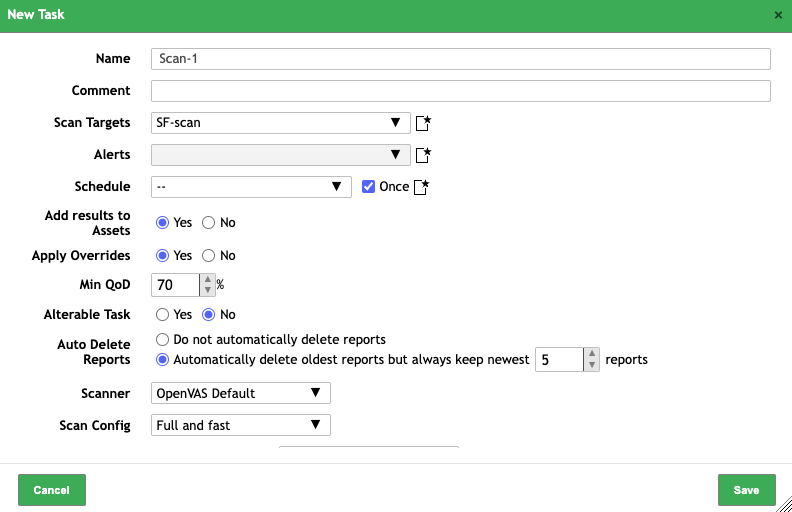

# 1. Введение в тему сканирования на уязвимости

- Сканирование на уязвимости является важной частью процесса обеспечения безопасности информационных систем
- необходимо для идентификации и оценки уязвимостей в системе с целью их последующего устранения или снижения риска их эксплуатации

несколько типов сканирований:
- сетевые сканирования;
- сканирования веб-приложений;
- сканирования исходного кода.

# 2. Сетевое сканирование: определение и типы

> **Сетевое сканирование**
>
> это процесс анализа сети для идентификации активных устройств, открытых портов и используемых сервисов.

## Классификация

Классификация сетевых сканирований позволяет систематизировать подходы к анализу сетевой инфраструктуры и определить наиболее эффективные методы для выявления потенциальных уязвимостей

### 1. Сканирование IP-адресов

> сканирование, которое запускается только с целью определения живых хостов в сети

Чаще всего производится с помощью протокола ICMP. По этому протоколу отправляется эхо-запрос по указанному IP-адресу. Если приходит эхо-ответ — значит, данный узел присутствует в сети.

### 2. Сканирование портов

> метод, основанный на попытке пробного подключения к портам TCP и UDP с целью определения запущенных служб и соответствующих им портов.

Определение портов, находящихся в режиме ожидания, позволяет выявить тип используемой ОС, а также запущенные приложения и их версии.

#### TCP-сканирование

заключается в попытке подключения по TCP-протоколу к нужному порту с прохождением полной процедуры согласования соединения.

Иначе говоря, определение сервисов, работающих по протоколу TCP.

#### UDP-сканирование

заключается в отправке сообщений и пакетов по протоколу UDP.

Если в ответ поступает сообщение, что порт недоступен, — значит, он закрыт, и наоборот. UDP-протокол ненадежен, а процесс UDP-сканирования очень медленный, поэтому к этому сканированию прибегают редко.

#### SYN-сканирование

заключается в том, что полного подключения к порту не происходит, а к порту посылается сообщение SYN.

Если в ответ приходит ответ SYN/ACK, то данный порт находится в режиме прослушивания. Данный метод является более скрытым, чем предыдущий, поскольку полного TCP-соединения не устанавливается.

# 3. Использование сканера Nmap

## Инструменты сканирования

### Naabu 

> инструмент для сетевого сканирования, разработанный компанией ProjectDiscovery. 

Он способен выполнять быстрое сканирование портов и обнаруживать службы, работающие на открытых портах. Naabu особенно полезен для обнаружения уязвимостей в сетевой инфраструктуре.

### RustScan 

>еще один инструмент для сканирования портов, который отличается высокой скоростью работы. 

RustScan использует асинхронное сканирование, что позволяет ему обрабатывать большое количество портов за короткий промежуток времени. Этот инструмент может быть полезен для быстрого обнаружения сервисов в сети.

### Nmap

> это инструмент с открытым исходным кодом, который используется для сканирования IP-адресов и портов в сети и обнаружения установленных приложений, а также проведения дополнительных проверок, в том числе на наличие уязвимостей.

## Преимущества Nmap

Что можно делать с помощью Nmap:
- быстро **распознавать все устройства**, включая серверы, маршрутизаторы, коммутаторы, мобильные устройства и т. д., в одной или нескольких сетях;
- **идентифицировать службы**, запущенные в системе, включая веб-серверы, DNS-серверы и другие распространенные приложения;
- **определять версии приложений**;
- искать **информацию об операционной системе**, запущенной на устройствах;
- во время аудита безопасности и сканирования уязвимостей вы можете использовать Nmap **для атаки систем с использованием существующих скриптов** из Nmap Scripting Engine;
- Nmap имеет графический пользовательский интерфейс под названием Zenmap, который может показывать карты сети для улучшения удобства использования и отчетности.

## Команды Nmap

### Поиск активных устройств

| Команда | Пояснение |
| -- | -- |
| `nmap -sp 192.168.1.1/24` | ping scan, сканирует список устройств, подключенных и запущенных в данной подсети |
| `nmap scanme.nmap.org` | Для сканирования одного хоста - сканирует один хост на наличие 1000 хорошо известных портов |

### Скрытое сканирование (-sS)

```
nmap -sS scanme.nmap.org
```

- выполняется путем отправки SYN-пакета и анализа ответа
- Если получен пакет SYN/ACK, это означает, что порт открыт, и можно открыть TCP-соединение

### Определение версий приложений (-sV)

```
nmap -sV scanme.nmap.org
```

Зная версию приложения, можно найти уязвимости, например, в базе CVE: [https://cve.mitre.org/](https://cve.mitre.org/)

### Определение версии операционной системы (-O)

```
nmap -O scanme.nmap.org
```

- используя TCP/IP-фингерпринтинг

### Агрессивное сканирование (-A)

```
nmap -A scanme.nmap.org
```

включает:
- обнаружение операционной системы
- определение версии
- сканирование сценариев
- трассировку маршрута.

сканирование дает гораздо больше информации, чем обычное. Но отправляет больше различных пакетов, и вероятность того, что оно будет обнаружено во время аудита безопасности, выше

### Сканирование нескольких хостов

| Команда | Пояснение |
| -- | -- |
| `nmap [host1] [host2] [host3]` | указание нескольких хостов через пробел<br><br>подходит для сканирования небольшого количества конкретных хостов, когда вы точно знаете, какие адреса хотите проверить |
| `nmap 192.162.1.*`<br>`nmap 192.168.*` | одновременного сканирования всех подсетей |
| `nmap 192.162.0.1,2,3,4` | Можно использовать запятые, чтобы отделить окончания адресов, вместо того, чтобы вводить целые домены<br><br>эффективно, когда требуется проверить несколько конкретных хостов в одной подсети |
| `nmap 192.164.0.0–255` | Можно использовать дефис для указания диапазона IP-адресов |
| `nmap 192.164.1.0/24` | сканирование подсети |

### Сканирование портов

| Команда | Пояснение |
| -- | -- |
| `nmap -p 973 [host\|net]` | для анализа одного порта |
| `nmap -p T:7777 [host\|net]` | укажете тип порта, то сможете выполнить сканирование для получения информации о конкретном типе подключения — например, в примере - TCP  |
| `nmap -p 76–973 [host\|net]` | Дифпазон портов |
| `nmap --top-ports 10 [host\|net]` | указать верхние n портов для сканирования |

### Использование списков из файлов (-iL)

```
nmap -iL [file_path]
```

Если вы хотите просканировать большой список IP-адресов, вы можете сделать это, используя файл со списком IP-адресов

## Вывод результата

### Подробный вывод

```
nmap -v [host\|net]
```

Подробный вывод предоставляет дополнительную информацию о выполняемом сканировании

Подробный вывод может включать в себя информацию о сканируемых IP-адресах, портах, протоколах, а также о способах и методах сканирования, используемых для обнаружения служб и уязвимостей на целевых хостах

### Нормальный вывод

```
nmap -oN [file_path] [host\|net]
```

экспортировать в текстовый файл. Он будет немного отличаться от исходного вывода командной строки, но там будут зафиксированы все основные результаты сканирования.

### Вывод XML

`nmap -oX [xml_file_path] [host\|net]`

### Множественные форматы

```
nmap -oA [filename] [host\|net]
```

экспортировать результаты сканирования сразу во все доступные форматы

Просмотр созданных файлов:

```
nmap ls -la
```

## Поиск уязвимостей с помощью Nmap

> **Nmap Scripting Engine (NSE)**
>
> это мощный механизм, который позволяет пользователям Nmap расширять возможности сканера с помощью скриптов.

скрипты написаны на языке программирования Lua ([https://www.lua.org/](https://www.lua.org/)) и могут использоваться для различных задач, включая автоматизацию сложных задач сканирования, обнаружение уязвимостей, аудит безопасности и многое другое.

Nmap по умолчанию содержит большую библиотеку различных скриптов: [https://github.com/nmap/nmap](https://github.com/nmap/nmap)

Основные возможности NSE:

1. **автоматизация задач**<br>NSE позволяет автоматизировать рутинные и сложные задачи, такие как перебор учетных записей, тестирование на уязвимости и сбор информации о целевых системах;
1. **обнаружение уязвимостей**<br>с помощью NSE можно искать известные уязвимости в сервисах, определенных Nmap. Это делает Nmap не просто инструментом для сканирования портов, но и сканером уязвимостей.

### Примеры использования NSE

#### категорией скриптов vuln

Категория скрипта определяется в самом исходном коде:

```
categories = {"exploit", "intrusive", "vuln"}
```

- предназначены для обнаружения известных уязвимостей в системах
- Преимущество: скрипты специально разработаны для проверки хостов на наличие широкого спектра известных уязвимостей
- ориентированы на уязвимости в целом и могут использоваться для быстрой оценки потенциальных рисков безопасности

Последовательность действий скриптов категории vuln.

1. **Собирают информацию**<br>начинают работу со сбора информации о целевой системе, включая версии запущенных сервисов и программного обеспечения.
1. **Сопоставляют информацию с базами данных уязвимостей**<br>после определения версий сервисов скрипты сравнивают их с базами данных уязвимостей, такими как Common Vulnerabilities and Exposures (CVE), чтобы определить, известны ли уязвимости для этих версий.
1. **Проверяют уязвимости**<br>скрипты могут также выполнять активные проверки, отправляя специально сформированные запросы к целевым сервисам и анализируя ответы на предмет признаков уязвимостей.
Этот шаг выполняется независимо от предыдущего, который иногда может отсутствовать.
1. **Пишут отчет**<br>после завершения сканирования скрипты vuln предоставляют отчеты, в которых указываются обнаруженные уязвимости, их описание, потенциальные риски и, если это предусмотрено кодом отдельного скрипта, дополнительная информация в виде ссылок на ПО и рекомендации по устранению.

Чтобы указать Nmap, что необходимо использовать скрипты типа vuln, укажите параметр “--script”. В значение необходимо поместить идентификатор скрипта либо категорию скриптов, которую нужно запустить — например, “vuln”:

```
nmap --script=vuln [target]
```

#### Создание собственных модулей

Подробнее про создание модулей вы можете прочитать в туториале: [https://nmap.org/book/nse-tutorial.html](https://nmap.org/book/nse-tutorial.html)

##### Шаг 1. Создание файла скрипта

Создайте новый файл с расширением .nse в каталоге “scripts” вашего установленного Nmap

```
nmap touch [name].nse
```

##### Шаг 2. Определение информации о скрипте

Каждый модуль NSE начинается с определения метаданных, которые описывают его функциональность и категорию. Это делается с помощью “description”

```lua
lua
description = [[
Отображает приветственное сообщение для каждого открытого порта.
Этот скрипт предназначен в качестве примера и не выполняет полезной работы.
]]
---
-- @usage
-- nmap --script=hello <target>
--
-- @output
-- PORT   STATE SERVICE
-- 22/tcp open  ssh
-- | hello:
-- |   Hello, port 22!
-- |_  Have a nice day.
---


author = "Your Name"
license = "Same as Nmap--See https://nmap.org/book/man-legal.html"
categories = {"safe", "discovery"}
```

##### Шаг 3. Определение функции скрипта

Основная логика скрипта определяется в функции `portrule` или `hostrule`, которые определяют, когда модуль должен быть выполнен. Затем функция `action` выполняется для каждого порта или хоста, который проходит проверку `portrule` или `hostrule`

```lua
lua
portrule = function(host, port)
  return port.protocol == "tcp" and port.state == "open"
end


action = function(host, port)
  return ("\nHello, port %d!\nHave a nice day."):format(port.number)
end
```

В этом примере “portrule” возвращает “true” для каждого открытого TCP-порта, и “action” выводит приветственное сообщение для каждого такого порта.

##### Шаг 4. Запуск скрипта

```
nmap --script=[name] <target>
```

# 4. Использование OpenVAS

> **Open Vulnerability Assessment System**
>
> это программное обеспечение с открытым исходным кодом для управления уязвимостями и проведения сканирований на уязвимости.

Оно предоставляет более широкий спектр возможностей по сравнению с Nmap, который в первую очередь является сетевым сканером портов.

Преимущества OpenVAS по сравнению с Nmap:

1. **специализированный инструмент для управления уязвимостями**<br>OpenVAS фокусируется на обнаружении уязвимостей и их управлении, в то время как Nmap используется для общего сканирования сети и определения сервисов;
1. **автоматизированные сканирования**<br>OpenVAS позволяет проводить автоматизированные сканирования на основе расписания, что удобно для регулярной проверки безопасности систем;
1. **обширная база данных уязвимостей**<br>OpenVAS включает в себя большую базу данных уязвимостей, которая регулярно обновляется сообществом. Это позволяет обнаруживать новые и актуальные уязвимости;
1. **комплексный анализ и отчеты**<br>OpenVAS предоставляет подробные отчеты о найденных уязвимостях, включая рекомендации по их устранению, что делает его полезным инструментом для аудиторов и специалистов по безопасности;
1. **web-интерфейс для управления**<br>OpenVAS предлагает удобный веб-интерфейс для управления сканированиями и просмотра результатов, что облегчает работу с инструментом;
1. **поддержка различных типов сканирования**<br>OpenVAS поддерживает как локальные, так и удаленные сканирования, предоставляя более глубокий анализ систем;
1. **модульность и расширяемость**<br>OpenVAS позволяет добавлять и обновлять тесты на уязвимости, что делает его адаптируемым к изменяющимся требованиям безопасности.

## Установка OpenVAS через Docker

Теперь получим файл docker-compose, описывающий все нужные контейнеры для запуска OpenVAS:

```bash
export DOWNLOAD_DIR=$HOME/greenbone-community-container && mkdir -p $DOWNLOAD_DIR
cd $DOWNLOAD_DIR && curl -f -L https://greenbone.github.io/docs/latest/_static/docker-compose-22.4.yml -o docker-compose.yml
```

скачаем все нужные образы контейнеров:

```bash
docker compose -f $DOWNLOAD_DIR/docker-compose.yml -p greenbone-community-edition pull
```

апустите все контейнеры:

```bash
docker compose -f $DOWNLOAD_DIR/docker-compose.yml -p greenbone-community-edition up -d
```

После того, как все контейнеры переведены в статус “started”, можно посмотреть логи:

```bash
docker compose -f $DOWNLOAD_DIR/docker-compose.yml -p greenbone-community-edition logs -f
```

А теперь смените пароль администратора, чтобы никто не получил доступ к вашему сканеру:

```bash
docker compose -f $DOWNLOAD_DIR/docker-compose.yml -p greenbone-community-edition exec -u gvmd gvmd gvmd --user=admin --new-password='<password>'
```

## Web-интерфейс программы

После запуска OpenVAS принимает соединения по умолчанию на `127.0.0.1:9392`


Первое, что вам нужно сделать, — дождаться обновления фидов. Статус обновления можно посмотреть на вкладке “Administration-> Feed Status”


Фиды OpenVAS (OpenVAS Feeds) представляют собой базы данных, содержащие информацию о различных уязвимостях. Они содержат:
1. **NVTs (Network Vulnerability Tests)**<br>скрипты, используемые OpenVAS для обнаружения уязвимостей. Они обновляются ежедневно и содержат информацию о тысячах уязвимостей;
1. **SCAP Data (Security Content Automation Protocol)**<br>стандартные данные о безопасности, которые включают информацию о уязвимостях, конфигурациях и других аспектах безопасности;
1. **CERT-Bund Information (Computer Emergency Response Team)**<br>информация о безопасности, предоставляемая немецким CERT-Bund. Она включает в себя информацию о новых угрозах и уязвимостях.

## Использование OpenVAS для детектирования уязвимостей

Мы рассмотрим два типа сканирований:
1. **базовое**<br>будем указывать только цель, не устанавливая никаких дополнительных настроек;
1. **расширенное**<br>рассмотрим некоторые параметры, которые могут быть полезны при проведении сканирований.

### Базовое использование

Запустить сканирования можно несколькими способами. Самый простой — через Task Wizard.

Для этого перейдите на “Scans->Tasks”:


Наведите на «волшебную палочку» и выберите “Task Wizard”:


После этого у вас появится окно, в котором можно увидеть поле для ввода адреса:


### Расширенная конфигурация

#### Создание цели сканирования

Для начала давайте определим список целей, который мы хотим сканировать. Перейдите в “Configuration -> Targets”. Тут вы можете видеть те цели, которые уже были просканированы, и добавить новые.

В том числе вы можете создавать списки целей. Для создания нового списка нажмите на иконку, как показано на скриншоте:


Затем появится окно конфигурации целей:


Рассмотрим каждый параметр подробнее:
- **Name** - название списка целей;
- **Hosts** - список целей, его можно определить либо через запятую, либо импортировать из файла;
- **Exclude hosts** - список хостов, которые нужно исключить из сканирования;
- **Allow simultaneous scanning via multiple IPs** - параллельное сканирование нескольких адресов;
- **Ports** - список портов, которые будут сканироваться;
- **Alive test** - метод проверки того, что хост «живой», т. е. присутствует в сети;
- **Credentials for authenticated checks** - учетные данные для сканирования с аутентификацией. Например, сканер может аутентифицироваться по SSH и просканировать хост.

#### Задача на сканирование

созданию задачи на сканирование.

Перейдите в “Scan->Tasks” и нажмите на иконку, выберите “New Task”:

 

У вас появится окно конфигурирования нового сканирования. Здесь делаем следующее:

1. Назовите его “Scan-1”.
1. В качестве цели выберите “SF-scan”.
1. `Alerts` устанавливать в данном случае не будем, но помните, что это очень удобный механизм для нотификации, если находится какая-либо уязвимость.<br>Подробнее про него можно почитать [тут](https://docs.huihoo.com/openvas/greenbone/3.1/alerts.html).
1. Около расписания нажмите `Once`.<br>Но вы можете настроить расписание так, как необходимо, — например, чтобы сканирование проходило по вашим целям раз в неделю.<br>Подробнее можно ознакомиться [тут](https://docs.huihoo.com/openvas/greenbone/3.1/scanning.html#scheduled-scan).
1. Давайте также проверим, что опция `Scan Config` имеет значение “Full and fast”.
1. Остальные опции будут влиять на последовательность и порядок сканирования, мы их менять не будем:
    - **order for target hosts** — в какой последовательности брать цели из списка;
    - **maximum concurrently executed NVTs per host** — сколько хостов можно сканировать параллельно с помощью NVTs (скриптов для сканирования уязвимостей);
    - **maximum concurrently scanned hosts** — сколько хостов можно сканировать параллельно.



После того, как заполните поля, нажмите “Save” — и новое сканирование создано. Оно будет запущено либо по вашему расписанию, если вы его указали, либо вы можете запустить его самостоятельно, нажав на кнопку запуска:


### Результаты сканирований

Когда сканирования закончатся, вы можете ознакомиться с полными результатами


Вы получите всю информацию о сканировании:
- общие данные;
- результат сканирования;
- найденные хосты и краткие результаты по ним;
- выявленные открытые порты;
- выявленные приложения и операционные системы;
- найденные уязвимости.

Чтобы посмотреть все результаты, нажмите на “Results”:

 

Из сканирования видно, что найдены две уязвимости высокого уровня критичности, две уязвимости среднего уровня критичности и две уязвимости низкого уровня критичности.

Чтобы посмотреть информацию о конкретной уязвимости, нажмите на нее

Вы увидите описание уязвимости — в чем именно она заключается, как была детектирована, какое влияние оказывает и т. д.


Например, показанная на скриншоте уязвимость заключается в том, что база данных PostgreSQL не имеет защиты паролем, что является серьезным нарушением безопасности, поэтому уровень критичности — 10.0.

Также обычно (но не всегда) у уязвимостей можно увидеть:

- **Detection results**<br>как именно была детектирована уязвимость.<br>В данном случае получилось использовать пользователя postgres с пустым паролем.
- **Product Detection Result** — метод идентификации сервиса.<br>В данном случае продуктом является PostgreSQL, система управления базами данных, идентифицированная с помощью CPE (Common Platform Enumeration) URI cpe:/a:postgresql:postgresql. Метод обнаружения, указанный как "PostgreSQL Detection (TCP)", использует OID (Object Identifier) 1.3.6.1.4.1.25623.1.0.100151 для идентификации службы PostgreSQL через TCP-протокол. Это означает, что сканер OpenVAS успешно определил активный экземпляр PostgreSQL на целевом хосте, используя сетевой протокол TCP. В разделе.
- **Log** — раздел, который предлагает просмотреть подробности об обнаружении продукта, что может включать в себя дополнительные технические детали (версии, конфигурации и потенциальные уязвимости).
- **Insight** — дополнительная информация или понимание, которое может быть получено из результатов сканирования.<br>Раздел может включать в себя подробности о том, как уязвимость была обнаружена, ее потенциальное влияние на систему, возможные способы ее эксплуатации и рекомендации по устранению. Этот раздел помогает специалистам по безопасности лучше понять риски, связанные с обнаруженными уязвимостями, и принять обоснованные решения о том, как лучше управлять этими рисками.
- **Impact** — влияние уязвимости (к чему она приводит).
- **Solution** — решение уязвимости (что нужно сделать, чтобы ее устранить).
- **Reference** — дополнительная информация об уязвимости (обычно это ссылки на документацию продуктов или ссылки на базу уязвимостей).

# Источники

## Использование Nmap

- Статья по использованию Nmap [https://habr.com/ru/articles/88064/](https://habr.com/ru/articles/88064/)
- Туториал по написанию сценариев Nmap [https://nmap.org/book/nse-tutorial.html](https://nmap.org/book/nse-tutorial.html)

## Использование Open VAS

- Документация OpenVAS [https://greenbone.github.io/docs/latest/index.html](https://greenbone.github.io/docs/latest/index.html)
- Видео по базовому использованию OpenVAS [https://www.youtube.com/watch?v=LGh2SetiKaY&ab_channel=GetCyber](https://www.youtube.com/watch?v=LGh2SetiKaY&ab_channel=GetCyber)
- Видео про использование фильтров по результатам сканирований [https://www.youtube.com/watch?v=H8Z5IhYaV78&ab_channel=OPENVAS](https://www.youtube.com/watch?v=H8Z5IhYaV78&ab_channel=OPENVAS)
- Видео про создание отчетов [https://www.youtube.com/watch?v=LNKnRJAesqw&ab_channel=OPENVAS](https://www.youtube.com/watch?v=LNKnRJAesqw&ab_channel=OPENVAS)
