# 1. Сканирование веб-приложений

> **Сканирование веб-приложений**
>
> это процесс автоматического обнаружения уязвимостей в веб-приложениях с помощью специализированных инструментов и техник. Оно может быть как статическим (анализ исходного кода), так и динамическим (тестирование работающего приложения).

Веб-сканирование включает в себя:
- проверку на XSS;
- SQL-инъекции;
- CSRF;
- другие уязвимости, которые не всегда очевидны при стандартном сетевом сканировании.

| WEB-сканироване   | Сетевое сканирование    |
|--------------- | --------------- |
| фокусируется на уязвимостях, специфичных для веб-приложений<br>(серверы, веб-формы, скрипты, API и другие компоненты, которые взаимодействуют с пользователем через браузер)   | направлено на анализ всей сетевой инфраструктуры, включая обнаружение открытых портов, служб, операционных систем и устройств, а также проверку на уязвимости, которые могут быть эксплуатированы на уровне сети   |
| сосредоточено на программном обеспечении и логике работы веб-приложений   | ориентировано на инфраструктуру и сетевые устройства   |

## Сканеры

1. **OWASP ZAP (Zed Attack Proxy)**это инструмент для тестирования веб-приложений на проникновение.
    - предоставляет удобный графический интерфейс и множество функций для автоматического и ручного тестирования
    - позволяет находить различные уязвимости (XSS, CSRF и многие другие), а также поддерживает скрипты и плагины для расширения функциональности.
1. **Nuclei** - это быстрый и настраиваемый инструмент для сканирования уязвимостей, который использует шаблоны для обнаружения известных уязвимостей в веб-приложениях и инфраструктуре.
    - позволяет создавать и использовать собственные шаблоны, что удобно для разных сценариев тестирования.

## Агрегация результатов сканирований

Анализ включает в себя
- оценку обнаруженных уязвимостей
- определение их критичности и потенциального воздействия на бизнес

На основе анализа разрабатываются рекомендации по устранению уязвимостей и улучшению общей безопасности веб-приложения

Результаты сканирования также могут быть использованы для
- составления отчетов для руководства и разработчиков
- для планирования дальнейших действий по обеспечению безопасности.

# 2. OWASP ZAP

> бесплатный и открытый инструмент для сканирования веб-приложений на наличие уязвимостей. Он используется как новичками, так и профессиональными тестировщиками на проникновение.

[https://www.zaproxy.org/](https://www.zaproxy.org/)

Документация: [https://www.zaproxy.org/docs/](https://www.zaproxy.org/docs/)

## Возможности OWASP Zaproxy

1. **Автоматическое сканирование**<br>ZAP может автоматически сканировать веб-приложения на наличие уязвимостей.
Для этого используются различные методы:
    - **- паук (Crawler)** - может автоматически переходить по ссылкам на веб-страницах, чтобы найти новые страницы и параметры, выстраивая таким образом карту анализируемого веб-приложения;
    - **активный сканер** - может атаковать веб-приложение, чтобы найти различные уязвимости. Более подробно активный сканер мы рассмотрим далее.
1. **Ручное тестирование**<br>также позволяет вручную тестировать веб-приложения. Вы можете использовать ZAP для:
    - перехвата и модификации HTTP-запросов и ответов;
    - просмотра исходного кода веб-страниц;
    - атаки веб-приложения с помощью различных инструментов.
1. **Проксирование**<br>может работать как прокси-сервер, что позволяет перехватывать весь трафик между вашим браузером и веб-приложением. Это позволяет вам:
    - анализировать трафик для поиска уязвимостей;
    - модифицировать трафик проведения атак.

## Плюсы и минусы сканера

### Преимущества ZAP:

- **Бесплатный и открытый исходный код**<br>ZAP представляет собой бесплатный инструмент, который может использовать любой. Исходный код ZAP доступен всем, что позволяет разработчикам добавлять новые функции и улучшать существующие.
- **Мощные возможности сканирования**<br>ZAP обладает широким спектром функций для сканирования веб-приложений на наличие уязвимостей.
- **Простота использования**<br>ZAP имеет простой и понятный интерфейс, что делает его доступным для пользователей с любым уровнем подготовки.
- **Поддержка различных типов атак**<br>ZAP может использоваться для выполнения различных типов атак, таких как SQL-инъекция, XSS, CSRF и многое другое.
- **Расширяемость**<br>ZAP можно расширить с помощью плагинов, которые добавляют новые функции и возможности.

особенно подходит для использования в процессе разработки и тестирования веб-приложений, предоставляя разработчикам и специалистам по безопасности мощный инструмент для раннего обнаружения и устранения уязвимостей.

### Недостатки ZAP:

- **Может быть сложным для начинающих пользователей**<br>ZAP обладает множеством функций, которые могут быть достаточно сложными для начинающих пользователей.
- **Может генерировать ложные срабатывания**<br>ZAP, как и все сканеры, иногда ошибочно определяет веб-приложения как уязвимые (false-positive срабатывания).
- **Требует базовых знаний веб-приложений**<br>для эффективного использования ZAP требуется базовое понимание работы веб-приложений.

лучше не использовать в качестве единственного инструмента для финальной оценки безопасности в продакшен-среде, поскольку он может не обнаружить все специфические уязвимости и требует дополнения другими методами тестирования и инструментами.

## Работа с OWASP ZAP

### Установка

```bash
sudo apt install zaproxy
```

Или скачать: [https://www.zaproxy.org/download/](https://www.zaproxy.org/download/)

После открытия ZAP вы увидите следующее окно:


После окончания загрузки вы перейдете к конфигурации сеанса:
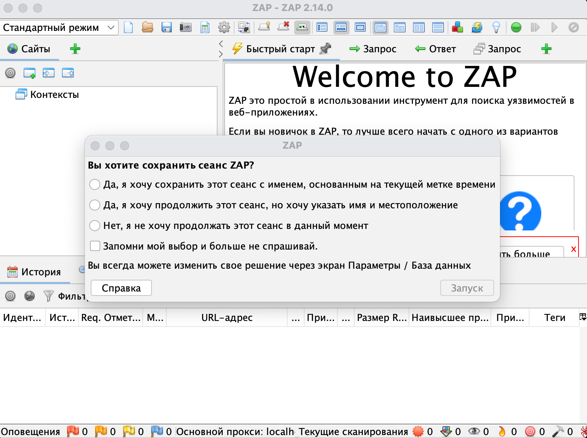

Далее вы попадете во вкладку «Установлено», где увидите дополнения, которые уже установлены. Вы можете обновить или удалить их.
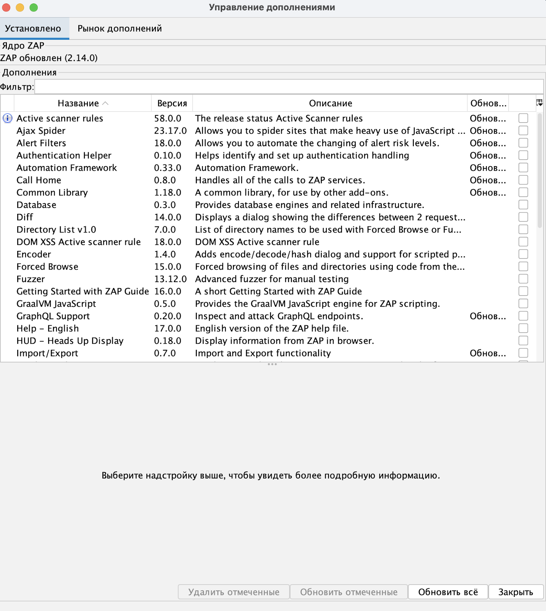

Во вкладке «Рынок дополнений» вы увидите расширения, которые можно установить:
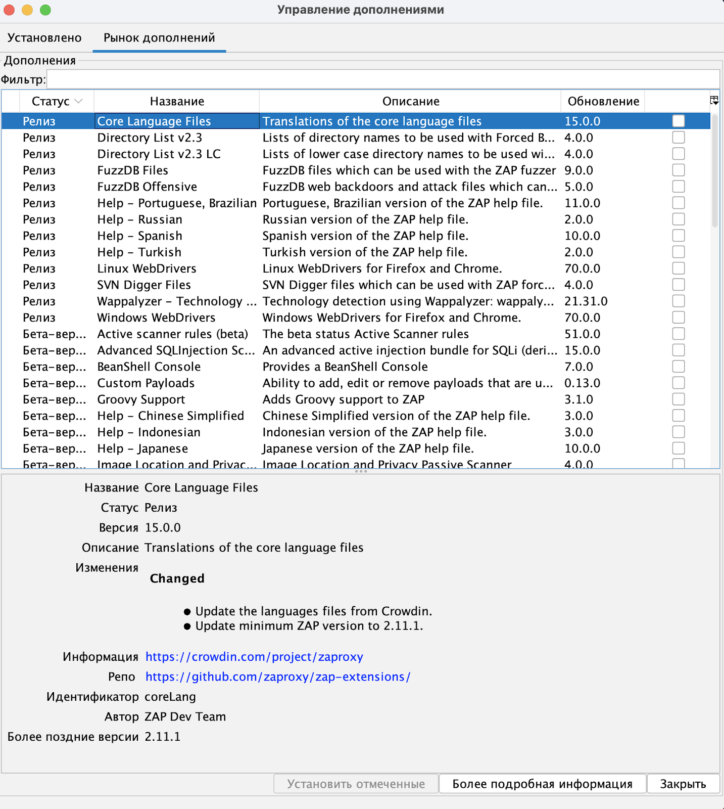

### Активное сканирование

> один из основных инструментов ZAP для поиска уязвимостей в веб-приложениях. Он работает путем атаки веб-приложения с помощью различных методов.

Для активного сканирования вы можете настраивать:
- Политики сканирования, которые определяют, какие атаки будут выполняться активным сканером.<br>Вы можете создать несколько политик сканирования для разных целей.
- Правила сканирования, которые определяют, как будут выполняться атаки.<br>Вы можете редактировать существующие правила сканирования или создавать новые.
- Скорость сканирования.<br>Вы можете влиять на скорость проведения сканирования — например, на частоту отправляемых запросов.

активное сканирование проводится следующим образом:
1. выбирается цель — веб-приложение, которое вы хотите сканировать;
1. устанавливается политика сканирования;
1. запускается сканирование, во время которого сканер ищет уязвимости;
1. проводится анализ результатов сканирования — может быть произведен как во время работы сканера, так и по завершении.

#### Автосканирование

Чтобы перейти к активному сканированию, во вкладке «Быстрый старт» выберите запуск автоматического сканирования приложения
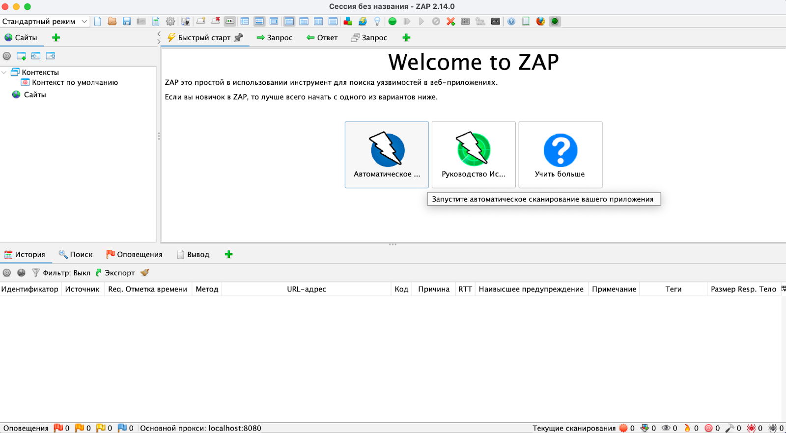

Мы с вами начнем сканировать веб-приложение, которое было создано как раз для тестирования сканеров [testfire.net](http://www.testfire.net/)
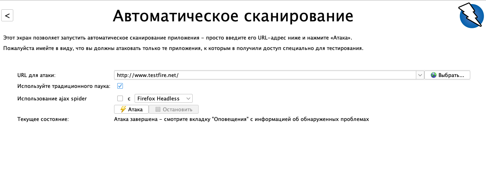

нажмите кнопку «Атака». После этого вы увидите, как в нижней части экрана начинают появляться запросы:
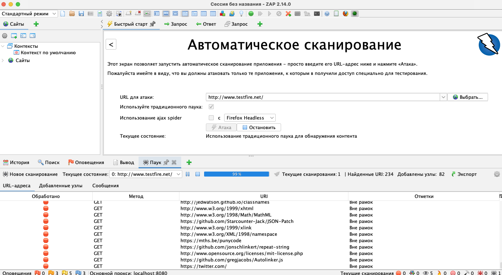

Результат будут во вкладке «Оповещения»

#### Настраиваемое

Выберите «Новое сканирование»
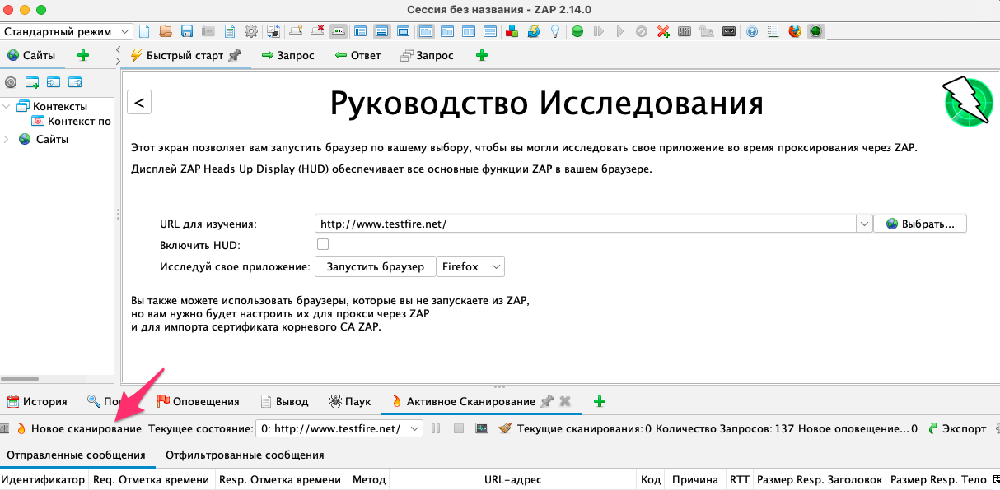

поставьте галочку «Показать расширенные опции»
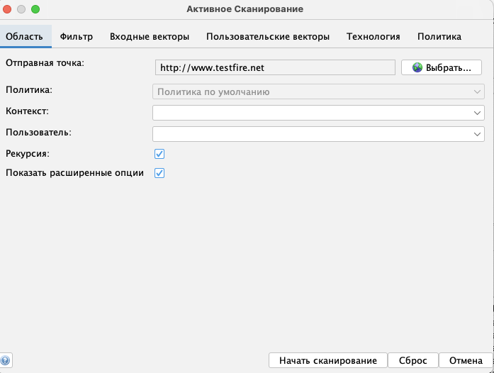

перейдите во вкладку «Входные векторы», где можно управлять логикой работы сканера и указывать, что ему нужно проверять.

Тут укажите все значения:
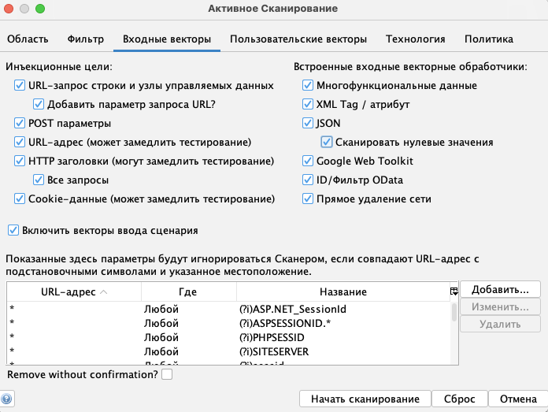

проверим оповещения
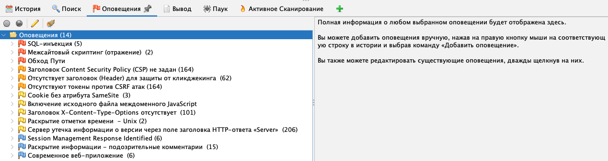

Теперь мы видим, что в данном случае было найдено больше уязвимостей, среди которых есть критичные (отмечены красным флагом):
- SQL-инъекция;
- межсайтовый скриптинг;
- обход пути.

### Анализ результатов сканирования

#### валидация уязвимостей

в процессе автоматического сканирования часто возникают ложные срабатывания (false positives) -> важно провести ручную проверку и анализ результатов, чтобы подтвердить или опровергнуть каждую обнаруженную уязвимость.

Тестирование может включать в себя:
- повторение атак, описанных в отчете сканера;
- использование дополнительных инструментов и техник для проверки уязвимостей.

Только после тщательной валидации можно точно определить, какие уязвимости являются реальными и требуют немедленного устранения.

##### Пример: проверка XSS

Давайте проверим самую первую инъекцию. Нажмите на нее и узнайте, какой запрос был отправлен:
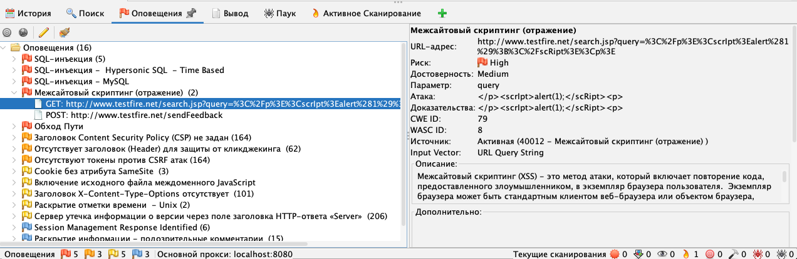

Из скриншота видно, что:
- URL-адрес: `http://www.testfire.net/search.jsp?query=%3C%2Fp%3E%3CscrIpt%3Ealert%281%29%3B%3C%2FscRipt%3E%3Cp%3E`
- Сама атака: `</p><scrIpt>alert(1);</scRipt><p>`

Отраженные XSS валидировать просто: для этого достаточно перейти по сформированному URL.

Мы видим, что наш браузер действительно выполнил тот скрипт, который вы передали в поисковой строке. Поздравляю, вы нашли первую уязвимость

##### Пример: SQL-инъекция

Во время работы сканер выявил, что параметр “Query” по URL testfire.net/Documents/JohnSmith/cgi.exe является уязвимым:
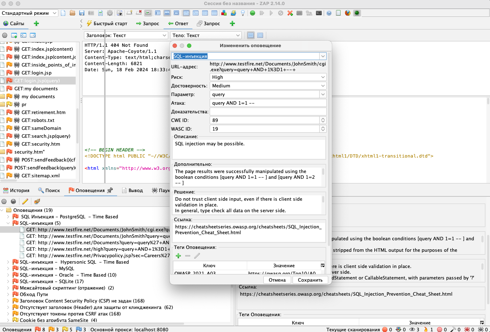

> Валидация SQL-инъекций зачастую достаточно сложна. Бывают разные типы инъекций, и для некоторых из них надо измерять временные задержки ответа приложения.

Чтобы упростить себе эту задачу, мы воспользуемся инструментом sqlmap [https://sqlmap.org/](https://sqlmap.org/), который позволяет автоматизировать эксплуатацию SQL-инъекций
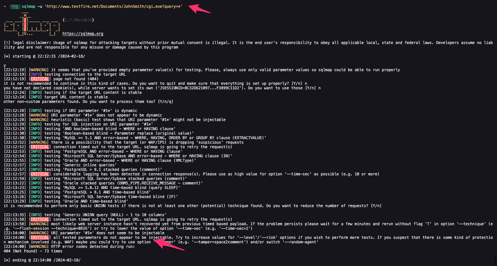

с помощью данного инструмента и что в результате своей работы он определил, что параметр "Query" является <ins>не уязвим</ins> к SQL-инъекциям.

То есть уязвимости на самом деле нет, хотя сканер и определил, что она есть.

# 4. Nuclei

[https://github.com/projectdiscovery/nuclei](https://github.com/projectdiscovery/nuclei)

> современный и мощный инструмент для автоматизированного сканирования уязвимостей, разработанный с учетом потребностей специалистов по кибербезопасности.

представляет собой быстрый и настраиваемый сканер, использующий шаблоны для обнаружения широкого спектра уязвимостей в веб-приложениях, системах и сетевой инфраструктуре.

## Особенности Nuclei. Шаблоны

> **Шаблоны Nuclei**
>
> это предопределенные конфигурации в формате YAML, которые используются для обнаружения уязвимостей, мисcконфигураций и других типов проблем в веб-приложениях и инфраструктуре.

Каждый шаблон Nuclei описывает конкретный тип проверки и содержит необходимые параметры для отправки запросов и анализа ответов от целевых систем.

Какие преимущества дают шаблоны:
- **модульность**<br>шаблоны Nuclei модульны, что позволяет легко добавлять, удалять или изменять отдельные проверки без влияния на остальную часть сканирования;
- **гибкость**<br>пользователи могут создавать собственные шаблоны для специфических нужд или использовать и модифицировать существующие шаблоны из обширной библиотеки;
- **наличие большого сообщества**<br>благодаря активному сообществу и открытому исходному коду библиотека шаблонов Nuclei постоянно пополняется и обновляется, что позволяет отслеживать новые уязвимости;
- **интеграция**<br>шаблоны могут быть легко интегрированы с другими инструментами и процессами, что делает Nuclei мощным дополнением к любому рабочему процессу тестирования на проникновение или аудита безопасности.

Информация в шаблоне:
1. Идентификатор шаблона.
    - Информация о шаблоне:
    - информация об авторе;
1. описания уязвимости.
1. Список данных, которые надо отправлять на удаленный хост, — как провести эксплуатацию уязвимости.
1. Инструкции по анализу ответа — как именно сканер должен понять, что уязвимость действительно есть

пример простого шаблона:
```yaml
id: htpasswd

info:
  name: Detect exposed .htpasswd files
  author: geeknik
  severity: info
  tags: config,exposure

requests:
  - method: GET
    path:
      - "{{BaseURL}}/.htpasswd"

    matchers-condition: and
    matchers:
      - type: word
        words:
          - ":{SHA}"
          - ":$apr1$"
          - ":$2y$"
        condition: or

      - type: status
        status:
          - 200
```
1. *id* — идентификатор шаблона.
1. *info* — информация о модуле, которая включает в себя:
    - *name* — название;
    - *author* — имя автора;
    - *severity* — уровень критичности;
    - *tags* — тэги шаблона (о них мы поговорим позже);
1. *requests* — секция, которая включает в себя методы или запросы, которые будет осуществлять сканер, а также условия по детектированию уязвимости.

## Работа с Nuclei

### Установка

```bash
sudo apt install nuclei
```

Установка с помощью Go

```bash
go install -v github.com/projectdiscovery/nuclei/v3/cmd/nuclei@latest
```

### Использование

Запустим сканер для сканирования одной цели:

```bash
nuclei -u https://my.target.site
```

Через параметр “-u” укажем цель для сканирования

Можно сканировать сетевые службы на произвольных портах:

```bash
nuclei -u my.target.site:5759
```

Или сканировать сразу несколько целей с помощью флага “-l” — в таком случае необходимо еще передать путь до списка с целями:

```bash
nuclei -l /path/to/list-of-targets.txt
```

Nuclei выберет некоторые параметры по умолчанию для запуска сканирования и отображения результатов. По умолчанию он будет запускать почти все шаблоны [https://github.com/projectdiscovery/nuclei-templates?ref=blog.projectdiscovery.io](https://github.com/projectdiscovery/nuclei-templates?ref=blog.projectdiscovery.io), разработанные сообществом, которые имеют отношение к выбранному сервису в соответствии с указанной целью (или целями).

Можно тунелировать комманды:

```bash
echo 10.172.9.3:8080 | nuclei -t custom-templates/airflow2.yaml
```

В этом случае Nuclei получит на вход значение 10.172.9.3:8080 и запустит сканирование с помощью шаблона “custom-templates/airflow2.yaml”.

### Фильтрация шаблонов

Мы можем выборочно фильтровать шаблоны по нескольким различным критериям. Давайте посмотрим на эти варианты.

Опция “-as” попытается определить стек технологий и компоненты, используемые в цели, а затем выбрать шаблоны, которые были помечены ключевыми словами этого стека технологий.

```bash
nuclei -u https:// my.target.site -as
```

#### Выбор конкретного шаблона

можно указать несколько аргументов “-t”

```bash
uclei -u https://my.target.site -t file/logs/python-app-sql-exceptions.yaml -t exposures/files/pyproject-disclosure.yaml
```

#### Использование шаблонов из папки

Эта опция запустит все шаблоны в определенной подпапке, расположенной в папке шаблонов (можно указать файл, содержащий список папок (по одной в строке))

```bash
nuclei -u https://my.target.site -t file/logs -t exposures/files -t cves/2021
```

#### Фильтрация шаблонов на базе тэгов

Этот параметр будет использовать только шаблоны, помеченные указанным значением. Шаблоны могут быть помечены стеком технологий, приложением или сервисом, к которым они применимы

```bash
nuclei -u https://jira.targetdomain.site -tags jira
```

#### Фильтрация шаблонов по критичности

При этом параметре сканер будет использовать только те шаблоны, метаданные которых имеют указанную степень критичности.

Например, это сканирование запустит шаблоны, которые ищут уязвимости со степенью критичности “Critical”:

```bash
nuclei -u https://jira.targetdomain.site -s critical
```

Можно указать несколько степеней:

```bash
nuclei -u https://jira.targetdomain.site -s high,medium
```

### Создание собственных шаблонов

Руководство: [https://nuclei.projectdiscovery.io/templating-guide/protocols/http/?ref=blog.projectdiscovery.io](https://nuclei.projectdiscovery.io/templating-guide/protocols/http/?ref=blog.projectdiscovery.io)

#### Описываем шаблон

Вы можете использовать Nuclei для фаззинга веб-сервисов, анализируя заголовки запросов с использованием списка слов, содержащего многочисленные полезные данные, и анализируя ответы для обнаружения аномалий.

> **Фаззинг**
>
> это методика тестирования программного обеспечения, которая заключается в автоматической подаче на вход приложения неожиданных, некорректных или случайно сгенерированных данных с целью обнаружения ошибок и уязвимостей. В контексте веб-приложений фаззинг часто используется для тестирования обработки различных входных данных — POST и GET параметров, заголовков и пр.

Создание нового шаблона всегда начинается так

```yaml
id: my-test-templ

info: 
    name: X Debug header fuzzing
    author: me
    severity: info
    description: Discover x-*-debug request headers

# TODO: what data to send to remote host
# TODO: how to analyze the response
```

#### Запросы (Requests)

В шаблоне, предназначенном для сканирования HTTP-сервисов, мы используется поле «Запросы», чтобы указать Nuclei, что отправлять целевому объекту.

Поле «Запросы» сообщает Nuclei, какой тип HTTP-запроса отправлять на удаленный хост. Механизм шаблонов позволяет указывать общие методы HTTP (GET, POST, PUT и т. д.), а также допускает «необработанный» (или «сырой») режим, в котором мы имеем полный контроль над различными частями запроса.

Поле “Requests” представляет собой структуру массива, поэтому при необходимости можно отправить несколько запросов.

```yaml
requests:
  - raw:
    - |
      GET / HTTP/1.1
      HOST: {{Hostname}}
      X-{{fuzz}}-debug: 1

    redirects: true
    attack: batteringram
    payloads:
      fuzz: /var/tmp/fuzz.txt
```

В шаблоне мы определили точку фаззинга (место, где сканер будет перебирать значения) с помощью переменной {{fuzz}}. Вместо “fuzz” вы можете использовать любое разрешенное имя переменной. Фактический список полезных нагрузок, которые заменят {{fuzz}} в запросах, считывается из файла /var/tmp/fuzz.txt, который должен содержать по одному полезному наполнению в строке.

Batteringram — единственный вариант, который здесь имеет смысл, потому что точка инъекции только одна. Если в запросе имеется несколько точек внедрения полезных данных, можно использовать другие режимы. Подробнее о них можно почитать тут [https://docs.projectdiscovery.io/templates/protocols/http/http-payloads#attack-mode](https://docs.projectdiscovery.io/templates/protocols/http/http-payloads#attack-mode)

поле “Redirects” сообщает Nuclei следовать любым перенаправлениям HTTP.

#### Детектирование (Matchers)

> **Matcher**
>
> это функция, которая может использовать несколько методов для проверки ответа хоста и сравнения его элементов со значениями, которые мы определяем.

В этом примере приложения мы можем получить некоторую информацию об ожидаемом ответе, проверив базовый запрос к приложению
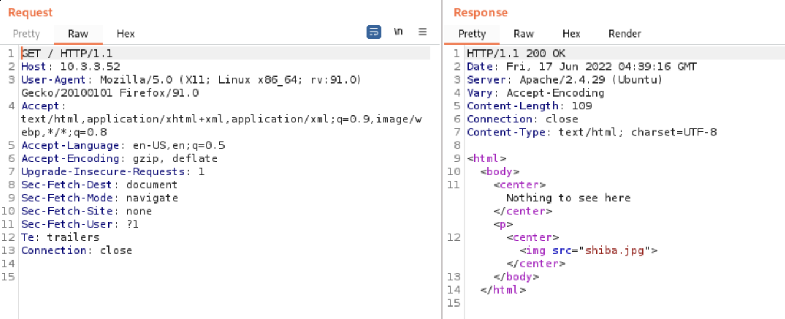

Из заголовка “Content-Length” мы знаем, что ожидаемый ответ от приложения содержит тело размером 109 байт

Мы пишем правило, чтобы отмечать ответ, если получаем тело ответа размером более 109 байт

Для шаблона мы будем использовать DSL (Domain-Specific Language), который позволяет нам использовать язык выражений Nuclei для проверки таких вещей, как длина тела ответа:

```yaml
stop-at-first-match: false
mathers:
  - type: dsl
    dsl:
      - "len(body) > 109"
```

#### Полный шаблон

```yaml
id: my-test-templ

info: 
    name: X Debug header fuzzing
    author: me
    severity: info
    description: Discover x-*-debug request headers

requests:
  - raw:
    - |
      GET / HTTP/1.1
      HOST: {{Hostname}}
      X-{{fuzz}}-debug: 1

    redirects: true
    attack: batteringram
    payloads:
      fuzz: /var/tmp/fuzz.txt

    stop-at-first-match: false
    mathers:
      - type: dsl
        dsl:
          - "len(body) > 109"
```

#### Сохранение и запуск

сохраним полученный шаблон в файл `/var/tmp/test.yaml` и попробуем его использовать


# 5. Системы агрегации уязвимостей

- Одна из ключевых проблем — различия в отчетах, которые предоставляют сканеры. Отсутствие стандартизации в номенклатуре и форматах отчетности приводит к тому, что одна и та же уязвимость может быть описана по-разному. Это затрудняет сопоставление результатов и определение приоритетов для устранения уязвимостей.
- не менее важной является проблема ложных срабатываний
- разные сканеры могут обнаруживать одни и те же уязвимости, но классифицировать их по-разному

## Системы агрегации уязвимостей

Они решают несколько задач:
1. **Создают единое место по работе с уязвимостями**
    - предоставляют централизованную платформу для сбора, анализа и управления уязвимостями, обнаруженными различными сканерами
    - упрощает процесс мониторинга и реагирования на уязвимости, позволяя командам безопасности эффективно координировать усилия по их устранению.
1. **Обеспечивают дедупликацию уязвимостей со множества отчетов**
    - автоматически идентифицируют и объединяют дублирующиеся записи, упрощая процесс анализа и позволяя сосредоточиться на реальных угрозах.
1. **Обрабатывают false positives**
    - позволяют один раз отметить обнаруженную уязвимость как ложное срабатывание, после чего она больше не будет влиять на приоритизацию и решения по безопасности, сокращая нагрузку на аналитиков и улучшая точность оценки угроз.

Существует несколько инструментов для управления уязвимостями, например:
- DefectDojo [https://github.com/DefectDojo/django-DefectDojo](https://github.com/DefectDojo/django-DefectDojo)
- Faraday [https://github.com/infobyte/faraday](https://github.com/infobyte/faraday)
- Hive [https://hexway.io/](https://hexway.io/)

## Знакомство с DefectDojo

[https://github.com/DefectDojo/django-DefectDojo](https://github.com/DefectDojo/django-DefectDojo)

> открытый инструмент для управления уязвимостями и безопасностью приложений. Он помогает автоматизировать и оптимизировать процессы обнаружения, устранения и мониторинга уязвимостей в программном обеспечении.

Этот инструмент разработан для улучшения взаимодействия между командами разработки и специалистами по безопасности, предоставляя единую платформу для сбора, анализа и управления данными об уязвимостях.

Основные задачи, которые решает DefectDojo:
- централизация данных о уязвимостях;
- дедупликация уязвимостей;
- управление ложными срабатываниями (false positives).

Помимо этого DefectDojo обладает встроенной функциональностью интеграции с тикетными системами, такими как Jira, что значительно упрощает процесс управления уязвимостями

# Источники

<ul class="list" style="margin-bottom: 0 !important;">
<li>
  <a href="https://habr.com/ru/articles/767590/">Nmap: сканирование портов</a>
</li>
<li><a href="https://redos.red-soft.ru/base/arm/arm-other/nmap/">Nmap — утилита исследования
    сети</a></li>
<li><a href="https://stationx.net/nmap-cheat-sheet/">Nmap Cheat Sheet 2024: All the Commands &amp;
    Flags</a></li>
<li><a href="https://www.youtube.com/watch?v=wlqUO09J-nw&amp;ab_channel=NielsenNetworking">Penetration Testing with
    Nmap: A Comprehensive Tutorial</a></li>
<li><a href="https://www.youtube.com/watch?v=lReXcE9BT0g&amp;ab_channel=CyberOffense">Perform a
    Vulnerability Scan
    Using OpenVAS</a></li>
<li><a href="https://www.youtube.com/watch?v=LGh2SetiKaY&amp;ab_channel=GetCyber-PurpleTeam%2F%2FKaliLinux">Complete
    Beginner OpenVAS Vulnerability Scanning Tutorial </a></li>
<li><a href="https://www.youtube.com/watch?v=yCeM1gBpOFY&amp;ab_channel=%D0%98%D0%A2%D0%BF%D1%80%D0%BE%D0%BF%D0%BE%D0%B2%D0%B5%D0%B4%D0%BD%D0%B8%D0%BA">OpenVas
    —сканер безопасности под Linux</a></li>
<li><a href="https://www.zaproxy.org/getting-started/">ZAP Getting started</a></li>
<li><a href="https://brightsec.com/blog/owasp-zap/">OWASP ZAP: 8 Key Features and How to Get
    Started</a></li>
<li><a href="https://www.youtube.com/watch?v=wLfRz7rRsH4&amp;ab_channel=CyberSecurityTV">OWASP ZAP
    For Beginners |
    Active Scan</a></li>
<li><a href="https://www.youtube.com/watch?v=LnFJWcjqIsg&amp;ab_channel=DucaraInfoSolutionsPrivateLimited">How to
    use OWASP-ZAP?</a></li>
<li><a href="https://www.jit.io/blog/6-essential-steps-to-use-owasp-zap-for-penetration-testing">6 Essential
    Steps to Use OWASP ZAP for Penetration Testing</a></li>
<li><a href="https://habr.com/ru/articles/744222/">Nuclei — это просто</a></li>
<li><a href="https://www.geeksforgeeks.org/nuclei-fast-and-customizable-vulnerability-scanner/">Nuclei — Fast
    and Customizable Vulnerability Scanner</a></li>
<li><a href="https://blog.projectdiscovery.io/ultimate-nuclei-guide/">The Ultimate Guide to
    Finding Bugs With
    Nuclei</a></li>
<li><a href="https://techyrick.com/nuclei-full-tutorial/">Nuclei Full Tutorial</a></li>
<li><a href="https://habr.com/ru/companies/pvs-studio/articles/754652/">DefectDojo и PVS-Studio:
    отслеживаем
    ошибки и уязвимости</a></li>
<li><a href="https://www.youtube.com/watch?v=TglOnGh7rAI&amp;ab_channel=Whitespots">Как работать с
    DefectDojo</a>
</li>
<li><a href="https://defectdojo.github.io/django-DefectDojo/">Документация DefectDojo</a></li>
<li><a href="https://www.youtube.com/watch?v=wpvOdsbX7sU&amp;ab_channel=OWASPSwitzerland">OWASP
    DefectDojo — The
    Heart of your AppSec Automation</a></li>
</ul>

